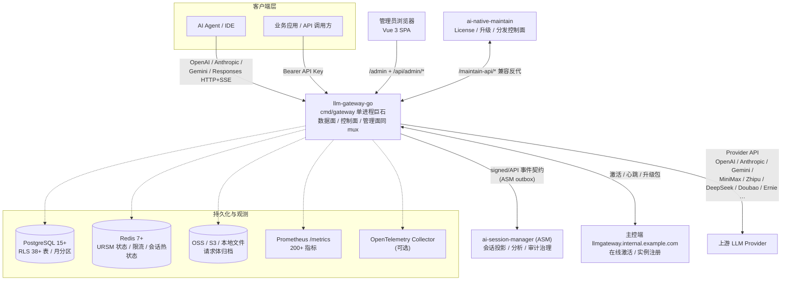
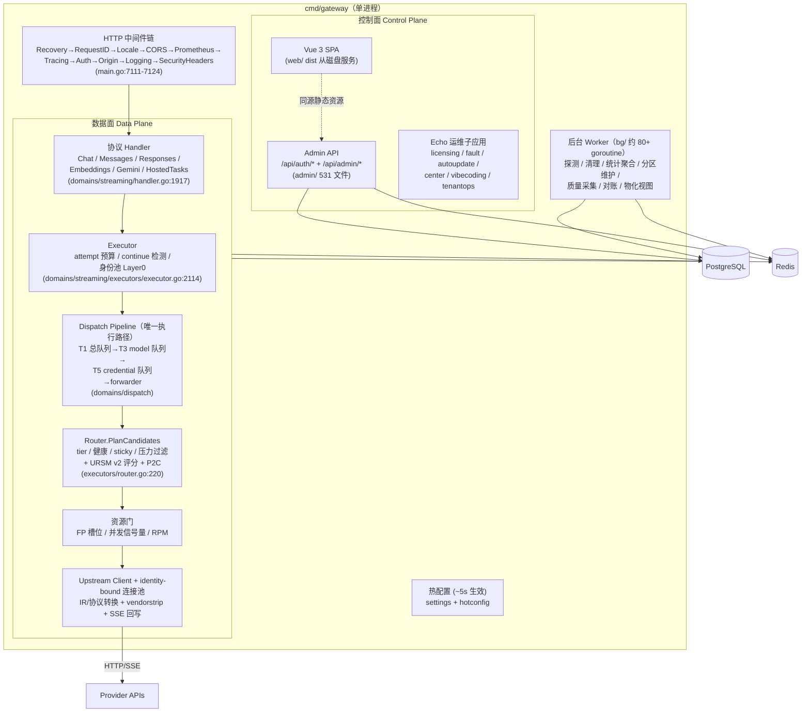
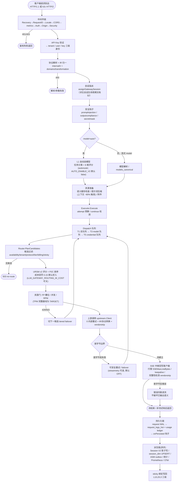
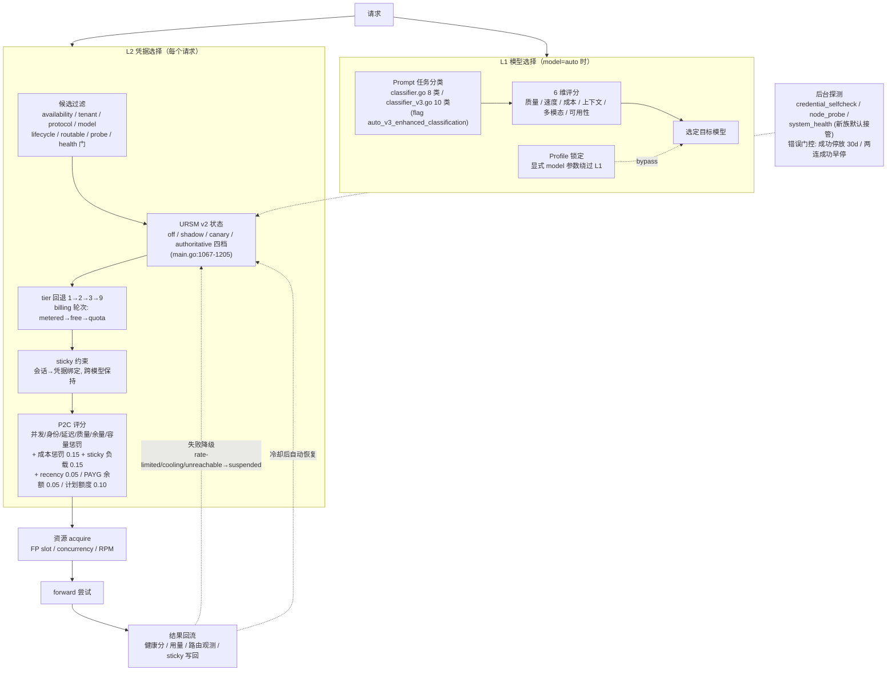
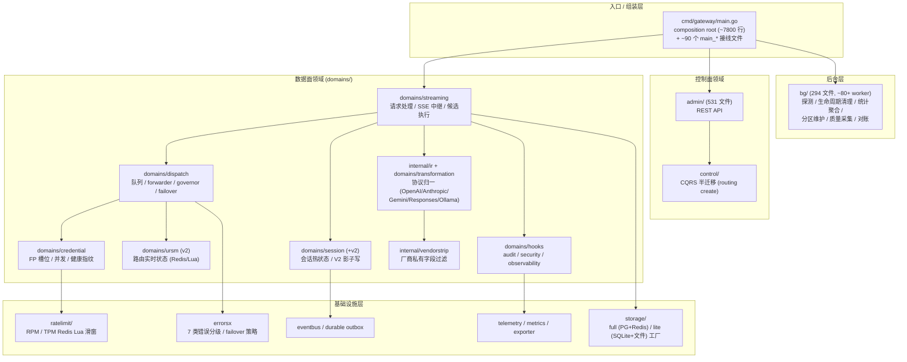
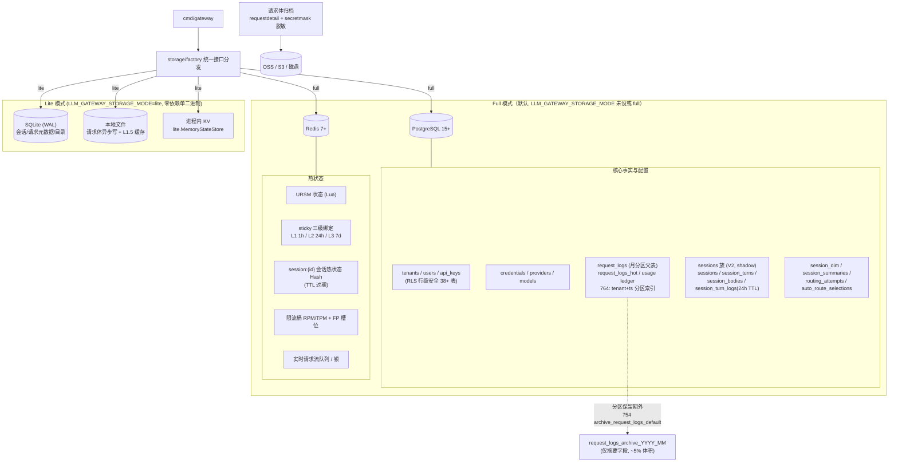
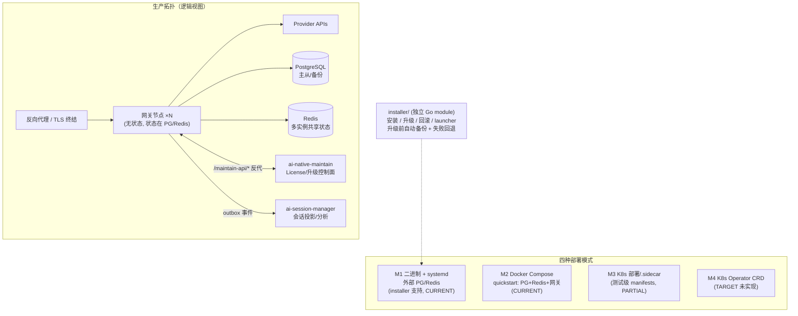
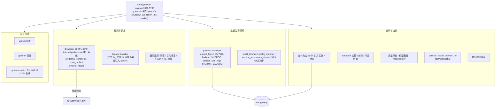
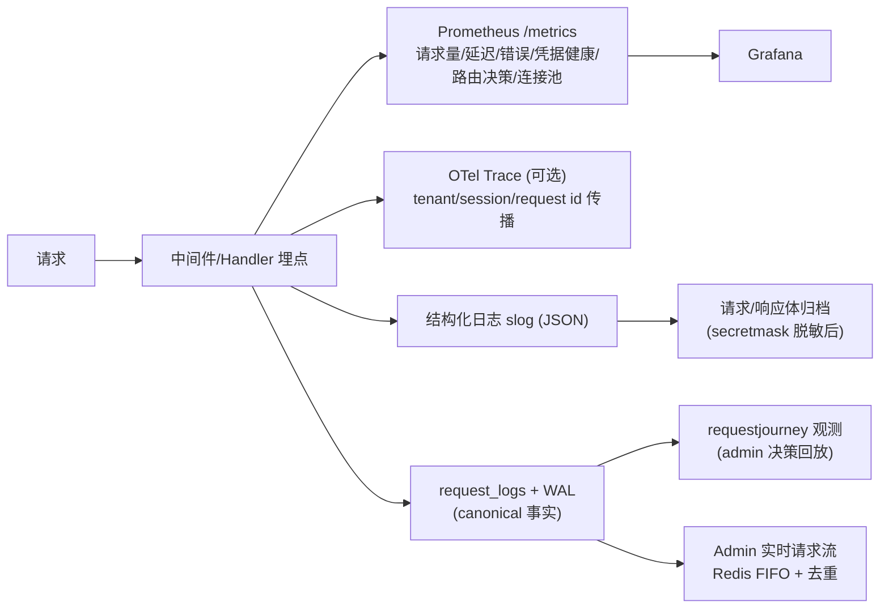

# 系统架构与业务流程图集（Mermaid）

> **事实快照**: 2026-10-01 · 基线提交 `3efae99`（main）
> **绘图方式**: 全部图表为 Mermaid 代码块，可在支持 Mermaid 的 Markdown 渲染器（GitHub / VS Code / GitLab）直接查看。
> **证据优先级**: 运行时 wiring / Go 代码 / SQL migration > [03-design/01-architecture/architecture/ARCHITECTURE.md](03-design/01-architecture/architecture/ARCHITECTURE.md)（2026-10-01 全码审计快照）> 本文档 > 历史审计。
> **配套文档**: 会话全生命周期专图见 [session-lifecycle.md](session-lifecycle.md)；异常分支细图见 [REQUEST_FLOW_WITH_EXCEPTIONS.md](REQUEST_FLOW_WITH_EXCEPTIONS.md)。

---

## 1. 系统上下文图（谁在和网关打交道）

要点（证据：`cmd/gateway/main.go` 装配，ARCHITECTURE.md §2）：

- 网关是**单进程巨石**：数据面（用户 LLM 请求）、控制面（Admin API + Vue SPA）、管理面（licensing/fault/autoupdate 等 Echo 子应用）共用一个 HTTP mux，h2c 同端口承载 HTTP/1.1 与 HTTP/2（main.go:7201）。
- 三服务边界：Gateway 是 provider 调用与 canonical 事实的 Owner；ASM 只消费签名事件做投影分析；Maintain 负责 License/升级（Gateway 保留 `/maintain-api/*` 兼容反代）。

---

## 2. 容器级架构图（网关内部结构）

**数据面公共 API 面**（AUTHITECTURE.md §3 + `domains/streaming` 路由注册）：

| 端点 | 协议 |
|---|---|
| `/v1/chat/completions` · `/v1/completions` | OpenAI 兼容 |
| `/v1/messages` · `/v1/messages/count_tokens` | Anthropic 兼容 |
| `/v1/responses` | Responses API |
| `/v1/embeddings` · `/v1/models` | OpenAI 兼容 |
| `/v1beta/models/{model}:generateContent` 等 | Gemini native |
| `/v1/hosted-tasks` | 托管任务门面（create/status/result/cancel/recall） |

---

## 3. 数据面请求处理主链（业务流程图）

重试与流一致性的核心规则（runtime-request-flow.md §4）：

- **首字节前**：可按策略重试 / failover（换 credential / provider / model）；多层重试能力并存（dispatch timed retry、goal retry、request survival、可选 stream retry），统一 retry budget 仍是 TARGET。
- **首字节后**：遵循流一致性，不把已输出流重放到另一个 Provider；错误内联进 SSE。
- 关联键不变量：retry/failover 只增加 `attempt_id`，不复制 `turn_id`；`charge_id` 承担计费幂等。

---

## 4. 智能路由决策图（双层路由）

状态源与评分细节证据：`domains/streaming/executors/router.go`、`router_scoring.go`、`domains/ursm/v2/`、`internal/probemode`（详见 [routing-and-state.md](03-design/01-architecture/architecture/routing-and-state.md)）。

---

## 5. 核心领域模块图（DDD 分层）

> 并行实现警示（ARCHITECTURE.md §8）：autoroute 三代（decision v1/v2 双活）、Session V1/V2、探测新旧 worker 族、URSM key 三代 schema、outbox 4 套实现等 **10 组并行对 + 7 处死代码** 已登记，读代码时勿把演示入口/死代码当活跃路径。

---

## 6. 存储架构图（full / lite 双模式）

---

## 7. 部署架构图（M1–M4 与三服务拓扑）

升级与激活（PROJECT_OVERVIEW §3.1/§3.10）：在线激活（JWT 24h 续期）/ 离线激活 / 7 天试用；自动升级 6h 检查周期，升级后 5s 健康检查失败自动回退。

---

## 8. 后台 Worker 体系图

> 注意：`bg/session_lifecycle_worker.go`（会话闲置回收）经 R35 审计标注 **UNUSED / 零生产调用方**，不得当作活跃路径；会话数据的实际终结链路见 [session-lifecycle.md](session-lifecycle.md) §8。

---

## 9. 可观测性链路

---

## 10. 图集与既有文档的关系

| 图 | 补充的既有文档 |
|---|---|
| §1–§2 架构图 | [PROJECT_OVERVIEW.md](PROJECT_OVERVIEW.md)、[architecture.md](architecture.md)（英文版） |
| §3 请求主链 | [REQUEST_FLOW_WITH_EXCEPTIONS.md](REQUEST_FLOW_WITH_EXCEPTIONS.md)（异常分支细图）、[runtime-request-flow.md](03-design/01-architecture/architecture/runtime-request-flow.md) |
| §4 路由决策 | [routing-and-state.md](03-design/01-architecture/architecture/routing-and-state.md)、[AUTO_SELECTION_SPEC](03-design/02-feature-design/design/AUTO_SELECTION_SPEC.md) |
| §5 领域模块 | [MODULES_GUIDE.md](MODULES_GUIDE.md)、[parallel-implementations-comparison.md](03-design/01-architecture/parallel-implementations-comparison.md) |
| §6 存储 | [storage/README.md](storage/README.md)、[lite-mode-quick-ref](03-design/design/lite-mode-quick-ref.md) |
| §7 部署 | [06-deployment/README.md](06-deployment/README.md) |
| 会话生命周期 | **[session-lifecycle.md](session-lifecycle.md)**（本图集的姊妹篇） |

---

## 附录：本文档引用的关键代码锚点

| 锚点 | 位置 |
|---|---|
| HTTP mux / h2c | `cmd/gateway/main.go:7201` |
| 中间件链 | `cmd/gateway/main.go:7111-7124` |
| ChatHandler 入口 | `domains/streaming/handler.go:1917` |
| serveWithExecutor | `domains/streaming/handler.go:2249` |
| Executor.Execute | `domains/streaming/executors/executor.go:2114` |
| Router.PlanCandidates | `domains/streaming/executors/router.go:220` |
| URSM 四档装配 | `cmd/gateway/main.go:1067-1205` |
| Admin Echo 子应用 | `cmd/gateway/main.go:6520-6698` |
| bg worker 装配 | `cmd/gateway/main.go:3626-5780` |
| 存储模式装配 | `cmd/gateway/storage_mode_init.go` |
| request_logs 归档函数 | `sql/migrations/startup/754_archive_request_logs_default.sql` |

---

**文档版本**: v1.0（2026-10-01）
**维护**: 与 [ARCHITECTURE.md](03-design/01-architecture/architecture/ARCHITECTURE.md) 同步更新；图表事实漂移时以代码 wiring 为准并回改本文。
