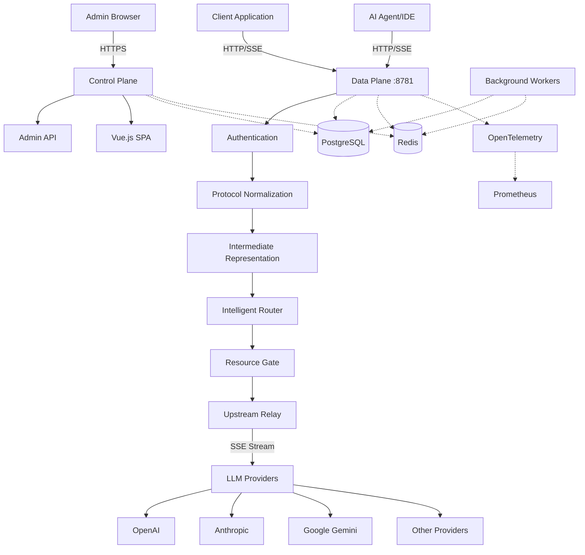

# Architecture Overview

AI Native Gateway is a private-deployment LLM gateway written in Go, providing protocol normalization, intelligent routing, multi-tenancy, and comprehensive observability for AI applications.

## High-Level Architecture

## Core Components

### Data Plane

**Entry Point**: `cmd/gateway/main.go`

Handles all user-facing LLM requests with OpenAI/Anthropic/Responses/Gemini compatibility.

**Request Flow**:
1. **Authentication**: API key validation, tenant isolation
2. **Protocol Normalization**: Convert various formats to IR (Intermediate Representation)
3. **Routing**: Select optimal credential(s) based on availability, cost, quality, sticky sessions
4. **Resource Gate**: Check quotas, rate limits, concurrency slots
5. **Upstream Relay**: Stream responses with integrity checks and retry logic
6. **Audit**: Log requests, responses, tokens, costs to PostgreSQL

**Endpoints**:
- `/v1/chat/completions` - OpenAI Chat Completions
- `/v1/completions` - OpenAI Legacy Completions
- `/v1/messages` - Anthropic Messages API
- `/v1/responses` - Responses API
- `/v1/embeddings` - Embeddings (OpenAI-compatible)
- `/v1/models` - Available models
- Gemini endpoints (`/v1/models/{model}:generateContent`, etc.)

### Control Plane

**Admin API**: REST API for gateway management  
**Admin UI**: Embedded Vue.js SPA at `/admin`

**Capabilities**:
- Provider and credential management
- Tenant, user, and API key administration
- Real-time request stream monitoring
- Routing analytics (heatmaps, Sankey diagrams, decision replay)
- Cost and pricing management
- Data lifecycle and compliance tools
- System health and diagnostics

### Routing Engine

**Location**: `domains/streaming/executors/`

**Routing Strategy**:
1. **L1 - Model Selection**: Task classification → Model profile matching
2. **L2 - Credential Selection**: 
   - Availability filter (health status, admin_protected)
   - Tenant and protocol compatibility
   - Tier-based fallback (primary → secondary → tertiary)
   - Billing mode preference (metered → free → quota)
   - Sticky sessions (session_id → credential binding)
   - P2C scoring (latency, success rate, concurrency)

**Current Status**:
- ✅ Availability, tenant, protocol, tier, billing, sticky, P2C baseline
- 🚧 Cost/quality/context-aware scoring (shadow mode, not default active)
- 🔬 Advanced bandit algorithms (exploration phase)

### Multi-Tenancy

**Isolation**: PostgreSQL Row-Level Security (RLS) on 38+ tables

**Key Concepts**:
- **Tenant**: Top-level isolation boundary
- **User**: Belongs to one tenant
- **API Key**: Belongs to one user, used for data plane authentication
- **Credential**: Upstream provider API key, may be tenant-specific or shared

All queries automatically enforce `tenant_id` filtering at database level.

### Storage

**PostgreSQL 14+**:
- Core data (tenants, users, api_keys, credentials, providers, models)
- Request logs and audit trail
- Session metadata and summaries
- Pricing and cost records

**Redis 7+**:
- Session state and sticky routing cache
- Live request stream (FIFO queue with dedup)
- Rate limit buckets (token/TPM/RPM)
- Credential availability cache (30s TTL)

### Observability

**Metrics**: Prometheus exposition at `/metrics`
- Request counts, latencies, errors by provider/model/tenant
- Credential health scores and availability
- Routing decisions and retries
- Database and Redis connection pools

**Traces**: OpenTelemetry integration (optional)
- Distributed tracing across routing and upstream calls
- Tenant ID, session ID, request ID propagation

**Logs**: Structured JSON logs (slog)
- Request/response bodies archived to disk or object storage
- Sensitive data masking (API keys, credentials)

### Background Workers

**Location**: `bg/`

~50 workers handle asynchronous tasks:
- Credential health probing (every 5 minutes)
- Session summarization (LLM-based)
- Cost aggregation and billing
- Data lifecycle (archival, cleanup)
- Provider model catalog sync
- System monitor (Redis queue, 30s dedup)

## Deployment Modes

| Mode | Description | Status |
|------|-------------|--------|
| **M1** | Binary + systemd | ✅ CURRENT (with installer) |
| **M2** | Docker Compose | ✅ CURRENT (quickstart provided) |
| **M3** | Kubernetes deployment/sidecar | ✅ PARTIAL (test-grade manifests) |
| **M4** | Kubernetes Operator (CRD) | 🔬 TARGET (not implemented) |

**Quick Start**: `docker-compose.quickstart.yml` includes PostgreSQL, Redis, and gateway.

**Production**: Requires external PostgreSQL/Redis, TLS, secrets management, backups. See [Production Deployment](deployment/production.md).

## Security Architecture

- **Authentication**: Bearer token (API keys) for data plane, separate admin API keys for control plane
- **Multi-Tenancy**: PostgreSQL RLS enforces tenant isolation at database level
- **Encryption**: Upstream credentials encrypted at rest (Fernet/AES-256-GCM)
- **Secrets**: Environment variables or SOPS-encrypted configs (not included in quick start)
- **Network**: Services bind to localhost by default; use reverse proxy for external access
- **Audit**: Full request/response logging with sensitive field masking

## Technology Stack

**Backend**:
- Go 1.21+
- PostgreSQL 14+ (with RLS)
- Redis 7+

**Frontend**:
- Vue 3 + TypeScript
- Element Plus UI
- ECharts for visualization
- Vite build system

**Deployment**:
- Docker / Docker Compose
- Kubernetes (basic manifests)
- systemd (binary mode)

**Monitoring**:
- Prometheus
- OpenTelemetry (optional)
- Grafana (dashboards not included)

## Design Principles

1. **Private Deployment First**: All data stays within your infrastructure
2. **Protocol Agnostic**: Support OpenAI, Anthropic, Gemini, and custom protocols
3. **Production Stability**: Fail-closed on errors, graceful degradation, extensive testing
4. **Observability**: Every request traced, every decision auditable
5. **Multi-Tenancy**: Tenant isolation enforced at database and application levels
6. **Extensibility**: Background workers, plugin hooks, custom routing policies

## Limitations and Constraints

- M3 Kubernetes manifests are test-grade; production K8s deployment requires additional hardening
- Advanced routing features (cost/quality optimization) are in shadow mode
- MCP gateway integration and A2A protocol are in research phase
- Binary installer and quick start do not include all enterprise features (e.g., offline activation, upgrade automation)

## Further Reading

- [Getting Started](getting-started.md) - Deploy in 10 minutes
- [Configuration Reference](configuration.md) - Environment variables and settings
- [Routing Details](routing.md) - Deep dive into routing logic
- [Multi-Tenancy](multi-tenancy.md) - RLS and tenant isolation
- [API Documentation](api/) - Admin and data plane APIs
