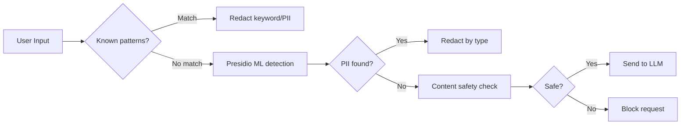

# LLM Gateway / API Gateway Best Practices Research (2024–2026)

> **Purpose**: Comprehensive research for llm-gateway-go architecture design
> **Research Date**: 2026-07-18
> **Sources**: Web search of industry articles, academic papers, open source projects, cloud vendor documentation

---

## Table of Contents

1. [Multi-Cloud / Heterogeneous Compute Unified Access](#1-multi-cloud--heterogeneous-compute-unified-access)
2. [Content Moderation for LLM Inputs/Outputs](#2-content-moderation-for-llm-inputsoutputs)
3. [Dynamic Request Routing](#3-dynamic-request-routing)
4. [LLM Billing & Metering](#4-llm-billing--metering)
5. [Open Source Reference Matrix](#5-open-source-reference-matrix)
6. [Key Design Decisions for llm-gateway-go](#6-key-design-decisions-for-llm-gateway-go)

---

## 1. Multi-Cloud / Heterogeneous Compute Unified Access

### 1.1 Industry Standard Patterns

#### The LLM Gateway Pattern
The LLM Gateway is an internal proxy service sitting between application microservices and LLM providers (OpenAI, Anthropic, Google Gemini, AWS Bedrock, Azure OpenAI, local Ollama, etc.). It centralizes six load-bearing concerns (per the 2026 industry consensus):

| Concern | Description |
|---------|-------------|
| **Provider Abstraction** | Single OpenAI-compatible API surface for all backends |
| **Multi-Provider Routing** | Route by default, fail over automatically |
| **Circuit Breakers** | Detect provider degradation, stop hammering slow endpoints |
| **Rate Limiting** | Per-tenant and per-model token budgets |
| **Cost Tracking** | Real-time token usage aggregated by tenant, feature, model |
| **Semantic Caching** | Serve near-identical queries from cache (40-60% reduction) |

#### How Major Cloud Platforms Handle Multi-Provider Access

| Platform | Approach | Key Differentiator |
|----------|----------|-------------------|
| **AWS Bedrock** | Unified API across Anthropic, Meta, Mistral, OpenAI, Amazon Nova; IAM auth, VPC endpoints, CloudWatch metrics | Broadest model selection; single billing + auth relationship |
| **Azure OpenAI Service** | Managed OpenAI deployment inside Azure subscription + region; Entra ID federation | Deepest Microsoft 365 / Office integration |
| **Google Vertex AI** | Gemini-native + Model Garden (Claude, Llama, etc.); BigQuery grounding, 1M-token context | Best for data-first + multimodal workloads |
| **OpenAI Direct API** | Single-provider; simple API key auth | Fastest feature iteration; simplest integration |

**Key 2026 Shift**: OpenAI models (GPT-5.5, Codex) now available on AWS Bedrock, enabling enterprises to consume both OpenAI and Anthropic under one AWS billing relationship and IAM model. This collapses the multi-provider management problem significantly.

#### Provider Abstraction Design

The standard pattern is a **unified interface** (Provider Adapter pattern):

```go
// Provider interface pattern (from industry reference implementations)
type LLMProvider interface {
    Complete(ctx context.Context, req *LLMRequest) (*LLMResponse, error)
    Name() string
    IsHealthy() bool
    GetRateLimit() RateLimit
}
```

Key abstraction layers:
1. **Schema normalization**: Normalize OpenAI-compatible request/response as the canonical format
2. **Adapter per provider**: Translate canonical format to provider-specific schemas
3. **Credential injection**: Inject API keys / IAM roles at the adapter layer, never in request payloads
4. **Error normalization**: Map provider-specific errors to canonical error codes

#### Credential Rotation Patterns

Based on multi-cloud credential management research (2026):

| Pattern | Description | Best For |
|---------|-------------|----------|
| **API Key Vault** | Centralized vault (HashiCorp Vault, AWS Secrets Manager); gateway injects at request time | All cloud providers |
| **IAM Role Assumption** | Gateway assumes IAM roles (AWS) / Workload Identity (GCP) / Managed Identity (Azure) | Cloud-native deployments |
| **Short-lived Token** | STS-based tokens with 1-hour max TTL, auto-refreshed | Least-privilege enforcement |
| **Key Pool** | Multiple API keys per provider, round-robin to avoid rate limits | High-volume OpenAI/Anthropic |
| **SOPS-encrypted Config** | Encrypted env files, decrypted at gateway startup | Self-hosted / air-gapped |

**Recommended architecture** for llm-gateway-go:
- HashiCorp Vault or AWS Secrets Manager as the SSOT for credentials
- Gateway fetches credentials on startup + periodic refresh (every 15-60 min)
- Key pool pattern for high-throughput providers (N keys per provider, round-robin)
- Fail-closed: if credential fetch fails on startup, do not start

#### Rate Limit Adaptation

LLM providers have **two-dimensional rate limits** (RPM + TPM), making adaptation non-trivial:

```
OpenAI: RPM (requests per minute) + TPM (tokens per minute) per model/tier
Anthropic: RPM + TPU (tokens per minute) per workspace
AWS Bedrock: Per-model throughput units (PTU) provisioned
Azure OpenAI: PTU (provisioned throughput units) or GPT (global provisioned throughput)
```

**Recommended adaptation patterns**:
1. **Token bucket per provider endpoint** — refill at known limits
2. **Adaptive rate limiting** — if provider returns 429, back off and adjust bucket size
3. **Provider-adaptive queuing** — when approaching rate limit, queue requests with estimated wait time
4. **Multi-key striping** — spread requests across multiple API keys (for same provider) to effectively multiply rate limits
5. **Fallback on rate limit** — when TPM exhausted on primary provider, route to secondary

### 1.2 Circuit Breaker Patterns for LLM Providers

Circuit breakers for LLM are **different from traditional microservice circuit breakers** because:
- Providers may return HTTP 200 while delivering degraded responses (slow, truncated, low-quality)
- Rate limit errors (429) are normal at high volume, not a degradation signal
- Latency variance is extreme (800ms one minute, 15s the next)
- Silent quality degradation is common during peak load

#### Three-Layer Circuit Breaker Hierarchy (AppScale 2026)

```
┌─────────────────────────────────────────┐
│  Layer 1: Provider-Level Breaker        │
│  Monitors overall provider health       │
│  Trip: 50% failure rate over 20 reqs    │
│  Cooldown: 30-60 seconds                │
├─────────────────────────────────────────┤
│  Layer 2: Model-Level Breaker           │
│  Monitors specific model endpoint       │
│  Trip: latency > 3x baseline OR         │
│         error rate > 10% over 5 min     │
├─────────────────────────────────────────┤
│  Layer 3: Capability-Level Breaker      │
│  Monitors specific capabilities         │
│  (e.g., tool use, structured output)    │
│  Trip: quality score drops below thr.   │
└─────────────────────────────────────────┘
```

#### Failure Definition for LLM Breakers

| Signal | What to Monitor | Trip Threshold |
|--------|----------------|----------------|
| **HTTP Errors** | 429, 500, 502, 503, 529 | >20% in 1 min window |
| **Latency Degradation** | P99 latency vs rolling baseline | >3x baseline for 30s |
| **Empty/Truncated Responses** | Output length vs expected | <10% of expected tokens |
| **Quality Degradation** | Content filter rejections on legit queries | >5% rejection rate |
| **Cost Anomaly** | Token consumption per request | >5x average (possible leak) |

#### Circuit Breaker State Machine with LLM-specific Extensions

```
  ┌──────┐  failure > threshold   ┌──────┐
  │CLOSED│ ───────────────────────▶│ OPEN │
  └──┬───┘                        └──┬───┘
     │                                │
     │ probe succeeds                 │ cooldown expires
     │  (half-open, N probes)         │
     └────────────────────────────────┘
```

**LLM-specific extensions**:
- **Half-open with graduated probing**: Start with 1 probe, then 10%, then 50%
- **Quality probes**: In half-open, send a known test prompt and verify output quality, not just HTTP 200
- **Latency-based tripping**: Trip on latency even if all responses are 200 OK
- **Distributed breaker state**: Use Redis-backed state so all gateway instances share breaker status

#### Open Source References for Circuit Breakers

| Project | Approach | Notes |
|---------|----------|-------|
| [Shamratha/LLM-GATEWAY](https://github.com/Shamratha/LLM-GATEWAY) | Multi-provider fallback + circuit breaker | FastAPI + Redis + Prometheus |
| [darshjme/agent-circuit-breaker](https://github.com/darshjme/agent-circuit-breaker) | Agent-level per-tool breakers | Python, per-capability isolation |
| LiteLLM Proxy | Built-in fallback chains | YAML-configured circuit breaker thresholds |
| Kong AI Gateway | Plugin-based circuit breaker | Nginx C module, enterprise features |

#### Common Pitfalls

- ❌ **Counting 4xx errors as circuit-breaker failures** — 400/401 are client bugs, not provider degradation. Only count 429, 5xx, timeouts, and connection errors.
- ❌ **Single-instance breaker state** — with multiple gateway replicas, in-memory breakers fragment. Use Redis-backed shared state.
- ❌ **Equal threshold for all providers** — Frontier models degrade differently than fast models. Calibrate thresholds per provider.
- ❌ **No quality probing** — HTTP 200 with bad content is the most dangerous failure mode. Add semantic quality checks in half-open state.
- ❌ **Too-short cooldown** — LLM provider outages can last 15-60 minutes. Start with 60s cooldown, exponential backoff to 600s.

### 1.3 Key Design Considerations

1. **OpenAI-compatible API as canonical surface** — Almost every gateway in 2026 speaks OpenAI-compatible API
2. **Minimum gateway overhead** — Industry benchmarks show 11µs to 5ms overhead is achievable (Bifrost: 11µs at 5K RPS, LiteLLM: 2-5ms)
3. **Stateless gateway design** with Redis-backed shared state for rate limits + circuit breakers
4. **Provider-agnostic logging** — Log canonical format, not provider-specific formats
5. **Graceful degradation chain**: Primary → Secondary → Local (Ollama) → Error (never silent failure)

---

## 2. Content Moderation for LLM Inputs/Outputs

### 2.1 Defense-in-Depth Architecture

Content moderation for LLM pipelines differs fundamentally from traditional web moderation. In an LLM pipeline, you must moderate **both** user prompt (input) **and** model response (output) — in real time, before the response is streamed to the client.

The industry standard is a **three-layer safety architecture** (ResumeLens AI, 2026):

```
Layer 1: Input Moderation
  ┌─ User Input ─▶ [Regex Filters] ─▶ [ML Classifier] ─▶ [LLM Judge] ─▶ [LLM] ─┐
                                                                                │
Layer 3: Self-Moderation (RLHF)                                                 │
  └─── LLM has built-in refusal training (not shown at layer, implicit) ──────┘
                                                                                │
Layer 2: Output Moderation                                                      │
  ┌─── [LLM] ─▶ [PII Detector] ─▶ [Content Safety] ─▶ [Hallucination Check] ─▶ User
```

**Key principle**: No single layer catches everything. A production system always combines multiple filters.

### 2.2 Content Filter Types by Performance

Based on TrueFoundry's benchmark (2026) of major guardrail providers:

| Filter Type | Speed | Precision | Recall | Best For |
|-------------|-------|-----------|--------|----------|
| **Regex / Keyword** | <1ms | High on exact matches | Low on variations | Blocklists, URL filter, profanity |
| **OpenAI Moderation API** | ~191ms | 0.922 | 0.877 | General content safety (hate, violence, sexual) |
| **Azure Content Safety** | ~52ms | 0.796 | 0.722 | Fast content moderation |
| **Azure PII Detection** | ~52ms | 1.000 | 0.865 | PII redaction (mutate mode) |
| **LLM-as-Judge** | 200-800ms | High | High | Nuanced policy, contextual decisions |
| **Microsoft Presidio** | ~10ms | High | High | PII detection + redaction (open source) |

**Recommended multi-layer pipeline for llm-gateway-go**:

```
INPUT PATH:
  1. [Regex Blocklist] — <1ms — quick filter for known bad patterns
  2. [PII Detection] — Presidio or Azure — ~50ms — redact sensitive data
  3. [Prompt Injection] — OpenAI Moderation or Palo Alto Prisma — ~200ms
  4. [Content Safety] — OpenAI Moderation or Azure — ~200ms

OUTPUT PATH:
  1. [PII Detection] — ~50ms — catch PII the model might have generated
  2. [Content Safety] — ~200ms — hate, violence, self-harm, sexual
  3. [Hallucination Check] — ~200-500ms — optional, for critical use cases
  4. [Schema Validation] — ~1ms — structured output matches expected schema
```

### 2.3 Multi-Layer Moderation Approaches

#### 2.3.1 Input Guardrails (Before LLM Call)

| Threat | Detection Method | Action |
|--------|------------------|--------|
| **Prompt Injection** | ML classifier + LLM judge | Block request |
| **Jailbreak Attempts** | Known pattern matching + perplexity scoring | Block request |
| **Off-Topic Requests** | Topic classifier | Route to different model or block |
| **PII in Input** | Presidio / Azure PII | Redact before sending to LLM |
| **Explicit Content** | OpenAI Moderation / Azure | Block or route to reviewed queue |

#### 2.3.2 Output Guardrails (After LLM Response)

| Threat | Detection Method | Action |
|--------|------------------|--------|
| **PII Leakage** | Presidio / AWS Comprehend PII | Redact or block |
| **Toxic Content** | OpenAI Moderation / Perspective API | Block or replace |
| **Hallucination** | LLM-as-Judge / vector similarity check | Re-generate or flag |
| **Code/Secret Leak** | Trufflehog / Gitleaks / detect-secrets | Block response |
| **Policy Violation** | Topic-specific classifier | Block or escalate |

#### 2.3.3 Two Modes of Guardrail Action

| Mode | Behavior | Use Case |
|------|----------|----------|
| **Validate (Block)** | Reject request/response with error | Hard policy enforcement (PII, hate speech) |
| **Mutate (Redact/Transform)** | Remove or replace offending content | Soft policy (PII redaction, URL replacement) |

#### 2.3.4 Guardrail Provider Benchmark Data (TrueFoundry, 2026)

**Content Moderation Benchmark** (400 samples, 50/50 positive/negative split):

| Provider | Precision | Recall | F1 | Accuracy | 95% CI | Latency |
|----------|-----------|--------|-----|----------|--------|---------|
| OpenAI Moderation | 0.922 | 0.877 | 0.899 | 0.920 | [0.889, 0.943] | 191.5ms |
| Azure Content Safety | 0.796 | 0.722 | 0.757 | 0.812 | [0.771, 0.847] | 52.2ms |
| PromptFoo (LLM-based) | — | — | — | — | — | highest latency |

**PII Detection Benchmark**:

| Provider | Precision | Recall | F1 | Accuracy | Latency |
|----------|-----------|--------|-----|----------|---------|
| Azure PII (redact) | 1.000 | 0.865 | 0.928 | 0.928 | 52.3ms |
| Microsoft Presidio | ~0.95 | ~0.82 | ~0.88 | — | ~10ms |

**Key insight**: Azure PII has perfect precision (every flagged entity is genuine PII) but misses ~13.5% (recall gap in ambiguous contexts). Presidio is faster but slightly less accurate. For production, combine both: Presidio for speed, Azure for depth.

### 2.4 Compliance Patterns for Regulated Industries

#### HIPAA Compliance for LLM

| Requirement | Implementation in Gateway |
|-------------|--------------------------|
| **PII/PHI Redaction** | Mutate mode guardrails on input + output; never send PHI to LLM |
| **Data Residency** | Route to HIPAA-eligible regions only (US East/West) |
| **Audit Trail** | Log all requests with content, metadata, guardrail decisions; immutable storage |
| **Access Control** | Token-based auth with IAM integration; RBAC for gateway management |
| **Business Associate Agreement (BAA)** | Only route to providers with signed BAA (Azure OpenAI, AWS Bedrock) |

#### SOC 2 / ISO 27001 for LLM

| Control | Implementation |
|---------|---------------|
| **Access Control (CC6)** | Virtual keys (per-tenant API keys managed by gateway); credential vault integration |
| **System Monitoring (CC7)** | Real-time monitoring of all LLM traffic; anomaly detection for prompt injection |
| **Change Management (CC8)** | Canary deployments for model changes; versioned routing rules |
| **Logical Security (CC6)** | VPC-only deployment; no public endpoints; mTLS between services |
| **Data Retention** | Configurable retention policies for request/response logs; auto-purge |

#### GDPR Compliance

| Requirement | Implementation |
|-------------|---------------|
| **Right to Erasure** | Gateway must support deleting all stored prompts/responses for a user |
| **Data Processing Agreement** | Only use providers with GDPR DPA |
| **Data Localization** | Geo-routing: EU traffic → EU-based inference endpoints |
| **Prompt Logging Controls** | Configurable: log full prompts, only metadata, or nothing |
| **LLM Training Opt-Out** | Add header to block provider from using data for training (OpenAI: `--header "OpenAI-Organization: ..."`) |

#### China Regulations Compliance

| Requirement | Implementation |
|-------------|---------------|
| **Data Sovereignty** | China traffic must use China-based providers (e.g., Alibaba Cloud Tongyi Qianwen, Baidu ERNIE) |
| **Content Safety** | Must pass China content moderation APIs (Alibaba Cloud Content Moderation, Baidu AI Content Audit) |
| **Algorithm Filing** | Gateway operators may need to file algorithm with CAC |
| **Licensing** | If offering LLM services to public, may need generative AI license |
| **Cross-border Data** | Do NOT route China user prompts to overseas providers |

### 2.5 Sensitive Data Detection and Redaction

#### PII Detection Stack

Based on industry practice, the recommended stack:

| Layer | Tool | Detection Scope | Latency |
|-------|------|----------------|---------|
| **Fast Regex** | Custom compiled patterns | SSN, credit card, phone, email | <1ms |
| **ML-based** | Microsoft Presidio | Named entities, context-aware PII | ~10ms |
| **Provider API** | Azure PII / AWS Comprehend PII | 20+ PII categories, language-aware | ~50ms |
| **LLM-based** | GPT-4/Claude as judge | Custom PII, contractual secrets | ~200-500ms |

**Redaction strategies**:
- **Masking**: Replace with `[REDACTED]` or type-specific placeholder (e.g., `[EMAIL]`)
- **Hashing**: Replace with hash (irreversible for untrusted consumers, reversible for authorized)
- **Tokenization**: Replace with a reference token, store original in secure vault
- **Synthetic replacement**: Replace with fake but valid-looking data (for testing/development)

#### Compliance-Informed Redaction Pipeline Design



### 2.6 Open Source References

| Project | Focus | License | Stars |
|---------|-------|---------|-------|
| [Microsoft Presidio](https://github.com/microsoft/presidio) | PII detection + anonymization | MIT | ~3k |
| [NVIDIA NeMo Guardrails](https://github.com/NVIDIA/NeMo-Guardrails) | Programmable guardrails | Apache-2.0 | ~4k |
| [OpenAI Guardrails (JS)](https://www.npmjs.com/package/@openai/guardrails) | Content moderation, PII, jailbreak detection | MIT | Official |
| [Llama Guard](https://github.com/meta-llama/PurpleLlama) | LLM-based input/output safety | MIT (Meta) | Official |
| [OWASP LLM Top 10](https://owasp.org/www-project-top-10-for-llm-applications/) | Security taxonomy | — | Community |

### 2.7 Common Pitfalls

- ❌ **Output-only moderation** — Input filtering is equally critical (prevents cost waste + injection)
- ❌ **Single-layer reliance** — No one filter catches everything; always use defense-in-depth
- ❌ **300ms+ guardrail latency** without async fallback — Use sampling/async for expensive checks
- ❌ **Blocking on false positives** — Use "warn + review" mode, not just "block" for borderline cases
- ❌ **No monitor mode** — Ship guardrails in "monitor mode" first, tune thresholds, then enable blocking
- ❌ **Forgetting caching** — Cache guardrail results for common patterns (20-30% hit rate achievable)
- ❌ **Blindly trusting provider-native safety** — Always add your own guardrails; provider safety can change

---

## 3. Dynamic Request Routing

### 3.1 LLM-Specific Load Balancing Algorithms

Traditional round-robin/least-connections is **not sufficient** for LLM workloads. The five production-proven strategies (2026 industry consensus):

#### Strategy 1: Cost-Aware Routing

Route requests to the model/provider that meets quality requirements at lowest cost.

```
Request: "Translate this JSON to French"
→ Route to: GPT-4o-mini or Claude Haiku (cheap, good at translation)
NOT: GPT-5.5 or Claude Opus ($50x more expensive)
```

**Implementation**:
- Classify requests by complexity/intent
- Maintain cost matrix: `{model_name: {input_cost_per_token, output_cost_per_token}}`
- Apply cost cap: `if cost_estimate > threshold, route to cheaper model`
- **Result**: 40-70% cost reduction (industry-reported)

#### Strategy 2: Latency-Aware Routing

Route based on real-time provider latency to maintain P99 SLA.

**Implementation**:
- Maintain rolling latency histogram per provider/model
- Use Thompson Sampling with reliability penalty
- Factor in: queue depth, recent P50/P95/P99 latency, time of day, current capacity

#### Strategy 3: Capability-Aware (Semantic) Routing

Route based on task type embedding — send each request to the model best suited for it.

**Implementation**:
- Embed request text (fast, <5ms with sentence-transformers)
- Classify into task buckets: reasoning, creative, coding, structured data, translation
- Route to model known to excel in that bucket

#### Strategy 4: Cascading (Sequential Escalation)

Start with cheapest/fastest model, escalate to more powerful if quality is insufficient.

```go
// Cascade pattern: try cheapest first, escalate if needed
response, err := tryModel(ctx, cheapModel, request)
if err != nil || qualityScore(response) < threshold {
    response, err = tryModel(ctx, expensiveModel, request)
}
```

#### Strategy 5: Weighted Split for A/B Testing / Canary

Route X% to new model for gradual rollouts.

```
canary_config:
  model_a (claude-sonnet-4): 95%
  model_b (claude-sonnet-5): 5%
  evaluation: track latency, token usage, user feedback
  auto_promote: if error_rate < baseline && latency < baseline * 1.2 for 24h
```

#### Routing Strategy Decision Tree

```
Is request latency-critical?
  YES → Latency-aware routing (pick fastest provider)
  NO  → Is cost a primary concern?
         YES → Cost-aware routing + cascade
         NO  → Is quality the primary concern?
                YES → Capability-aware routing
                NO  → Weighted split + failover
```

### 3.2 Geographic Routing for Compliance

Geo-routing is mandatory for multi-region deployments. Key patterns:

#### Pattern 1: GDPR Data Residency Routing

```
EU User Request → Gateway checks:
  1. User's region (from auth token or IP geo)
  2. If EU → only route to EU-based endpoints
     (Azure OpenAI North Europe, AWS Bedrock Frankfurt)
  3. Block routing to non-EU endpoints
```

#### Pattern 2: China Compliance Routing

```
China User Request → Gateway checks:
  1. User region = CN
  2. Route to CN-compliant providers only
     (Alibaba Cloud, Baidu, iFlytek, DeepSeek)
  3. Apply CN-required content moderation
  4. NEVER store prompts outside CN
```

#### Pattern 3: Least-Distance Latency Routing

```
Any User Request → Gateway:
  1. Determine caller region (from request headers / geo-IP)
  2. Route to geographically closest provider endpoint
  3. Fallback to next-closest region on failure
```

#### Implementation pattern:

```go
type GeoRouter struct {
    regionMap map[string]RegionConfig // region → list of endpoints
}

func (r *GeoRouter) SelectEndpoint(userRegion string) (*Endpoint, error) {
    config, ok := r.regionMap[userRegion]
    if !ok {
        config = r.regionMap["default"] // fallback
    }
    // Select from region endpoints (round-robin, latency-aware, or priority-based)
    return config.SelectBest()
}
```

### 3.3 Priority-Based Queuing

Multiple request priorities within the gateway prevent low-priority bulk operations from starving real-time user-facing requests.

#### Priority Levels Design

| Priority | Reserve | Behavior Under Pressure | Example Workloads |
|----------|---------|------------------------|-------------------|
| **Critical** | 0% | Always served | Real-time user-facing chat |
| **High** | 0% | Served before normal | User-initiated actions |
| **Normal** | 10% of bucket reserved | Shed when bucket <10% | Standard API calls |
| **Low** | 30% of bucket reserved | Shed first, 429 when <30% | Batch processing, ETL |

#### Implementation (Token Bucket with Priority)

```go
// Priority-aware token bucket (from reference implementations)
type PriorityBucket struct {
    capacity      int
    reserve       map[Priority]int // percentage reserved
    available     int
}

func (b *PriorityBucket) Allow(p Priority) bool {
    // Reserve floor: low-priority callers are shed first
    minAvailable := b.capacity * b.reserve[p] / 100
    if b.available < minAvailable {
        return false // would dip below reserve
    }
    b.available--
    return true
}
```

#### Priority Queuing + Dispatch

```
Request arrives
  → Priority queue (4 levels)
  → Dispatch:
     - Always dequeue highest priority first
     - Within same priority, use fair scheduling
     - Low priority requests: rate-limited to X% of total capacity
```

### 3.4 Canary Routing for Model Rollouts

Canary deployments for model changes are essential for risk management. Key patterns from industry:

#### Graduated Rollout Strategy (Traefik AI Gateway, Azure)

```
Phase 1: 5% traffic to new model
  - Duration: 24 hours minimum
  - Monitor: error rate, latency, cost per request, user feedback
  - Evaluate: compare against gold standard dataset (asynchronously)

Phase 2: 25% traffic
  - Duration: 24-48 hours
  - Evaluate: drift detection (semantic similarity vs baseline)

Phase 3: 50% traffic
  - Duration: 24 hours
  - Final validation

Phase 4: 100% traffic
  - Auto-rollback if any metric exceeds threshold
```

#### Canary Evaluation Metrics

| Metric | Threshold for Rollback |
|--------|----------------------|
| Error rate increase | >3% vs baseline |
| P99 latency increase | >50% vs baseline |
| Cost per request | >20% vs baseline |
| Empty/refusal rate | >2x vs baseline |
| User feedback score | Significant negative shift |
| Semantic drift (eval) | Cosine similarity <0.9 vs gold standard |

#### Implementation in Gateway

```go
type CanaryConfig struct {
    Active          bool
    NewModel        ModelConfig
    BaselineModel   ModelConfig
    TrafficPercent  int   // 0-100
    GraduationMin   time.Duration
    RollbackOn      []MetricThreshold
    EvalInterval    time.Duration
}
```

#### Canary Router Pattern

```go
func (r *Router) SelectModel(req *Request) ModelConfig {
    if !r.canary.Active {
        return r.baseline
    }
    // Consistent routing based on request ID hash
    hash := hashRequestID(req.ID)
    if hash%100 < r.canary.TrafficPercent {
        return r.canary.NewModel
    }
    return r.canary.BaselineModel
}
```

### 3.5 Failover Patterns Across Providers

#### Multi-Provider Fallback Chain

```
Primary:    OpenAI GPT-5.5
  │  failure/rate-limit/timeout
  ▼
Secondary:  Anthropic Claude Opus 4.8
  │  failure/rate-limit/timeout
  ▼
Tertiary:   AWS Bedrock (Claude or Llama)
  │  failure/rate-limit/timeout
  ▼
Quaternary: Local Ollama (emergency fallback)
  │  failure
  ▼
Error:  "All providers unavailable" + alert
```

#### Health-Check Based Switching vs Error-Based Switching

| Approach | Pros | Cons |
|----------|------|------|
| **Error-based** | Simple; no extra calls | Latency of failure cascade |
| **Health-check** | Proactive; <50ms check interval | Extra load; needs cross-instance state |

**Recommended**: Hybrid approach — proactive health checks every 30s + error-based fallback as immediate response.

#### Failover Configuration

```yaml
# Example: multiple fallback chains per model tier
fallback_chains:
  frontier:
    - provider: openai
      model: gpt-5.5
      weight: 1
    - provider: anthropic
      model: claude-opus-4.8
      weight: 1
    - provider: google
      model: gemini-2.5-pro
      weight: 1
    - provider: local
      model: llama-4
      weight: 0.5 # lower quality, emergency only

  fast:
    - provider: openai
      model: gpt-4o-mini
    - provider: anthropic
      model: claude-haiku-4.5
    - provider: google
      model: gemini-2.5-flash
```

### 3.6 Open Source References for LLM Routing

| Project | Routing Features | License |
|---------|-----------------|---------|
| [LiteLLM Proxy](https://github.com/BerriAI/litellm) | Multi-provider + fallback chains | MIT |
| [Portkey AI Gateway](https://github.com/Portkey-AI/gateway) | Weighted routing, failover, canary | MIT |
| [Bifrost (Maxim AI)](https://github.com/maximhq/bifrost) | 11µs overhead, 20+ providers | Open source |
| [Kong AI Gateway](https://konghq.com/products/kong-ai-gateway) | Plugin-based routing + canary | Enterprise |
| [Traefik AI Gateway](https://traefik.io/solutions/ai-gateway) | GitOps-native, canary, progressive rollout | Enterprise |
| [Cloudflare AI Gateway](https://www.cloudflare.com/ai-gateway/) | Edge routing, caching, 330 edge nodes | Managed |
| [OpenRouter](https://openrouter.ai/) | Managed model marketplace, cost comparisons | Managed |

### 3.7 Common Pitfalls

- ❌ **Single-provider dependency** — Hard dependency on one provider's availability
- ❌ **Equal weight for failover** — Not all providers have equal quality; calibrate weights by use case
- ❌ **No cost tracking on failover** — Failover to expensive model silently doubles costs
- ❌ **Session affinity with failover** — If a conversation spans multiple providers, context switching breaks
- ❌ **No canary rollback automation** — Manual rollback is too slow; automate metric-based rollback
- ❌ **Ignoring provider-specific rate limits in routing decisions** — Must account for each provider's TPM/RPM
- ❌ **Fallback that uses different models without notifying the consumer** — This can cause surprising behavior changes

---

## 4. LLM Billing & Metering

### 4.1 Token-Based Billing Models

The industry has converged on **five billing models** for LLM API products (Gruv.ai, 2026):

| Model | How It Works | Best For | Example |
|-------|-------------|----------|---------|
| **Pass-Through** | Bill customer at exact provider cost | Transparent pricing, enterprise | OpenRouter |
| **Markup / Cost-Plus** | Provider cost + fixed margin (10-30%) | Predictable margin | Most LLM gateways |
| **Flat per-Call** | Fixed price per API call regardless of tokens | Simplicity | Low-volume use cases |
| **Token Bundles** | Prepaid token packs, track balance | Predictable billing for customers | Credit-based systems |
| **Tiered Subscriptions** | Base fee + included tokens, overage above | Monthly recurring + usage | SaaS products |

#### Recommended Pricing Model for Gateway Operators

```
Hybrid model:
  1. Monthly base subscription (tiered by features/rpm limits)
  2. Included token allowance per tier
  3. Overage: per-token rate (different for input vs output)
  4. Optional: capacity packs (prepaid token bundles at discount)
```

### 4.2 Multi-Dimensional Metering

Token count alone is insufficient. Production metering must track multiple dimensions:

| Dimension | Why It Matters | How to Meter |
|-----------|---------------|-------------|
| **Input Tokens** | ~3-4x cheaper than output | From provider response `usage.prompt_tokens` |
| **Output Tokens** | Primary cost driver | From `usage.completion_tokens` |
| **Total Tokens** | Combined cost baseline | `input + output` |
| **Reasoning Tokens** | OpenAI o-series, DeepSeek R1 — hidden cost | Separate `usage.completion_tokens_details.reasoning_tokens` |
| **Cache Hit Tokens** | Prompt caching reduces cost 40-60% | Read from provider cache header |
| **Model** | Different rates per model | From request model parameter |
| **Provider** | Same model, different cost by provider | From routing decision |
| **Tenant/Team** | Cost attribution | From auth metadata or header |
| **Feature/Endpoint** | Feature-level cost analysis | From request metadata tag |
| **Request Duration** | For GPU-time-based billing | From request start/end timestamps |

#### Metering Event Schema (Industry Standard)

```json
{
  "externalRequestId": "req_01HZXB6MQZ2WQ9D2KCF9M4V2QY",
  "provider": "openai",
  "model": "gpt-5.5",
  "endpointTag": "checkout.ai_summary",
  "promptVersion": "summary_v3",
  "tenantId": "tenant_acme_hash",
  "userId": "user_abc_hash",
  "inputTokens": 540,
  "outputTokens": 180,
  "reasoningTokens": 30,
  "cacheHitTokens": 200,
  "latencyMs": 892,
  "status": "success",
  "costUsd": 0.0032,
  "environment": "prod",
  "timestamp": "2026-07-18T10:30:00Z"
}
```

### 4.3 Metering Pipeline Architecture

Based on industry patterns (Dodo Payments 2026, Flexprice 2026):

```
                    ┌──────────────┐
                    │  LLM Gateway │
                    └──────┬───────┘
                           │ raw metering events
                           ▼
              ┌────────────────────────┐
              │  Instrumentation Layer │
              │ (capture tokens, cost) │
              └───────────┬────────────┘
                          │ events (idempotent)
                          ▼
              ┌────────────────────────┐
              │  Ingestion Layer       │
              │ (dedup, validate,      │
              │  enrich with tenant)   │
              └───────────┬────────────┘
                          │ batches
                          ▼
              ┌────────────────────────┐
              │  Aggregation Layer     │
              │ (hourly/daily rollups) │
              │ (Redis real-time, PG   │
              │  as source of truth)   │
              └───────────┬────────────┘
                          │ aggregated usage
                          ▼
              ┌────────────────────────┐
              │  Rating Layer          │
              │ (apply price model:    │
              │  per-token, tiered,    │
              │  prepaid deduction)    │
              └───────────┬────────────┘
                          │ rated line items
                          ▼
              ┌────────────────────────┐
              │  Billing Layer         │
              │ (Stripe/invoice,       │
              │  usage API, dashboard) │
              └────────────────────────┘
```

#### Critical Design Principle: Separation of Usage from Price

> **Usage events should be durable facts. Price calculation should happen in a controlled pricing layer.** (Pylva, 2026)

This allows:
- Historical invoices to be replayed with corrected pricing
- Price model changes without modifying raw usage records
- Tenant-specific pricing without altering the metering pipeline

#### Recommended Storage Architecture

| Data Store | Purpose | Retention |
|------------|---------|-----------|
| **Redis** | Real-time rate limit counters, burst quota checks | Minutes to hours |
| **PostgreSQL** | Durable audit log of all usage events | 90 days (hot), then cold storage |
| **ClickHouse / TimescaleDB** | Aggregated analytics, billing rollups | 2 years |
| **S3/GCS/COS** | Archived raw events for compliance | 7 years |

### 4.4 Prepaid/Postpaid Hybrid Models

#### Balance-Based Prepaid System

```go
type TenantBalance struct {
    TenantID      string
    BalanceTokens int64      // prepaid token balance
    BalanceUSD    float64    // prepaid monetary balance
    ExpiresAt     time.Time
    AllowedModels []string   // which models this balance applies to
}

func (b *BalanceService) Deduct(tenantID string, cost Cost) error {
    balance := b.getBalance(tenantID)
    if balance.BalanceTokens >= cost.TotalTokens {
        balance.BalanceTokens -= cost.TotalTokens
        return nil // prepaid deduction
    }
    // Postpaid overage: record as debt
    b.recordOverage(tenantID, cost)
    return nil
}
```

#### Hybrid Flow

```
Request → Gateway
  → Deduct from prepaid balance
  → If balance insufficient → apply postpaid rate
  → If postpaid exceeds credit limit → return 402 (Payment Required)
  → Record usage event for billing
```

### 4.5 Tenant-Level Chargeback/Showback

Based on FinOps LLM research (2026):

| Concept | Description | Trigger |
|---------|-------------|---------|
| **Showback** | Report costs to teams without moving money | Start here: build trust first |
| **Chargeback** | Assign actual financial liability to team budget | Only after attribution coverage is high |

#### Showback Maturity Levels (Kong, 2026)

| Level | Capability | Timeline |
|-------|-----------|----------|
| **L1: Basic** | Request volume by team/service | Week 1 |
| **L2: Advanced Showback** | Token counts, provider cost, model version, trend analysis | Month 1 |
| **L3: Chargeback + Enforcement** | Meter, charge for, and enforce limits on AI consumption at gateway | Month 2-3 |

#### Chargeback Attribution Dimensions

```
Cost per tenant = Σ(input_tokens * input_price + output_tokens * output_price)
                  + shared_infrastructure_overhead
                  + cache_discount (if cache_hit: 40-60% discount on prompt tokens)
```

#### Default Allocation Rules

| Cost Component | Allocation Method |
|---------------|------------------|
| **Direct LLM calls** | `tenant_id` on the event (direct attribution) |
| **Gateway overhead** | Proportional to each tenant's request share |
| **Shared infrastructure** | By plan/customer tier when no precise signal exists |
| **Unallocated (orphan)** | Track as separate line item; goal: <5% |

### 4.6 Usage Aggregation and Billing Pipelines

#### Event Deduplication

Critical for accuracy: retries create multiple events for the same successful request.

```go
// Use externalRequestId for deduplication
func (p *Pipeline) Ingest(event UsageEvent) error {
    exists, _ := p.redis.Exists(fmt.Sprintf("usage:%s", event.ExternalRequestID))
    if exists {
        return nil // Already ingested
    }
    // Process and store
    p.redis.Set(fmt.Sprintf("usage:%s", event.ExternalRequestID), "1", 24*time.Hour)
    return p.store(event)
}
```

#### Hourly Rollup Pattern

```sql
-- Hourly aggregation table
INSERT INTO usage_hourly (
    tenant_id, provider, model, hour,
    input_tokens, output_tokens, total_tokens, cost_usd, request_count
)
SELECT
    tenant_id, provider, model,
    date_trunc('hour', timestamp),
    SUM(input_tokens), SUM(output_tokens),
    SUM(total_tokens), SUM(cost_usd), COUNT(*)
FROM usage_events
WHERE timestamp >= NOW() - INTERVAL '1 hour'
GROUP BY 1, 2, 3, 4
ON CONFLICT (tenant_id, provider, model, hour)
DO UPDATE SET
    input_tokens = EXCLUDED.input_tokens,
    output_tokens = EXCLUDED.output_tokens,
    ...
;
```

### 4.7 Industry Tooling Comparison

#### LLM Observability & Billing Platforms

| Platform | Strengths | Weaknesses | Pricing |
|----------|-----------|------------|---------|
| **Langfuse** | Open source (MIT), deep tracing, prompt management, evals | SDK integration required (not proxy) | Free self-hosted, $59/mo cloud |
| **Helicone** | Fastest setup (proxy-based), best cost dashboards, caching | Shallow tracing, basic evals | Free 50K req, $80/mo |
| **LangSmith** | Deepest LangChain tracing, datasets, playground | LangChain lock-in, not open source | $39/seat/mo |
| **Portkey** | Gateway + observability in one, routing features | Less tracing depth than Langfuse | Free + usage-based |
| **Lunary** | SOC 2, PII masking, LLM firewall | Smaller community | Free + paid |
| **Kong Konnect** | Enterprise LLM cost registry, chargeback, auto-pricing | Requires Kong gateway | Enterprise |
| **Stripe (AI Billing)** | Native token billing, usage-based pricing | No LLM-specific features | Per-transaction |
| **Flexprice** | Real-time token metering, hybrid pricing | Newer platform | Usage-based |

#### Decision Matrix

| Need | Best Choice |
|------|-------------|
| Open source + full control | **Langfuse** (self-hosted) |
| Fastest cost visibility | **Helicone** (1-line proxy setup) |
| Deep tracing with LangChain | **LangSmith** |
| Gateway + billing in one | **Portkey** or **Kong Konnect** |
| Enterprise chargeback | **Kong Konnect** or **UsageBox** |
| Real-time billing pipeline | **Flexprice** or **Stripe Billing** |
| SOC 2 / compliance | **Lunary** or **Portkey** |

### 4.8 Key Design Considerations for Billing

1. **Deduplication is mandatory** — Without idempotency, retries cause double-billing
2. **Separate input/output token tracking** — Different pricing, different cost drivers
3. **Cache-aware billing** — If a prompt was cache-hit, cost is significantly less; pass savings to tenants
4. **Shadow billing** — Run billing pipeline in parallel with existing system before switching over
5. **Invoice replayability** — Every charge must be traceable from usage event → rated line item → invoice line
6. **Per-tenant rate limits must align with billing tier** — Higher-paid tiers get higher RPM/TPM limits
7. **Consider rounding** — Most providers bill in 1K-token increments; pass-through exact vs rounded
8. **Minimum billing unit** — Consider charging per millitoken (1/1000 of a token) for precision

### 4.9 Common Pitfalls

- ❌ **No deduplication** — Retries cause double-billing
- ❌ **Only tracking total tokens** — Input and output have different pricing
- ❌ **Ignoring cache hits** — Cache hits are cheaper; passing full price to tenants overcharges them
- ❌ **No shadow billing** — Ship billing without verifying against current invoice first
- ❌ **Missing reasoning tokens** — OpenAI o-series and DeepSeek R1 have hidden reasoning token costs
- ❌ **Inconsistent tenant ID** — If tenant IDs differ between auth and metering, attribution breaks
- ❌ **Monthly billing with hourly aggregation** — This works but causes invoice shock. Consider daily soft limits.
- ❌ **No anomaly detection** — A single bug could generate millions of tokens; detect + alert + block

---

## 5. Open Source Reference Matrix

| Gateway | Language | License | Routing | Circuit Breaker | Rate Limit | Cost Tracking | Caching | Guardrails | MCP Support |
|---------|----------|---------|---------|----------------|------------|---------------|---------|------------|-------------|
| **LiteLLM** | Python | MIT | ✅ | ✅ (fallback chains) | ✅ | ✅ | ✅ Semantic | ❌ (external) | ❌ |
| **Portkey** | Python/TS | MIT | ✅ Weighted | ✅ | ✅ | ✅ | ✅ | ✅ (Azure/OpenAI) | ❌ |
| **Bifrost** | Go | Open source | ✅ Multi-provider | ✅ | ✅ | ✅ | ✅ Semantic | ✅ Multi-provider | ✅ Native |
| **Kong AI Gateway** | Lua/C | Enterprise | ✅ Plugin | ✅ Plugin | ✅ | ✅ | ✅ | ✅ Via plugins | ❌ |
| **Cloudflare AI Gateway** | Rust/WASM | Managed | ✅ | ✅ | ✅ | ✅ | ✅ | ✅ | ❌ |
| **OpenRouter** | — | Managed | ✅ | ✅ Failover | ✅ | ✅ (pass-through) | ❌ | ❌ | ❌ |
| **Traefik AI Gateway** | Go | Enterprise | ✅ Canary | ✅ | ✅ | ❌ | ✅ | Via NIM | ❌ |

**Recommendation for llm-gateway-go**: Go-based gateways (Bifrost, Traefik) demonstrate sub-millisecond overhead, making Go the right language choice. Bifrost's open source architecture is the closest reference.

---

## 6. Key Design Decisions for llm-gateway-go

### Architecture Decisions

| Decision | Recommendation | Rationale |
|----------|---------------|-----------|
| **Language** | Go (as chosen) | Sub-millisecond overhead; excellent concurrency for N parallel providers |
| **Canonical API** | OpenAI-compatible | De facto industry standard in 2026 |
| **Provider Adapters** | Interface-based with registry pattern | Add new providers without modifying core router |
| **Credential Management** | HashiCorp Vault + key pool | Centralized, auditable, supports rotation |
| **Circuit Breaker** | 3-layer (provider, model, capability) | LLM failures are nuanced; 1-layer is insufficient |
| **Rate Limiting** | Token bucket per provider/model/tenant | RPM + TPM dual dimension |
| **State Storage** | Redis (shared across gateway instances) | Distributed rate limits + breaker state |
| **Metering** | Event-driven pipeline, separate usage from pricing | Enables replay, corrections, tenant-specific pricing |

### Content Moderation Decisions

| Decision | Recommendation | Rationale |
|----------|---------------|-----------|
| **Input Filtering** | Regex (fast) → Presidio (PII) → OpenAI Moderation (safety) | Defense-in-depth |
| **Output Filtering** | Presidio → OpenAI Moderation → Schema validation | Catch PII + toxicity + format issues |
| **Action Mode** | Start with "monitor" (log only), graduate to "block" | Data-driven threshold tuning |
| **PII Redaction** | Microsoft Presidio (self-hosted) | Fast, no external API call for basic PII |
| **Prompt Injection** | ML classifier + regex patterns | Multiple bypass methods need multiple defenses |

### Routing Decisions

| Decision | Recommendation | Rationale |
|----------|---------------|-----------|
| **Primary Strategy** | Capability-aware (semantic) routing | Route to best model per task type |
| **Fallback** | Cost-aware + failover chain | Protect against provider outages + silent cost explosion |
| **Canary** | Weighted split with auto-rollback | Safe model rollouts |
| **Geo-Routing** | Region-based endpoint selection | GDPR, China, latency optimization |
| **Priority Queuing** | 4-level (critical, high, normal, low + reserve) | Prevent batch from starving real-time |

### Billing Decisions

| Decision | Recommendation | Rationale |
|----------|---------------|-----------|
| **Metering** | Separate input/output/reasoning/cache tokens | Different pricing, different cost drivers |
| **Storage** | Redis (real-time) + PostgreSQL (audit) + ClickHouse (analytics) | Three-tier for performance + durability + query |
| **Deduplication** | External request ID with 24h TTL | Prevent double-counting from retries |
| **Showback First** | Report usage to tenants before charging | Build trust, validate data accuracy |
| **Cache Discount** | 40-60% discount on cache-hit prompt tokens | Reflect actual cost savings |
| **Chargeback** | Direct attribution + proportional shared costs | Fair allocation without over-engineering |

---

## References

1. JobsByCulture (2026). *LLM Gateway: The 6 Features Yours Must Have*
2. Digital Applied (2026). *LLM Gateway Architecture: The 2026 Engineering Reference*
3. TrueFoundry (2026). *Benchmarking LLM Guardrail Providers*
4. AppScale Blog (2026). *Multi-Provider Fallback Pattern; Agent-Level Circuit Breakers; Model Router Pattern*
5. Gruv.ai (2026). *Token Metering and Cost Pass-Through for LLM API Billing*
6. FinOps LLM (2026). *LLM Chargeback and Showback*
7. ResumeLens AI (2026). *Guardrails + Content Moderation*
8. Neel Mishra (2026). *Content Filtering: Input/Output Moderation*
9. TrueFoundry (2026). *Intelligent LLM Routing: Cost-, Latency-, and Quality-Aware Model Selection*
10. Kong (2026). *LLM Cost Management: How to Implement AI Showback and Chargeback*
11. FreeCodeCamp (2026). *The LLM Gateway Pattern: Why Every Kubernetes-Based AI App Needs One*
12. Braintrust (2026). *6 Best LLM Gateways for Developers in 2026*
13. AssemblyAI (2026). *Content Moderation: What It Is, How It Works, and the Best APIs*
14. OWASP (2025). *OWASP Top 10 for LLM Applications*
15. Stripe (2025). *Usage Metering: A Guide for Businesses*
16. Traefik (2024). *AI Gateway: Turn Any AI Endpoint Into a Managed API*
17. Microsoft (2025). *Access Foundry Models Through a Gateway* (Azure Architecture Center)
