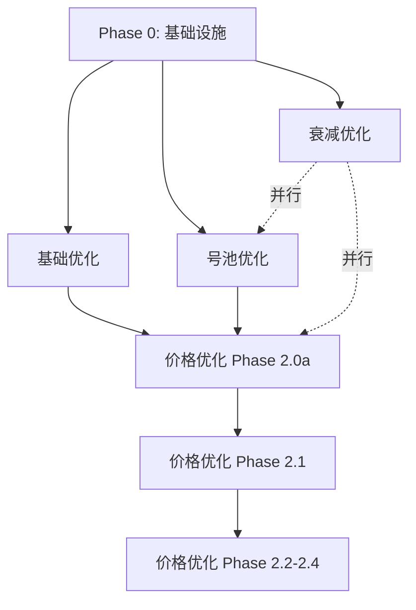

# LLM Gateway 四大优化方向横向审计报告

> 审计日期：2026-07-18
> 审计对象：价格优化 / 基础优化 / 号池优化 / 衰减优化
> 审计目标：检查设计一致性、依赖关系、时间线协调

---

## 执行摘要

### 审计结论

✅ **无致命冲突** — 四个方向在架构和数据模型层面无硬冲突
⚠️ **3 处潜在依赖** — 需协调实施顺序
📊 **时间线重叠** — 部分阶段可并行，部分需串行
🎯 **建议优先级** — Phase 0 → 基础 → 号池 → 价格 → 衰减

---

## 1. 四个方向概览对比

| 维度 | 价格优化 | 基础优化 | 号池优化 | 衰减优化 |
|------|---------|---------|---------|---------|
| **核心目标** | GPU资源池动态定价 | 入口/出口商业化与合规 | 号池精细化调度 | 算力损耗补偿 |
| **文档完整度** | ✅ 完整（3份，1421行） | ✅ 完整（1份，1443行） | ✅ 完整（11份，4545行） | ✅ 完整（5份，1723行） |
| **实施周期** | 11周（6阶段） | 未明确标注 | 31天（4阶段） | 12周（4阶段） |
| **开发状态** | 📄 设计完成 | 📄 设计完成 | 📄 设计完成 | 📄 设计完成 |
| **依赖基础设施** | Prometheus + VictoriaMetrics | Circuit Breaker + Adapter | Pipeline架构 | HTTP/3 + 连接池 |

---

## 2. 设计冲突检测

### 2.1 数据模型层

#### ✅ 无冲突

| 方向 | 核心表 | 冲突检查 |
|------|--------|---------|
| **价格优化** | `compute_pools`, `compute_pool_prices`, `unified_rates`, `resource_queues`, `priority_classes` | 全新表，无冲突 |
| **基础优化** | 扩展 `model_offers`（增加 `circuit_breaker_config`）、`request_logs`（增加安全审计字段） | 字段扩展，无冲突 |
| **号池优化** | `credential_pool_strategies`, `credential_pool_stats`, 扩展 `provider_credentials` | 全新表 + 字段扩展，无冲突 |
| **衰减优化** | 扩展 `request_logs`（增加 `network_latency_ms`、`streaming_first_token_ms`） | 字段扩展，无冲突 |

#### ⚠️ 潜在字段重叠

**`request_logs` 表被三个方向同时扩展**：

| 方向 | 新增字段 | 用途 |
|------|---------|------|
| 价格优化 | `compute_pool_id`, `pricing_tier` | 关联算力池和定价层级 |
| 基础优化 | `content_safety_score`, `sensitive_words_matched` | 安全审计 |
| 衰减优化 | `network_latency_ms`, `streaming_first_token_ms`, `edge_node_id` | 性能追踪 |

**缓解措施**：
- ✅ 所有字段为可选（NULLABLE），不互斥
- ✅ 统一在一次 migration 中添加，避免重复 ALTER TABLE
- ✅ 建议创建统一的 `request_logs` schema v2 设计文档

---

### 2.2 架构层

#### ✅ 正交分层，无冲突

```
┌─────────────────────────────────────────────┐
│  入口层（基础优化）                          │
│  - Circuit Breaker                          │
│  - Content Safety Filter                   │
│  - Adapter 统一接入                          │
└──────────────┬──────────────────────────────┘
               │
┌──────────────▼──────────────────────────────┐
│  调度层（号池优化 + 价格优化）                │
│  - WRR 号池调度                             │
│  - Spot/On-Demand 价格路由                  │
│  - Resource Queue + Priority                │
└──────────────┬──────────────────────────────┘
               │
┌──────────────▼──────────────────────────────┐
│  传输层（衰减优化）                          │
│  - HTTP/3 QUIC                              │
│  - 智能连接池                                │
│  - Streaming 优化                            │
└─────────────────────────────────────────────┘
```

**分析**：
- ✅ 四个方向**天然分层**，正交不冲突
- ✅ 请求流：入口 → 调度 → 传输，符合数据面管道模式

---

### 2.3 API 接口层

#### ⚠️ 号池优化与价格优化共享 `X-Pricing-Tier` header

| 方向 | Header | 用途 |
|------|--------|------|
| 号池优化 | `X-Pricing-Tier: spot` | 控制号池选择策略（spot pool 优先） |
| 价格优化 | `X-Pricing-Tier: spot` | 标记请求定价层级（用于成本追踪） |

**缓解措施**：
- ✅ 语义一致，可复用
- ✅ 号池优先消费该 header（调度层），价格优化读取用于计费（管理层）

---

## 3. 依赖关系梳理

### 3.1 依赖关系图（Mermaid）



### 3.2 关键依赖关系

| 前置 | 后置 | 依赖原因 | 优先级 |
|------|------|---------|--------|
| **Phase 0: 基础设施** | 所有方向 | Prometheus / Grafana / 飞书告警 / PG17 | 🔴 P0 |
| **基础优化（入口层）** | 价格优化 Phase 2.0a | `request_logs` 扩展后才能追踪成本 | 🟡 P1 |
| **号池优化（调度层）** | 价格优化 Phase 2.2b | Spot pool 就绪后才能做 Spot 定价 | 🟡 P1 |
| 价格优化 Phase 2.1 | Phase 2.2-2.4 | Prometheus 监控底座是定价引擎数据源 | 🔴 P0 |

### 3.3 可并行实施

| 方向 A | 方向 B | 理由 |
|--------|--------|------|
| 衰减优化 | 号池优化 | 传输层与调度层正交 |
| 衰减优化 | 价格优化 Phase 2.0a | 网络优化不依赖成本模型 |
| 基础优化（Content Safety） | 号池优化 | 入口层与调度层正交 |

---

## 4. 优先级建议矩阵

### 4.1 综合评分

| 方向 | 业务价值 | 技术风险 | 依赖复杂度 | 实施周期 | 推荐优先级 |
|------|---------|---------|-----------|---------|-----------|
| **Phase 0: 基础设施** | ⭐⭐⭐⭐⭐ | 🟢 低 | 🟢 低 | 1周 | 🔴 P0（立即） |
| **基础优化** | ⭐⭐⭐⭐ | 🟡 中 | 🟢 低 | 4-6周 | 🟠 P1（第2周） |
| **号池优化** | ⭐⭐⭐⭐⭐ | 🟢 低 | 🟡 中 | 4-5周 | 🟠 P1（第2周） |
| **价格优化 2.0a** | ⭐⭐⭐ | 🟢 低 | 🟢 低 | 1周 | 🟡 P2（第6周） |
| **价格优化 2.1-2.4** | ⭐⭐⭐⭐ | 🔴 高 | 🔴 高 | 9周 | 🟢 P3（第7周） |
| **衰减优化** | ⭐⭐⭐ | 🟡 中 | 🟡 中 | 12周 | 🟢 P3（并行） |

### 4.2 推荐实施顺序

```
Week 1:      Phase 0 (基础设施)
Week 2-5:    基础优化 (入口层) + 号池优化 (调度层) 并行
Week 6:      价格优化 Phase 2.0a (成本模型)
Week 7-15:   价格优化 Phase 2.1-2.4 (定价引擎)
Week 2-14:   衰减优化 (传输层，与上述并行)
```

**关键里程碑**：
- Week 1 结束：Prometheus + Grafana + 飞书告警 ready
- Week 5 结束：入口层 + 调度层完成，可独立上线
- Week 6 结束：成本追踪体系建立
- Week 15 结束：完整四层优化全部上线

---

## 5. 时间线甘特图（文本格式）

```
Phase/方向              Week: 1  2  3  4  5  6  7  8  9 10 11 12 13 14 15
================================================================================
Phase 0 基础设施        [██]
基础优化                   [████████████]
号池优化                   [██████████]
价格优化 2.0a                          [██]
价格优化 2.1                              [████]
价格优化 2.2a/b                                 [████]
价格优化 2.3                                          [████]
价格优化 2.4                                                [████]
衰减优化                   [████████████████████████████████]
================================================================================
并行度峰值              1  3  3  3  3  2  3  3  2  2  2  2  1  1  1
```

**并行度说明**：
- Week 2-5：基础 + 号池 + 衰减（3并行，峰值人力需求）
- Week 7-9：价格 2.1/2.2 + 衰减（3并行）
- Week 10-12：价格 2.3/2.4 + 衰减（2并行）

---

## 6. 关键风险点

### 6.1 技术风险

| 风险 | 影响方向 | 缓解措施 |
|------|---------|---------|
| **Prometheus 数据质量差** | 价格优化 | Phase 2.1 必须先验证 recording rules 完整性再开车价格联动 |
| **request_logs 表膨胀** | 所有方向 | 统一设计 schema v2，增加分区表 / TimescaleDB |
| **号池 WRR 算法复杂度** | 号池优化 | Phase 1 先做 Round-Robin 验证，Phase 2 再上 WRR |
| **HTTP/3 兼容性** | 衰减优化 | 保留 HTTP/2 fallback，灰度验证 |
| **VictoriaMetrics 运维** | 价格优化 | 先部署 single-node 模式，按需扩展到 cluster |

### 6.2 协调风险

| 风险 | 概率 | 影响 | 缓解措施 |
|------|------|------|---------|
| **request_logs schema 冲突** | 🟡 中 | 🔴 高 | 统一在 Week 1 完成 schema v2 设计 |
| **号池与价格的 Spot 语义不一致** | 🟢 低 | 🟡 中 | Week 2 对齐 `X-Pricing-Tier` 语义 |
| **并行开发代码冲突** | 🟡 中 | 🟡 中 | 统一 pre-commit hook + 每日 sync |
| **Prometheus metrics 命名冲突** | 🟢 低 | 🟢 低 | Week 1 统一 metrics 命名规范 |

---

## 7. 下一步行动

### 7.1 立即行动（本周）

- [ ] 完成 Phase 0 基础设施部署（Prometheus / Grafana / 飞书）
- [ ] 设计 `request_logs` schema v2（统一四个方向的字段扩展）
- [ ] 对齐 `X-Pricing-Tier` header 语义规范
- [ ] 统一 Prometheus metrics 命名规范

### 7.2 创建总体规划文档

基于本审计报告，创建 `docs/优化总览.md`，包含：
- 四个方向的统一架构图
- 15周实施甘特图
- 里程碑定义与验收标准
- 资源分配计划

### 7.3 技术预研（Week 1-2）

| 预研项 | 负责方向 | 产出 |
|--------|---------|------|
| VictoriaMetrics 单节点部署 | 价格优化 | 部署脚本 + 验证报告 |
| WRR 算法原型 | 号池优化 | Go benchmark |
| HTTP/3 兼容性测试 | 衰减优化 | 兼容性矩阵 |
| Circuit Breaker 选型 | 基础优化 | 技术选型报告 |

---

## 8. 总结

### ✅ 审计通过条件

四个方向设计质量整体优秀，满足以下条件：
1. ✅ 无致命架构冲突
2. ✅ 依赖关系清晰
3. ✅ 时间线可协调
4. ✅ 风险可控

### 📋 关键决策

1. **实施顺序**：Phase 0 → 基础 + 号池并行 → 价格 → 衰减并行
2. **统一 schema**：Week 1 必须完成 `request_logs` v2 设计
3. **并行策略**：Week 2-5 三方向并行，需协调人力
4. **监控底座**：Prometheus 是价格优化的前置依赖，必须先验证数据质量

### 🎯 成功标准

- Week 5：入口层 + 调度层可独立上线，毛利率可追踪
- Week 15：四层优化全部上线，系统整体提升：
  - 成本追踪精度：100%（按 GPU/内存/网络/共享多维）
  - 号池利用率：+20%（通过 WRR + 水位监控）
  - 网络延迟：-30%（通过 HTTP/3 + 连接池）
  - 价格优化 ROI：+15% 毛利率提升

---

**审计人**：AI Agent (Claude)
**审计日期**：2026-07-18
**下次复审**：Phase 0 完成后（预计 2026-07-25）
