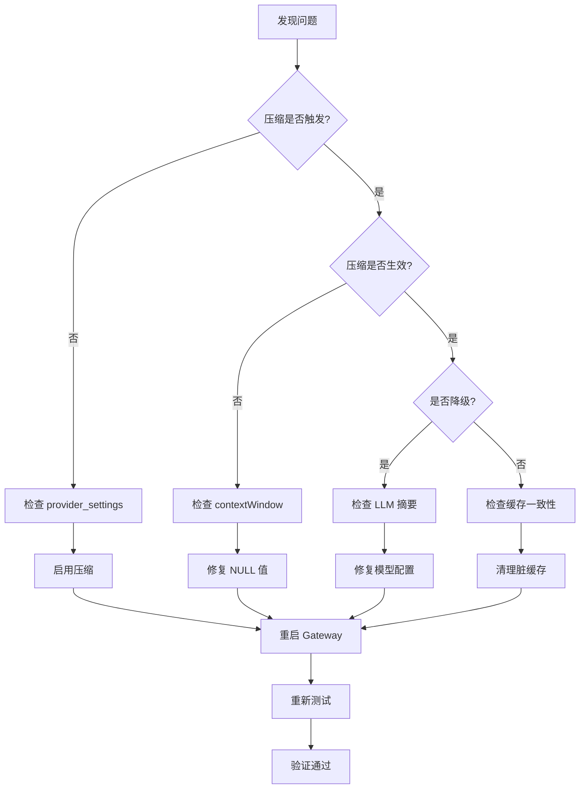

# 17 - 会话压缩与缓存测试方案

> **版本**: v1.0
> **日期**: 2026-07-19
> **目标**: 本地环境通过 Mock 供应商验证会话压缩+缓存的完整性、正确性和鲁棒性

---

## 一、测试目标

### 1.1 核心验证点

1. **会话压缩触发条件**
   - Token 触发：`tokenEst >= contextWindow * 0.85`
   - 消息数触发：`msgCount >= 50`
   - 空闲触发：`距上次压缩 >= 5分钟`

2. **压缩策略正确性**
   - `delta_append`: 增量累积新消息
   - `mechanical_trim`: 机械裁剪旧消息
   - `sliding_window_*`: LLM 智能摘要

3. **三级缓存一致性**
   - L1 (内存): 热会话快速访问
   - L2 (Redis): 持久化会话状态
   - L3 (PostgreSQL): 冷启动恢复

4. **Provider 级别配置**
   - `provider_settings.compression.mode` 覆盖全局配置
   - 中转节点与直连节点行为一致性

5. **压缩降级与错误处理**
   - `contextWindow = NULL` 时的 fallback
   - LLM 摘要失败时降级到机械裁剪
   - 压缩输出 >= 原始输入时的 NeverWorse 保护

### 1.2 问题场景重现

根据生产事故 `context_length_exceeded`，重点验证：

- ✅ 第三方中转节点 `compression.mode="off"` 导致的累积
- ✅ `contextWindow=NULL` 导致 token 触发器失效
- ✅ 客户端发送 577 条消息时的压缩行为
- ✅ `max_tokens` / `max_completion_tokens` 未扣减的问题

---

## 二、测试架构

### 2.1 整体架构

```
┌─────────────────────┐
│  Test Client        │  模拟客户端多轮对话
│  (Python/Go)        │  发送递增的消息历史
└──────────┬──────────┘
           │ HTTP + X-Gw-Session-Id
           ▼
┌─────────────────────┐
│  LLM Gateway        │  启动在本地 :8782
│  (本地编译)          │  • SessionCompressor
│                     │  • 3-tier SessionCache
│                     │  • Provider routing
└──────────┬──────────┘
           │
           ├─→ PostgreSQL (test DB)
           │   • provider_settings
           │   • request_logs (验证)
           │
           ├─→ Redis (本地)
           │   • L2 session cache
           │
           └─→ Mock Suppliers (端口 19200-19209)
               • mock_supplier.py × 10
               • 模拟直连 (A组) 和中转 (B组)
```

### 2.2 Mock 供应商配置

| 组 | Provider | Credential | Compression | Context | 模拟场景 |
|----|----------|------------|-------------|---------|---------|
| A  | mock-direct-gpt | 9200-9204 | smart | 128000 | 直连 OpenAI，压缩正常 |
| B  | mock-relay-gpt  | 9205-9209 | off   | 128000 | 中转节点，压缩禁用 |

---

## 三、测试场景定义

### S17: 基础会话压缩验证

**目标**: 验证压缩在理想条件下的触发和执行

**步骤**:
1. 客户端发送第 1-10 轮对话（每轮 2 条消息）
2. 第 11-30 轮持续发送

**预期**:
- 前 10 轮：`compression_strategy = NULL` 或 `"delta_append"`（消息数 < 50）
- 第 25 轮：触发 `sliding_window_count`（消息数 >= 50）
- `outbound_msg_count` 稳定在 ~40-50 条
- `request_logs` 中 `compression_meta.context_window_used = 128000`

**验证 SQL**:
```sql
SELECT
    request_id,
    jsonb_array_length(request_body->'messages') AS client_msgs,
    outbound_msg_count,
    compression_strategy,
    compression_meta->'context_window_used' AS ctx_window
FROM request_logs
WHERE gw_session_id = 'test-s17-basic'
ORDER BY created_at;
```

---

### S18: 中转节点压缩禁用问题

**目标**: 重现生产问题：中转节点 `compression.mode="off"` 导致消息累积

**配置**:
```sql
-- 设置 B 组中转节点禁用压缩
INSERT INTO provider_settings (provider_id, key, value, enabled)
VALUES (9001, 'compression.mode', '"off"', true)
ON CONFLICT (provider_id, key) DO UPDATE SET value = '"off"';
```

**步骤**:
1. 客户端请求模型 `loadtest-relay-gpt`（强制路由到 B 组）
2. 发送 60 轮对话（120 条消息）

**预期**:
- ❌ `compression_strategy = NULL`（所有轮次）
- ❌ `outbound_msg_count = client_msg_count`（无压缩）
- ❌ 第 60 轮时 `pg_column_size(outbound_body) > 500KB`
- ❌ 最终可能触发 `context_length_exceeded`

**修复验证**:
```sql
-- 启用压缩
UPDATE provider_settings
SET value = '"smart"'
WHERE provider_id = 9001 AND key = 'compression.mode';

-- 重启 gateway 后重新测试
-- 预期：compression_strategy = "sliding_window_count"
```

---

### S19: ContextWindow NULL 降级

**目标**: 验证当 `contextWindow=NULL` 时的行为

**配置**:
```sql
-- 临时置空 context_window
UPDATE models_canonical
SET context_window = NULL
WHERE canonical_name = 'loadtest-gpt-128k';
```

**预期**:
- ⚠️ Token 触发器失效（无法计算 85% 阈值）
- ✅ 消息数触发器仍然生效（第 50 条消息时压缩）
- ✅ 空闲触发器仍然生效（5 分钟后压缩）
- ⚠️ 如果消息数 < 50 且 < 5 分钟，则不压缩

**修复验证**:
```sql
-- 恢复 context_window
UPDATE models_canonical
SET context_window = 128000
WHERE canonical_name = 'loadtest-gpt-128k';
```

---

### S20: 压缩 NeverWorse 保护

**目标**: 验证压缩输出 >= 输入时的保护机制

**步骤**:
1. 发送 5 条极短消息（每条 < 10 tokens）
2. 触发压缩

**预期**:
- ✅ 压缩器检测到 `len(compressed) >= len(original)`
- ✅ 回退到原始 body，`compression_strategy = NULL`
- ✅ 日志中出现 `never_worse_guard: discarded compression`

---

### S21: LLM 摘要失败降级

**目标**: 验证 LLM 摘要失败时降级到机械裁剪

**配置**:
```bash
# 禁用 LLM 摘要模型
export LLM_GATEWAY_COMPACTION_DISABLE=1
```

**预期**:
- ✅ `compression_strategy = "mechanical_trim"`（而非 `sliding_window_*`）
- ✅ 消息数减少但无摘要
- ✅ 日志: `"LLM summary failed/no-op, falling back to mechanical trim"`

---

### S22: 三级缓存一致性

**目标**: 验证 L1/L2/L3 缓存的读写和降级

**步骤**:
1. 发送第 1 轮对话
2. 清空 L1（重启 gateway）
3. 发送第 2 轮对话（应从 L2 Redis 恢复）
4. 清空 L2（Redis FLUSHALL）
5. 发送第 3 轮对话（应从 L3 PG 恢复）

**验证**:
```bash
# 检查 Redis L2
redis-cli HGETALL "session:sc:default:test-s22-cache:v1"

# 检查 PG L3
SELECT outbound_body, outbound_msg_hashes
FROM request_logs
WHERE gw_session_id = 'test-s22-cache'
ORDER BY created_at DESC
LIMIT 1;
```

**预期**:
- ✅ L1 miss → L2 hit：缓存状态恢复
- ✅ L2 miss → L3 hit：从 PG 恢复状态
- ✅ 所有层级的 `LastOutboundHash` 一致

---

### S23: Kill Switch 验证

**目标**: 验证紧急关闭开关

**配置**:
```bash
# 禁用 SessionCompressor
export LLM_GATEWAY_SESSION_COMPRESSOR_DISABLE=1

# 禁用 SessionCache
export KILL_SESSION_CACHE=1
```

**预期**:
- ✅ 日志: `"v3 session-level compressor disabled"`
- ✅ 所有请求 `compression_strategy = NULL`
- ✅ 每次请求视为新会话（无增量）
- ✅ 无 Redis/PG 缓存写入

---

### S24: 高频会话压缩

**目标**: 验证短时间内大量消息的压缩性能

**步骤**:
1. 1 秒内发送 100 轮对话（200 条消息）

**预期**:
- ✅ 第 50 条消息时触发压缩
- ✅ P95 延迟 < 2s（包含压缩开销）
- ✅ 压缩后 `outbound_msg_count` 稳定在 40-50
- ✅ 无 goroutine 泄漏或 panic

---

### S25: 跨协议压缩

**目标**: 验证 OpenAI 和 Anthropic 协议的压缩

**配置**:
- Mock A组：`protocol = "openai-completions"`
- Mock C组：`protocol = "anthropic-messages"`

**预期**:
- ✅ OpenAI: 调用 `CompressMessagesIfNeeded`
- ✅ Anthropic: 调用 `CompressAnthropicMessagesIfNeeded`
- ✅ 两者都正确触发压缩
- ✅ `compression_meta` 记录正确的协议

---

### S26: 并发会话隔离

**目标**: 验证多会话并发时的缓存隔离

**步骤**:
1. 同时启动 10 个会话（session-01 到 session-10）
2. 每个会话独立发送 30 轮对话

**预期**:
- ✅ 每个会话独立压缩，互不干扰
- ✅ L1 缓存 LRU 正确驱逐（容量 1024）
- ✅ Redis 中存在 10 个独立的 hash key
- ✅ 无会话串话（消息错乱）

---

## 四、测试数据准备

### 4.1 数据库 Seed

```sql
-- docs/全方面测试/data/compression-seed.sql

-- 创建测试模型
INSERT INTO models_canonical (canonical_name, family, context_window, source, status)
VALUES
    ('loadtest-gpt-128k', 'openai-gpt', 128000, 'test', 'active'),
    ('loadtest-gpt-null-ctx', 'openai-gpt', NULL, 'test', 'active'),
    ('loadtest-claude', 'anthropic-claude', 200000, 'test', 'active')
ON CONFLICT (canonical_name) DO UPDATE
SET context_window = EXCLUDED.context_window;

-- 创建 mock providers
INSERT INTO providers (id, label, category, protocol, base_url, enabled, tenant_id)
VALUES
    (9000, 'mock-direct-gpt', 'official', 'openai-completions', 'http://localhost:19200', true, 'default'),
    (9001, 'mock-relay-gpt', 'third_party_relay', 'openai-completions', 'http://localhost:19205', true, 'default');

-- 创建 credentials (5 × 2 = 10)
INSERT INTO credentials (id, provider_id, label, secret_ciphertext, status, tenant_id)
SELECT
    9200 + row_number() OVER () - 1 AS id,
    CASE WHEN row_number() OVER () <= 5 THEN 9000 ELSE 9001 END AS provider_id,
    'mock-cred-' || (9200 + row_number() OVER () - 1) AS label,
    'v1:test:mock-key',
    'active',
    'default'
FROM generate_series(1, 10);

-- 绑定模型
INSERT INTO model_offers (credential_id, raw_model_name, canonical_id, standardized_name, available)
SELECT
    c.id,
    'loadtest-gpt-128k',
    (SELECT id FROM models_canonical WHERE canonical_name = 'loadtest-gpt-128k'),
    'loadtest-gpt-128k',
    true
FROM credentials c
WHERE c.id BETWEEN 9200 AND 9209;

-- 设置 B 组压缩为 off（模拟中转节点）
INSERT INTO provider_settings (provider_id, key, value, enabled)
VALUES (9001, 'compression.mode', '"off"', true)
ON CONFLICT (provider_id, key) DO UPDATE SET value = '"off"';
```

### 4.2 Mock Supplier 启动

```bash
# docs/全方面测试/tools/start_compression_mocks.sh

#!/bin/bash
set -e

# 启动 10 个 mock suppliers
for port in {19200..19209}; do
  python3 docs/全方面测试/tools/mock_supplier.py \
    --port $port \
    --mode healthy \
    --model loadtest-gpt-128k \
    --context-window 128000 \
    --latency-ms 100 \
    > /tmp/mock-supplier-$port.log 2>&1 &
  echo "Started mock supplier on :$port (PID: $!)"
done

echo "All compression test mocks started"
```

---

## 五、测试执行流程

### 5.1 环境准备

```bash
# 1. 准备测试数据库
createdb llm_gateway_test
psql llm_gateway_test -f sql/schema/01-schema.sql
psql llm_gateway_test -f docs/全方面测试/data/compression-seed.sql

# 2. 启动 Redis
redis-server --port 6379

# 3. 启动 Mock Suppliers
chmod +x docs/全方面测试/tools/start_compression_mocks.sh
docs/全方面测试/tools/start_compression_mocks.sh

# 4. 编译并启动 Gateway
export DATABASE_URL="postgresql://localhost/llm_gateway_test"
export REDIS_URL="redis://localhost:6379"
export LLM_GATEWAY_SESSION_COMPRESSOR_DISABLE=0
export KILL_SESSION_CACHE=0
go build -o bin/gateway cmd/gateway/main.go
./bin/gateway --port 8782 &
```

### 5.2 运行单个场景

```bash
# 运行 S17: 基础压缩验证
python3 docs/全方面测试/tools/compression_test_client.py \
  --gateway http://localhost:8782 \
  --scenario S17 \
  --session-id test-s17-basic \
  --rounds 30 \
  --model loadtest-gpt-128k \
  --output results/S17-basic-compression.json
```

### 5.3 运行全部场景

```bash
# 一键运行所有压缩测试
docs/全方面测试/scenarios/run_compression_tests.sh

# 生成报告
python3 docs/全方面测试/tools/compression_validation_report.py \
  --input results/S17-*.json \
  --output results/COMPRESSION_REPORT.md
```

---

## 六、验收标准

### 6.1 功能验收

| 场景 | 验收标准 | Pass/Fail |
|------|---------|-----------|
| S17 基础压缩 | 第 25 轮触发压缩，`outbound_msg_count < 50` | - |
| S18 中转禁用 | 压缩禁用时消息累积，启用后正常压缩 | - |
| S19 NULL ctx | 消息数触发器生效，无 panic | - |
| S20 NeverWorse | 压缩无效时回退原始 body | - |
| S21 LLM降级 | LLM 失败时降级到机械裁剪 | - |
| S22 缓存一致性 | L1/L2/L3 正确读写和降级 | - |
| S23 Kill Switch | 压缩完全禁用，无缓存写入 | - |
| S24 高频压缩 | 100 轮 P95 < 2s，无泄漏 | - |
| S25 跨协议 | OpenAI 和 Anthropic 都正常压缩 | - |
| S26 并发隔离 | 10 会话无串话，L1 LRU 正常 | - |

### 6.2 性能验收

- **压缩延迟**: P95 < 500ms（不含 LLM 摘要）
- **LLM 摘要延迟**: P95 < 2s
- **缓存命中率**: L1 > 90%, L2 > 95%
- **内存占用**: L1 缓存 < 100MB (1024 会话)

### 6.3 数据验收

```sql
-- 验证所有场景的日志完整性
SELECT
    COUNT(*) AS total_requests,
    COUNT(CASE WHEN compression_strategy IS NOT NULL THEN 1 END) AS compressed,
    COUNT(CASE WHEN error_kind = 'context_length_exceeded' THEN 1 END) AS errors,
    AVG(pg_column_size(request_body)) AS avg_request_bytes,
    AVG(pg_column_size(outbound_body)) AS avg_outbound_bytes,
    AVG(outbound_msg_count::float / NULLIF(jsonb_array_length(request_body->'messages'), 0)) AS avg_compression_ratio
FROM request_logs
WHERE created_at > NOW() - INTERVAL '1 hour'
  AND gw_session_id LIKE 'test-s%';
```

**预期**:
- `compressed / total_requests > 0.7`（70% 请求被压缩）
- `errors = 0`（无上下文超限）
- `avg_compression_ratio < 0.9`（至少 10% 压缩）

---

## 七、问题诊断与修复

### 7.1 常见问题检查清单

```bash
# 1. 检查压缩是否启用
curl http://localhost:8782/admin/health | jq '.features.session_compressor'

# 2. 检查 provider_settings
psql -c "SELECT * FROM provider_settings WHERE key LIKE '%compression%';"

# 3. 检查 Redis 缓存
redis-cli KEYS "session:sc:*" | wc -l

# 4. 检查日志
tail -f /tmp/gateway.log | grep -i "compression\|session_compressor"

# 5. 检查 request_logs
psql -c "
SELECT compression_strategy, COUNT(*)
FROM request_logs
WHERE created_at > NOW() - INTERVAL '10 minutes'
GROUP BY compression_strategy;
"
```

### 7.2 修复验证流程



---

## 八、与现有测试体系整合

### 8.1 整合到 CI/CD

```yaml
# .github/workflows/compression-test.yml
name: Session Compression Tests

on: [push, pull_request]

jobs:
  compression-test:
    runs-on: ubuntu-latest
    services:
      postgres:
        image: postgres:15
      redis:
        image: redis:7
    steps:
      - uses: actions/checkout@v3
      - name: Setup Go
        uses: actions/setup-go@v4
        with:
          go-version: '1.21'
      - name: Seed Test Data
        run: psql $DATABASE_URL -f docs/全方面测试/data/compression-seed.sql
      - name: Start Mocks
        run: docs/全方面测试/tools/start_compression_mocks.sh
      - name: Run Compression Tests
        run: docs/全方面测试/scenarios/run_compression_tests.sh
      - name: Validate Results
        run: |
          python3 docs/全方面测试/tools/compression_validation_report.py
          if grep -q "FAIL" results/COMPRESSION_REPORT.md; then exit 1; fi
```

### 8.2 纳入全方面测试矩阵

在 `docs/全方面测试/03-测试场景定义.md` 中添加：

```markdown
### S17-S26: 会话压缩与缓存专项测试

详见 [17-会话压缩与缓存测试方案.md](./17-会话压缩与缓存测试方案.md)

| 编号 | 场景名称 | 验证重点 | 并发数 | 请求量 |
|------|---------|---------|-------|-------|
| S17 | 基础压缩验证 | 压缩触发条件 | 1 | 30 |
| S18 | 中转节点问题 | provider_settings 覆盖 | 1 | 60 |
| S19 | NULL ctx降级 | contextWindow=NULL | 1 | 60 |
| S20 | NeverWorse保护 | 压缩退化保护 | 1 | 10 |
| S21 | LLM降级 | 摘要失败降级 | 1 | 30 |
| S22 | 缓存一致性 | L1/L2/L3 降级 | 1 | 10 |
| S23 | Kill Switch | 紧急关闭 | 1 | 20 |
| S24 | 高频压缩 | 性能压力 | 1 | 100 |
| S25 | 跨协议 | OpenAI+Anthropic | 2 | 60 |
| S26 | 并发隔离 | 多会话并发 | 10 | 300 |
```

---

## 九、附录

### 9.1 测试客户端代码示例

```python
# docs/全方面测试/tools/compression_test_client.py

import requests
import time
import json
import argparse

def run_session_test(gateway_url, api_key, session_id, rounds, model):
    """发送多轮对话，验证压缩行为"""
    messages = []
    results = []

    for i in range(1, rounds + 1):
        # 累积消息历史
        messages.append({"role": "user", "content": f"第 {i} 轮问题"})

        # 发送请求
        resp = requests.post(
            f"{gateway_url}/v1/chat/completions",
            headers={
                "Authorization": f"Bearer {api_key}",
                "X-Gw-Session-Id": session_id,
                "Content-Type": "application/json"
            },
            json={
                "model": model,
                "messages": messages.copy()
            }
        )

        # 记录结果
        result = {
            "round": i,
            "client_msg_count": len(messages),
            "status": resp.status_code,
            "headers": dict(resp.headers),
            "response": resp.json() if resp.ok else resp.text
        }
        results.append(result)

        # 添加助手回复到历史
        if resp.ok:
            content = resp.json()["choices"][0]["message"]["content"]
            messages.append({"role": "assistant", "content": content})

        time.sleep(0.1)  # 避免过快

    return results

if __name__ == "__main__":
    parser = argparse.ArgumentParser()
    parser.add_argument("--gateway", required=True)
    parser.add_argument("--scenario", required=True)
    parser.add_argument("--session-id", required=True)
    parser.add_argument("--rounds", type=int, required=True)
    parser.add_argument("--model", required=True)
    parser.add_argument("--output", required=True)
    args = parser.parse_args()

    results = run_session_test(
        gateway_url=args.gateway,
        api_key="test-compression-key",
        session_id=args.session_id,
        rounds=args.rounds,
        model=args.model
    )

    with open(args.output, "w") as f:
        json.dump({
            "scenario": args.scenario,
            "session_id": args.session_id,
            "results": results
        }, f, indent=2)

    print(f"✅ {args.scenario} completed: {args.output}")
```

### 9.2 参考文档

- [session-cache-test-report.md](../session-cache-test-report.md) - 原有缓存测试
- [03-测试场景定义.md](./03-测试场景定义.md) - 全场景矩阵
- [08-kill-switch.md](./08-kill-switch.md) - Kill Switch 文档
- [domains/hooks/compression/README.md](../../domains/hooks/compression/README.md) - 压缩模块设计

---

**文档维护**: 测试发现问题后，及时更新本文档的"问题诊断"章节
