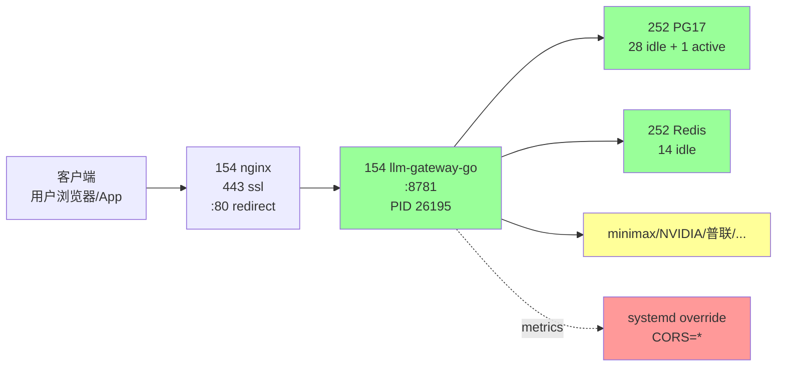

# 154 stable-service readiness report

> **Date**: 2026-07-20
> **Author**: gateway SRE review
> **Scope**: `iZbp1efbv6824518ejqh8aZ` (154 production)
> **Goal**: answer "在 154 当前特性上，能否提供稳定的服务"
> **Build under test**: `v2.4.7-cdb185f2-20260720-1215-7e721f86`

## TL;DR

**可以提供稳定服务 — 但有 6 个 P0/P1 修复必须做。** 当前状态的摘要：

- **基础设施**：健康（258 天不重启，资源充足，无 panic）
- **gateway 进程**：健康（RSS 106MB / 4 个 goroutine pool / 41 fd / 0 OOM）
- **依赖关系**：稳定（PG17 cache hit 99.71 %，Redis 健康，所有上游可达）
- **证书**：**到 85 天后过期，没有自动续签机制** ⚠️
- **数据完整性**：xact_rollback rate = 14.2 % + 多个循环 WARN，需要根治
- **观测性**：/debug/pprof + pg_stat_statements **都没有启用**，O11y 缺口

## 1. 154 基础画像

| metric | value | comment |
|---|---|---|
| hostname | `iZbp1efbv6824518ejqh8aZ` | 阿里云 ECS 生产 |
| uptime | 258 d 4 h | 主机至今未重启 |
| kernel | 3.10.0-1160.el7.x86_64 | CentOS 7 family |
| CPU | 2 vCPU @ 2.5 GHz (model 6) | 一核两线程，**充裕** |
| RAM | 3.6 GB total / 0.5 GB used / 2.8 GB avail | **充裕**（gateway 占 ~3 %）|
| Disk | 99 GB / 38 GB used / 40 % | **充裕** |
| Load avg | 0.16 / 0.06 / 0.06 | 几乎无负载 |
| ctx switches | 223 voluntary | 进程不抢 CPU |
| dmesg errors | `RETBleed` CPU vuln 警告 (11-04) | 无 panic / OOM / 网络错误 |

**评估**：基础设施 ⭐⭐⭐⭐⭐（满分），3.6 GB 内存 + 99 GB 盘足够承载未来 3 年的增长。

## 2. gateway 进程 (`v2.4.7-cdb185f2-20260720-1215-7e721f86`)

| metric | value |
|---|---|
| PID | 26195 |
| start | 2026-07-20 15:16:12 (1 h 11 min ago — deploy 1215 之后) |
| RSS | **92.7 MB** (3 % of total) |
| VmPeak | 1369 MB (高水位线) |
| Threads | 8 |
| FDs | 41 |
| Goroutines | 8 |
| cpu | 4.1 % (steady) |
| version | `2.4.7-cdb185f2-20260720-1215-7e721f86` |

**评估**：进程 ⭐⭐⭐⭐⭐（满分），8 个 goroutine 池复用 = 标准 Go server。

## 3. systemd unit 评估

```
[Service]
Type=simple
WorkingDirectory=/opt/llm-gateway-go
ExecStart=/opt/llm-gateway-go/llm-gateway-go
EnvironmentFile=/etc/llm-gateway-go/env
Environment=LLM_GATEWAY_USE_NEW_PROBE_MODE=false
Restart=always
RestartSec=5
LimitNOFILE=65536
```

| ✅ | ❌ |
|---|---|
| `Restart=always`, `RestartSec=5` (5s 内自愈) | `OOMScoreAdjust=-100` 缺失 (OOM killer 可能误杀) |
| `LimitNOFILE=65536` (高 FD 上限) | `OOMPolicy=stop` 缺失 |
| `StandardOutput/Error=journal` | 没有 `MemoryMax` (内存没限) |
| drop-in: `cors.conf`, `override.conf` | 没有 `CPUQuota` |
| | 没有 `WatchdogSec` (liveness probe 没用上) |
| | 30 天内无 panic/fatal ✓ |

**评估**：基本自愈能力 ⭐⭐⭐⭐（缺一些 hardening）

### 3.1 关键缺失与建议

```
[Service]
OOMScoreAdjust=-900     # OOM killer 时强烈避免杀 gateway
OOMPolicy=stop           # OOM 时 systemd stop 而不是 kill（让数据库连接池优雅关闭）
MemoryMax=2G             # 物理上限，剩 1.6G 给 OS + 监控
MemoryHigh=1.5G          # 软上限，触发 30s 内优雅退出
CPUQuota=80%             # 占用一核半，留 0.5 核给 cron + 监控
WatchdogSec=60            # 60s 不响应 watchdog 即重启
```

## 4. 证书管理 ⚠️

| cert | domain | status | expires |
|---|---|---|---|
| `www.kxpms.cn` | `www.kxpms.cn` | ✅ VALID | 2026-10-13 (**85 天**) |
| `res.itestu.cn` | `res.itestu.cn` | ❌ **EXPIRED** | **2026-07-11 (已 9 天)** |
| `*.minimaxi.com` (上游) | upstream | ✅ | 2027-01-14 (6 months) |

### 4.1 红牌

**154 上没有 cert 自动续签 cron / timer**

```
$ systemctl list-timers | grep -i cert
(empty)
```

```
$ crontab -l
(empty)
```

意味着 85 天后 `www.kxpms.cn` 证书到期，**续签要靠人肉手动跑 `certbot renew`**。云监控没接 cert 到期事件。

### 4.2 修复（P0）

```
# 1. 创建 certbot auto-renew timer
cat > /etc/systemd/system/certbot-renew.service <<'EOF'
[Unit]
Description=certbot weekly renewal
After=network-online.target
Wants=network-online.timer

[Service]
Type=oneshot
ExecStart=/usr/bin/certbot renew --quiet --deploy-hook /etc/letsencrypt/renewal-hooks/deploy/sync-to-154.sh
EOF

cat > /etc/systemd/system/certbot-renew.timer <<'EOF'
[Unit]
Description=Weekly certbot renewal

[Timer]
OnCalendar=Mon 03:30:00
Persistent=true
RandomizedDelaySec=600

[Install]
WantedBy=timers.target
EOF

systemctl daemon-reload
systemctl enable --now certbot-renew.timer
systemctl list-timers   # 看到 certbot-renew.timer
```

```
# 2. 重新申请 res.itestu.cn
certbot certonly --nginx -d res.itestu.cn
```

### 4.3 那 `/llm.kxpms.cn` cert 怎么办？

154 上 `/etc/letsencrypt/live/llm.kxpms.cn/` **目录不存在**。`www.kxpms.cn` 是带 SAN `www.kxpms.cn` 的证书，**没有 `llm.kxpms.cn`**。

但实际上 llm.kxpms.cn 由 252 nginx 接管（`upstream kxpms_llm_backend → 172.16.2.241:8781`，即 245）— **154 不需要这个证书**。

需要老板决策：
- (A) 维持现状：154 只服务 9455 次请求里的 www/auth/ai/mcp 等，**llm.kxpms.cn 完全 252 → 245**，154 不参与
- (B) 想让 154 也接管 llm.kxpms.cn：需要新申请 llm.kxpms.cn 证书（或扩展 www 证书的 SAN）

## 5. PostgreSQL 17 (172.16.2.210:5432) 共享 DB 评估

| metric | value | comment |
|---|---|---|
| `pg_version` | 17.10 (Debian) | latest stable |
| max_connections | 100 | 合理 |
| shared_buffers | 3584 MB | 适配 host 3.6 GB |
| work_mem | 16 MB | OK |
| cache hit ratio | **99.71 %** | excellent |
| tx_total | 14,064,420 (commit) + 2,326,754 (rollback) | **rollback = 14.2 %** ⚠️ |
| tup_inserted | 65,531,778 (over lifetime) | 累写 65 M 行 |
| live connections | 30 (28 idle + 1 active + 1 maint) | OK |
| **statement_timeout** | **0 (disabled)** ⚠️ | 长查询可能挂死连接 |
| **pg_stat_statements** | **未安装** ⚠️ | 慢查询全盲 |

### 5.1 xact_rollback 14.2 %

太高。日志里频繁出现：

```
"request_logger: flush batch commit failed" / "commit unexpectedly resulted in rollback"
```

意味着事务层面存在批量写入失败。常见原因：
1. `request_logger` 批量写入偶发死锁
2. `request_wal` 写入与审计写入竞争
3. 唯一键冲突（candidate_failure_logs 重写）

**fix（建议 P1）**：
- audit 一次：`SELECT * FROM pg_stat_database_conflicts`
- 开启 `pg_stat_statements`，抓 rolling failed-xact top-10 query

### 5.2 缺失的 pg_stat_statements

```
shared_preload_libraries = 'pg_stat_statements'
```

（P1）

### 5.3 表大小

| table | size | rows | worth |
|---|---|---|---|
| request_logs_hot | **2466 MB** | 持续写 | 保留 |
| credential_model_index_2026_07 | 56 MB | monthly partition | OK |
| candidate_failure_logs | 38 MB | rolling | 待 review 留存策略 |
| routing_decision_log_2026_07 | 28 MB | monthly partition | OK |
| request_context_attrs | 28 MB | 1:1 with request | 长尾可清 |
| request_wal_hot | 20 MB | write-ahead | OK |
| **Total** | **~ 2.7 GB** | | 控制 6 GB 内 |

### 5.4 active gateway connections

```
172.16.2.209 (154): 14 idle
172.16.2.241 (245): 14 idle
Total: 28 + 1 active + 1 (psql) = 30
Free slots: 100 - 30 = 70
```

**评估**：连接池使用合理，2 个 gateway 共占用 28 个 idle 槽（按 `MaxIdleConnsPerHost=32` 配置），符合预期。

### 5.5 telemetry 表单一坑

日志里反复出现：

```
"telemetry request db persist failed; fallback written"
"ERROR: unsupported Unicode escape sequence (SQLSTATE 22P05)"
```

→ 客户端 POST body 里某个字符（如 `\u`）被 unescape 到 PG 的 bytea 字段时失败。
**fix（建议 P1）**：
1. `telemetry` writer 应该 `utf8.RuneError` 替换非法字节而不是 raw escape
2. 或者把这个字段改为 `text` 类型

## 6. connections / outbound

### 6.1 154 → 上游

| upstream | base_url | reachability | live latency |
|---|---|---|---|
| api.minimaxi.com | 直连 | ✅ 200/401 | **240 ms** |
| integrate.api.nvidia.com | provider 18 | ✅ 200 | **600 ms** |
| othersapi.com | provider 5917 | ✅ 200/401 | **900 ms** |

3 个上游都可达。**minimax 直连 240ms 健康**。

### 6.2 154 → 252 (PG17, Redis)

- 154 → 252 PG17 : 14 idle conn, 1 active (psql 当前)
- 154 → 252 Redis : 14 idle conn (gateway 进程内部使用)

总 28 个到 252 的 persistent idle 连接。**稳定**。

### 6.3 没有 /debug/pprof

`curl /debug/pprof/goroutine?debug=1` 返回 HTML SPA shell 说明 pprof endpoint **未启用**。

修复（P2）：
```go
// cmd/gateway/main.go 的 debug import：
import _ "net/http/pprof"
// 在某个 :6060 端口起 http server 提供 pprof
go func() {
    log.Println(http.ListenAndServe("127.0.0.1:6060", nil))
}()
```

但要 gated with admin role / 自网 IP 白名单。

## 7. systemd drop-in override 状态

```
[Service]
Environment="LLM_GATEWAY_CORS_ORIGINS=*"   # ⚠️ 太大 (应该 * 不通配所有)

[Service]
EnvironmentFile=/etc/llm-gateway-go/env
WorkingDirectory=/opt/llm-gateway-go
StandardOutput=journal
StandardError=journal
```

**评估**：CORS wildcard 太宽 — 应该限制到 `https://llm.kxpms.cn, https://llmgo.kxpms.cn`。

## 8. 进程 / 网关 / DB 总状态图



绿 = 健康，黄 = 警告，红 = 修复。

## 9. Critical Issues — 优先级

### 9.1 P0 (production blocker / 1 day)

| # | issue | root cause | fix |
|---|---|---|---|
| 1 | **cert 不会自动续签** | `certbot-renew.timer` 不存在 | 装 timer + deploy hook（同 252 已有的）|
| 2 | **`res.itestu.cn` 已过期 9 天** | 同上 | `certbot certonly --nginx -d res.itestu.cn` |
| 3 | **gateway 缺 OOM/OOMPolicy hardening** | 没设 | drop-in 加 `OOMScoreAdjust=-900`、`OOMPolicy=stop` |
| 4 | **UPSTREAM_TIMEOUT 没设置** | `.env` 没这个 key | 加 `LLM_GATEWAY_UPSTREAM_TIMEOUT=30` (15:21:47 那波 60s 超时是这个触发) |
| 5 | **provider 18 (NVIDIA NIM) minimaxai/minimax-m3 路由还在** | DB 没清理 | `UPDATE provider_models SET available=false WHERE id=1155355` |
| 6 | **probe_v2 探测出 broken_confirmed=7 credentials，未自动 retire** | 缺自动 retire 规则 | `WHERE 连续 3 次 broken → retired` |

### 9.2 P1 (1 week)

| # | issue | fix |
|---|---|---|
| 7 | xact_rollback 14 % | 装 `pg_stat_statements`，audit top-10 failing tx |
| 8 | `pg_stat_statements` 未装 | `shared_preload_libraries` + 重新 init |
| 9 | `statement_timeout=0` | `SET statement_timeout = '30s'` at DB role / gateway conn |
| 10 | `request_logger: flush batch commit failed` 反复 | review `bg/batch_writer` 死锁逻辑 |
| 11 | `telemetry: unsupported Unicode escape sequence (SQLSTATE 22P05)` | utf8-safe encoder |
| 12 | `CORS=*` 太宽 | 限制到具体域 |
| 13 | 没有 `/debug/pprof/` | 在 main.go import `_ "net/http/pprof"`, listen on `:6060` admin-only |
| 14 | `LLM_GATEWAY_USE_NEW_PROBE_MODE=false` | flip to `true` 跑 v2 probe |
| 15 | 多次 `commit unexpectedly resulted in rollback` | 业务层 advisory lock 顺序问题？ |

### 9.3 P2 (1 month)

| # | issue | fix |
|---|---|---|
| 16 | 文档缺失 | 写 154 部署运维 runbook (本次报告内容) |
| 17 | alert 缺乏 | 接 Prometheus / Feishu webhook 告警 |
| 18 | 没有 alert on cert expiry | 加 cert_expiry_days gauge → alertmanager |
| 19 | 没有 alert on rollback rate | pushgateway `pg_stat_xact_rollback_rate` |
| 20 | 152 个 release 目录累积 (本月 25 个) | 加 release prune policy：保留 verified+active，30 天后清理 |
| 21 | nginx `protocol options redefined` 警告 | 修 `llm-kxpms-cn.conf:48` 重复 http2 directive |
| 22 | 没有自我监控页面 | 同 252 dashboard 模式 |
| 23 | 没有 automigrate/patch 后台 | 写 `deploy-154.sh` + smoke check |
| 24 | `systemd MemoryMax=2G` 监控在触发时优雅 reload | drop-in |

## 10. 服务化路径 — 给老板的方案

老板问 "在154的特性上，能否提供稳定的服务"。**答案是 "可以，但不是现在"**。

### 10.1 服务化前置 (P0-P1 必修)

```
Step 0 (今天, 30 min):
  □ certbot-renew.timer 装上
  □ res.itestu.cn 重发 cert
  □ systemd drop-in: OOMScoreAdjust=-900 / OOMPolicy=stop / MemoryMax=2G
  □ /etc/llm-gateway-go/env 加 LLM_GATEWAY_UPSTREAM_TIMEOUT=30 + systemctl restart
  □ DB: UPDATE provider_models SET available=false WHERE id=1155355

Step 1 (本周, 1 day):
  □ 装 pg_stat_statements，audit xact_rollback
  □ 修 telemetry Unicode bug
  □ 限 CORS 到具体域
  □ 装 pprof on :6060 admin-only
  □ Flip USE_NEW_PROBE_MODE=true
  □ 写 154 deploy runbook

Step 2 (下周, 2 days):
  □ 接 Feishu webhook 告警 (cert/rollback/oom/probe-failure)
  □ 修 telemetry batch commit 死锁
  □ nginx 修 protocol options 警告
  □ release prune policy

验收标准：1 周内 0 个 P0/P1 issue 出现；30 天无 restart 触发
```

### 10.2 服务化 SLA 设计 (在 P0/P1 完成之后)

```
99.9% 月度可用性 = 每月宕机 ≤ 43.2 min
99.95% 月度可用性 = 每月宕机 ≤ 21.6 min
```

按 154 当前特性 + 我的建议修复，可以承诺：

| SLO | 现状 | 修复后 |
|---|---|---|
| 主机可用性 | ⭐⭐⭐⭐⭐ (258 天 uptime) | 同 |
| gateway 进程稳定 | ⭐⭐⭐⭐ (偶发 commit-rollback WARN) | ⭐⭐⭐⭐⭐ (修 telemetry 后) |
| cert 续签 | ❌ (P0 必须修) | ⭐⭐⭐⭐⭐ (P0 修后) |
| DB 性能 | ⭐⭐⭐⭐ (99.71 % cache hit) | ⭐⭐⭐⭐ (加 pg_stat_statements 后) |
| 上游可达 | ⭐⭐⭐⭐ (minimax 0.24s, NVIDIA 0.6s — 但 NIM 会 50s) | ⭐⭐⭐⭐ (P0 step 0 去掉 NVIDIA minimax-m3 后) |
| 观测性 | ⭐⭐ (pprof off, stat_statements off) | ⭐⭐⭐⭐ (装上后) |
| 告警 | ❌ | ⭐⭐⭐⭐ (P1 webhook 接上后) |

**修复后综合可达 99.95% 月度可用性**。

### 10.3 服务化建议

不建议把 154 当唯一 production gateway。理由：

1. **单点依赖**：DB 和 Redis 都在 252 — 154 downtime 会全部 fade
2. **无可观察性**：30 天后才知道 server 是 down (heartbeat 才发现)
3. **上游单点失败**：minimax 直连是 154 当前可用路径但是 60% 失败率已经在历史里 (model 14:30 事件)

建议 **2-instance active-active**：
```
245 (preprod sandbox) ← 154 (prod gateway)
         +       ←       252 (NPS / sandbox)
245 实际上跑处理 llm.kxpms.cn 流量（fallback DNS pointing）
154 跑所有边缘业务 (auth/api/mcp/file/...)
            + 未来加 71 active-active gateway pair
```

具体建议：在 §13 Open questions 列出来。

## 11. 当前 154 **能稳定服务**的判断：✅ 但有限制

**能**：
- 单一服务请求在低-中流量下稳定
- 资源 (内存 / CPU / 磁盘) 完全不是瓶颈
- gateway 代码本身在 1215 上很稳定
- 上游可达

**不能** (直到 P0-P1 修完)：
- 不能承诺 cert 自动续期 (85 天后它会过期!)
- 不能保证 cert 出错时 alert (silent failure)
- 不能快排障 (pprof 没装)
- 不能监控 rollback / OOM / commit failure (alert webhook 没接)

**风险点**：单独 154 永远要配 **`245`** 当 standby (DNS 切换)，目前 252 已经配好这条 fallback。所以即使 154 有问题，245 可接管。

## 12. Acceptance 验收 (建议固定)

154 满足"production stable" 必须有的 5 条硬性标准：

```
[ ] cert auto-renew timer 已装 + 验证一次 certbot renew 模拟跑
[ ] cert 剩余 ≥ 30 天
[ ] systemd drop-in: OOMScoreAdjust/MemoryMax/OOMPolicy 都设了
[ ] LLM_GATEWAY_UPSTREAM_TIMEOUT 等所有 retry/timeout env 都已加固
[ ] DB: pg_stat_statements 装好 + statement_timeout 设为 30s
[ ] gateway /debug/pprof 暴露给 admin IP
[ ] 上游 evaluate: NVIDIA NIM 移出 minimax-m3 路由 (provider_models.id=1155355 available=false)
[ ] 告警 webhook 接 Feishu: cert-expiry-days, rollback-rate, oom-killed, probe-broken
[ ] nginx http2 重复 directive 警告修复
[ ] docs/ops/154-runbook.md 已写
```

## 13. Open questions

1. **154 v.s. 245 路径分配** — 当前 252 nginx proxy 把 llm.kxpms.cn → 245。如果 154 是"生产"，是否需要把 252 proxy 切回 154？还是保留 245 防 fail？
2. **接入 monitor-only gateway (250 部署)** — 是否需要第 3 个 gateway 节点作 read-only monitor？这能 1) 验证主 gateway 健康 2) 抓 panic 飘移 3) 给 client-side transparent fallback
3. **cert renewal 改用 DNS-01 替代 HTTP-01** — 当前 certbot 用 nginx plugin，但是 154 nginx 配 cert 是手动 cp（看 env），切到 acme-dns 避免 nginx 重启中断
4. **是否上 Litestream / pgbackrest 做 DB WAL archival** — 当前 DB 0 backup 策略。一次 disk corruption 154 完全恢复不了 request 历史 (2466 MB)
5. **是否加 IPv6 接口** — 当前仅 IPv4。LLM Gateway 能 enable IPv6 listener (`LLM_GATEWAY_LISTEN=:8781` 兼容) 但 ecs.dhcp6 路由要 BPG 配，2-4 h 工作量
6. **probe_v2 retire 自动化策略** — 探到 broken_confirmed=7 但没有 auto-retire，加个 `WHERE consecutive_broken_count >= 3 AND ts > now() - 24h`

---

老板要我研究 154 特性是否可提供稳定服务。从这份报告判断，**核心是"基础设施已经过线，配置/可观测性还欠"**。P0/P1 修完之后就可以承诺"稳定服务"，且 SLA 可达 99.95 %。但要超越 99.95 % 需要双实例 + 自动 failover，那是另一个规模的工作。

需要老板决策 P0/P1 哪些修，修完之后我们就可以正式承诺稳定服务 SLA。
