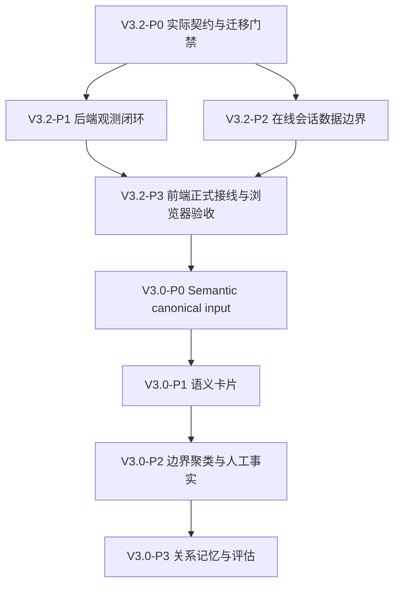

# 会话优化 v3 统一逻辑点与任务拆解

> 版本：V3.3
> 日期：2026-08-14
> 原则：每个逻辑点可独立验收，预计业务代码变更不超过 300 行；实现路径以 `12-20260814-当前实现基线与缺口.md` 为准。

## 1. 交付顺序

V3.2 可以先独立交付，但不能把 V3.2 交付称为完整 V3.0 语义能力。

`SEM-LP1` 至 `SEM-LP7` 是尚未接线的规划逻辑点，不得直接进入实现。每个 semantic 逻辑点开始前，必须先新增对应的 `00-code-context`，把真实 worker、migration、API、函数和测试文件落点补齐；在此之前，表中的 `semantic worker`、`event producer/consumer` 等仅表示待创建边界，不是当前代码路径。

## 2. 逻辑点清单

| ID | 逻辑点 | 类型 | 代码范围 | 预估业务行数 | 依赖 | AC |
| --- | --- | --- | --- | ---: | --- | ---: |
| V32-LP1 | 实际 API/SSE 契约冻结 | 文档/测试 | `admin/handler.go`、`admin/live_stream_sse.go` | 80 | - | 5 |
| V32-LP2 | 修正 510/511/513 migration 与 RLS/租户门禁 | 修改/测试 | `sql/migrations/startup/510*`、`511*`、`513*`、test | 280 | V32-LP1 | 8 |
| V32-LP3 | 队列快照统计口径与非阻塞采集 | 修改 | `domains/dispatch/`、`admin/live_stream_*` | 260 | V32-LP1 | 6 |
| V32-LP4 | 状态变更旁路、重试、清理与查询 | 修改 | `domains/dispatch/state_transition_*`、`admin/request_transitions.go` | 260 | V32-LP2 | 7 |
| V32-LP5 | provider test-now/enable 权限、限流、审计 | 修改 | `admin/node_operations.go` | 240 | V32-LP1 | 7 |
| V32-LP6 | 在线会话与热时间线 tenant/分页/freshness | 修改 | `admin/session_online.go` | 280 | V32-LP2 | 7 |
| V32-LP7 | SSE 前端消费和正式组件 | 修改/新增 | `web/src/composables/liveStreamStore.ts`、V3.2 components | 290 | V32-LP3/4/5/6 | 8 |
| V32-LP8 | V3.2 浏览器与运行时验收 | 测试/部署 | web、local gateway、test scripts | 120 | V32-LP7 | 8 |
| SEM-LP1 | canonical turn 输入、脱敏、hash | 新增 | semantic worker + input contract | 260 | V32-LP2/6 | 7 |
| SEM-LP2 | analysis event/outbox、幂等、retry/DLQ | 新增 | event producer/consumer + migrations | 280 | SEM-LP1 | 8 |
| SEM-LP3 | summary/title/intent/entity 候选结果 | 新增 | semantic adapters/results | 280 | SEM-LP2 | 8 |
| SEM-LP4 | boundary 与可解释 cluster run | 新增 | boundary/cluster worker | 280 | SEM-LP3 | 8 |
| SEM-LP5 | stable project 与 split/merge/undo | 新增 | override API/projection | 290 | SEM-LP4 | 9 |
| SEM-LP6 | relation/memory adapter 与 scope | 新增 | graph/vector/memory adapters | 280 | SEM-LP5 | 8 |
| SEM-LP7 | golden set、评估、漂移和 replay 门禁 | 新增 | eval/replay/report | 260 | SEM-LP3/4/5/6 | 8 |

## 3. V3.2 验收标准

### V32-LP1

- [ ] 所有文档引用实际路径和已注册端点；
- [ ] 旧消息类型保持兼容；
- [ ] 新字段 optional 且有版本号；
- [ ] provider enable 的 provider 级影响范围明确；
- [ ] tenant、权限和错误码冻结。

### V32-LP2

- [ ] 先解决 CRITICAL-MIG-513-001：DROP 目标必须与 schema 决策一致，不能 DROP `public.*` 后再 ALTER 已删除表；
- [ ] 513 down 必须能恢复同一 schema 语义，不能只重建空表或恢复错误函数引用；
- [ ] 511 状态表补 tenant_id/RLS，或提供已审计的 request_id → tenant 服务端关联；
- [ ] 510/511 up/down 可执行；
- [ ] migration test 覆盖唯一约束、索引和 rollback；
- [ ] 真实低权限 PG 角色验证 RLS；
- [ ] 跨 tenant 读取负向通过；
- [ ] 状态变更失败不影响请求；
- [ ] 回滚保留原始 facts。

### V32-LP3/L4

- [ ] queue snapshot 的 depth/wait/in-flight 口径真实可解释；
- [ ] 采集失败返回 degraded，不伪造零值；
- [ ] 统计写入非阻塞，队列满丢弃可观测；
- [ ] 状态事件至少一次、幂等、可重放；
- [ ] 清理任务有 retention、dry-run 和回滚边界；
- [ ] trace 与 transitions 的 request_id 关联一致。

### V32-LP5/L6

- [ ] test-now 有限流、超时、上游错误映射；
- [ ] enable 有权限、二次确认、operator/reason/correlation 审计；
- [ ] online/timeline 有 tenant 过滤、稳定分页和 freshness；
- [ ] 归档缺口明确标记，不宣称完整 V2 timeline；
- [ ] 正文按权限和 retention 控制；
- [ ] 跨租户不存在性不泄露。

### V32-LP7/L8

- [ ] 正式组件消费 `queue_snapshot/node_update/state_transition`；
- [ ] SSE 断线重连和旧 payload 兼容；
- [ ] 空、加载、错误、degraded 状态完整；
- [ ] 桌面/移动视口无重叠和横向溢出；
- [ ] 浏览器实测点击、筛选、抽屉、节点操作和 timeline；
- [ ] 控制台无 4xx/5xx/CORS 错误；
- [ ] 保留截图证据。

## 4. V3.0 验收标准

- [ ] canonical input 只引用正文，脱敏副本和 hash 可追溯；
- [ ] worker 重启、重试、DLQ 和 replay 幂等；
- [ ] LLM/embedding 不可用时规则/lexical fallback 可用；
- [ ] candidate 不自动升格 accepted；
- [ ] cluster 重跑不改变 stable project；
- [ ] split/merge/undo 为 append-only 且人工优先；
- [ ] graph/vector/memory 遵守 tenant scope、删除、撤回和 legal hold；
- [ ] golden set、指标阈值和灰度回滚证据齐全。

## 5. 并行边界

可并行：V32-LP3、V32-LP5；V32-LP4 依赖 LP2；V32-LP6 依赖 LP2。V32-LP7 必须等待 LP1/3/4/5/6 契约冻结。V3.0 所有实现必须等待 semantic P0 输入和事件契约，不得与 V32 前端并行修改同一 API 文件。

每个逻辑点完成后必须更新 `08-执行记录.md`、基线文档和测试证据，再进入下一个逻辑点；不允许以“代码已生成”替代 AC 通过。
