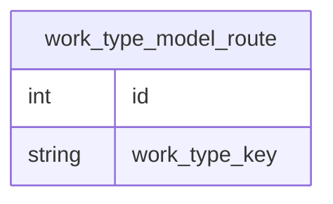
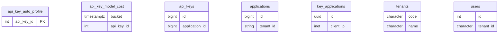
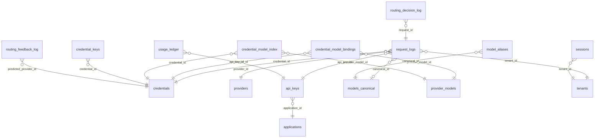

# 数据库结构图（llm-gateway-go · PostgreSQL）

> 生成物：`.db-audit/parse_schema.py` 解析权威 schema `sql/schema/01-schema.sql`
>（30,315 行）。覆盖 271 张表 / 4,697 列 / 621 个索引 / 34 条外键。
> 按月分区叶子表（`*_YYYY_MM`）在图中折叠进其家族根表；全列清单见
> [schema-inventory.md](schema-inventory.md)。生成日期：2026-09-17。


## 核心路由与凭证

共 81 个表家族（月分区叶子已折叠），拆为 5 张子图。


### 核心路由与凭证 · 子图 1/5

```mermaid
erDiagram
    auto_tune_audit {
    bigint id
    bigint credential_id
    }
    candidate_failure_logs {
    bigint id
    string request_id
    }
    credential_capabilities {
    bigint id
    bigint credential_id
    }
    credential_health_checks {
    bigint id
    bigint run_id
    }
    credential_model_bindings {
    bigint id
    bigint credential_id
    }
    credential_model_call_history {
    bigint credential_id
    string raw_model
    }
    credential_model_index {
    timestamptz bucket
    bigint credential_id
    }
    credential_model_index_archive {
    timestamptz bucket
    bigint credential_id
    }
    credential_model_index_hot {
    timestamptz bucket
    bigint credential_id
    }
    credential_model_peak_1m {
    timestamptz bucket
    bigint credential_id
    }
    credential_model_stats_1m {
    timestamptz bucket
    bigint credential_id
    }
    credential_model_weekly_peak {
    timestamptz week_start
    bigint credential_id
    }
    credential_probe_configs {
    bigint id
    bigint credential_id
    bigint credential_id
    }
    credential_probe_model_log {
    bigint id
    string tenant_id
    }
    credential_probes {
    bigint id
    bigint credential_id
    bigint credential_id
    }
    credential_quota_usage {
    bigint id
    bigint quota_id
    }
    credential_quotas {
    bigint id
    bigint credential_id
    }
    credential_state_log {
    int credential_id
    string raw_model_name
    }
    credentials {
    bigint id
    bigint provider_id
    }
    model_aliases {
    bigint id
    bigint canonical_id
    }
    credential_probe_configs references credentials : "credential_id"
    credential_probes references credentials : "credential_id"
```

### 核心路由与凭证 · 子图 2/5

```mermaid
erDiagram
    model_credit_rates {
    int canonical_id
    bigint credits_per_1m_in
    }
    model_discovery_runs {
    bigint id
    string tenant_id
    }
    model_families {
    string id
    string display_name
    }
    model_fingerprints {
    bigint id
    bigint credential_id
    }
    model_integrity_events {
    bigint id
    timestamptz ts
    }
    model_lifecycle_jobs {
    bigint id
    bigint runtime_id
    }
    model_name_mapping {
    bigint id
    string raw_model_name
    }
    model_offer_events {
    bigint id
    timestamptz ts
    }
    model_pricing {
    int id
    character model_canonical
    }
    model_pricing_history {
    int id
    character model_canonical
    }
    model_probe_runs {
    bigint id
    string tenant_id
    }
    model_probe_runs_hot {
    bigint id
    string tenant_id
    }
    model_probe_state {
    bigint credential_id
    string raw_model_name
    }
    model_reconcile_log {
    bigint id
    bigint provider_id
    }
    model_task_index {
    timestamptz bucket
    int canonical_id
    }
    models_canonical {
    bigint id
    string canonical_name
    }
    node_probe_runs {
    bigint id
    bigint credential_id
    }
    node_probe_state {
    bigint credential_id
    string raw_model_name
    }
    passive_probe_state {
    int credential_id
    string raw_model_name
    }
    provider_catalog {
    string code
    string tier
    }
```



### 核心路由与凭证 · 子图 3/5

```mermaid
erDiagram
    provider_cost_reconciliation {
    bigint id
    bigint provider_id
    }
    provider_credibility_tests {
    bigint id
    bigint credential_id
    }
    provider_error_details {
    bigint id
    bigint provider_id
    }
    provider_events {
    bigint id
    bigint credential_id
    }
    provider_header_profiles {
    bigint id
    string profile_code
    }
    provider_health_events {
    bigint id
    bigint provider_id
    }
    provider_metrics_hour {
    bigint id
    bigint provider_id
    }
    provider_metrics_minute {
    bigint id
    bigint provider_id
    }
    provider_models {
    bigint id
    bigint provider_id
    }
    provider_models_v1000_backup {
    bigint provider_model_id
    bigint canonical_id
    }
    provider_profile_alerts {
    bigint id
    bigint credential_id
    }
    provider_profile_daily {
    bigint id
    bigint credential_id
    }
    provider_profile_metrics {
    bigint id
    bigint credential_id
    }
    provider_profile_whitelist {
    bigint id
    bigint provider_id
    }
    provider_quality_configs {
    bigint id
    bigint provider_id
    bigint provider_id
    }
    provider_quality_profiles {
    bigint id
    bigint provider_id
    bigint provider_id
    }
    provider_quality_rollup {
    int provider_id
    timestamptz bucket_start
    }
    provider_scores {
    bigint id
    bigint credential_id
    }
    provider_settings {
    bigint id
    bigint provider_id
    }
    providers {
    bigint id
    string tenant_id
    }
    provider_quality_configs references providers : "provider_id"
    provider_quality_profiles references providers : "provider_id"
```

### 核心路由与凭证 · 子图 4/5

```mermaid
erDiagram
    route_decisions {
    bigint id
    string request_id
    }
    route_incident_events {
    bigint id
    uuid incident_id
    uuid incident_id
    }
    route_incidents {
    uuid id
    string tenant_id
    }
    routing_audit_log {
    bigint id
    timestamptz ts
    }
    routing_decision_log {
    timestamptz ts
    uuid request_id
    }
    routing_decision_log_archive {
    timestamptz ts
    uuid request_id
    }
    routing_decision_log_hot {
    timestamptz ts
    uuid request_id
    }
    routing_health_checks {
    bigint id
    string check_id
    }
    routing_overrides {
    bigint id
    string task_type
    }
    routing_overrides_audit {
    bigint id
    timestamptz ts
    }
    routing_policy {
    smallint id
    string tenant_id
    }
    sticky_sessions {
    string sticky_key
    bigint credential_id
    }
    system_probe_runs {
    bigint id
    bigint task_id
    }
    system_probe_runs_default {
    bigint id
    bigint task_id
    }
    task_default_routing {
    bigint id
    string task_type
    }
    task_default_routing_audit {
    bigint id
    timestamptz ts
    }
    tuning_params {
    string key
    jsonb value
    }
    tuning_proposals {
    bigint id
    timestamptz ts
    }
    tuning_signals {
    bigint id
    string request_id
    }
    work_type_config {
    string key
    string label
    }
    route_incident_events references route_incidents : "incident_id"
```

### 核心路由与凭证 · 子图 5/5



<details><summary>分区/热表家族</summary>

- `credential_model_index`：2 个分区/热叶子（credential_model_index_2026_07、credential_model_index_2026_08）
- `model_probe_runs`：1 个分区/热叶子（model_probe_runs_2026_07）
- `routing_decision_log`：2 个分区/热叶子（routing_decision_log_2026_07、routing_decision_log_2026_08）
- `routing_decision_log_archive`：1 个分区/热叶子（routing_decision_log_archive_2026_08）

</details>

## 请求日志与账本（分区族）

共 28 个表家族（月分区叶子已折叠），拆为 2 张子图。


### 请求日志与账本（分区族） · 子图 1/2

```mermaid
erDiagram
    billing_orders {
    bigint id
    character order_no
    }
    credit_ledger {
    bigint id
    character tenant_id
    }
    credit_ledger_hot {
    bigint id
    character tenant_id
    }
    credit_ledger_old {
    bigint id
    character tenant_id
    }
    maas_credit_consumption_buckets {
    string tenant_id
    timestamptz bucket_start
    }
    maas_settings {
    int id
    numeric(10,4) cents_per_credit
    }
    request_logs {
    bigint id
    string request_id
    }
    request_logs_archive {
    bigint id
    string request_id
    }
    request_logs_bodies {
    string request_id
    timestamptz ts
    }
    request_logs_bodies_hot {
    string request_id
    timestamptz ts
    }
    request_logs_hot {
    bigint id
    string request_id
    }
    request_stats_dim_minute {
    timestamptz bucket
    string tenant_id
    }
    request_stats_error_drill_minute {
    timestamptz bucket
    string tenant_id
    }
    request_stats_minute {
    timestamptz bucket
    string tenant_id
    }
    request_stats_rollup_cursor {
    smallint id
    timestamptz last_ts
    }
    request_wal {
    character request_id
    character tenant_id
    }
    request_wal_archive {
    character request_id
    character tenant_id
    }
    request_wal_bodies {
    character request_id
    string outbound_body
    }
    request_wal_hot {
    character request_id
    character tenant_id
    }
    subscription_plans {
    int id
    character code
    }
```

### 请求日志与账本（分区族） · 子图 2/2

```mermaid
erDiagram
    subscription_tiers {
    int id
    string code
    }
    tenant_credit_wallets {
    character tenant_id
    bigint balance_credits
    }
    tool_usage_stats {
    bigint id
    character tool_id
    }
    tool_usage_stats_hot {
    bigint id
    character tool_id
    }
    tool_usage_stats_old {
    bigint id
    character tool_id
    }
    usage_ledger {
    string request_id
    timestamptz ts
    }
    usage_ledger_hot {
    string request_id
    timestamptz ts
    }
    usage_ledger_old {
    string request_id
    timestamptz ts
    }
```



<details><summary>分区/热表家族</summary>

- `credit_ledger`：2 个分区/热叶子（credit_ledger_2026_07、credit_ledger_2026_08）
- `request_logs`：2 个分区/热叶子（request_logs_2026_07、request_logs_2026_08）
- `request_logs_bodies`：3 个分区/热叶子（request_logs_bodies_2026_07、request_logs_bodies_2026_08、request_logs_bodies_2026_09）
- `request_wal`：2 个分区/热叶子（request_wal_2026_07、request_wal_2026_08）
- `tool_usage_stats`：2 个分区/热叶子（tool_usage_stats_2026_07、tool_usage_stats_2026_08）
- `usage_ledger`：2 个分区/热叶子（usage_ledger_2026_07、usage_ledger_2026_08）

</details>

## 会话与分析

```mermaid
erDiagram
    analysis_events {
    bigint id
    string event_id
    }
    compression_bench_results {
    bigint id
    bigint row_id
    }
    intent_aggregates {
    string tenant_id
    string intent_kind
    }
    intent_analysis_adjustments {
    bigint id
    string tenant_id
    bigint superseded_by
    }
    intent_classification_feedback {
    bigint id
    string session_id
    }
    intent_classifier_config {
    int id
    string tenant_id
    }
    session_audit_records {
    bigint id
    string session_id
    }
    session_bodies {
    bigint id
    string session_id
    }
    session_intent_evolution {
    bigint id
    string session_id
    }
    session_last_requests {
    character session_id
    bigint last_request_id
    }
    session_memora_extraction_log {
    string task_id
    timestamptz extracted_at
    }
    session_module_executions {
    bigint execution_id
    character gw_session_id
    }
    session_module_executions_hot {
    bigint execution_id
    character gw_session_id
    }
    session_summaries {
    character session_key
    character tenant_id
    character tenant_id
    }
    session_titles {
    string task_id
    string scoped_session_id
    }
    session_turn_logs {
    bigint id
    string session_id
    }
    session_turn_snapshots {
    bigint id
    character tenant_id
    }
    session_turns {
    bigint id
    string session_id
    }
    sessions {
    bigint id
    string session_id
    }
    intent_analysis_adjustments references intent_analysis_adjustments : "superseded_by"
    session_summaries references tenants : "tenant_id"
```

<details><summary>分区/热表家族</summary>

- `session_bodies`：2 个分区/热叶子（session_bodies_2026_07、session_bodies_2026_08）
- `session_module_executions`：2 个分区/热叶子（session_module_executions_2026_07、session_module_executions_2026_08）
- `session_turns`：2 个分区/热叶子（session_turns_2026_07、session_turns_2026_08）
- `sessions`：2 个分区/热叶子（sessions_2026_07、sessions_2026_08）

</details>

## API 密钥与应用



## 审批与安全

```mermaid
erDiagram
    approval_approvers {
    int id
    character tenant_id
    }
    approval_configs {
    int id
    character tenant_id
    }
    approval_queue {
    uuid id
    string session_id
    }
    approval_requests {
    int id
    character request_id
    }
    approval_routing_rules {
    bigint id
    string tenant_id
    }
    approval_rules {
    int id
    character tenant_id
    }
    armor_judgments {
    bigint id
    string request_id
    }
    attachments {
    string id
    string tenant_id
    }
    canary_tokens {
    int id
    character tenant_id
    }
    ip_blocklist {
    bigint id
    string ip_or_cidr
    }
    output_compliance_audit {
    bigint id
    character tenant_id
    }
    output_compliance_custom_keywords {
    int id
    character tenant_id
    }
    output_compliance_feedback {
    bigint id
    character tenant_id
    }
    output_compliance_policies {
    int id
    character tenant_id
    character tenant_id
    }
    output_compliance_review_queue {
    int id
    character tenant_id
    }
    prompt_injection_detections {
    bigint id
    character tenant_id
    int rule_id
    }
    prompt_injection_llm_engines {
    int id
    character tenant_id
    }
    prompt_injection_policies {
    int id
    character tenant_id
    character tenant_id
    }
    prompt_injection_rules {
    int id
    character rule_name
    }
    output_compliance_policies references tenants : "tenant_id"
    prompt_injection_detections references prompt_injection_rules : "rule_id"
    prompt_injection_policies references tenants : "tenant_id"
```

## 许可与实例运维

```mermaid
erDiagram
    center_commands {
    bigint id
    string command_id
    }
    gateway_instances {
    string instance_id
    string hostname
    }
    gray_release_rules {
    bigint id
    bigint release_id
    bigint release_id
    }
    instance_heartbeats {
    string instance_id
    timestamptz timestamp
    }
    instance_release_status {
    bigint release_id
    string instance_id
    bigint release_id
    }
    instance_status_reports {
    string instance_id
    timestamptz timestamp
    }
    license_devices {
    bigint id
    bigint license_id
    bigint license_id
    }
    license_holders {
    bigint id
    string email
    }
    license_module_audit {
    bigint id
    string license_key
    }
    license_modules {
    bigint id
    bigint license_id
    bigint license_id
    string module_key
    }
    license_trial_consents {
    bigint id
    bigint license_id
    bigint license_id
    }
    licenses {
    bigint id
    string license_key
    bigint holder_id
    }
    ops_node_registrations {
    bigint id
    string instance_id
    bigint license_id
    }
    product_module_features {
    int id
    string module_key
    string module_key
    }
    product_modules {
    int id
    string key
    }
    releases {
    bigint id
    string version
    }
    runtime_telemetry_consent_events {
    bigint id
    string hardware_hash
    bigint license_id
    }
    runtime_telemetry_preferences {
    string hardware_hash
    bigint license_id
    bigint license_id
    }
    tier_module_map {
    string tier_code
    string module_key
    string tier_code
    string module_key
    }
    upgrade_logs {
    bigint id
    string instance_id
    }
    gray_release_rules references releases : "release_id"
    instance_release_status references releases : "release_id"
    license_devices references licenses : "license_id"
    license_modules references licenses : "license_id"
    license_modules references product_modules : "module_key"
    license_trial_consents references licenses : "license_id"
    licenses references license_holders : "holder_id"
    ops_node_registrations references licenses : "license_id"
    product_module_features references product_modules : "module_key"
    runtime_telemetry_consent_events references licenses : "license_id"
    runtime_telemetry_preferences references licenses : "license_id"
    tier_module_map references product_modules : "module_key"
    tier_module_map references subscription_tiers : "tier_code"
```

## 故障与诊断

```mermaid
erDiagram
    background_tasks {
    bigint id
    string tenant_id
    }
    background_tasks_duplicates {
    bigint id
    string tenant_id
    }
    diagnostic_runs {
    uuid id
    uuid incident_id
    }
    fault_action_logs {
    bigint id
    bigint event_id
    bigint event_id
    }
    fault_events {
    bigint id
    bigint rule_id
    }
    fault_rules {
    int id
    string name
    }
    integrity_fingerprint_baseline {
    string tenant_id
    int provider_id
    }
    self_check_round_results {
    bigint id
    bigint run_id
    bigint run_id
    }
    self_check_runs {
    bigint id
    string model_name
    }
    self_check_settings {
    int id
    boolean enabled
    }
    fault_action_logs references fault_events : "event_id"
    self_check_round_results references self_check_runs : "run_id"
```

## 代理与资产图谱

```mermaid
erDiagram
    agent_relationships {
    bigint src_agent_id
    bigint dst_agent_id
    bigint src_agent_id
    bigint dst_agent_id
    }
    agents {
    bigint id
    string tenant_id
    }
    asset_relationships {
    string src_kind
    bigint src_ref_id
    string src_kind
    bigint src_ref_id
    string dst_kind
    bigint dst_ref_id
    }
    assets {
    string kind
    bigint ref_id
    }
    dashboard_access_events {
    character event_id
    character event_type
    }
    dashboard_access_events_hot {
    character event_id
    character event_type
    }
    donations {
    bigint id
    string order_no
    bigint holder_id
    }
    download_events {
    bigint id
    string request_id
    bigint holder_id
    }
    download_publish_runs {
    bigint id
    string release_version
    }
    agent_relationships references agents : "dst_agent_id"
    agent_relationships references agents : "src_agent_id"
    asset_relationships references assets : "dst_kind,dst_ref_id"
    asset_relationships references assets : "src_kind,src_ref_id"
    donations references license_holders : "holder_id"
    download_events references license_holders : "holder_id"
```

<details><summary>分区/热表家族</summary>

- `dashboard_access_events`：2 个分区/热叶子（dashboard_access_events_2026_07、dashboard_access_events_2026_08）

</details>

## 其余

共 49 个表家族（月分区叶子已折叠），拆为 3 张子图。


### 其余 · 子图 1/3


### 其余 · 子图 2/3

```mermaid
erDiagram
    runtime_alert_events {
    bigint id
    string rule_key
    }
    runtime_metrics {
    bigint id
    string instance_id
    bigint license_id
    }
    schema_migration_audit {
    string migration_id
    timestamptz applied_at
    }
    schema_migrations {
    string version
    string description
    }
    schema_migrations_backup_20260722 {
    string version
    string description
    }
    security_audit_log {
    bigint id
    timestamptz ts
    }
    security_detector_config {
    int id
    string tenant_id
    }
    settings_audit {
    bigint id
    character setting_key
    }
    settings_kv {
    character key
    jsonb value
    }
    severity_action_matrix {
    int id
    character tenant_id
    }
    system_identity_pool {
    int id
    int max_identities
    }
    system_settings {
    int id
    character key
    }
    tenant_model_policies {
    bigint id
    character tenant_id
    }
    tenant_model_policies_audit {
    bigint id
    timestamptz ts
    }
    tenant_settings_kv {
    character tenant_id
    character key
    }
    tenant_subscriptions {
    int id
    character tenant_id
    }
    tenant_tool_policies {
    bigint id
    character tenant_id
    }
    test_columnar_new {
    int id
    string tenant_id
    }
    token_audit_events {
    bigint id
    string request_id
    }
    tool_call_events {
    bigint id
    character tool_id
    }
    runtime_metrics references licenses : "license_id"
```

### 其余 · 子图 3/3

```mermaid
erDiagram
    tool_categories {
    character id
    character name
    }
    tool_registry {
    int id
    character category
    }
    topup_packages {
    int id
    character code
    }
    toxic_keywords {
    int id
    character keyword
    }
    ursm_node_snapshot_min {
    timestamptz snapshot_ts
    bigint recovery_epoch
    }
    usage_minute {
    timestamptz bucket
    string tenant_id
    }
    vibe_code_reviews {
    bigint id
    bigint session_id
    bigint session_id
    }
    vibe_coding_projects {
    bigint id
    string tenant_id
    }
    vibe_coding_sessions {
    bigint id
    bigint project_id
    bigint project_id
    }
    vibe_code_reviews references vibe_coding_sessions : "session_id"
    vibe_coding_sessions references vibe_coding_projects : "project_id"
```

## 逻辑外键（无 DB 约束，应用层维护）

本库大量关系不建物理外键（写入吞吐优先），以下为代码路径核实的主要逻辑引用：


