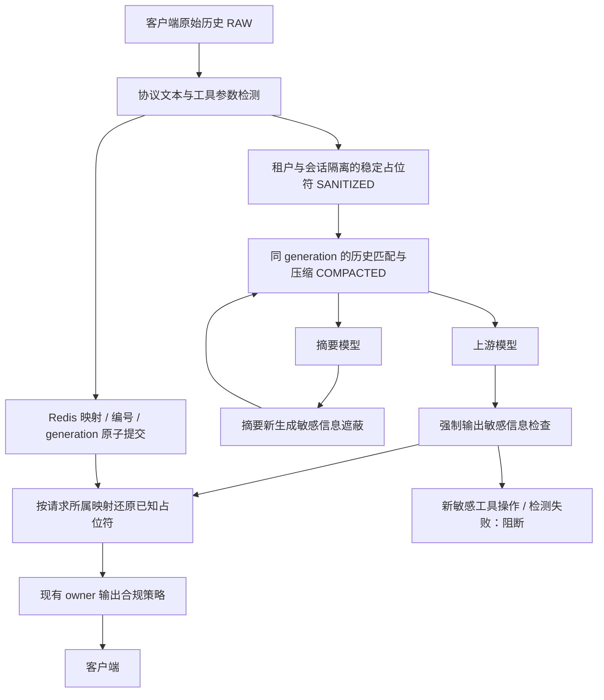

# 会话压缩、脱敏、缓存匹配与输出处理完善方案

初稿：2026-10-01；批判式复审修订：2026-10-02。范围：本地代码优化、协议模拟、回归与竞态验证。未部署服务、修改凭据或数据库结构。

## 1. 业务流程与数据边界

实际顺序是 **原始请求 → 可逆脱敏 → 增量匹配/压缩 → 模型 → 新生成敏感信息检查 → 占位符还原 → 调用者/数据所有者输出策略 → 客户端**。不能把“原始、压缩、脱敏”理解成先压缩原文再脱敏：原始密码不应进入摘要模型。

两种“三级”必须区分：

| 维度 | 层级 | 用途与边界 |
|---|---|---|
| 语义阶段 | RAW | 客户端脱敏前快照，记录指纹、消息数和估算 token；新增来源元数据不保存正文 |
| 语义阶段 | SANITIZED | 模型可见的稳定占位符文本；消息级前后指纹和替换次数建立对应关系 |
| 语义阶段 | COMPACTED | 对脱敏历史增量重建、滑窗、摘要或机械裁剪后的实际上游正文 |
| 存储层级 | L1 | 进程内状态和正文，跨进程不可共享 |
| 存储层级 | L2 | Redis 会话状态、正文/结果 memo，以及独立的脱敏映射与编号 |
| 存储层级 | L3 | DB 会话恢复/审计；V2 元数据镜像严格筛选字段；原始正文存储是独立权限边界 |

RAW 与 SANITIZED 可一对一比较消息位置；压缩摘要、历史增量重建会改变数量与坐标。token 为字符估算，并非供应商 tokenizer 实测值。占位符可能比原文更长，压缩预算应针对 SANITIZED 计算，不应强制 COMPACTED ≤ RAW。

主要入口：`security/sanitize/smart_sani_guard.go`、`input_protocols.go`；匹配与压缩：`domains/hooks/compression/session_compressor.go`、`diff.go`、`recovery_coordinator.go`；输出：`domains/hooks/outputcompliance/*`、`domains/hooks/response/chain.go`；启动接线：`cmd/gateway/goal_control.go`、`main.go`。

## 2. 已发现并实施修复的遗漏

| 遗漏 | 原有后果 | 实施方案 |
|---|---|---|
| 相同敏感值每次回放分配新编号 | 脱敏历史指纹漂移，增量匹配和 memo 失效 | 同租户、会话、类型、值复用最早有效编号；新值才递增 |
| 映射过期后编号可重新从 1 开始 | 相同占位符可能表示另一密码/手机号，旧摘要被错用 | 128 位随机 generation；会话历史、memo、V1/V2 恢复均要求 generation 相同 |
| 上游生成期间映射过期/重建 | 响应可能用后续请求的字典还原成错误敏感值 | 读取映射后核验 generation；不一致或映射丢失时使用本轮 Context 字典 |
| assistant/tool/function 历史被跳过 | 回放中密码、IP、工具结果重新明文发送上游 | 扫描历史所有标准文本角色、推理文本及工具参数 |
| 密码规则大小写/长度限制、公网 IP 缺失 | 短口令、中文帐号、公网/IPv6、整段私钥漏检 | 补充标签值捕获、Bearer/JWT/AWS、URI 凭据、完整私钥块和有效 IPv4/IPv6 |
| 工具 JSON 中带空格、引号、数组的凭据 | 正则截断值、只检查简单标量 | 按 JSON 字符串叶节点检查，凭据键传播至数组；保留数值精度与工具 ID/name |
| 字面占位符与新分配值碰撞 | 用户提供的内部标记被还原成新密码 | 处理任何字段前预留全请求所有字面标记编号，包含 JSON unicode 转义 |
| 模型新生成的敏感信息没有输入映射 | 仅做占位符还原无法阻止新密码泄漏 | 独立、强制的前置输出 gate：默认遮蔽，支持 block，不创建可逆输入映射 |
| 敏感工具输出简单改为遮蔽字符串 | 客户端可能执行语义改变的敏感操作 | 工具参数发现新凭据/IP 时阻断整条操作；不返回可执行的改写凭据 |
| 摘要模型输出检查缺失 | 新生成密码进入后续上游、缓存或 memo | 在各摘要入口、候选客户端及恢复拼接前检查；失败使用后续候选/机械回退 |
| SSE holder 释放批次绕过后续拦截器 | 流已被前置检查，但未还原/未执行后置策略 | terminal 与 EOF 释放逐事件通过剩余拦截链，支持多个 holder 顺序处理 |
| 旧式 choices.text / 流式 reasoning_content | 补全文本漏检或内部标记无法还原 | 补齐非流式检测、分片检测与还原；补入标准 error.message/detail |
| 未知 JSON 信封直接替换序列化字符串 | 还原引号、反斜线、换行可能破坏 JSON | 解码字符串叶节点还原后再编码；残留标记时阻断 |
| Redis/DB 缺省启动没有挂防护 | lite/无 Redis 情况脱敏失效 | 请求级脱敏、还原、强制输出检查仍接线；缺少跨轮持久化时保守失效缓存 |
| RAW 快照实际来自已脱敏正文 | 阶段指纹与压缩统计混淆 | 输入端生成真实 RAW 与 SANITIZED 快照，贯穿压缩与 V2 镜像 |
| 重复值统计按 map 大小差分 | 同值在另一条消息出现时替换数被记为 0 | 按本轮替换事件计数，独立于映射去重 |

## 3. 识别、替换与还原契约

### 输入识别

- 现有手机号、身份证、邮件、卡号规则继续使用。
- 帐号字段支持 account、username、user_name、login、帐号、账号、账户、用户名；密码字段支持 password/passwd/pwd、secret/token/api_key/apikey/access_key/authorization、密码/口令。
- 文本标签只替换值，保留标签与 JSON 引号；带引号的空格和转义值整段处理。
- 有效 IPv4 和 IPv6 均可检测，包括尾部 `::` 和带 zone 的 IPv6；用 `netip.ParseAddr` 排除无效地址。私有地址分类为 internal_ip，其他为 server_ip。
- 私钥覆盖完整块及未闭合至文本末尾的块。多检测器结果按配置顺序稳定合并；重叠范围取并集，避免只替换长敏感值的一部分。
- 工具 arguments/input 按 JSON 处理，不改工具名称、ID、调用关联、schema；递归深度上限 256。

### 稳定替换与持久化

占位符仍为 `{SENSITIVE:type:index}`，新增 `account`、`server_ip` 类型。反向查找表只在请求内用于复用，不引入新的明文索引存储。

Redis 的读、分配、保存由 `(tenant, session)` 租约保护。本轮 map、offset high-water 与 generation 用 Lua 原子提交：同占位符同值可幂等保存，同编号不同值拒绝提交；租约丢失、Redis 类型错误等停止输入请求，不发送原文。默认映射 TTL 30 分钟，输出使用映射时刷新相关 TTL。已有 `_unknown`/历史 key 兼容逻辑保留。

### 输出的两类来源

| 来源 | 处理 |
|---|---|
| 模型返回已知占位符 | gate 保留，按所属会话字典还原，然后现有 owner policy 决定最终是否继续遮蔽 |
| 模型直接生成密码/帐号/IP 等 | 默认 `[REDACTED]`；严格模式阻断；不加入可逆映射 |
| 新敏感内容进入工具参数 | 即使处于 mask 模式也阻断，避免执行被改写的敏感操作 |
| 未知或残缺占位符 | 采用现有协议的遮蔽/阻断规则；任何未处理内部标记不能到客户端 |
| signed thinking 中敏感文本 | 不改写签名内容；输入拒绝或输出阻断 |
| 原本不敏感的摘要生成新秘密 | 遮蔽后再拼入上游请求；检测失败回退，不缓存未检查摘要 |

强制 gate 不继承 `output_compliance.enabled` 关闭开关或 owner 豁免。默认 `mask`；进程启动环境变量 `LLM_GATEWAY_SANITIZE_OUTPUT_ACTION=block` 可选严格阻断。现有后置 output compliance 继续负责所有者授权、其它内容合规和最终可见数据策略。

## 4. 缓存与匹配契约

1. 指纹比较以完整 canonical 消息为单位；正文不只比较 content。工具、角色、关联 ID 的语义继续参与历史匹配。
2. 新请求中相同敏感值保持相同占位符，才能稳定命中同会话历史。
3. 匹配成立还必须同 generation。映射重建、老版本未保存 generation、Redis-free 请求的新私有字典，都不得沿用另一字典对应的摘要。
4. memo 原有租户、会话、协议、模式、context window 维度不变；有 generation 时加入正文 hash 计算；v2 namespace 停止复用旧 memo，空 generation 也不例外。缓存命中前使用当前 guard 复验，generation 相同不能证明旧摘要已经检查。
5. V1 L1/L2 状态保存 generation、请求 RAW/SANITIZED 快照和合并历史后的 CompressionSourceSnapshot；V2 的 typed metadata 解析、导出和严格镜像同时接通这些字段。镜像仅允许固定长度 hex 指纹与有界计数，丢弃嵌套 plaintext/body。
6. 未扩展 V1 DB 表结构；旧 V1 L3 恢复没有新 generation 时保守视为不匹配，重新根据客户端历史构建。V2 的 JSON 元数据无需数据库迁移。
7. 会话失效时同时删除 map/offset/generation；旧 memo 按 TTL 自然淘汰，不跨 generation 命中。
8. 请求阶段快照只描述对应请求体。阶段一致性使用合并后的压缩源快照；实际 handler 的 NeverWorse 使用同范围的已脱敏 SourceBody，真实压缩增大时回退到这个完整源，不能回退到截断的客户端 delta 丢失摘要。SourceBody 只在本轮内存使用，不持久化。
9. clean/marker-only 轮次保留活跃 generation 与完整还原字典，Stats 只统计本轮映射。Redis HSET 显式写入零统计、空引用/代际/阶段字段，防止 L2 冷读复活上一轮数据。

## 5. 回退与错误矩阵

| 条件 | 行为 | 是否可继续 |
|---|---|---|
| 输入 JSON 非法、敏感 signed thinking | 400；通用错误响应 | 不调用模型 |
| 输入体超过 128 MiB | 413 | 不调用模型 |
| Redis 配置存在但租约/映射提交失败 | 503，不降级为明文 | 不调用模型 |
| Redis 没有配置 | Context 私有字典；缺少跨请求复用能力 | 可调用，缓存保守失效 |
| 缓存/memo 不可用或 generation 不同 | 重新处理本轮已脱敏正文 | 可继续 |
| 摘要候选失败/生成文本检测失败 | 后续候选或机械滑窗/裁剪 | 能构成有效重试体才继续 |
| 输出检测失败、JSON 不可检查、敏感签名或工具操作 | fail closed | 不释放不安全正文 |
| 上游生成期间映射消失/重建 | 使用本轮 Context 已知映射；其余标记遮蔽/阻断 | 按协议安全决定 |
| SSE terminal 未到而连接 EOF | Flush 后继续经过后续链检查 | 检查通过才释放 |
| SSE 待检查数据超过 1 MiB | 阻断 | 不释放累积正文 |

SSE 文本保留到 terminal/EOF 再按逻辑 lane 检测，这是为跨分片任意长度正则提供可靠边界。会影响首个可见文本延迟，且两个检查层会各自缓冲；不是低延迟逐 token 输出方案。控制事件及指定心跳可提前通过。恢复可能只裁掉部分历史；小 context window 被保留消息/摘要预留预算占满时无法保证自动重试成功，保持现有“不进行无效重试”的边界。

## 6. 模拟操作与验收

复审新增边界：占位符仅豁免自身字节，混入凭据或私钥不能豁免整个匹配；嵌套工具 JSON 的 Unicode 标记也预留编号。Responses custom tool 和 reasoning_text 纳入检查/还原。工具单帧、多片段均在 terminal/EOF 做完整 JSON 检查，片段不单独解析 JSON。不透明字段豁免仅限指定字段的字符串，data 对象/数组仍递归检查；结构检查通过后不重复扫描序列化二进制。已知凭据进入 JSON 字符串前先转义，用 UseNumber 保留大整数；非法可执行参数阻断。

详见配套验证报告。重点流程：

- 两轮相同手机号历史回放 → token 相同 → 增量匹配 unchanged。
- 修改手机号 → 分配新编号 → 修改的 canonical 消息不能误判为 unchanged。
- 删除映射后重建 → generation 不同 → 旧 summary/memo/cut marker 不可复用。
- 长耗时响应期间重建映射 → 返回旧请求值，不返回新字典值。
- assistant/function/tool 历史携带 JSON 密码、转义值、数组与大整数 → 凭据消失，结构/大整数保留，已知值可还原。
- SSE 将密码与占位符分在两个 delta，terminal/EOF 释放 → 新密码遮蔽，已知手机号还原，后置策略仍执行。
- 新敏感工具操作、检测故障、未知 native 标记、signed thinking → 阻断，不返回可执行变形操作。

## 7. 剩余边界与后续方案

这些边界没有被本次文本方案覆盖，也不应宣称“所有敏感数据均已识别”：

- 无标签的任意帐号/口令、人名地址、业务机密、医疗/法律语义，需要租户词典或语义检测器。识别不到的内容不会因为缓存 generation 自动变安全。
- 工具凭据支持字符串和字符串数组；数字、布尔、对象及混入这些类型的凭据数组拒绝输入（400）、阻断输出，null 不改型。completion 的 token-ID prompt 尚无文本解码，属于未覆盖边界。
- 图片、音视频、文档二进制、media URL、工具 schema 与部分未知扩展字段继续视为 opaque；需要 OCR/ASR/附件解析与协议注册后才能保证跨媒体保护。
- 配置加载器主要消费 pii/secret/financial 的 enabled、patterns.regex、group。YAML 中 keywords、confidence、redaction_rules、medical 和部分全局/白名单选项不等于已启用行为；本次移除了误导性的 IP 白名单排除说明，未实现全配置引擎。
- Redis 可逆字典仍保存明文原值；DB session_censors 的加密 sink 为 best-effort。应在专门上线方案中评估 Redis ACL/传输与静态加密、保留期、审计权限、密钥轮换与彻底删除。不能把新增 hash 元数据当作所有日志都已脱敏。
- 原始请求/响应日志、错误日志、供应商 HTTP 错误信息有各自存储路径；本次 gate 保护经过输出拦截链的标准错误信封，不覆盖所有模型调用失败的网关自建响应或所有原始日志。
- 多租户认证必须在中间件之前注入可信 tenant；没有认证时 `_unknown` 是兼容路径，不等于认证隔离证明。
- 未运行真实供应商/生产 Redis/Postgres 集群和横向实例压测；miniredis、pgxmock、httptest 和 race 验证不能代替生产验收。

后续落地顺序：先以合成数据灰度验证协议与 SSE 延迟/1 MiB 限额，再补齐媒体与租户业务词典；最后独立推进日志/Redis 静态加密和保留期治理。上线前监控仅使用类型、计数、状态和 generation 摘要，避免添加明文指标。发生兼容性问题优先回退协议改写或调整严格动作，不采用“失败透传原文”。代码回退会失去本次防护，应作为有明确风险记录的整版本回退。

## 8. 批判式复审

初轮模块测试没有覆盖上述混合标记、单帧工具 JSON、结构化 data、clean-turn、冷 Redis 清零及真实 handler 回退。复审先复现失败再修复，测试通过只证明已列举场景。依赖审计发现 grpc v1.81.1 与 x/text v0.38.0 三项可达漏洞；更新 grpc v1.83.1、x/text v0.39.0、必要的传递依赖并同步 vendor。扫描仍报告非可达依赖项，不能声称供应链没有漏洞。
