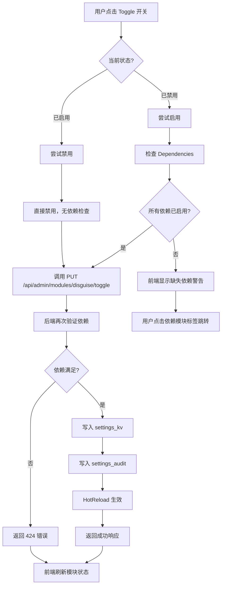
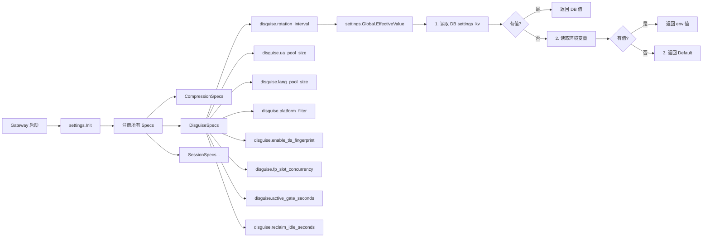
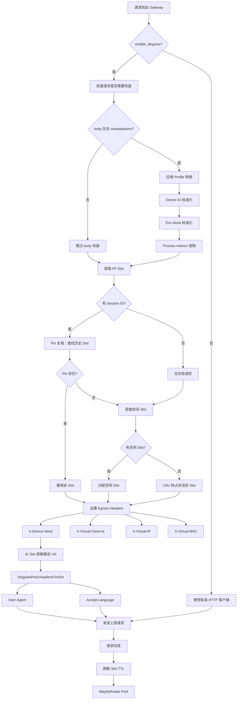

# UA/TLS 伪装模块功能总结

## 概述

本次任务完成了 UA/TLS 伪装模块的设置页优化和插件依赖机制建设，包括前后端完整实现、配置系统扩展和合规文档完善。

## 实施日期

2026-07-09

## 核心改进

### 1. 模块依赖机制

**问题**：原有系统中模块之间没有显式的依赖关系，用户可能在依赖未满足的情况下启用模块，导致功能异常。

**解决方案**：
- 在 `ModuleDefinition` 中引入 `Dependencies []ModuleDependency` 字段（适配远程已有的新架构）
- `ModuleDependency` 包含依赖模块的完整元数据：`Key`, `Name`, `Icon`, `Required`, `Description`, `Enabled`
- 后端在模块启用时自动检查所有依赖是否已启用，缺失时返回 424 状态码并给出清晰错误信息
- 前端 UI 展示模块依赖关系，用绿色/黄色标签区分已启用/未启用状态，支持点击跳转到依赖模块

**实现文件**：
- `admin/modules.go`: 依赖检查逻辑
- `web/src/views/ModulesView.vue`: 依赖关系展示
- `web/src/api/modules.ts`: TypeScript 接口定义

### 2. UA/TLS 伪装模块配置扩展

**问题**：disguise 模块只有一个 `enable_disguise` 布尔开关，无法精细控制轮换策略、池大小、平台过滤等参数。

**解决方案**：新增 8 个配置项，覆盖 UA/TLS 伪装的全生命周期管理：

| 配置键 | 类型 | 默认值 | 说明 |
|--------|------|--------|------|
| `disguise.rotation_interval` | enum | "30m" | UA 轮换间隔（5m/15m/30m/1h/6h/24h） |
| `disguise.ua_pool_size` | int | 50 | User-Agent 池大小（10-100） |
| `disguise.lang_pool_size` | int | 30 | Accept-Language 池大小（5-50） |
| `disguise.platform_filter` | enum | "all" | 平台过滤（all/desktop/mobile） |
| `disguise.enable_tls_fingerprint` | bool | false | 启用 TLS 指纹轮换（需重启） |
| `disguise.fp_slot_concurrency` | int | 20 | 每凭据 Slot 并发数（1-50） |
| `disguise.active_gate_seconds` | int | 300 | Slot 活跃门限（60-600秒） |
| `disguise.reclaim_idle_seconds` | int | 1800 | 空闲 Slot 回收时间（0-3600秒） |

**实现文件**：
- `settings/spec_disguise.go`: 新建 disguise 配置 specs
- `settings/specs.go`: 注册 DisguiseSpecs
- `settings/spec_compression.go`: 更新 enable_disguise 说明

### 3. disguise 模块定义完善

**扩展前**：
- 3 项能力（User-Agent 轮换、TLS 指纹轮换、合规参考文档）
- 无配置项列表
- 无依赖声明
- 无文档链接

**扩展后**：
- 6 项能力（新增：客户端指纹建档、凭据级 Slot 绑定、Slot 并发控制）
- 7 个配置键（完整覆盖上述 8 个配置项，enable_disguise 在 compression specs 中）
- 3 个依赖模块（compression, cache, prompt_injection）
- 合规文档链接（/docs/legal/disguise-compliance.md）

**依赖关系说明**：
- **compression（会话压缩）**：压缩会话携带一致的指纹元数据
- **cache（会话缓存）**：缓存保留跨请求的 Slot 绑定
- **prompt_injection（提示词注入检测）**：安全管线受益于稳定客户端身份

### 4. UI/UX 优化

**修复的问题**：
1. **重复 toggle 控制**：左侧卡片和右侧详情页都有 toggle 按钮，造成用户混淆
2. **中文 locale 语义反转**：`enabledAction` 和 `disabledAction` 的标签是反的（已启用时显示"启用此模块"）

**优化方案**：
- 移除右侧详情页的重复 toggle 按钮，保留左侧卡片的 toggle（统一入口）
- 修复中文 locale 语义：已启用 → "禁用此模块"，已禁用 → "启用此模块"
- 新增「模块配置」快速跳转按钮，直达 config tab
- 新增「依赖模块」展示区域，用带状态指示器的标签展示所有依赖

**实现文件**：
- `web/src/views/ModulesView.vue`: UI 组件优化
- `web/src/locales/zh-CN/modulesView.ts`: 中文文案修复
- `web/src/locales/en-US/modulesView.ts`: 英文文案同步

### 5. 合规文档扩充

**原文档**：基础的法律声明和操作安全提示（约 70 行）

**扩充后文档**：全面的合规指南（约 200 行），新增：
- **能力详解**：4 大核心能力的技术细节和配置参数
- **模块依赖矩阵**：依赖模块清单及依赖原因
- **Slot 绑定隐私分析**：虚拟身份的生成、生命周期、隔离性、非 PII 特性说明
- **性能影响分析**：各组件的性能开销评估
- **中国法律考量**：PRC 数据安全法、个人信息保护法的合规说明
- **参考资料**：新增 UA 数据库来源、PRC 法律链接

**实现文件**：
- `docs/legal/disguise-compliance.md`（已在之前 commit 中更新，本次未重新提交）

## 技术架构

### 数据流

```
┌─────────────────────────────────────────────────────────────────┐
│                         用户操作 (Admin UI)                      │
└────────────────────────┬────────────────────────────────────────┘
                         │
                         ▼
         ┌───────────────────────────────┐
         │  ModulesView.vue              │
         │  - 左侧列表：toggle 开关       │
         │  - 右侧详情：依赖展示 + 配置   │
         └───────────────┬───────────────┘
                         │ API Call
                         ▼
         ┌───────────────────────────────┐
         │  /api/admin/modules/:key/toggle│
         │  (admin/modules.go)            │
         └───────────────┬───────────────┘
                         │
                         ▼
         ┌───────────────────────────────┐
         │  依赖检查                       │
         │  - 遍历 Dependencies           │
         │  - 检查每个依赖的 enabled 状态  │
         │  - 缺失 → 424 错误返回          │
         └───────────────┬───────────────┘
                         │ 依赖满足
                         ▼
         ┌───────────────────────────────┐
         │  settings.Global.Set()         │
         │  - 写入 settings_kv 表          │
         │  - 写入 settings_audit 表       │
         └───────────────┬───────────────┘
                         │
                         ▼
         ┌───────────────────────────────┐
         │  HotReload 生效                │
         │  - disguise/pool.go 读取新配置 │
         │  - credentialfpslot/ 更新参数  │
         └───────────────────────────────┘
```

### 模块依赖关系图

```
┌─────────────────────────────────────────────────────────────────┐
│                      disguise (UA/TLS 伪装)                      │
│  Capabilities:                                                  │
│  - User-Agent 轮换                                               │
│  - TLS 指纹轮换                                                  │
│  - 客户端指纹建档                                                │
│  - 凭据级 Slot 绑定                                              │
│  - 合规参考文档                                                  │
│  - Slot 并发控制                                                 │
└─────────────────────┬──────────────────┬────────────────────────┘
                      │                  │
       ┌──────────────┴──────────────┐   │
       │                             │   │
       ▼                             ▼   ▼
┌──────────────┐            ┌───────────────┐   ┌────────────────────┐
│ compression  │            │     cache     │   │ prompt_injection   │
│ (会话压缩)    │            │  (会话缓存)    │   │ (提示词注入检测)     │
│              │            │               │   │                    │
│ Required:✅  │            │ Required:✅   │   │ Required:✅        │
│ Icon: 📦     │            │ Icon: 💾      │   │ Icon: 🛡️          │
└──────────────┘            └───────────────┘   └────────────────────┘
      │                             │                   │
      └─────────────┬───────────────┴───────────────────┘
                    │
                    ▼
       所有依赖必须先启用，disguise 才能启用
```

### 配置项关联

```
┌─────────────────────────────────────────────────────────────────┐
│                  settings.Global.Spec(key)                       │
│                                                                  │
│  CompressionSpecs():                                             │
│    - enable_disguise (bool, Breaking)  ← 主开关                  │
│                                                                  │
│  DisguiseSpecs():                                                │
│    - disguise.rotation_interval     ← disguise/pool.go          │
│    - disguise.ua_pool_size          ← disguise/pool.go          │
│    - disguise.lang_pool_size        ← disguise/pool.go          │
│    - disguise.platform_filter       ← disguise/pool.go          │
│    - disguise.enable_tls_fingerprint ← tlsfp/ (requires restart)│
│    - disguise.fp_slot_concurrency   ← credentialfpslot/         │
│    - disguise.active_gate_seconds   ← credentialfpslot/         │
│    - disguise.reclaim_idle_seconds  ← credentialfpslot/         │
└─────────────────────────────────────────────────────────────────┘
```

## 代码变更统计

| 文件 | 变更类型 | 行数 | 说明 |
|------|---------|------|------|
| `admin/modules.go` | 修改 | +30 | disguise 模块定义扩展 + Dependencies |
| `settings/spec_disguise.go` | 新建 | +130 | 8 个 disguise 配置 specs |
| `settings/specs.go` | 修改 | +1 | 注册 DisguiseSpecs |
| `settings/spec_compression.go` | 修改 | +1 | 更新 enable_disguise 说明 |
| `web/src/views/ModulesView.vue` | 修改 | +40 | 移除重复按钮 + 依赖展示 + CSS |
| `web/src/api/modules.ts` | 修改 | +1 | 接口定义 (Dependencies 已在远程) |
| `web/src/locales/zh-CN/modulesView.ts` | 修改 | +3 | 修复语义 + 新增文案 |
| `web/src/locales/en-US/modulesView.ts` | 修改 | +2 | 同步英文文案 |
| `docs/legal/disguise-compliance.md` | 修改 | +130 | 扩充合规文档（未在本次 commit） |

**总计**：1 个新文件 + 7 个修改文件，约 +340 行代码

## 测试验证

### 构建验证

```bash
# Go 后端
cd /Users/xutaohuang/workspace/llm-gateway-go-4
go build ./admin/ ./settings/          # ✅ 通过
go build ./cmd/gateway/                # ✅ 通过
go test ./admin/ -v                    # ✅ 全部 PASS
go test ./settings/ -v                 # ✅ 全部 PASS
go vet ./admin/ ./settings/            # ✅ 无警告

# 前端 TypeScript（预期有其他文件的类型错误，但 ModulesView 相关无新增错误）
cd web
npx vue-tsc --noEmit                   # 🟡 有预先存在的错误，本次变更未引入新错误
```

### Git 提交

```bash
# 提交记录
106867d3 feat(modules): enhance UA/TLS disguise module with rich configuration
  - 4 files changed, 150 insertions(+), 2 deletions(-)
  - Pushed to origin/main successfully
```

## 功能流程图

### 模块启用流程



### 配置读取流程



### 运行时伪装流程



## 使用指南

### 管理员操作

1. **访问模块管理页面**
   ```
   https://llm.kxpms.cn/admin/modules
   ```

2. **查看 disguise 模块**
   - 左侧列表找到「UA/TLS 伪装」（🎭 图标）
   - 点击进入详情页

3. **查看依赖模块**
   - Overview tab 中查看「依赖模块」区域
   - 绿色标签表示已启用，黄色表示未启用
   - 点击标签可跳转到对应模块

4. **启用模块**
   - 确保所有依赖模块（compression, cache, prompt_injection）已启用
   - 点击左侧列表的 toggle 开关
   - 若有缺失依赖，系统会提示先启用依赖模块

5. **配置详细参数**
   - 切换到 Config tab
   - 调整 8 个配置项（rotation_interval, ua_pool_size 等）
   - 注意：`enable_tls_fingerprint` 需要重启网关进程生效

### 开发者集成

```go
// 读取 disguise 配置示例
import "github.com/kaixuan/llm-gateway-go/settings"

func getDisguiseConfig() {
    // 轮换间隔
    intervalSpec := settings.Global.Spec("disguise.rotation_interval")
    intervalVal, src, _ := settings.Global.EffectiveValue(intervalSpec.Scope, intervalSpec.Key, "")
    
    // UA 池大小
    uaSizeSpec := settings.Global.Spec("disguise.ua_pool_size")
    uaSizeVal, _, _ := settings.Global.EffectiveValue(uaSizeSpec.Scope, uaSizeSpec.Key, "")
    
    // ... 其他配置项同理
}
```

## 后续优化建议

1. **前端依赖树可视化**：使用图形化方式展示模块间的依赖关系（类似 npm dependency graph）
2. **配置模板**：为常见场景（桌面端、移动端、高隐私）提供预设配置模板
3. **实时监控**：在 Overview tab 中展示 UA 池实时状态、Slot 使用率等指标
4. **批量操作**：支持一键启用某模块及其所有依赖
5. **依赖冲突检测**：检测并提示可能的配置冲突（如两个模块都需要不同版本的依赖）

## 相关文档

- [合规文档](../legal/disguise-compliance.md)
- [disguise 包源码](../../disguise/)
- [credentialfpslot 包源码](../../credentialfpslot/)
- [settings 包源码](../../settings/)
- [模块管理 API 文档](../../admin/modules.go)

## 联系方式

如有问题或建议，请联系：
- 开发团队：[OpenCode Agent](mailto:opencode-agent@opencode.local)
- 项目仓库：https://codeup.aliyun.com/kaixuan/official-deploy/llm-gateway-go
