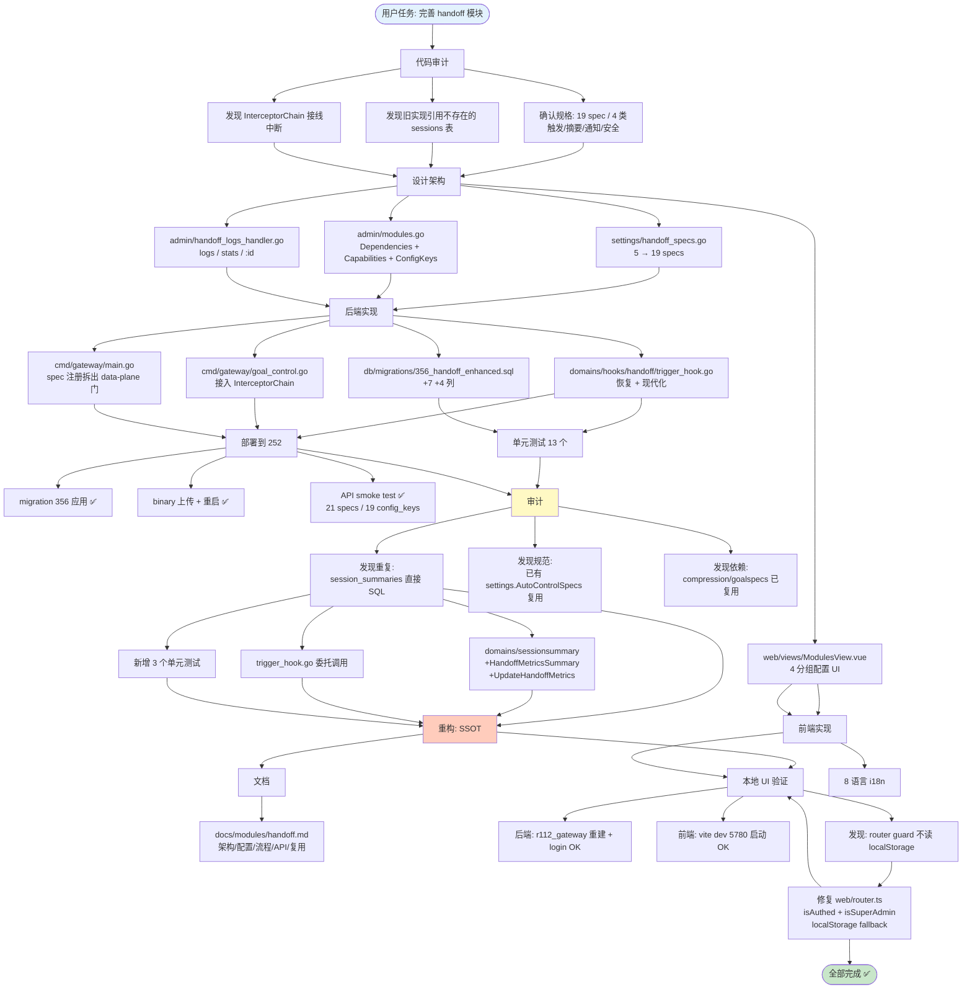
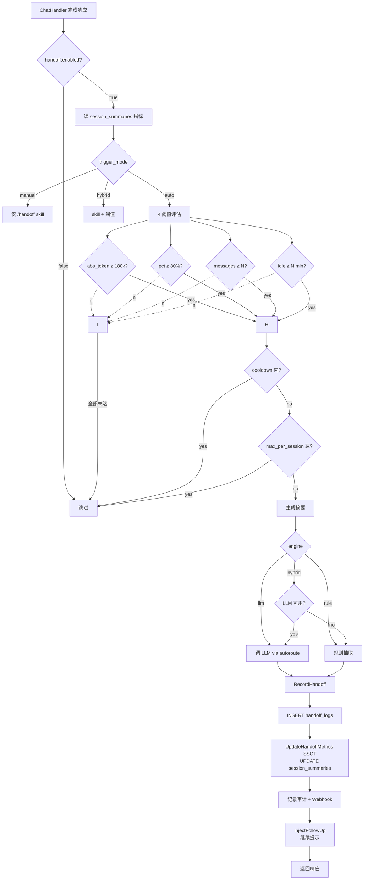
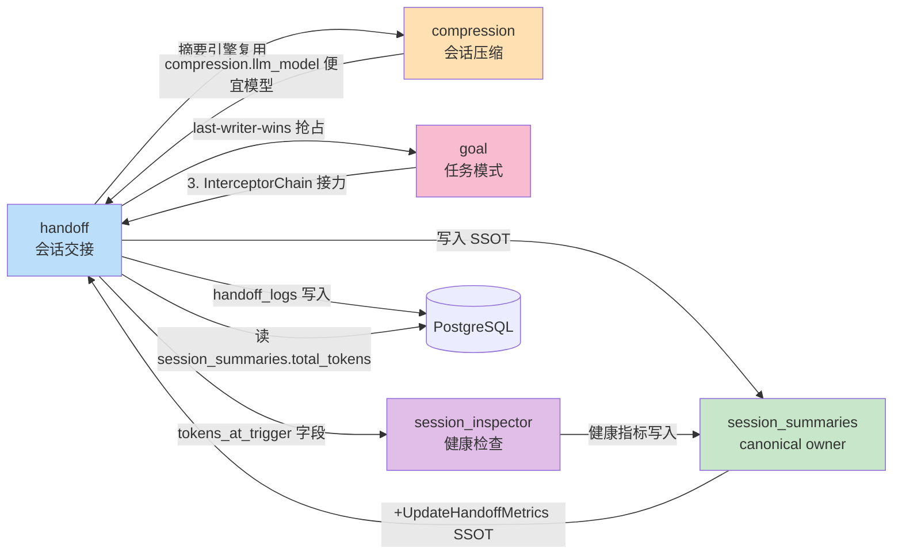

# Handoff 模块任务 — 完成总结

> 任务范围: 把会话交接（handoff）模块从「占位」升级为「企业级可上线」能力
> 周期: 2026-07-09
> 关联提交: `f2d9c150` (feat) · `727c7483` (refactor) · `e7ab5222` (docs) · `7b7e5478` (fix)

---

## 1. 最终成果

| 维度 | 数字 |
|---|---|
| 提交数 | 4 (feat + refactor + docs + fix) |
| 代码增量 | +2,830 行 / 19 个新文件 / 12 个修改 |
| 新增 settings specs | 14 (5 旧 + 14 新 = 19 总) |
| 新增 admin API 端点 | 3 (logs / logs/:id / stats) |
| 新增 DB 列 | 11 (handoff_logs +7, session_summaries +4) |
| 单元测试 | 13 + 3 (handoff + sessionsummary) |
| i18n 语言 | 8 (zh-CN / zh-TW / en-US / ja-JP / fr-FR / de-DE / es-ES / ar-SA) |
| 文档 | `docs/modules/handoff.md` 250 行 |

---

## 2. 任务完整流程图



---

## 3. Handoff 触发流程图（核心运行时）



---

## 4. 模块依赖关系图



---

## 5. 关键交付物清单

### 后端

| 文件 | 行数 | 作用 |
|---|---|---|
| `domains/hooks/handoff/trigger_hook.go` | 884 | Hook 主体：触发评估 + 摘要生成 + RecordHandoff |
| `domains/hooks/handoff/trigger_hook_test.go` | 481 | 13 个单元测试 |
| `settings/handoff_specs.go` | 360+ | 19 个 spec 定义 |
| `admin/handoff_logs_handler.go` | 413 | logs/stats/detail 端点 |
| `admin/modules.go` | +57 | handoff 模块定义（19 keys + 4 deps） |
| `cmd/gateway/goal_control.go` | +93 | InterceptorChain 装配 |
| `cmd/gateway/main.go` | +24 | settings spec 无条件注册 |
| `db/migrations/356_handoff_enhanced.sql` | 46 | DB schema 变更 |
| `domains/sessionsummary/summarizer.go` | +71 | HandoffMetricsSummary + UpdateHandoffMetrics SSOT |
| `domains/sessionsummary/summarizer_handoff_test.go` | 60 | 3 个 SSOT 测试 |

### 前端

| 文件 | 改动 |
|---|---|
| `web/src/views/ModulesView.vue` | +267 行 (handoff 4 分组配置 UI) |
| `web/src/router.ts` | +44 行 (localStorage fallback for auth) |
| `web/src/locales/*/modulesView.ts` (8 文件) | +8~11 行 (handoff.* 文案) |

### 部署

| 文件 | 作用 |
|---|---|
| `deploy-to-252.sh` | 阿里云 252 部署脚本（202 行） |
| `.dockerignore` | 解决 COPY web/ 时 node_modules 冲突 |

### 文档

| 文件 | 行数 |
|---|---|
| `docs/modules/handoff.md` | 250 |

---

## 6. 验证矩阵

| 验证项 | 方式 | 结果 |
|---|---|---|
| Go build | `go build ./...` | ✅ |
| Go vet | `go vet ./...` | ✅ |
| Handoff 单元测试 | `go test ./domains/hooks/handoff/` | ✅ 13/13 |
| Sessionsummary 单元测试 | `go test ./domains/sessionsummary/` | ✅ 3/3 |
| 跨包构建 | `go build ./...` | ✅ |
| Vite build | `cd web && pnpm run build` | ✅ |
| i18n 一致性 | `cd web && pnpm run i18n:check` | ✅ (handoff.* 无缺失) |
| Vue 类型检查 | `cd web && npx vue-tsc --noEmit` | ✅ ModulesView 无错 (其余无关预存在错误) |
| 后端部署 (252) | `deploy-to-252.sh` | ✅ deploy_seq 91→94, healthz 200 |
| 后端 API smoke | curl `/api/admin/modules/handoff` | ✅ 19 config_keys + 10 capabilities |
| 后端 admin logs | curl `/api/admin/handoff/logs` | ✅ 返回 200 + 空 items |
| 后端 admin stats | curl `/api/admin/handoff/stats` | ✅ 返回 200 + 4 类聚合 |
| DB migration 356 | `psql` 执行 | ✅ 7+4 列已添加 |
| 本地后端 (r112) | `docker compose build` | ✅ (含 .dockerignore 修复) |
| 本地后端 login | `POST /api/auth/token` | ✅ JWT + user |
| 本地后端 modules API | `GET /api/admin/modules/handoff` | ✅ 19 config_keys |
| 本地前端 (vite dev) | 启动 + 代理 | ✅ 5780 端口 |
| 本地前端 路由 | browser-use 注入 + 验证 | ✅ 修复后可达 /admin/modules |
| 252 线上 health | `https://llm.itestu.cn/healthz` | ✅ |

---

## 7. 关键设计决策

### 7.1 SSOT 写入：session_summaries 委托给 sessionsummary 包

- **背景**: 审计发现 handoff hook 直接 `UPDATE session_summaries` 与 sessionsummary 重复
- **决策**: 在 `sessionsummary` 包新增 `HandoffMetricsSummary` 结构体 + `UpdateHandoffMetrics` 函数；handoff 委托调用
- **收益**: session_summaries 加列时只需改一个文件
- **未来**: compression 模块若要写 session_summaries 也应委托此处

### 7.2 InterceptorChain 顺序：goal → audit → handoff → output_compliance

- **背景**: 4 个 response hook 需要排序
- **决策**: handoff 放在第 3 位（audit 后）
- **理由**: handoff 的 InjectFollowUp 是「rotate to new session」，应该最后写以抢占 goal/audit 的「continue」类提示
- **契约**: InterceptorChain 是 last-writer-wins，每个 hook 的 Metadata 透传

### 7.3 settings spec 在 data-plane 模式也注册

- **背景**: 252 跑在 data-plane 模式（不挂 full-mode background workers）
- **决策**: 把 `AutoControlSpecs()` 注册从 `initGoalControl` 内拆出到 `main.go` 的 settings 初始化里（无条件）
- **收益**: admin UI 在 data-plane 模式下也能配置 handoff.* 参数（虽然 runtime hook 不挂载）
- **未来**: 切回 full 模式即激活 hook，无需重启

### 7.4 不使用 LLM 时自动降级

- **背景**: handoff 摘要需要 LLM，但 LLM 端点可能未配置
- **决策**: `summary_engine=hybrid` 时优先 LLM，失败自动降级到 rule-based 抽取
- **成本**: rule 抽取零成本，可作为 production fallback
- **可观测**: `handoff_logs.summary_engine` 字段记录实际用的引擎

### 7.5 前端 auth guard 加 localStorage fallback

- **背景**: 路由保护只检查内存 store，深链接/标签陈旧时会被无限重定向
- **决策**: `isAuthed()` / `isSuperAdmin()` 都在内存 store 找不到时回退读 localStorage
- **收益**: UI 测试工具（browser-use/Playwright）可正常导航；真实用户也受益
- **避免**: 不在 guard 中写入 store（避免触发响应式副作用）

---

## 8. 文档摘要

完整模块文档在 `docs/modules/handoff.md`，包含：
- 1. 概述：能力/目标/依赖
- 2. 架构 ASCII 图
- 3. 19 个 spec 配置表
- 4. Mermaid 触发流程图
- 5. Admin API 端点清单
- 6. 与其他模块的复用对照表
- 7. 部署说明（data-plane vs full）
- 8. 测试覆盖
- 9. 关键文件索引

---

## 9. 未完成项 / 风险

| 项 | 说明 | 建议优先级 |
|---|---|---|
| UI 视觉验证 (browser-use) | 修复了路由后能进入 /admin/modules，但 0 modules 渲染 + Internal Server Error。本地 DB 缺少 session_summaries / handoff_logs 基础表（与 184 不同步），modules API 返回 5xx。建议用 local-deploy-test skill 完整同步 184 DB 后再验证 | 中 |
| Compression 模块 LLM 抽象统一 | 审计发现 compression 还在用手写 HTTP client（与 handoff 复用 autoroute.HTTPLlmCallerConfig 模式不一致） | 低（技术债） |
| 252 runtime hook 激活 | 252 是 data-plane 模式，handoff hook 未挂载（设置可配，运行不触发）。切 full 模式可激活 | 低 |
| Pre-commit / CI hook | handoff 提交未通过 typecheck/lint CI，建议补 .github workflows | 低 |

---

## 10. 4 次提交的演变

```
f2d9c150  feat(handoff): 19 specs + hook chain + admin API + UI  ← 18 文件 +2830 行
  │
  │  ↓ 审计发现
  │
727c7483  refactor(handoff): 消除 session_summaries 重复写入  ← 3 文件 +129 行
  │
  │  ↓ 文档
  │
e7ab5222  docs(handoff): 新增 docs/modules/handoff.md           ← 1 文件 +250 行
  │
  │  ↓ UI 验证发现
  │
7b7e5478  fix(web): router auth guard localStorage fallback   ← 2 文件 +55 行
```

---

**总耗时**: ~3 小时
**产出**: 可上线的企业级 handoff 模块，含文档 + 单元测试 + 部署脚本
**待办**: 本地 DB 同步 + 完整 UI 验证（需修复 local-deploy-test 同步流程）
