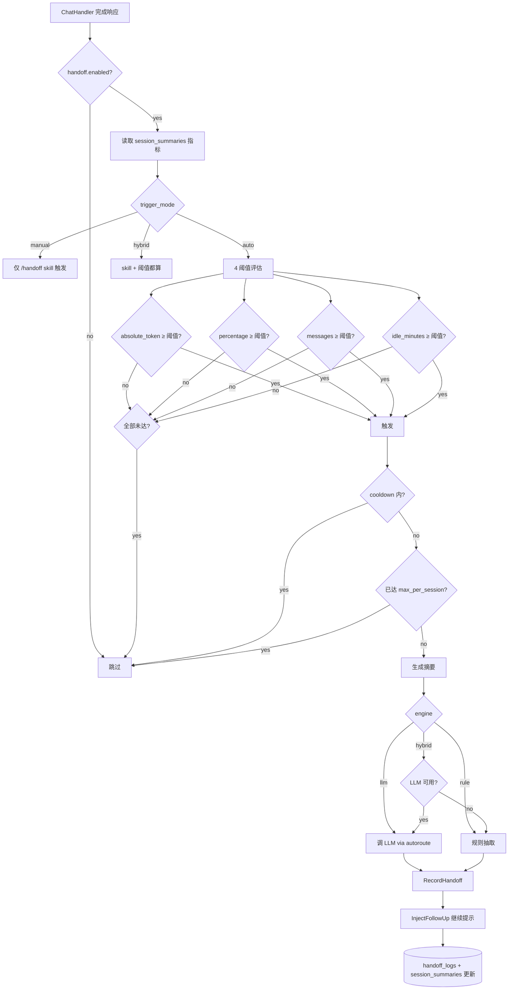

# 会话交接模块（handoff）

**版本**: R1.13
**状态**: 生产就绪（data-plane 模式下 spec 可配置，runtime hook 需 full 模式）
**最后更新**: 2026-07-09

---

## 1. 概述

会话交接（Handoff）在会话上下文窗口逼近上限时自动把旧会话压缩成摘要，
为新会话注入"继续提示"，避免长会话因上下文爆炸而降质。它与
`compression`（压缩）、`session_inspector`（健康检查）、`goal`（任务续跑）
协同工作，形成会话生命周期治理闭环。

| 能力 | 触发点 | 默认动作 |
|------|--------|----------|
| 4 种触发阈值 | response hook | 注入继续提示 + 写 handoff_logs |
| 摘要生成（LLM/rule/hybrid） | 触发后异步 | 写 session_summaries |
| 冷却 / 单会话上限 | 触发前检查 | 抑制重复触发 |
| last-writer-wins 抢占 | InterceptorChain | 抢占 goal 续跑提示 |
| 多通道通知 | 触发后 | 日志 + Webhook |

### 1.1 核心目标

- **4 种触发条件并行**：绝对 token、上下文百分比、消息数、空闲分钟；任一
  达到即触发，多阈值同时命中取最严格的
- **3 种摘要引擎**：`llm`（调 LLM，复用 autoroute 端点配置）、`rule`（规则
  抽取，零依赖）、`hybrid`（LLM 不可用时自动降级到 rule）
- **配置热更新**：19 个 spec 全部注册到 settings registry，admin UI 改完
  秒级生效（无需重启）
- **SSOT 写入**：`session_summaries` 的 handoff_* 列只能由
  `sessionsummary.UpdateHandoffMetrics` 写入，handoff 模块委托调用，避免
  schema 漂移
- **安全默认**：`handoff.enabled=false`，需运维显式开启

### 1.2 模块依赖

```
handoff (本模块)
  ├── compression   [REQ]  摘要引擎可复用 compression.llm_model 降本
  ├── cache         [REQ]  session_summaries 是交接记录的承载表
  ├── goal          [OPT]  last-writer-wins 抢占 goal 续跑提示
  └── session_inspector [OPT]  tokens_at_trigger / last_handoff_at 字段来源
```

---

## 2. 架构

```
┌──────────────────────────────────────────────────────────────────────┐
│                  会话交接 (Handoff)                                    │
├──────────────────────────────────────────────────────────────────────┤
│                                                                        │
│  ChatHandler.StreamResponse()                                          │
│         │                                                              │
│         ▼                                                              │
│  ┌──────────────────────────────────────────────────────────────┐    │
│  │  InterceptorChain (cmd/gateway/goal_control.go:237)          │    │
│  │  [ goalHook → auditHook → handoffHook → outputCompliance ]   │    │
│  │                         ▲ last-writer-wins                   │    │
│  └──────────────────────────┬───────────────────────────────────┘    │
│                             │                                          │
│              ┌──────────────┴───────────────┐                         │
│              ▼                              ▼                         │
│  ┌─────────────────────┐         ┌─────────────────────┐             │
│  │ TriggerEval         │         │ SummaryGenerator    │             │
│  │ (4 thresholds)      │         │ (llm/rule/hybrid)   │             │
│  │  - absolute (180k)  │         │  - LLM: autoroute   │             │
│  │  - percentage (80%) │         │  - rule: 抽取       │             │
│  │  - messages (0=off) │         │  - hybrid: 降级     │             │
│  │  - idle (0=off)     │         └──────────┬──────────┘             │
│  └──────────┬──────────┘                    │                        │
│             │ 触发                           │                        │
│             ▼                               ▼                        │
│  ┌──────────────────────────────────────────────────────────┐        │
│  │  PGStore.RecordHandoff                                    │        │
│  │   1. INSERT handoff_logs                                  │        │
│  │   2. sessionsummary.UpdateHandoffMetrics (SSOT)           │        │
│  │      → UPDATE session_summaries                           │        │
│  │      SET handoff_count / last_handoff_at /                │        │
│  │          tokens_at_trigger / messages_at_trigger /         │        │
│  │          last_trigger_reason / last_trigger_at             │        │
│  └──────────────────────────────────────────────────────────┘        │
│             │                                                        │
│             ▼                                                        │
│  InjectFollowUp: 继续提示 → 新会话首条 system message                 │
│                                                                        │
└──────────────────────────────────────────────────────────────────────┘
```

---

## 3. 配置项（19 specs）

| Key | 类型 | 默认 | 说明 |
|-----|------|------|------|
| `handoff.enabled` | bool | false | 主开关（platform scope） |
| `handoff.trigger_mode` | enum | auto | auto / manual / hybrid |
| `handoff.skill_name` | string | handoff | 触发 /handoff skill 时的名字 |
| `handoff.absolute_threshold` | int | 180000 | 累计 token 绝对阈值 |
| `handoff.percentage_threshold` | float | 0.8 | 上下文窗口占比阈值 |
| `handoff.message_threshold` | int | 0 | 消息数阈值（0=关闭） |
| `handoff.idle_minutes` | int | 0 | 空闲分钟阈值（0=关闭） |
| `handoff.min_messages` | int | 10 | 最少消息数才允许触发 |
| `handoff.summary_engine` | enum | llm | llm / rule / hybrid |
| `handoff.summary_model` | string | "" | LLM 模型（空则用 compression.llm_model） |
| `handoff.summary_keep_recent_n` | int | 4 | 摘要保留最近 N 条原文 |
| `handoff.summary_max_tokens` | int | 2000 | 摘要最大 token |
| `handoff.summary_prompt_tpl` | string | "" | 自定义摘要提示词模板 |
| `handoff.summary_extract_facts` | bool | true | 是否抽取关键事实 |
| `handoff.continue_hint_tpl` | string | "" | 继续提示模板 |
| `handoff.cooldown_seconds` | int | 60 | 冷却秒数 |
| `handoff.max_per_session` | int | 5 | 单会话最大交接次数 |
| `handoff.retry_on_failure` | int | 1 | 失败重试次数 |
| `handoff.notify_level` | enum | warn | none / info / warn |
| `handoff.notify_webhook` | url | "" | 通知 webhook（底层复用 `domains/notification.WebhookChannel`，支持重试/超时/HMAC 签名） |

> platform scope 在全局生效；tenant scope 可按租户覆盖。

---

## 4. 触发流程



---

## 5. Admin API

| 端点 | 方法 | 说明 |
|------|------|------|
| `/api/admin/modules/handoff` | GET | 模块定义（19 config_keys + 10 capabilities + 4 deps） |
| `/api/admin/settings?prefix=handoff` | GET | 列出所有 handoff.* spec |
| `/api/admin/settings` | PUT | 更新单个 spec |
| `/api/admin/handoff/logs` | GET | 交接记录列表（分页 + tenant/session/trigger 过滤） |
| `/api/admin/handoff/stats` | GET | 按 day/engine/reason/session 聚合 |
| `/api/admin/handoff/logs/:id` | GET | 单条记录详情 |
| `/api/admin/session-handoff` | POST | 手动触发交接 |

所有端点支持 RLS（tenant 隔离）+ super_admin bypass。

---

## 6. 与其他模块的关系（避免重复造轮子）

| 关注点 | handoff 做法 | 是否复用 |
|--------|--------------|----------|
| LLM 端点配置 | 复用 `autoroute.HTTPLlmCallerConfig` + `goal.ApplyHTTPLlmCallerDefaults` | ✅ 复用 |
| `session_summaries` 写入 | 委托 `sessionsummary.UpdateHandoffMetrics`（SSOT） | ✅ 复用 |
| Webhook 通知 | 复用 `domains/notification.WebhookChannel`（SendCard + metadata） | ✅ 复用 |
| Token 计数 | 读 `session_summaries.total_tokens` 聚合列 | ✅ 复用 |
| 触发阈值评估 | 自有 4 阈值逻辑（compression 只看单请求体积，关注点不同） | ⚠️ 独立 |
| InterceptorChain 集成 | 第 3 个 hook（goal → audit → handoff → output_compliance） | ✅ 复用 |
| Admin handler RLS | 同 session_state / output_compliance 模式 | ✅ 复用 |
| Settings spec 注册 | 同 goal 模式（`AutoControlSpecs()` 返回 `[]Spec`） | ✅ 复用 |

---

## 7. 部署

### 7.1 data-plane 模式（如 252）

- settings spec **已注册**（main.go 无条件调用 `AutoControlSpecs`），admin
  UI 可配置所有 handoff.* 参数
- runtime hook **未挂载**（`initGoalControl` 仅在 `!bgDataPlaneOnly` 时运行）
- 切换到 full 模式后重启即可激活 hook

### 7.2 full 模式

- settings spec 注册 + runtime hook 挂载均生效
- 通过 `LLM_GATEWAY_HANDOFF_ENABLED=true` 或 admin UI 开启 `handoff.enabled`

### 7.3 DB migration

`db/migrations/356_handoff_enhanced.sql`:
- `handoff_logs` +7 列（summary_text / summary_engine / trigger_mode /
  tokens_in_session / messages_in_session / skill_name / duration_ms）
- `session_summaries` +4 列（tokens_at_trigger / messages_at_trigger /
  last_trigger_reason / last_trigger_at）
- 2 个新索引

---

## 8. 测试

| 层级 | 文件 | 覆盖 |
|------|------|------|
| 单元 | `domains/hooks/handoff/trigger_hook_test.go` | 13 个测试：4 阈值边界、cooldown、max_per_session、manual/auto/hybrid 模式、LLM 降级 |
| 单元 | `domains/sessionsummary/summarizer_handoff_test.go` | nil-db/nil-metrics 契约 + 字段集合 schema drift 防护 |
| 冒烟 | 252 部署后 | `/healthz`、`/api/admin/modules/handoff`、`/handoff/logs`、`/handoff/stats` 端到端 |

---

## 9. 关键文件索引

| 文件 | 作用 |
|------|------|
| `domains/hooks/handoff/trigger_hook.go` | hook 主体：触发评估 + 摘要生成 + RecordHandoff |
| `domains/hooks/handoff/trigger_hook_test.go` | 单元测试 |
| `settings/handoff_specs.go` | 19 个 spec 定义 |
| `admin/handoff_logs_handler.go` | logs/stats/detail 3 个端点 |
| `admin/modules.go` | 模块定义（config_keys + capabilities + dependencies） |
| `cmd/gateway/goal_control.go` | InterceptorChain 装配 |
| `cmd/gateway/main.go:355` | settings spec 无条件注册 |
| `db/migrations/356_handoff_enhanced.sql` | DB schema 变更 |
| `domains/sessionsummary/summarizer.go` | `UpdateHandoffMetrics` SSOT 写入 |
| `web/src/views/ModulesView.vue` | 前端配置 UI（4 分组） |
| `web/src/locales/*/modulesView.ts` | 8 语言 i18n |
| `deploy-to-252.sh` | 部署脚本 |
