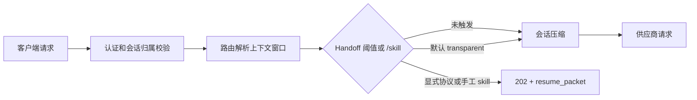

# 会话交接模块（handoff）

**状态**：full 模式可用。data-plane 模式只注册设置，不执行请求 Hook。

## 概述

会话交接在供应商调用前评估会话上下文，避免等到 `context_length_exceeded` 后再恢复。达到阈值时，只有显式声明支持交接协议的客户端才会收到结构化 resume packet；默认兼容模式不会改写请求体，也不会替客户端创建新会话，原请求继续正常路由。

Handoff 与 `compression`、`cache`、`goal` 和 `session_inspector` 协同：

- `compression` 在 Handoff 检查之后运行，缓存并转发原始或其他中间件已处理的请求。
- `cache` 和 `session_summaries` 提供累计 token 与请求数，供阈值判断使用。
- `goal` 仍在响应侧处理任务续跑，但 Handoff 不使用隐藏 follow-up 请求。
- `202 handoff_required` 只生成恢复包，不会在客户端创建新会话前增加 `handoff_count` 或启动 cooldown；客户端确认协议尚待实现。

## 运行流程



默认 `transparent` 模式不增加交接响应头，不改写请求体，也不创建新会话。设置 `X-Gw-Handoff-Mode: explicit`，或将 `handoff.client_mode` 设为 `explicit`，会返回 `202 Accepted` 和：

```json
{
  "status": "handoff_required",
  "resume_packet": {
    "version": 1,
    "previous_session_id": "gw_...",
    "trigger_reason": "percentage_threshold:80%",
    "summary": "...",
    "skill_name": "handoff"
  }
}
```

## 手动 Skill

`handoff.trigger_mode=manual` 只响应最后一条 user message 的 `/<handoff.skill_name>`。该命令本身视为显式交接请求：网关不会把命令或恢复包发送给供应商，而是返回 `202 Accepted` 和 resume packet，由客户端创建新会话后续跑。`hybrid` 同时支持手动命令和阈值触发。

Skill 名称只允许字母、数字、`_`、`-`，最长 64 个字符。

## 触发条件与保护

任一启用的阈值均可触发：

| 设置 | 默认 | 说明 |
|---|---:|---|
| `handoff.absolute_threshold` | 180000 | 会话累计 token 阈值，`0` 禁用 |
| `handoff.percentage_threshold` | 0.8 | 已解析模型上下文窗口的占比 |
| `handoff.message_threshold` | 0 | 请求数近似消息数，`0` 禁用 |
| `handoff.idle_minutes` | 0 | 空闲时长，`0` 禁用 |
| `handoff.min_messages` | 10 | 防止新会话过早交接 |
| `handoff.cooldown_seconds` | 60 | 最小交接间隔 |
| `handoff.max_per_session` | 5 | 单会话上限 |

建议百分比阈值为 `0.75-0.85`，为响应、工具调用和重试保留足够窗口余量。压缩的 4xx recovery 仍作为最终安全网。

## 摘要与凭据

`llm`、`rule`、`hybrid` 都从当前会话消息生成摘要。LLM 摘要使用系统配置的摘要模型和凭据；请求中的 gateway `Authorization` Key **绝不会**被转发给摘要供应商。

当直通上游凭据在认证层被显式标记并提供给 Handoff 后，才允许优先复用它；未建模或无法验证的 Key 一律视为 gateway Key，安全回退到系统摘要凭据。日志、Webhook、响应头和 resume packet 不含凭据。

## 设置分组

- **主控**：`handoff.enabled`、`handoff.trigger_mode`、`handoff.client_mode`、`handoff.skill_name`
- **触发**：token、百分比、消息数、静默时间和最小消息数
- **摘要**：引擎、模型、保留尾部、最大 token、提示模板和事实抽取
- **保护与通知**：冷却、次数上限、降级、日志级别和 webhook

所有设置均通过 settings registry 热更新。平台级设置由平台 scope 解析，租户级阈值和摘要策略可单独覆盖。
