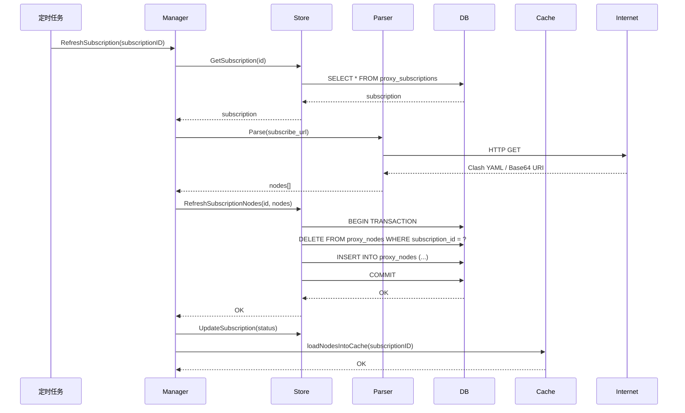
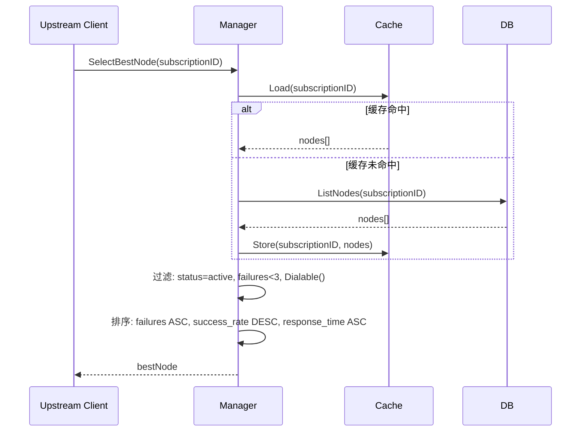
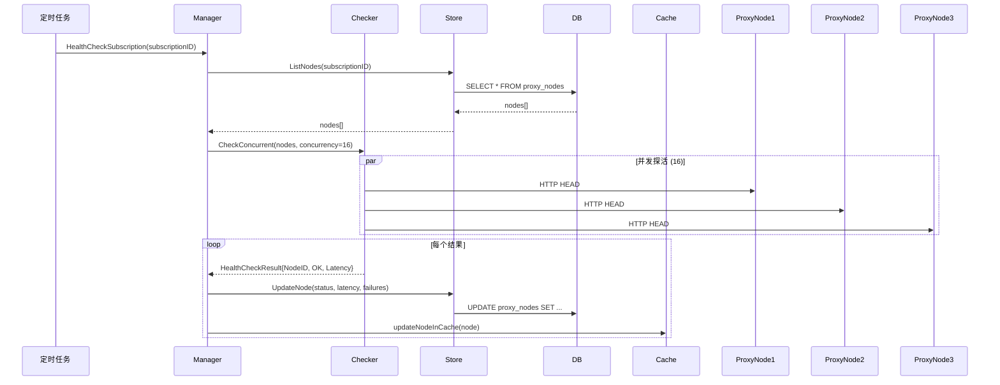

# 代理业务运维手册

## 目录

- [1. 架构说明](#1-架构说明)
  - [1.1 整体架构](#11-整体架构)
  - [1.2 核心组件](#12-核心组件)
  - [1.3 数据流转](#13-数据流转)
  - [1.4 定时任务](#14-定时任务)
- [2. 监控指标](#2-监控指标)
  - [2.1 指标列表](#21-指标列表)
  - [2.2 指标查询示例](#22-指标查询示例)
  - [2.3 正常范围与异常阈值](#23-正常范围与异常阈值)
- [3. 告警处理流程](#3-告警处理流程)
  - [3.1 ProxyNoDialableNodes 告警](#31-proxynodialablenodes-告警)
  - [3.2 ProxyHighFailureRate 告警](#32-proxyhighfailurerate-告警)
  - [3.3 ProxySubscriptionRefreshFailed 告警](#33-proxysubscriptionrefreshfailed-告警)
  - [3.4 ProxyAllNodesUnhealthy 告警](#34-proxyallnodesunhealthy-告警)
- [4. 常见问题排查](#4-常见问题排查)
  - [4.1 订阅刷新失败](#41-订阅刷新失败)
  - [4.2 节点不可用](#42-节点不可用)
  - [4.3 性能下降](#43-性能下降)
  - [4.4 内存泄漏](#44-内存泄漏)
- [5. 应急预案](#5-应急预案)
  - [5.1 全部节点故障](#51-全部节点故障)
  - [5.2 数据库故障](#52-数据库故障)
  - [5.3 性能严重下降](#53-性能严重下降)
- [6. 日常运维操作](#6-日常运维操作)
  - [6.1 订阅管理](#61-订阅管理)
  - [6.2 节点管理](#62-节点管理)
  - [6.3 健康检查](#63-健康检查)
  - [6.4 缓存管理](#64-缓存管理)

---

## 1. 架构说明

### 1.1 整体架构

代理业务负责管理海外供应商的代理节点，为需要访问海外 LLM 服务（如 OpenAI、Anthropic）的请求提供出口代理。

```mermaid
graph TB
    subgraph "代理管理层"
        Manager[Manager<br/>代理管理器]
        Store[PgStore<br/>数据持久化]
        Parser[MultiFormatParser<br/>订阅解析器]
        Checker[HTTPHealthChecker<br/>健康检查器]
        TransportFactory[TransportFactory<br/>传输层工厂]
    end
    
    subgraph "数据存储"
        DB[(PostgreSQL)]
        Cache[sync.Map<br/>内存缓存]
    end
    
    subgraph "定时任务"
        RefreshLoop[订阅刷新循环<br/>30分钟]
        HealthLoop[健康检查循环<br/>5分钟]
    end
    
    subgraph "Admin API"
        ProxyAPI[/api/proxy/*]
    end
    
    subgraph "业务请求"
        Upstream[Upstream Client]
    end
    
    Manager --> Store
    Manager --> Parser
    Manager --> Checker
    Manager --> TransportFactory
    Manager --> Cache
    Store --> DB
    
    RefreshLoop --> Manager
    HealthLoop --> Manager
    
    ProxyAPI --> Manager
    Upstream --> Manager
    
    Parser -.拉取订阅.-> Internet[机场订阅服务]
    Checker -.探活.-> ProxyNode[代理节点]
    TransportFactory -.连接池.-> ProxyNode
```

### 1.2 核心组件

#### Manager (代理管理器)
- **职责**: 统一管理订阅、节点、健康检查、节点选择
- **文件**: `proxy/manager.go`
- **关键方法**:
  - `SelectBestNode()`: 根据健康状态和响应时间选择最优节点
  - `RefreshSubscription()`: 刷新订阅并更新节点列表
  - `HealthCheckNode()`: 单节点健康检查
  - `HealthCheckSubscription()`: 并发批量健康检查（16 并发）
  - `GetProxyTransport()`: 获取可复用的 HTTP Transport

#### PgStore (数据持久化)
- **职责**: PostgreSQL 数据库访问，节点密码加密/解密
- **文件**: `proxy/store_pg.go`
- **关键表**:
  - `proxy_subscriptions`: 订阅配置
  - `proxy_nodes`: 代理节点
  - `proxy_domains`: 域名配置（是否需要代理）
- **事务保护**: `RefreshSubscriptionNodes()` 使用事务原子性更新节点

#### MultiFormatParser (订阅解析器)
- **职责**: 拉取并解析机场订阅（支持 Clash YAML、Base64 URI、纯文本 URI）
- **文件**: `proxy/parser.go`
- **超时**: 20 秒（HTTP 拉取）
- **大小限制**: 16 MB

#### HTTPHealthChecker (健康检查器)
- **职责**: 通过 HTTP HEAD 请求探测节点可用性
- **文件**: `proxy/health_checker.go`
- **超时**: 10 秒/节点
- **并发度**: 16（可配置）
- **判定规则**: 连续失败 ≥3 次标记为 unhealthy

#### TransportFactory (传输层工厂)
- **职责**: 按订阅缓存 HTTP Transport，复用连接池
- **文件**: `proxy/transport.go`
- **连接池配置**:
  - `MaxIdleConns`: 100
  - `MaxIdleConnsPerHost`: 10
  - `IdleConnTimeout`: 90 秒

### 1.3 数据流转

#### 订阅刷新流程



#### 节点选择流程



#### 健康检查流程



### 1.4 定时任务

#### 订阅刷新任务
- **间隔**: 30 分钟（可配置 `autoRefreshInterval`）
- **超时**: 10 分钟/批次
- **触发**: `Manager.Start()` 启动后自动运行
- **操作**: 遍历所有 `status=active` 的订阅，依次调用 `RefreshSubscription()`

#### 健康检查任务
- **间隔**: 5 分钟（可配置 `healthCheckInterval`）
- **超时**: 10 分钟/批次
- **触发**: `Manager.Start()` 启动后自动运行
- **操作**: 遍历所有 `status=active` 的订阅，并发探活其节点

---

## 2. 监控指标

### 2.1 指标列表

所有指标均以 `llm_gateway_proxy_` 为前缀，注册到 Prometheus。

| 指标名称 | 类型 | 标签 | 含义 |
|---------|------|------|------|
| `llm_gateway_proxy_subscriptions_total` | Gauge | `active` | 订阅总数（按 active 状态分列） |
| `llm_gateway_proxy_nodes_total` | Gauge | - | 代理节点总数 |
| `llm_gateway_proxy_nodes_dialable` | Gauge | - | 可被 Go 直接拨号的节点数（http/https/socks5） |
| `llm_gateway_proxy_nodes_unhealthy` | Gauge | - | 处于 unhealthy 状态的节点数（连续失败 ≥3） |
| `llm_gateway_proxy_health_failures_total` | Counter | - | 代理节点探活失败累计次数 |
| `llm_gateway_proxy_egress_selections_total` | Counter | `result` | 出口节点选择次数（dialable/undialable/none） |

**标签说明**:
- `active`: `"true"` 或 `"false"`
- `result`: `"dialable"` (成功选出可拨号节点), `"undialable"` (仅有不可拨号节点), `"none"` (无可用节点)

### 2.2 指标查询示例

#### 查询当前活跃订阅数量
```promql
llm_gateway_proxy_subscriptions_total{active="true"}
```

#### 查询可拨号节点占比
```promql
llm_gateway_proxy_nodes_dialable / llm_gateway_proxy_nodes_total * 100
```

#### 查询不健康节点占比
```promql
llm_gateway_proxy_nodes_unhealthy / llm_gateway_proxy_nodes_total * 100
```

#### 查询过去 1 小时探活失败率
```promql
rate(llm_gateway_proxy_health_failures_total[1h])
```

#### 查询过去 5 分钟节点选择失败率
```promql
rate(llm_gateway_proxy_egress_selections_total{result="none"}[5m]) 
  / 
rate(llm_gateway_proxy_egress_selections_total[5m])
```

#### 查询不可拨号节点被跳过的比例
```promql
rate(llm_gateway_proxy_egress_selections_total{result="undialable"}[5m])
  /
rate(llm_gateway_proxy_egress_selections_total[5m])
```

### 2.3 正常范围与异常阈值

| 指标 | 正常范围 | 警告阈值 | 严重阈值 |
|------|---------|---------|---------|
| 可拨号节点占比 | ≥80% | <50% | <20% |
| 不健康节点占比 | ≤10% | >30% | >50% |
| 探活失败率 | ≤5% | >20% | >50% |
| 节点选择失败率 | 0% | >1% | >10% |
| 活跃订阅数量 | ≥1 | 0 | - |

---

## 3. 告警处理流程

### 3.1 ProxyNoDialableNodes 告警

**触发条件**: `llm_gateway_proxy_nodes_dialable == 0 AND llm_gateway_proxy_nodes_total > 0`

**含义**: 存在节点但全部为不可拨号协议（trojan/vless/vmess/ss），无法直接使用。

#### 排查步骤（SOP）

1. **检查订阅状态**
   ```bash
   curl http://localhost:8080/api/proxy/subscriptions | jq
   ```
   确认 `status=active` 的订阅数量和 `last_fetch_status`。

2. **检查节点列表**
   ```bash
   curl http://localhost:8080/api/proxy/nodes | jq '.by_protocol'
   ```
   查看各协议节点分布，确认是否全是 `trojan`/`vless`/`vmess`/`ss`。

3. **查看告警提示**
   ```bash
   curl http://localhost:8080/api/proxy/status | jq '.warning'
   ```
   输出: "导入的 116 个节点均为 trojan/vless/vmess/ss 协议..."

4. **解决方案**: 部署本地网桥
   - 安装 mihomo 或 xray
   - 配置 Clash YAML，导入订阅
   - 启动 mixed-port (例如 `127.0.0.1:7897`)
   - 手动登记网桥节点:
     ```bash
     curl -X POST http://localhost:8080/api/proxy/nodes \
       -H "Content-Type: application/json" \
       -d '{
         "subscription_id": 1,
         "name": "Local Mihomo Bridge",
         "protocol": "http",
         "server": "127.0.0.1",
         "port": 7897,
         "location": "local",
         "health_check_url": "https://www.google.com",
         "status": "active"
       }'
     ```

5. **验证修复**
   ```bash
   curl http://localhost:8080/api/proxy/status | jq '.dialable_count'
   ```
   应 ≥1。

---

### 3.2 ProxyHighFailureRate 告警

**触发条件**: `rate(llm_gateway_proxy_health_failures_total[5m]) > 0.2`

**含义**: 过去 5 分钟探活失败率超过 20%。

#### 排查步骤（SOP）

1. **查看不健康节点列表**
   ```bash
   curl http://localhost:8080/api/proxy/nodes?status=unhealthy | jq '.items[] | {name, server, consecutive_failures, last_health_check_status}'
   ```

2. **查看日志**
   ```bash
   grep "health check failed" /var/log/llm-gateway.log | tail -50
   ```
   关注错误信息（已脱敏）：
   - `context deadline exceeded`: 探活超时（节点网络慢/不可达）
   - `connection refused`: 端口未开放
   - `no route to host`: 网络不通
   - `authentication failed`: 密码错误

3. **手动探活单个节点**
   ```bash
   curl -X POST http://localhost:8080/api/proxy/nodes/{id}/health-check
   ```
   返回详细错误信息。

4. **分类处理**
   - **网络问题**: 检查服务器到代理节点的网络连通性
     ```bash
     curl -x http://node-server:port https://www.google.com -I --max-time 10
     ```
   - **节点失效**: 联系订阅提供商或禁用该节点
     ```bash
     curl -X PUT http://localhost:8080/api/proxy/subscriptions/{id} \
       -H "Content-Type: application/json" \
       -d '{"status": "disabled"}'
     ```
   - **密码错误**: 检查数据库密码加密/解密是否正常
     ```bash
     # 查看数据库日志
     grep "decrypt" /var/log/llm-gateway.log
     ```

5. **批量刷新订阅**
   ```bash
   for id in $(curl -s http://localhost:8080/api/proxy/subscriptions | jq -r '.items[] | select(.status=="active") | .id'); do
     curl -X POST http://localhost:8080/api/proxy/subscriptions/$id/refresh
   done
   ```

---

### 3.3 ProxySubscriptionRefreshFailed 告警

**触发条件**: 订阅 `last_fetch_status = "failed"`

**含义**: 订阅拉取或解析失败。

#### 排查步骤（SOP）

1. **查看订阅错误**
   ```bash
   curl http://localhost:8080/api/proxy/subscriptions | jq '.items[] | select(.last_fetch_status=="failed") | {id, name, last_error}'
   ```

2. **常见错误类型**:
   - **网络超时**: `context deadline exceeded`
     - 检查服务器出口网络
     - 检查订阅 URL 是否可访问
     ```bash
     curl -I {subscribe_url} --max-time 20
     ```
   - **订阅过期**: `403 Forbidden` / `401 Unauthorized`
     - 联系订阅提供商续费
     - 更新 `subscribe_url`
   - **格式错误**: `unsupported format` / `parse error`
     - 手动下载订阅内容检查格式
     ```bash
     curl {subscribe_url} | head -50
     ```
   - **订阅返回空内容**: `no nodes found`
     - 联系订阅提供商

3. **手动触发刷新**
   ```bash
   curl -X POST http://localhost:8080/api/proxy/subscriptions/{id}/refresh -v
   ```
   查看详细错误响应。

4. **临时措施**: 切换到备用订阅
   ```bash
   # 禁用失效订阅
   curl -X PUT http://localhost:8080/api/proxy/subscriptions/{failed_id} \
     -d '{"status": "disabled"}'
   
   # 启用备用订阅
   curl -X PUT http://localhost:8080/api/proxy/subscriptions/{backup_id} \
     -d '{"status": "active"}'
   ```

---

### 3.4 ProxyAllNodesUnhealthy 告警

**触发条件**: `llm_gateway_proxy_nodes_unhealthy == llm_gateway_proxy_nodes_dialable`

**含义**: 所有可拨号节点均处于 unhealthy 状态。

#### 排查步骤（SOP）

1. **确认范围**
   ```bash
   curl http://localhost:8080/api/proxy/status
   ```
   查看 `unhealthy_count`、`healthy_count`、`dialable_count`。

2. **检查是否为批量故障**
   ```bash
   curl http://localhost:8080/api/proxy/nodes | jq '.items[] | select(.status=="unhealthy") | {name, server, consecutive_failures, last_health_check_at}'
   ```
   如果 `last_health_check_at` 集中在同一时间段，可能是:
   - 服务器出口网络故障
   - 代理供应商批量封禁

3. **测试出口网络**
   ```bash
   # 测试直连（不走代理）
   curl https://www.google.com -I --max-time 10
   
   # 测试代理连接
   curl -x http://127.0.0.1:7897 https://www.google.com -I --max-time 10
   ```

4. **应急预案**: 见 [5.1 全部节点故障](#51-全部节点故障)

---

## 4. 常见问题排查

### 4.1 订阅刷新失败

#### 问题表现
- 订阅 `last_fetch_status = "failed"`
- 节点数量长时间不更新
- 日志显示 `parse subscription: ...`

#### 原因分析
1. **网络问题**: 服务器无法访问订阅 URL
2. **订阅过期**: 订阅服务商账号过期或被封
3. **格式错误**: 订阅返回内容格式不符合预期
4. **超时**: 订阅拉取耗时超过 20 秒

#### 排查命令
```bash
# 1. 检查订阅可访问性
curl -I {subscribe_url} --max-time 20

# 2. 下载订阅内容检查格式
curl {subscribe_url} -o /tmp/subscription.txt
head -50 /tmp/subscription.txt

# 3. 查看解析器日志
grep "parse subscription" /var/log/llm-gateway.log | tail -20

# 4. 手动触发刷新
curl -X POST http://localhost:8080/api/proxy/subscriptions/{id}/refresh -v
```

#### 解决方案
- **网络问题**: 配置代理或 VPN
- **订阅过期**: 联系提供商续费，更新 `subscribe_url`
- **格式错误**: 联系提供商或切换其他订阅
- **超时**: 检查网络带宽，考虑增加超时时间

---

### 4.2 节点不可用

#### 问题表现
- 节点 `status = "unhealthy"`
- `consecutive_failures >= 3`
- 选择节点时报错 `no available active nodes`

#### 原因分析
1. **网络不通**: 服务器到节点的网络不可达
2. **节点失效**: 代理服务商节点下线或 IP 被封
3. **密码错误**: 节点密码变更但未同步
4. **协议不支持**: 节点为 trojan/vless 等不可直接拨号的协议

#### 排查命令
```bash
# 1. 检查节点状态
curl http://localhost:8080/api/proxy/nodes/{id}

# 2. 手动探活
curl -X POST http://localhost:8080/api/proxy/nodes/{id}/health-check

# 3. 测试节点连通性
curl -x http://{server}:{port} https://www.google.com -I --max-time 10

# 4. 查看探活日志
grep "node_id={id}" /var/log/llm-gateway.log | tail -20
```

#### 解决方案
- **网络不通**: 检查防火墙、路由、DNS
- **节点失效**: 刷新订阅获取最新节点列表
  ```bash
  curl -X POST http://localhost:8080/api/proxy/subscriptions/{subscription_id}/refresh
  ```
- **密码错误**: 手动更新节点密码（暂不支持，需等订阅刷新）
- **协议不支持**: 部署本地网桥（参考 [3.1](#31-proxynodialablenodes-告警)）

---

### 4.3 性能下降

#### 问题表现
- 请求响应时间变长
- `response_time_ms` 指标升高
- 日志显示大量超时错误

#### 原因分析
1. **节点响应慢**: 代理节点网络拥塞或负载高
2. **数据库慢查询**: `ListNodes` 等查询耗时长
3. **缓存失效**: 频繁回退到数据库查询
4. **连接池耗尽**: Transport 连接池打满

#### 排查命令
```bash
# 1. 查看节点响应时间
curl http://localhost:8080/api/proxy/nodes | jq '.items | sort_by(.response_time_ms) | reverse | .[0:10] | .[] | {name, response_time_ms}'

# 2. 检查数据库慢查询
psql -h {db_host} -U {db_user} -d {db_name} -c "SELECT query, calls, mean_exec_time, max_exec_time FROM pg_stat_statements WHERE query LIKE '%proxy%' ORDER BY mean_exec_time DESC LIMIT 10;"

# 3. 查看缓存命中率（通过日志）
grep "list nodes" /var/log/llm-gateway.log | wc -l  # 应该很少

# 4. 检查 goroutine 数量
curl http://localhost:8080/debug/pprof/goroutine?debug=1 | grep "proxy" | wc -l
```

#### 解决方案
- **节点响应慢**: 禁用慢节点或切换订阅
  ```bash
  # 禁用响应时间 >5000ms 的节点（需脚本实现）
  for id in $(curl -s http://localhost:8080/api/proxy/nodes | jq -r '.items[] | select(.response_time_ms > 5000) | .id'); do
    curl -X PUT http://localhost:8080/api/proxy/nodes/$id -d '{"status": "disabled"}'
  done
  ```
- **数据库慢查询**: 添加索引
  ```sql
  CREATE INDEX IF NOT EXISTS idx_proxy_nodes_subscription_status ON proxy_nodes(subscription_id, status);
  ```
- **缓存失效**: 检查 `ReloadCache` 调用频率，确保缓存正常工作
- **连接池耗尽**: 增加 `MaxIdleConns` 或重启服务释放连接

---

### 4.4 内存泄漏

#### 问题表现
- 进程内存持续增长
- 最终 OOM (Out of Memory)
- Goroutine 数量持续增加

#### 原因分析
1. **Transport 未释放**: 节点删除后 Transport 未关闭空闲连接
2. **缓存无限增长**: 订阅删除后缓存未清理
3. **Goroutine 泄漏**: 健康检查 goroutine 未正确退出

#### 排查命令
```bash
# 1. 查看内存使用
curl http://localhost:8080/debug/pprof/heap > /tmp/heap.prof
go tool pprof -http=:8081 /tmp/heap.prof

# 2. 查看 goroutine 数量
curl http://localhost:8080/debug/pprof/goroutine?debug=1 | grep "goroutine" | wc -l

# 3. 查看 goroutine 堆栈
curl http://localhost:8080/debug/pprof/goroutine?debug=2 > /tmp/goroutine.txt
grep -A 10 "proxy" /tmp/goroutine.txt

# 4. 监控缓存大小（通过日志）
grep "cache size" /var/log/llm-gateway.log | tail -20
```

#### 解决方案
- **Transport 泄漏**: 确保调用 `InvalidateTransport()`
  - 节点删除时已自动调用
  - 订阅删除时已自动调用
- **缓存泄漏**: 定期调用 `ReloadCache()`
  ```bash
  curl -X POST http://localhost:8080/api/proxy/cache/reload
  ```
- **Goroutine 泄漏**: 重启服务（已在 2026-08-29 审计中修复）
- **临时措施**: 重启服务
  ```bash
  systemctl restart llm-gateway
  ```

---

## 5. 应急预案

### 5.1 全部节点故障

#### 场景
所有代理节点不可用，无法访问海外 LLM 服务。

#### 影响范围
- 需要代理的海外供应商请求全部失败
- 影响所有租户的海外模型调用

#### 应急措施

**步骤 1: 切换到备用订阅**
```bash
# 查看所有订阅
curl http://localhost:8080/api/proxy/subscriptions

# 启用备用订阅
curl -X PUT http://localhost:8080/api/proxy/subscriptions/{backup_id} \
  -H "Content-Type: application/json" \
  -d '{"status": "active"}'

# 立即刷新
curl -X POST http://localhost:8080/api/proxy/subscriptions/{backup_id}/refresh
```

**步骤 2: 手动添加可用节点**（如有备用节点）
```bash
curl -X POST http://localhost:8080/api/proxy/nodes \
  -H "Content-Type: application/json" \
  -d '{
    "subscription_id": 1,
    "name": "Emergency Node",
    "protocol": "http",
    "server": "backup-proxy.example.com",
    "port": 8080,
    "username": "user",
    "password": "pass",
    "status": "active"
  }'
```

**步骤 3: 降级到直连模式**（如供应商支持国内访问）
```sql
-- 临时禁用所有代理需求
UPDATE proxy_domains SET requires_proxy = false WHERE requires_proxy = true;
```

**步骤 4: 通知业务方**
- 发送告警通知到 Slack/钉钉
- 通知受影响的租户
- 提供预计恢复时间

#### 恢复验证
```bash
# 1. 检查节点状态
curl http://localhost:8080/api/proxy/status

# 2. 测试节点选择
curl http://localhost:8080/api/proxy/status | jq '.selected_node'

# 3. 测试实际代理请求
curl -X POST http://localhost:8080/v1/chat/completions \
  -H "Authorization: Bearer {token}" \
  -d '{"model": "gpt-4", "messages": [{"role": "user", "content": "test"}]}'
```

---

### 5.2 数据库故障

#### 场景
PostgreSQL 数据库不可用（连接失败、主从切换、磁盘满）。

#### 影响范围
- 无法查询节点列表
- 无法刷新订阅
- 无法更新健康检查结果
- **已缓存的节点仍可使用**

#### 应急措施

**步骤 1: 使用缓存继续服务**
- Manager 的 `nodesCache` 保存了最近一次加载的节点
- `SelectBestNode()` 优先使用缓存
- 在数据库恢复前，代理功能可继续运行（但无法刷新）

**步骤 2: 检查数据库状态**
```bash
# 连接测试
psql -h {db_host} -U {db_user} -d {db_name} -c "SELECT 1;"

# 检查主从状态
psql -h {db_host} -U {db_user} -d {db_name} -c "SELECT * FROM pg_stat_replication;"

# 检查磁盘空间
df -h /var/lib/postgresql
```

**步骤 3: 数据库恢复**
- **连接失败**: 检查网络、防火墙、连接池
- **主从切换**: 更新连接字符串指向新主库
- **磁盘满**: 清理日志、扩容磁盘

**步骤 4: 服务恢复后重载缓存**
```bash
# 重载缓存（需实现 API）
curl -X POST http://localhost:8080/api/proxy/cache/reload
```

#### 降级策略
- 禁用订阅刷新任务（减少数据库压力）
- 禁用健康检查任务（减少数据库写入）
- 只读模式：使用缓存提供服务

---

### 5.3 性能严重下降

#### 场景
代理请求响应时间从正常的 1-2 秒暴增到 10+ 秒。

#### 影响范围
- 用户请求超时
- 网关吞吐量下降
- 可能引发雪崩效应

#### 应急措施

**步骤 1: 限流保护**
```bash
# Nginx 限流（如有）
nginx -s reload

# 应用层限流（需实现）
curl -X PUT http://localhost:8080/api/config/rate-limit \
  -d '{"proxy_requests_per_minute": 100}'
```

**步骤 2: 禁用慢节点**
```bash
# 查询响应时间 >5000ms 的节点
curl http://localhost:8080/api/proxy/nodes | jq '.items[] | select(.response_time_ms > 5000) | .id'

# 批量禁用（需实现脚本）
for id in $(curl -s http://localhost:8080/api/proxy/nodes | jq -r '.items[] | select(.response_time_ms > 5000) | .id'); do
  curl -X DELETE http://localhost:8080/api/proxy/nodes/$id
done
```

**步骤 3: 扩容代理节点**
- 联系订阅提供商增加节点配额
- 添加新的订阅源
- 部署更多本地网桥

**步骤 4: 降级非关键功能**
- 禁用健康检查任务（临时）
  ```go
  // 需在代码中实现暂停机制
  manager.PauseHealthCheck()
  ```
- 增加订阅刷新间隔（从 30 分钟改为 2 小时）
- 禁用某些低优先级供应商

#### 恢复验证
```bash
# 监控平均响应时间
curl http://localhost:8080/api/proxy/nodes | jq '[.items[] | select(.status=="active")] | map(.response_time_ms) | add / length'

# 应 <3000ms
```

---

## 6. 日常运维操作

### 6.1 订阅管理

#### 列出所有订阅
```bash
curl http://localhost:8080/api/proxy/subscriptions | jq '.items[] | {id, name, status, node_count, last_fetch_status}'
```

#### 添加订阅
```bash
curl -X POST http://localhost:8080/api/proxy/subscriptions \
  -H "Content-Type: application/json" \
  -d '{
    "name": "VendorA Premium",
    "subscribe_url": "https://vendor-a.com/subscribe?token=xxx",
    "priority": 10,
    "notes": "生产环境主订阅",
    "status": "active"
  }'
```

#### 更新订阅
```bash
curl -X PUT http://localhost:8080/api/proxy/subscriptions/{id} \
  -H "Content-Type: application/json" \
  -d '{
    "name": "VendorA Premium (Updated)",
    "status": "active",
    "priority": 20
  }'
```

#### 手动刷新订阅
```bash
curl -X POST http://localhost:8080/api/proxy/subscriptions/{id}/refresh
```

**响应示例**:
```json
{
  "ok": true,
  "subscription_id": 1,
  "node_count": 116,
  "by_protocol": {
    "trojan": 80,
    "vless": 36
  },
  "dialable_count": 0,
  "warning": "导入的 116 个节点均为 trojan/vless/vmess/ss 协议..."
}
```

#### 删除订阅
```bash
curl -X DELETE http://localhost:8080/api/proxy/subscriptions/{id}
```
**注意**: 会级联删除该订阅下的所有节点（`ON DELETE CASCADE`）。

---

### 6.2 节点管理

#### 列出所有节点
```bash
curl http://localhost:8080/api/proxy/nodes | jq '.items[] | {id, name, protocol, server, port, status, dialable, response_time_ms}'
```

#### 按订阅过滤节点
```bash
curl "http://localhost:8080/api/proxy/nodes?subscription_id=1"
```

#### 只列出可拨号节点
```bash
curl "http://localhost:8080/api/proxy/nodes?dialable=true"
```

#### 查询不健康节点
```bash
curl http://localhost:8080/api/proxy/nodes | jq '.items[] | select(.status=="unhealthy") | {id, name, consecutive_failures}'
```

#### 添加节点（手动登记网桥）
```bash
curl -X POST http://localhost:8080/api/proxy/nodes \
  -H "Content-Type: application/json" \
  -d '{
    "subscription_id": 1,
    "name": "Local Mihomo Bridge HK",
    "protocol": "http",
    "server": "127.0.0.1",
    "port": 7897,
    "location": "HongKong",
    "health_check_url": "https://www.google.com",
    "status": "active"
  }'
```

#### 删除节点
```bash
curl -X DELETE http://localhost:8080/api/proxy/nodes/{id}
```

#### 查看节点详情
```bash
curl http://localhost:8080/api/proxy/nodes/{id}
```

---

### 6.3 健康检查

#### 手动探活单个节点
```bash
curl -X POST http://localhost:8080/api/proxy/nodes/{id}/health-check
```

**响应示例**:
```json
{
  "ok": true,
  "id": 42,
  "dialable": true,
  "status": "active",
  "response_time_ms": 1234,
  "health_status": "success"
}
```

**失败响应**:
```json
{
  "ok": false,
  "id": 42,
  "dialable": true,
  "status": "unhealthy",
  "response_time_ms": 0,
  "health_status": "failed",
  "error": "context deadline exceeded"
}
```

#### 查看节点健康历史
```bash
# 查看最近探活时间
curl http://localhost:8080/api/proxy/nodes/{id} | jq '{last_health_check_at, last_health_check_status, consecutive_failures}'
```

#### 批量探活订阅节点（通过刷新触发）
```bash
# 刷新会自动触发健康检查
curl -X POST http://localhost:8080/api/proxy/subscriptions/{id}/refresh
```

---

### 6.4 缓存管理

#### 查看当前选中节点
```bash
curl http://localhost:8080/api/proxy/status | jq '.selected_node'
```

**响应示例**:
```json
{
  "id": 42,
  "name": "HK-01",
  "protocol": "http",
  "server": "127.0.0.1",
  "port": 7897,
  "dialable": true,
  "status": "active",
  "response_time_ms": 856,
  "success_rate": 0.95,
  "consecutive_failures": 0
}
```

#### 重载缓存（手动）
**注意**: 当前版本通过 API 操作（刷新、删除）会自动调用 `ReloadCache()`，通常无需手动重载。

如需手动重载（例如数据库直接修改后）:
```bash
# 需实现专用 API
curl -X POST http://localhost:8080/api/proxy/cache/reload
```

#### 查看整体状态
```bash
curl http://localhost:8080/api/proxy/status
```

**响应示例**:
```json
{
  "subscription_count": 2,
  "active_subscriptions": 1,
  "node_count": 118,
  "by_protocol": {
    "http": 2,
    "trojan": 80,
    "vless": 36
  },
  "dialable_count": 2,
  "unhealthy_count": 0,
  "healthy_count": 2,
  "selected_node": { ... }
}
```

---

## 附录

### A. 相关文件

| 文件 | 说明 |
|------|------|
| `proxy/manager.go` | 核心管理器 |
| `proxy/store_pg.go` | PostgreSQL 存储 |
| `proxy/parser.go` | 订阅解析器 |
| `proxy/health_checker.go` | 健康检查器 |
| `proxy/transport.go` | Transport 工厂 |
| `proxy/metrics.go` | Prometheus 指标 |
| `admin/proxy.go` | Admin API 路由 |

### B. 数据库表结构

#### proxy_subscriptions
```sql
CREATE TABLE proxy_subscriptions (
  id SERIAL PRIMARY KEY,
  name TEXT NOT NULL,
  subscribe_url TEXT NOT NULL,
  status TEXT NOT NULL DEFAULT 'active',
  priority INTEGER DEFAULT 0,
  node_count INTEGER DEFAULT 0,
  last_fetch_at TIMESTAMPTZ,
  last_fetch_status TEXT,
  last_error TEXT,
  notes TEXT,
  created_at TIMESTAMPTZ DEFAULT NOW(),
  updated_at TIMESTAMPTZ DEFAULT NOW()
);
```

#### proxy_nodes
```sql
CREATE TABLE proxy_nodes (
  id SERIAL PRIMARY KEY,
  subscription_id INTEGER REFERENCES proxy_subscriptions(id) ON DELETE CASCADE,
  name TEXT NOT NULL,
  protocol TEXT NOT NULL,
  server TEXT NOT NULL,
  port INTEGER NOT NULL,
  username TEXT,
  password TEXT,  -- 加密存储
  location TEXT,
  status TEXT DEFAULT 'active',
  health_check_url TEXT,
  last_health_check_at TIMESTAMPTZ,
  last_health_check_status TEXT,
  response_time_ms INTEGER DEFAULT 0,
  success_rate DOUBLE PRECISION DEFAULT 0,
  consecutive_failures INTEGER DEFAULT 0,
  created_at TIMESTAMPTZ DEFAULT NOW(),
  updated_at TIMESTAMPTZ DEFAULT NOW()
);

CREATE INDEX idx_proxy_nodes_subscription_status ON proxy_nodes(subscription_id, status);
```

### C. 常用日志查询

```bash
# 查看订阅刷新日志
grep "refreshing subscription" /var/log/llm-gateway.log

# 查看节点探活失败
grep "health check failed" /var/log/llm-gateway.log

# 查看节点选择错误
grep "no dialable proxy node" /var/log/llm-gateway.log

# 查看解析错误
grep "parse subscription" /var/log/llm-gateway.log
```

### D. 性能调优建议

1. **数据库索引**: 确保已创建订阅和状态的联合索引
2. **缓存预热**: 服务启动时 `Manager.Start()` 会自动加载缓存
3. **并发控制**: 健康检查并发度默认 16，可根据网络情况调整
4. **连接池**: 根据节点数量和请求量调整 `MaxIdleConns`
5. **定时任务**: 根据订阅变更频率调整刷新间隔（默认 30 分钟）

---

**文档版本**: v1.0  
**最后更新**: 2026-08-29  
**维护者**: LLM Gateway 运维团队
