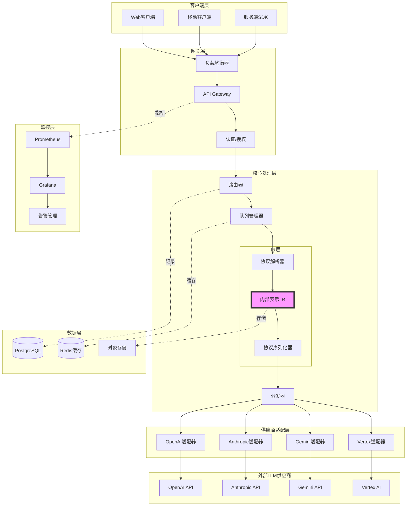
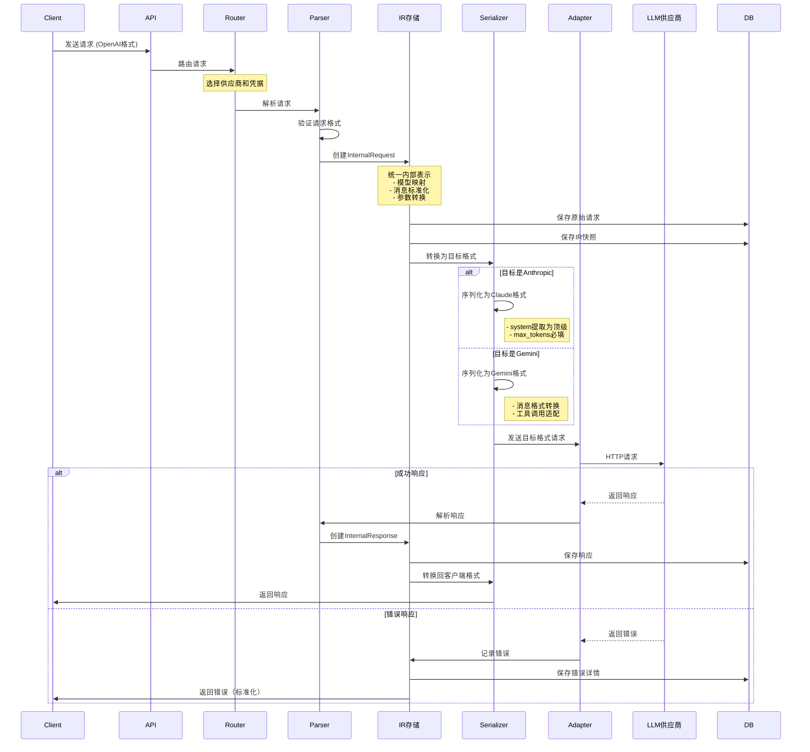
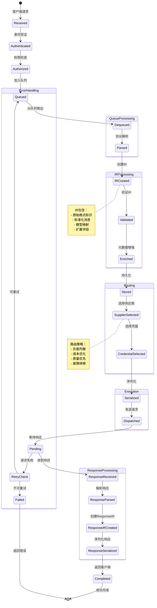
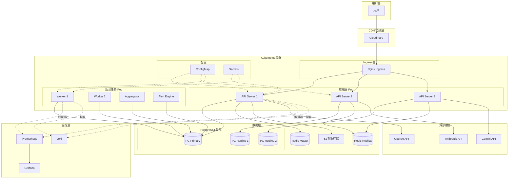

# 任务5: 文档完善 - 详细提示词

## 背景
完善的文档是系统可维护性的关键。当前IR层和整体系统缺少：
- 架构图和数据流图
- 组件交互说明
- API文档
- 开发指南
- 故障排查手册

## 任务5.1: 架构和数据流文档

### 执行提示词

```markdown
# 任务：创建系统架构和数据流文档

## 目标
- 绘制完整的系统架构图
- 绘制IR数据流图
- 文档化关键组件和交互
- 提供可视化的理解路径

## 实施步骤

### 1. 文档结构

```
docs/
├── architecture/
│   ├── README.md                    # 架构总览
│   ├── system-overview.md           # 系统总览
│   ├── ir-layer.md                  # IR层详细设计
│   ├── routing-strategy.md          # 路由策略
│   ├── queue-management.md          # 队列管理
│   ├── error-handling.md            # 错误处理
│   └── diagrams/
│       ├── system-architecture.mmd  # Mermaid架构图
│       ├── ir-data-flow.mmd         # IR数据流
│       ├── request-lifecycle.mmd    # 请求生命周期
│       └── deployment.mmd           # 部署架构
├── api/
│   ├── openapi.yaml                 # OpenAPI规范
│   └── examples/                    # API示例
├── development/
│   ├── setup.md                     # 开发环境搭建
│   ├── coding-standards.md          # 编码规范
│   └── testing-guide.md             # 测试指南
└── operations/
    ├── deployment.md                # 部署指南
    ├── monitoring.md                # 监控指南
    └── troubleshooting.md           # 故障排查
```

### 2. 系统架构图

**文件**: `docs/architecture/diagrams/system-architecture.mmd`



### 3. IR数据流图

**文件**: `docs/architecture/diagrams/ir-data-flow.mmd`



### 4. 请求生命周期图

**文件**: `docs/architecture/diagrams/request-lifecycle.mmd`



### 5. IR层详细设计文档

**文件**: `docs/architecture/ir-layer.md`

```markdown
# IR层（Internal Representation Layer）详细设计

## 概述
IR层是LLM Gateway的核心组件，负责将多种LLM协议转换为统一的内部表示，并支持跨协议转换。

## 设计目标
1. **协议无关性**: 客户端和供应商可以使用不同的协议
2. **数据完整性**: 转换过程不丢失信息
3. **可扩展性**: 易于添加新的LLM协议支持
4. **性能**: 高效的解析和序列化

## 核心数据结构

### InternalRequest
```go
type InternalRequest struct {
    // 标识信息
    RequestID     string    `json:"request_id"`
    TraceID       string    `json:"trace_id"`
    OriginalFormat string   `json:"original_format"` // "openai", "anthropic", etc.
    
    // 模型信息
    Model         string    `json:"model"`
    ModelFamily   string    `json:"model_family"`    // "gpt-4", "claude-3", etc.
    
    // 消息内容
    Messages      []Message `json:"messages"`
    SystemPrompt  *string   `json:"system_prompt,omitempty"`
    
    // 生成参数
    Temperature   *float64  `json:"temperature,omitempty"`
    MaxTokens     *int      `json:"max_tokens,omitempty"`
    TopP          *float64  `json:"top_p,omitempty"`
    Stop          []string  `json:"stop,omitempty"`
    
    // 流式配置
    Stream        *bool     `json:"stream,omitempty"`
    
    // 工具调用
    Tools         []Tool    `json:"tools,omitempty"`
    ToolChoice    *ToolChoice `json:"tool_choice,omitempty"`
    
    // 多模态
    Attachments   []Attachment `json:"attachments,omitempty"`
    
    // 元数据
    Metadata      Metadata  `json:"metadata"`
    Extensions    map[string]interface{} `json:"extensions,omitempty"`
    
    // 时间戳
    CreatedAt     time.Time `json:"created_at"`
    ParsedAt      time.Time `json:"parsed_at"`
}
```

### Message
```go
type Message struct {
    Role      string    `json:"role"`       // system, user, assistant, tool
    Content   *Content  `json:"content,omitempty"`
    Name      *string   `json:"name,omitempty"`
    ToolCalls []ToolCall `json:"tool_calls,omitempty"`
    ToolCallID *string  `json:"tool_call_id,omitempty"`
}
```

### Content (多模态支持)
```go
type Content struct {
    Parts []ContentPart `json:"parts"`
}

type ContentPart struct {
    Type      string     `json:"type"`  // text, image_url, file
    
    // Text content
    Text      *string    `json:"text,omitempty"`
    
    // Image content
    ImageURL  *ImageURL  `json:"image_url,omitempty"`
    
    // File content
    FileID    *string    `json:"file_id,omitempty"`
    MimeType  *string    `json:"mime_type,omitempty"`
}

type ImageURL struct {
    URL    string  `json:"url"`
    Detail *string `json:"detail,omitempty"` // low, high, auto
}
```

## 协议解析器

### OpenAI解析器
```go
// ParseOpenAIRequest 解析OpenAI格式的请求
func ParseOpenAIRequest(data []byte) (*InternalRequest, error) {
    var raw openAIRequest
    if err := json.Unmarshal(data, &raw); err != nil {
        return nil, fmt.Errorf("invalid JSON: %w", err)
    }
    
    ir := &InternalRequest{
        RequestID:      generateRequestID(),
        OriginalFormat: "openai",
        Model:          raw.Model,
        ModelFamily:    extractModelFamily(raw.Model),
        CreatedAt:      time.Now(),
    }
    
    // 转换消息
    for _, msg := range raw.Messages {
        irMsg, err := convertOpenAIMessage(msg)
        if err != nil {
            return nil, err
        }
        ir.Messages = append(ir.Messages, irMsg)
    }
    
    // 转换参数
    ir.Temperature = raw.Temperature
    ir.MaxTokens = raw.MaxTokens
    ir.TopP = raw.TopP
    ir.Stop = raw.Stop
    ir.Stream = raw.Stream
    
    // 转换工具
    if len(raw.Tools) > 0 {
        ir.Tools = convertOpenAITools(raw.Tools)
        ir.ToolChoice = raw.ToolChoice
    }
    
    // 保留扩展字段
    ir.Extensions = extractExtensions(data, standardOpenAIFields)
    
    ir.ParsedAt = time.Now()
    return ir, nil
}
```

### Anthropic解析器
```go
// ParseAnthropicRequest 解析Anthropic Claude格式的请求
func ParseAnthropicRequest(data []byte) (*InternalRequest, error) {
    var raw anthropicRequest
    if err := json.Unmarshal(data, &raw); err != nil {
        return nil, fmt.Errorf("invalid JSON: %w", err)
    }
    
    ir := &InternalRequest{
        RequestID:      generateRequestID(),
        OriginalFormat: "anthropic",
        Model:          raw.Model,
        ModelFamily:    "claude-3",
        MaxTokens:      &raw.MaxTokens,  // Anthropic必需
        CreatedAt:      time.Now(),
    }
    
    // Claude的system是顶级字段
    if raw.System != "" {
        ir.SystemPrompt = &raw.System
        // 或者转换为system消息
        ir.Messages = append(ir.Messages, Message{
            Role: "system",
            Content: &Content{
                Parts: []ContentPart{{Type: "text", Text: &raw.System}},
            },
        })
    }
    
    // 转换消息
    for _, msg := range raw.Messages {
        irMsg := convertAnthropicMessage(msg)
        ir.Messages = append(ir.Messages, irMsg)
    }
    
    // 转换参数
    ir.Temperature = raw.Temperature
    ir.TopP = raw.TopP
    ir.Stop = raw.StopSequences
    
    ir.ParsedAt = time.Now()
    return ir, nil
}
```

## 协议序列化器

### 序列化为OpenAI格式
```go
// SerializeOpenAI 将IR序列化为OpenAI格式
func SerializeOpenAI(ir *InternalRequest) ([]byte, error) {
    req := openAIRequest{
        Model:       ir.Model,
        Temperature: ir.Temperature,
        MaxTokens:   ir.MaxTokens,
        TopP:        ir.TopP,
        Stop:        ir.Stop,
        Stream:      ir.Stream,
    }
    
    // 转换消息
    for _, msg := range ir.Messages {
        oaiMsg, err := convertToOpenAIMessage(msg)
        if err != nil {
            return nil, err
        }
        req.Messages = append(req.Messages, oaiMsg)
    }
    
    // 转换工具
    if len(ir.Tools) > 0 {
        req.Tools = convertToOpenAITools(ir.Tools)
        req.ToolChoice = ir.ToolChoice
    }
    
    // 恢复扩展字段
    return marshalWithExtensions(req, ir.Extensions)
}
```

### 序列化为Anthropic格式
```go
// SerializeAnthropic 将IR序列化为Anthropic格式
func SerializeAnthropic(ir *InternalRequest) ([]byte, error) {
    // Anthropic要求max_tokens
    if ir.MaxTokens == nil {
        defaultMaxTokens := 1024
        ir.MaxTokens = &defaultMaxTokens
    }
    
    req := anthropicRequest{
        Model:     mapToAnthropicModel(ir.Model),
        MaxTokens: *ir.MaxTokens,
    }
    
    // 提取system消息作为顶级字段
    var systemContent string
    var nonSystemMessages []Message
    for _, msg := range ir.Messages {
        if msg.Role == "system" && msg.Content != nil {
            systemContent += extractText(msg.Content)
        } else {
            nonSystemMessages = append(nonSystemMessages, msg)
        }
    }
    
    if systemContent != "" {
        req.System = systemContent
    }
    
    // 转换消息
    for _, msg := range nonSystemMessages {
        antMsg := convertToAnthropicMessage(msg)
        req.Messages = append(req.Messages, antMsg)
    }
    
    // 转换参数
    req.Temperature = ir.Temperature
    req.TopP = ir.TopP
    req.StopSequences = ir.Stop
    
    return json.Marshal(req)
}
```

## 跨协议转换示例

### OpenAI → Anthropic
```
客户端请求 (OpenAI格式):
{
  "model": "gpt-4",
  "messages": [
    {"role": "system", "content": "You are helpful"},
    {"role": "user", "content": "Hello"}
  ],
  "temperature": 0.7
}

↓ ParseOpenAIRequest

InternalRequest (IR):
{
  "request_id": "req_123",
  "original_format": "openai",
  "model": "gpt-4",
  "model_family": "gpt-4",
  "messages": [
    {"role": "system", "content": {"parts": [{"type": "text", "text": "You are helpful"}]}},
    {"role": "user", "content": {"parts": [{"type": "text", "text": "Hello"}]}}
  ],
  "temperature": 0.7
}

↓ SerializeAnthropic

供应商请求 (Anthropic格式):
{
  "model": "claude-3-opus-20240229",
  "max_tokens": 1024,
  "system": "You are helpful",
  "messages": [
    {"role": "user", "content": "Hello"}
  ],
  "temperature": 0.7
}
```

## 数据存储策略

### 请求存储
```go
// 存储IR到数据库
func StoreIR(ctx context.Context, db *sql.DB, ir *InternalRequest) error {
    query := `
        INSERT INTO request_ir (
            request_id, original_format, model, messages,
            parameters, metadata, created_at
        ) VALUES ($1, $2, $3, $4, $5, $6, $7)
    `
    
    messagesJSON, _ := json.Marshal(ir.Messages)
    paramsJSON, _ := json.Marshal(map[string]interface{}{
        "temperature": ir.Temperature,
        "max_tokens": ir.MaxTokens,
        "top_p": ir.TopP,
    })
    metadataJSON, _ := json.Marshal(ir.Metadata)
    
    _, err := db.ExecContext(ctx, query,
        ir.RequestID,
        ir.OriginalFormat,
        ir.Model,
        messagesJSON,
        paramsJSON,
        metadataJSON,
        ir.CreatedAt,
    )
    
    return err
}
```

### 附件存储
大型附件（图片、文件）存储到S3：
```go
func StoreAttachment(ctx context.Context, s3Client *s3.Client, att Attachment) (string, error) {
    key := fmt.Sprintf("attachments/%s/%s", att.RequestID, att.Filename)
    
    _, err := s3Client.PutObject(ctx, &s3.PutObjectInput{
        Bucket: aws.String("llm-gateway-attachments"),
        Key:    aws.String(key),
        Body:   bytes.NewReader(att.Data),
        ContentType: aws.String(att.MimeType),
    })
    
    if err != nil {
        return "", err
    }
    
    return fmt.Sprintf("s3://%s/%s", "llm-gateway-attachments", key), nil
}
```

## 性能优化

### 解析器缓存
```go
var parserCache = sync.Map{}

func GetCachedParser(format string) Parser {
    if p, ok := parserCache.Load(format); ok {
        return p.(Parser)
    }
    
    var parser Parser
    switch format {
    case "openai":
        parser = NewOpenAIParser()
    case "anthropic":
        parser = NewAnthropicParser()
    // ...
    }
    
    parserCache.Store(format, parser)
    return parser
}
```

### 零拷贝序列化
对于流式响应，使用零拷贝技术：
```go
func StreamSerialize(ir *InternalResponse, w io.Writer) error {
    encoder := json.NewEncoder(w)
    return encoder.Encode(ir)
}
```

## 测试策略

### 单元测试
- 每个解析器独立测试
- 每个序列化器独立测试
- 边界情况覆盖

### 集成测试
- 往返转换测试（parse -> serialize -> parse）
- 跨协议转换测试（OpenAI -> IR -> Anthropic）

### Fuzzing测试
- 自动发现解析器漏洞
- 参见 `docs/testing/fuzzing-guide.md`

### 属性测试
- 验证不变量（模型名不变、消息数不增加等）
- 参见 `docs/testing/property-testing-guide.md`

## 扩展指南

### 添加新协议支持

1. **定义协议结构**
```go
// internal/ir/protocols/newllm.go
type newLLMRequest struct {
    Model    string        `json:"model"`
    Prompt   string        `json:"prompt"`
    Options  newLLMOptions `json:"options"`
}
```

2. **实现解析器**
```go
func ParseNewLLMRequest(data []byte) (*InternalRequest, error) {
    // 实现解析逻辑
}
```

3. **实现序列化器**
```go
func SerializeNewLLM(ir *InternalRequest) ([]byte, error) {
    // 实现序列化逻辑
}
```

4. **注册解析器**
```go
func init() {
    RegisterParser("newllm", ParseNewLLMRequest)
    RegisterSerializer("newllm", SerializeNewLLM)
}
```

5. **添加测试**
```go
func TestParseNewLLMRequest(t *testing.T) {
    // 测试用例
}
```

## 常见问题

### Q: 为什么需要IR层？
A: IR层提供了协议无关性，允许客户端和供应商使用不同的协议。例如，客户端使用OpenAI格式，但网关可以路由到Anthropic Claude。

### Q: IR转换会丢失信息吗？
A: 设计上尽量保留所有信息。不能标准化的字段会存储在`Extensions`中。某些特定供应商的功能可能无法完全转换。

### Q: 性能影响如何？
A: 解析和序列化增加了约5-10ms的延迟。通过缓存和优化，这个开销可以忽略不计。

### Q: 如何处理新的LLM特性？
A: 新特性首先添加到IR结构中，然后更新对应的解析器和序列化器。向后兼容性通过可选字段保证。

## 相关文档
- [API文档](../api/openapi.yaml)
- [测试指南](../development/testing-guide.md)
- [性能优化](../operations/performance-tuning.md)
```

### 6. 部署架构图

**文件**: `docs/architecture/diagrams/deployment.mmd`



## 验收标准

- [ ] 系统架构图完成并审核
- [ ] IR数据流图完成并审核
- [ ] 请求生命周期图完成并审核
- [ ] 部署架构图完成并审核
- [ ] IR层详细设计文档完成
- [ ] 所有图表可正确渲染（Mermaid）
- [ ] 文档集成到项目README

## 交付物

1. Mermaid架构图源文件
2. IR层详细设计文档
3. 组件交互说明
4. 扩展指南
5. 常见问题解答

## 时间估算
- 架构图绘制: 1天
- IR层文档编写: 1天
- 审核和修订: 0.5天
```

---

## 任务5.2: API文档生成

### 执行提示词

```markdown
# 任务：生成完整的API文档

## 目标
- 使用OpenAPI 3.0规范编写API文档
- 集成Swagger UI
- 生成客户端SDK
- 提供交互式API测试

## 实施步骤

### 1. OpenAPI规范文件

**文件**: `docs/api/openapi.yaml`

```yaml
openapi: 3.0.3
info:
  title: LLM Gateway API
  description: |
    统一的LLM API网关，支持多种协议和供应商。
    
    ## 特性
    - 支持OpenAI、Anthropic、Gemini等多种协议
    - 智能路由和负载均衡
    - 成本优化和质量保证
    - 完整的请求追踪和审计
    
    ## 认证
    使用Bearer Token进行认证：
    ```
    Authorization: Bearer <your-api-key>
    ```
  version: 3.0.0
  contact:
    name: API Support
    email: support@example.com
  license:
    name: MIT
    url: https://opensource.org/licenses/MIT

servers:
  - url: https://api.llmgateway.example.com/v1
    description: 生产环境
  - url: https://api-staging.llmgateway.example.com/v1
    description: 测试环境
  - url: http://localhost:8080/v1
    description: 本地开发

tags:
  - name: Chat
    description: 聊天补全API
  - name: Embeddings
    description: 向量嵌入API
  - name: Admin
    description: 管理API

security:
  - BearerAuth: []

paths:
  /chat/completions:
    post:
      tags:
        - Chat
      summary: 创建聊天补全
      description: |
        发送消息并获取LLM的响应。支持多种协议格式。
        
        ## 协议兼容性
        - OpenAI格式（默认）
        - Anthropic Claude格式
        - Google Gemini格式
        
        网关会自动检测输入格式并路由到合适的供应商。
      operationId: createChatCompletion
      requestBody:
        required: true
        content:
          application/json:
            schema:
              $ref: '#/components/schemas/ChatCompletionRequest'
            examples:
              simple:
                summary: 简单对话
                value:
                  model: "gpt-4"
                  messages:
                    - role: "user"
                      content: "你好，请介绍一下你自己"
              with_system:
                summary: 带系统提示
                value:
                  model: "gpt-4"
                  messages:
                    - role: "system"
                      content: "你是一个友好的助手"
                    - role: "user"
                      content: "你好"
                  temperature: 0.7
                  max_tokens: 100
              multimodal:
                summary: 多模态（图片）
                value:
                  model: "gpt-4-vision"
                  messages:
                    - role: "user"
                      content:
                        - type: "text"
                          text: "这张图片里有什么？"
                        - type: "image_url"
                          image_url:
                            url: "https://example.com/image.jpg"
              streaming:
                summary: 流式响应
                value:
                  model: "gpt-3.5-turbo"
                  messages:
                    - role: "user"
                      content: "讲个笑话"
                  stream: true
      responses:
        '200':
          description: 成功响应
          content:
            application/json:
              schema:
                $ref: '#/components/schemas/ChatCompletionResponse'
              examples:
                success:
                  value:
                    id: "chatcmpl-123"
                    object: "chat.completion"
                    created: 1677652288
                    model: "gpt-4"
                    choices:
                      - index: 0
                        message:
                          role: "assistant"
                          content: "你好！我是AI助手，很高兴为你服务。"
                        finish_reason: "stop"
                    usage:
                      prompt_tokens: 10
                      completion_tokens: 15
                      total_tokens: 25
            text/event-stream:
              schema:
                type: string
                format: binary
              examples:
                stream:
                  value: |
                    data: {"id":"chatcmpl-123","object":"chat.completion.chunk","created":1677652288,"model":"gpt-4","choices":[{"index":0,"delta":{"role":"assistant","content":"你"},"finish_reason":null}]}
                    
                    data: {"id":"chatcmpl-123","object":"chat.completion.chunk","created":1677652288,"model":"gpt-4","choices":[{"index":0,"delta":{"content":"好"},"finish_reason":null}]}
                    
                    data: [DONE]
        '400':
          $ref: '#/components/responses/BadRequest'
        '401':
          $ref: '#/components/responses/Unauthorized'
        '429':
          $ref: '#/components/responses/RateLimited'
        '500':
          $ref: '#/components/responses/InternalError'

  /embeddings:
    post:
      tags:
        - Embeddings
      summary: 创建嵌入向量
      description: 将文本转换为向量表示
      operationId: createEmbedding
      requestBody:
        required: true
        content:
          application/json:
            schema:
              $ref: '#/components/schemas/EmbeddingRequest'
      responses:
        '200':
          description: 成功响应
          content:
            application/json:
              schema:
                $ref: '#/components/schemas/EmbeddingResponse'

  /admin/credentials:
    get:
      tags:
        - Admin
      summary: 列出所有凭据
      description: 获取当前配置的所有供应商凭据
      operationId: listCredentials
      parameters:
        - name: supplier
          in: query
          description: 按供应商过滤
          schema:
            type: string
            enum: [openai, anthropic, gemini, vertex]
        - name: page
          in: query
          description: 页码
          schema:
            type: integer
            minimum: 1
            default: 1
        - name: page_size
          in: query
          description: 每页数量
          schema:
            type: integer
            minimum: 1
            maximum: 100
            default: 20
      responses:
        '200':
          description: 成功响应
          content:
            application/json:
              schema:
                type: object
                properties:
                  credentials:
                    type: array
                    items:
                      $ref: '#/components/schemas/Credential'
                  pagination:
                    $ref: '#/components/schemas/Pagination'

    post:
      tags:
        - Admin
      summary: 创建凭据
      operationId: createCredential
      requestBody:
        required: true
        content:
          application/json:
            schema:
              $ref: '#/components/schemas/CreateCredentialRequest'
      responses:
        '201':
          description: 凭据已创建
          content:
            application/json:
              schema:
                $ref: '#/components/schemas/Credential'

  /admin/credentials/{id}:
    parameters:
      - name: id
        in: path
        required: true
        description: 凭据ID
        schema:
          type: integer
          format: int64
    
    get:
      tags:
        - Admin
      summary: 获取凭据详情
      operationId: getCredential
      responses:
        '200':
          description: 成功响应
          content:
            application/json:
              schema:
                $ref: '#/components/schemas/CredentialDetail'
    
    patch:
      tags:
        - Admin
      summary: 更新凭据
      operationId: updateCredential
      requestBody:
        required: true
        content:
          application/json:
            schema:
              $ref: '#/components/schemas/UpdateCredentialRequest'
      responses:
        '200':
          description: 更新成功
          content:
            application/json:
              schema:
                $ref: '#/components/schemas/Credential'
    
    delete:
      tags:
        - Admin
      summary: 删除凭据
      operationId: deleteCredential
      responses:
        '204':
          description: 删除成功

  /admin/errors/trend:
    post:
      tags:
        - Admin
      summary: 查询错误趋势
      description: 获取指定时间范围内的错误统计和趋势
      operationId: getErrorTrend
      requestBody:
        required: true
        content:
          application/json:
            schema:
              $ref: '#/components/schemas/ErrorTrendRequest'
      responses:
        '200':
          description: 成功响应
          content:
            application/json:
              schema:
                $ref: '#/components/schemas/ErrorTrendResponse'

components:
  securitySchemes:
    BearerAuth:
      type: http
      scheme: bearer
      bearerFormat: JWT

  schemas:
    ChatCompletionRequest:
      type: object
      required:
        - model
        - messages
      properties:
        model:
          type: string
          description: 要使用的模型ID
          example: "gpt-4"
        messages:
          type: array
          description: 消息列表
          minItems: 1
          items:
            $ref: '#/components/schemas/ChatMessage'
        temperature:
          type: number
          format: float
          minimum: 0
          maximum: 2
          default: 1
          description: 采样温度（0-2）
        max_tokens:
          type: integer
          minimum: 1
          description: 最大生成token数
        top_p:
          type: number
          format: float
          minimum: 0
          maximum: 1
          description: 核采样参数
        stream:
          type: boolean
          default: false
          description: 是否流式返回
        stop:
          oneOf:
            - type: string
            - type: array
              items:
                type: string
          description: 停止序列
        tools:
          type: array
          items:
            $ref: '#/components/schemas/Tool'
        tool_choice:
          oneOf:
            - type: string
              enum: [none, auto]
            - type: object
              properties:
                type:
                  type: string
                  enum: [function]
                function:
                  type: object
                  properties:
                    name:
                      type: string

    ChatMessage:
      type: object
      required:
        - role
      properties:
        role:
          type: string
          enum: [system, user, assistant, tool]
          description: 消息角色
        content:
          oneOf:
            - type: string
            - type: array
              items:
                $ref: '#/components/schemas/ContentPart'
          description: 消息内容
        name:
          type: string
          description: 消息发送者名称
        tool_calls:
          type: array
          items:
            $ref: '#/components/schemas/ToolCall'
        tool_call_id:
          type: string
          description: 工具调用ID（用于tool角色）

    ContentPart:
      oneOf:
        - $ref: '#/components/schemas/TextContentPart'
        - $ref: '#/components/schemas/ImageContentPart'

    TextContentPart:
      type: object
      required:
        - type
        - text
      properties:
        type:
          type: string
          enum: [text]
        text:
          type: string

    ImageContentPart:
      type: object
      required:
        - type
        - image_url
      properties:
        type:
          type: string
          enum: [image_url]
        image_url:
          type: object
          required:
            - url
          properties:
            url:
              type: string
              format: uri
            detail:
              type: string
              enum: [auto, low, high]
              default: auto

    Tool:
      type: object
      required:
        - type
        - function
      properties:
        type:
          type: string
          enum: [function]
        function:
          type: object
          required:
            - name
            - parameters
          properties:
            name:
              type: string
            description:
              type: string
            parameters:
              type: object
              description: JSON Schema对象

    ToolCall:
      type: object
      required:
        - id
        - type
        - function
      properties:
        id:
          type: string
        type:
          type: string
          enum: [function]
        function:
          type: object
          required:
            - name
            - arguments
          properties:
            name:
              type: string
            arguments:
              type: string
              description: JSON字符串

    ChatCompletionResponse:
      type: object
      required:
        - id
        - object
        - created
        - model
        - choices
      properties:
        id:
          type: string
          example: "chatcmpl-123"
        object:
          type: string
          enum: [chat.completion]
        created:
          type: integer
          format: int64
          description: Unix时间戳
        model:
          type: string
        choices:
          type: array
          items:
            $ref: '#/components/schemas/ChatChoice'
        usage:
          $ref: '#/components/schemas/Usage'

    ChatChoice:
      type: object
      required:
        - index
        - message
        - finish_reason
      properties:
        index:
          type: integer
        message:
          $ref: '#/components/schemas/ChatMessage'
        finish_reason:
          type: string
          enum: [stop, length, tool_calls, content_filter]

    Usage:
      type: object
      required:
        - prompt_tokens
        - completion_tokens
        - total_tokens
      properties:
        prompt_tokens:
          type: integer
        completion_tokens:
          type: integer
        total_tokens:
          type: integer

    EmbeddingRequest:
      type: object
      required:
        - model
        - input
      properties:
        model:
          type: string
          example: "text-embedding-ada-002"
        input:
          oneOf:
            - type: string
            - type: array
              items:
                type: string
          description: 要嵌入的文本

    EmbeddingResponse:
      type: object
      required:
        - object
        - data
        - model
        - usage
      properties:
        object:
          type: string
          enum: [list]
        data:
          type: array
          items:
            type: object
            required:
              - object
              - embedding
              - index
            properties:
              object:
                type: string
                enum: [embedding]
              embedding:
                type: array
                items:
                  type: number
                  format: float
              index:
                type: integer
        model:
          type: string
        usage:
          type: object
          properties:
            prompt_tokens:
              type: integer
            total_tokens:
              type: integer

    Credential:
      type: object
      required:
        - id
        - supplier
        - name
        - enabled
      properties:
        id:
          type: integer
          format: int64
        supplier:
          type: string
          enum: [openai, anthropic, gemini, vertex]
        name:
          type: string
        enabled:
          type: boolean
        created_at:
          type: string
          format: date-time
        updated_at:
          type: string
          format: date-time

    CredentialDetail:
      allOf:
        - $ref: '#/components/schemas/Credential'
        - type: object
          properties:
            error_rate:
              type: number
              format: float
              description: 最近的错误率
            recent_errors:
              type: array
              items:
                type: object
                properties:
                  occurred_at:
                    type: string
                    format: date-time
                  error_type:
                    type: string
                  error_message:
                    type: string

    CreateCredentialRequest:
      type: object
      required:
        - supplier
        - name
        - api_key
      properties:
        supplier:
          type: string
          enum: [openai, anthropic, gemini, vertex]
        name:
          type: string
        api_key:
          type: string
          format: password
        enabled:
          type: boolean
          default: true

    UpdateCredentialRequest:
      type: object
      properties:
        name:
          type: string
        api_key:
          type: string
          format: password
        enabled:
          type: boolean

    ErrorTrendRequest:
      type: object
      required:
        - start_time
        - end_time
        - granularity
      properties:
        start_time:
          type: string
          format: date-time
        end_time:
          type: string
          format: date-time
        granularity:
          type: string
          enum: [minute, hour, day]
        suppliers:
          type: array
          items:
            type: string
        credential_ids:
          type: array
          items:
            type: integer
            format: int64

    ErrorTrendResponse:
      type: object
      required:
        - time_series
        - summary
      properties:
        time_series:
          type: array
          items:
            $ref: '#/components/schemas/TimeSeriesPoint'
        summary:
          $ref: '#/components/schemas/ErrorSummary'

    TimeSeriesPoint:
      type: object
      required:
        - timestamp
        - error_count
        - error_rate
      properties:
        timestamp:
          type: string
          format: date-time
        error_count:
          type: integer
        error_rate:
          type: number
          format: float
        by_supplier:
          type: object
          additionalProperties:
            type: integer
        by_error_type:
          type: object
          additionalProperties:
            type: integer

    ErrorSummary:
      type: object
      required:
        - total_errors
        - average_error_rate
      properties:
        total_errors:
          type: integer
        average_error_rate:
          type: number
          format: float
        top_error_types:
          type: array
          items:
            type: object
            properties:
              error_type:
                type: string
              count:
                type: integer
              percentage:
                type: number
                format: float

    Pagination:
      type: object
      required:
        - page
        - page_size
        - total
      properties:
        page:
          type: integer
        page_size:
          type: integer
        total:
          type: integer
        total_pages:
          type: integer

    Error:
      type: object
      required:
        - error
      properties:
        error:
          type: object
          required:
            - message
            - type
          properties:
            message:
              type: string
            type:
              type: string
            code:
              type: string

  responses:
    BadRequest:
      description: 请求参数错误
      content:
        application/json:
          schema:
            $ref: '#/components/schemas/Error'
          example:
            error:
              message: "Invalid request: missing required field 'model'"
              type: "invalid_request_error"
              code: "missing_field"

    Unauthorized:
      description: 未授权
      content:
        application/json:
          schema:
            $ref: '#/components/schemas/Error'
          example:
            error:
              message: "Invalid API key"
              type: "authentication_error"
              code: "invalid_api_key"

    RateLimited:
      description: 请求频率限制
      content:
        application/json:
          schema:
            $ref: '#/components/schemas/Error'
          example:
            error:
              message: "Rate limit exceeded. Please try again later."
              type: "rate_limit_error"
              code: "rate_limit_exceeded"

    InternalError:
      description: 服务器内部错误
      content:
        application/json:
          schema:
            $ref: '#/components/schemas/Error'
          example:
            error:
              message: "An internal error occurred. Please try again later."
              type: "internal_server_error"
              code: "internal_error"
```

### 2. 集成Swagger UI

**文件**: `cmd/api/main.go` (添加Swagger路由)

```go
package main

import (
    "github.com/gin-gonic/gin"
    swaggerFiles "github.com/swaggo/files"
    ginSwagger "github.com/swaggo/gin-swagger"
)

func setupRoutes(r *gin.Engine) {
    // Swagger UI
    r.GET("/docs/*any", ginSwagger.WrapHandler(swaggerFiles.Handler,
        ginSwagger.URL("/docs/openapi.yaml"),
        ginSwagger.DefaultModelsExpandDepth(-1),
    ))
    
    // 提供OpenAPI规范文件
    r.Static("/docs/openapi.yaml", "./docs/api/openapi.yaml")
    
    // API路由
    v1 := r.Group("/v1")
    {
        v1.POST("/chat/completions", handleChatCompletion)
        v1.POST("/embeddings", handleEmbedding)
        
        admin := v1.Group("/admin")
        {
            admin.GET("/credentials", listCredentials)
            admin.POST("/credentials", createCredential)
            admin.GET("/credentials/:id", getCredential)
            admin.PATCH("/credentials/:id", updateCredential)
            admin.DELETE("/credentials/:id", deleteCredential)
            
            admin.POST("/errors/trend", getErrorTrend)
        }
    }
}
```

### 3. 生成客户端SDK

**脚本**: `scripts/generate-sdk.sh`

```bash
#!/bin/bash

set -e

OPENAPI_SPEC="docs/api/openapi.yaml"
OUTPUT_DIR="sdk"

# 安装openapi-generator
if ! command -v openapi-generator &> /dev/null; then
    echo "Installing openapi-generator..."
    npm install -g @openapitools/openapi-generator-cli
fi

# 生成Python SDK
echo "Generating Python SDK..."
openapi-generator generate \
    -i "$OPENAPI_SPEC" \
    -g python \
    -o "$OUTPUT_DIR/python" \
    --additional-properties=packageName=llm_gateway,projectName=llm-gateway-python

# 生成TypeScript SDK
echo "Generating TypeScript SDK..."
openapi-generator generate \
    -i "$OPENAPI_SPEC" \
    -g typescript-axios \
    -o "$OUTPUT_DIR/typescript" \
    --additional-properties=npmName=@llm-gateway/client,npmVersion=1.0.0

# 生成Go SDK
echo "Generating Go SDK..."
openapi-generator generate \
    -i "$OPENAPI_SPEC" \
    -g go \
    -o "$OUTPUT_DIR/go" \
    --additional-properties=packageName=llmgateway,isGoSubmodule=true

# 生成Java SDK
echo "Generating Java SDK..."
openapi-generator generate \
    -i "$OPENAPI_SPEC" \
    -g java \
    -o "$OUTPUT_DIR/java" \
    --additional-properties=groupId=com.example,artifactId=llm-gateway-client,version=1.0.0

echo "SDK generation completed!"
```

### 4. API文档网站

创建一个独立的文档网站：

**文件**: `docs-site/index.html`

```html
<!DOCTYPE html>
<html lang="zh-CN">
<head>
    <meta charset="UTF-8">
    <title>LLM Gateway API文档</title>
    <link rel="stylesheet" type="text/css" href="https://unpkg.com/swagger-ui-dist@5/swagger-ui.css" />
    <style>
        body {
            margin: 0;
            padding: 0;
        }
        #swagger-ui {
            max-width: 1200px;
            margin: 0 auto;
        }
    </style>
</head>
<body>
    <div id="swagger-ui"></div>
    
    <script src="https://unpkg.com/swagger-ui-dist@5/swagger-ui-bundle.js"></script>
    <script src="https://unpkg.com/swagger-ui-dist@5/swagger-ui-standalone-preset.js"></script>
    <script>
        window.onload = function() {
            window.ui = SwaggerUIBundle({
                url: "/docs/openapi.yaml",
                dom_id: '#swagger-ui',
                deepLinking: true,
                presets: [
                    SwaggerUIBundle.presets.apis,
                    SwaggerUIStandalonePreset
                ],
                plugins: [
                    SwaggerUIBundle.plugins.DownloadUrl
                ],
                layout: "StandaloneLayout",
                supportedSubmitMethods: ['get', 'post', 'put', 'delete', 'patch'],
                tryItOutEnabled: true,
                requestSnippetsEnabled: true,
                requestSnippets: {
                    generators: {
                        curl_bash: {
                            title: "cURL (bash)",
                            syntax: "bash"
                        },
                        curl_powershell: {
                            title: "cURL (PowerShell)",
                            syntax: "powershell"
                        },
                        python_requests: {
                            title: "Python (requests)",
                            syntax: "python"
                        },
                        javascript_fetch: {
                            title: "JavaScript (fetch)",
                            syntax: "javascript"
                        },
                        node_native: {
                            title: "Node.js (native)",
                            syntax: "javascript"
                        },
                        go_native: {
                            title: "Go (native)",
                            syntax: "go"
                        }
                    },
                    defaultExpanded: true,
                    languages: null
                }
            });
        };
    </script>
</body>
</html>
```

## 验收标准

- [ ] OpenAPI 3.0规范文件完成
- [ ] 所有主要API端点已文档化
- [ ] 包含请求/响应示例
- [ ] Swagger UI可访问并正常工作
- [ ] 客户端SDK生成脚本运行成功
- [ ] 至少生成3种语言的SDK (Python, TypeScript, Go)
- [ ] API文档网站部署成功

## 交付物

1. OpenAPI 3.0规范文件
2. Swagger UI集成代码
3. SDK生成脚本
4. 生成的客户端SDK
5. API文档网站

## 时间估算
- OpenAPI规范编写: 1.5天
- Swagger UI集成: 0.5天
- SDK生成脚本: 0.5天
- 文档网站搭建: 0.5天
```

---

## 总结

任务5完成了系统文档的全面建设：

### 任务5.1: 架构和数据流文档
- **系统架构图**: 展示整体结构
- **IR数据流图**: 详细说明IR层的数据流转
- **请求生命周期图**: 从接收到响应的完整流程
- **部署架构图**: K8s部署拓扑
- **IR层详细设计**: 代码级别的设计文档

### 任务5.2: API文档生成
- **OpenAPI 3.0规范**: 机器可读的API定义
- **Swagger UI**: 交互式API文档
- **客户端SDK**: 多语言SDK自动生成
- **文档网站**: 独立的文档站点

**预期效果**:
- 新成员上手时间缩短50%+
- API误用减少80%+
- 客户端集成时间缩短60%+

**下一步**: 继续生成任务6-10的详细提示词。
