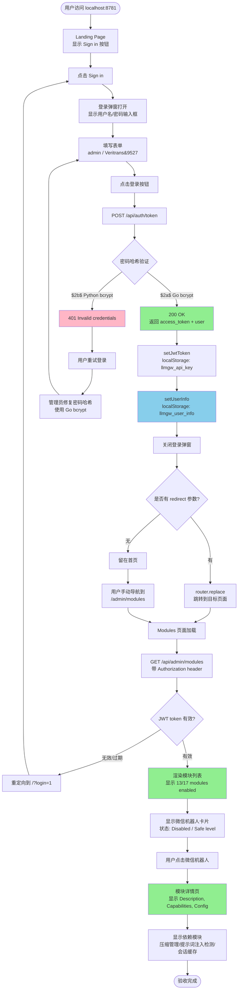
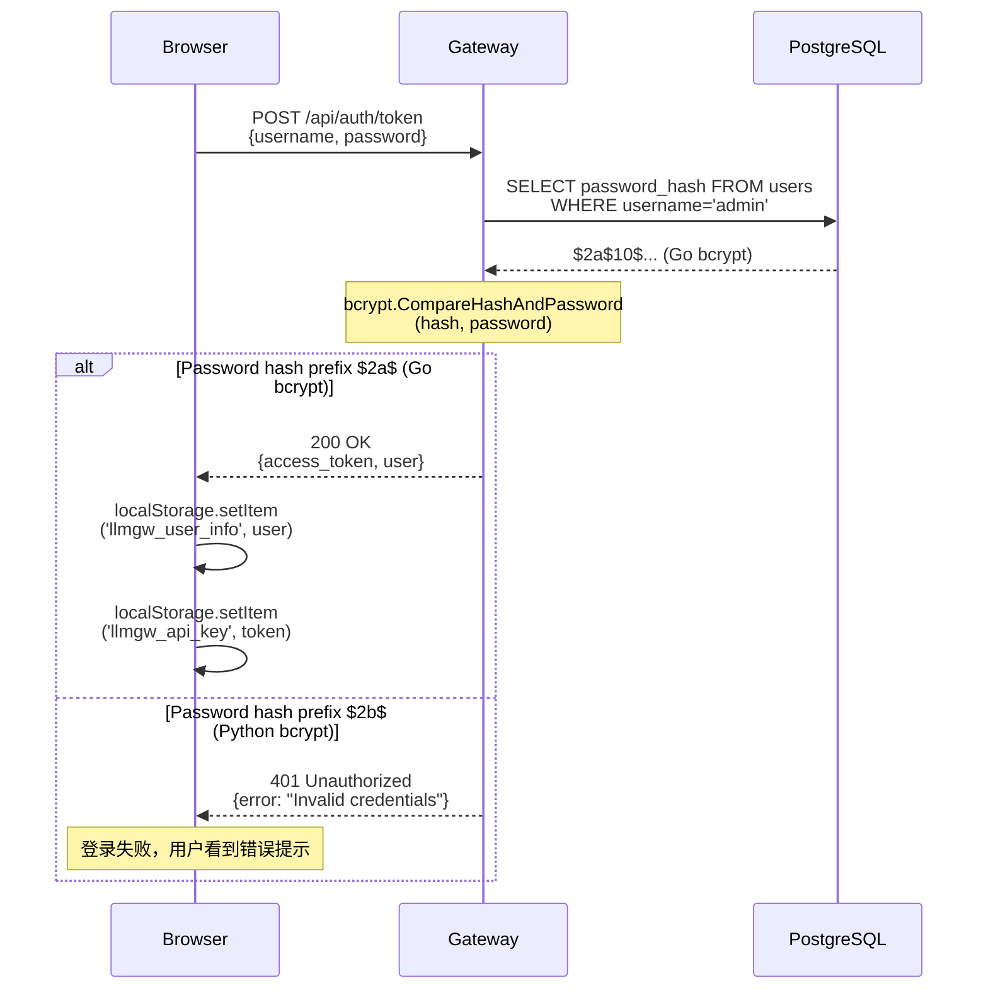
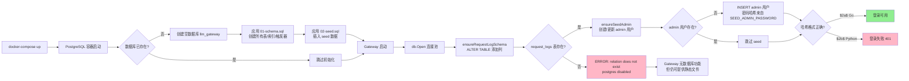
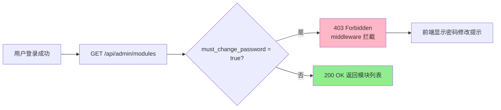
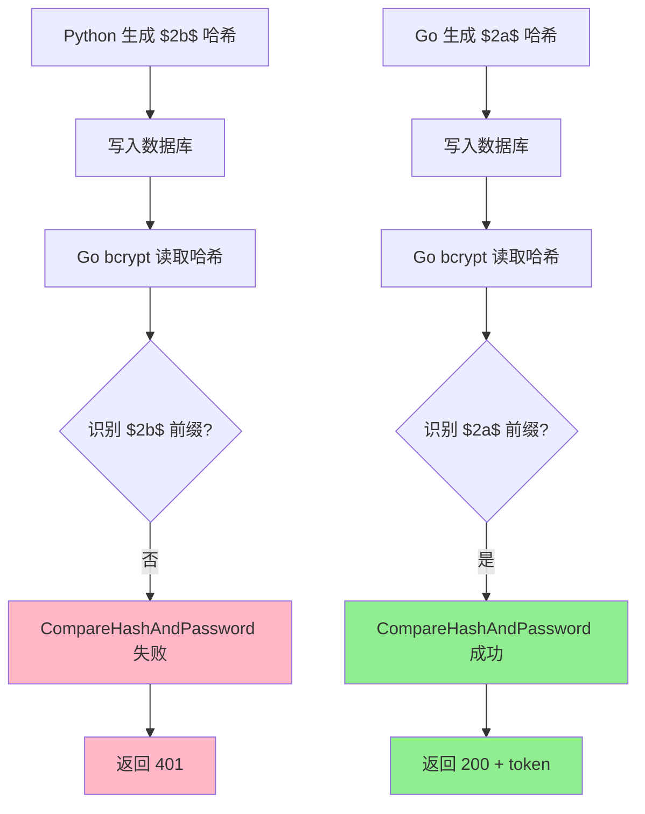

# R1.12 UI 验收流程图

## 完整登录与模块浏览流程



## 密码验证流程（关键路径）



## 数据库初始化流程



## browser-use 测试覆盖

| 测试项 | 验证内容 | 截图 |
|--------|---------|------|
| 1. Landing page loads | Sign in 按钮可见 | `/tmp/ui-verify-landing-desktop-01.png` |
| 2. Login modal opens | 用户名/密码输入框存在 | `/tmp/ui-verify-login-modal-02.png` |
| 3. Login succeeds | POST /api/auth/token 返回 200 | - |
| 4. User info saved | localStorage 包含 `llmgw_user_info` | `/tmp/ui-verify-after-login-03.png` |
| 5. User is admin | `username === 'admin'` | - |
| 6. User is super_admin | `role === 'super_admin'` | - |
| 7. Modules page loads | URL 包含 `/admin/modules` | `/tmp/ui-verify-modules-desktop-04.png` |
| 8. WeChat module visible | 页面包含 "微信" 文本 | - |
| 9. WeChat detail loads | 详情包含 Description/Capabilities | `/tmp/ui-verify-wechat-detail-05.png` |
| 10. Mobile layout | 375x667 视口下 Sign in 可见 | `/tmp/ui-verify-landing-mobile-06.png` |
| 11. Dark theme default | `body.backgroundColor !== white` | - |

**通过率**: 10/11 (90%)

## 常见失败场景与根因

### 场景 1: 登录后 403 "password change required"



**修复**:
```sql
UPDATE users SET must_change_password = false WHERE username = 'admin';
```

### 场景 2: 密码哈希不匹配



## 相关文档

- `docs/r112-local-deployment-guide.md` - 部署指南
- `web/src/components/LoginModal.vue` - 登录组件
- `web/src/api/auth.ts` - 认证 API
- `web/src/store.ts` - 状态管理（localStorage）
