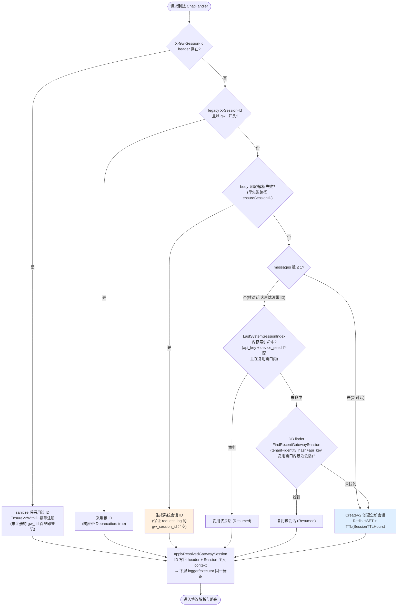
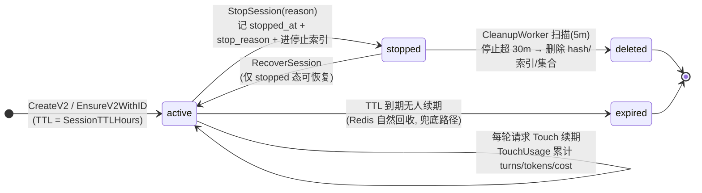
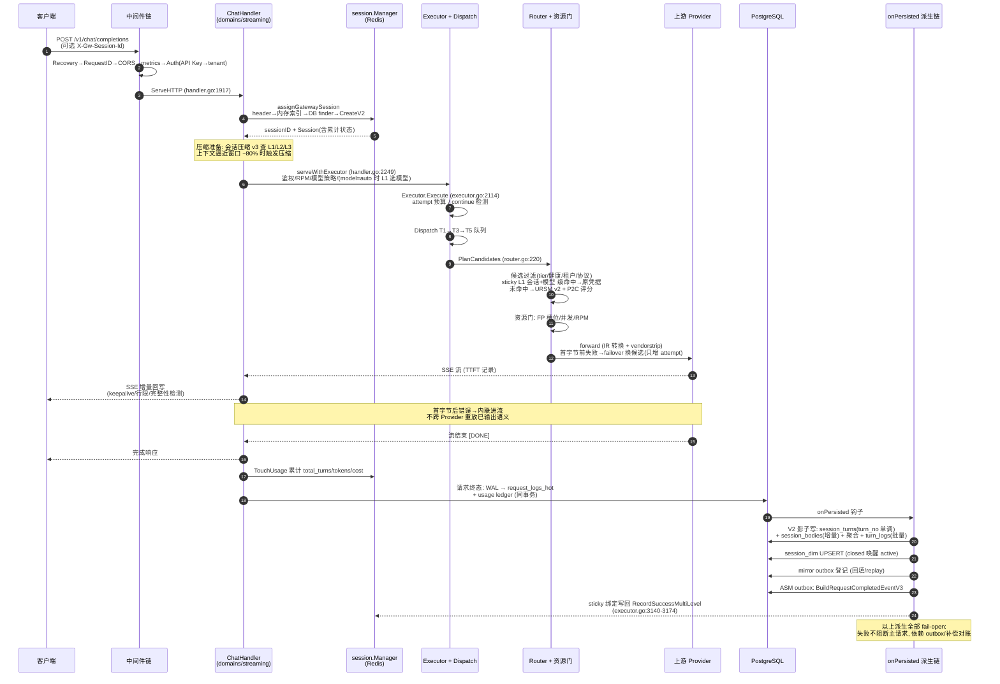
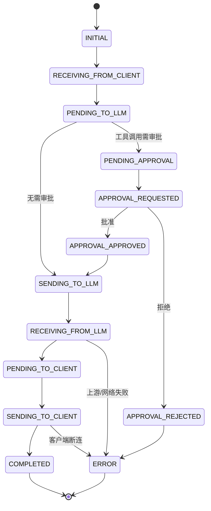
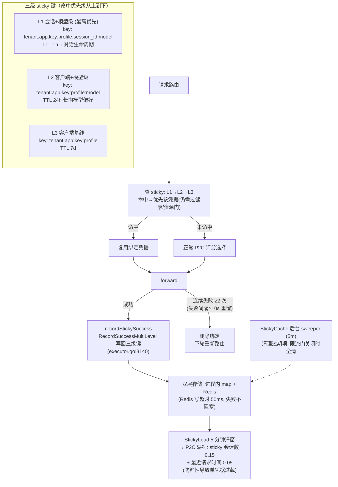
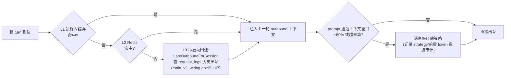
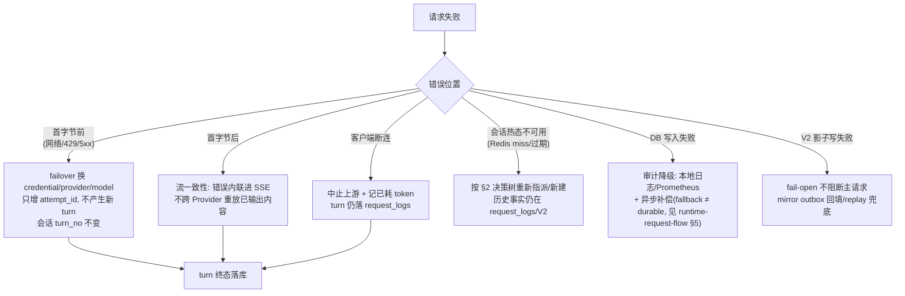

# 会话处理生命周期 — 架构与流程图

> **事实快照**: 2026-10-01 · 基线提交 `3efae99`（main）
> **范围**: 一个会话（session）从首次请求创建，到每轮（turn）处理、落库、粘性绑定、压缩复用，直至热状态回收与数据归档删除的完整生命周期。
> **证据优先级**: 代码 wiring / file:line > 本文档；与 [ARCHITECTURE.md](03-design/01-architecture/architecture/ARCHITECTURE.md) §5（数据、审计和会话）保持一致。
> **姊妹篇**: 系统整体架构图见 [architecture-diagrams.md](architecture-diagrams.md)。

---

## 1. 会话三层模型（总架构图）

网关中的"会话"不是一个单一实体，而是**三层协同**：Redis 里的热状态（运行时真相）、PostgreSQL `request_logs` 里的 canonical 事实（每轮请求记录）、以及处于影子验证阶段的 Sessions V2 表族（目标态的规范化存储）。

```mermaid
graph TB
    subgraph L_RUNTIME["第 1 层 · 运行时热状态（Redis，生存期 = 会话活跃期）"]
        SESSH["session:{gw_uuid} Hash<br/>身份: api_key_id / tenant_id / task_id / devices<br/>状态: status(active|stopped) / stopped_at / stop_reason<br/>累计: total_turns / prompt+completion tokens / cost<br/>当前: current_credential/model/provider + cred 轮换计数<br/>FP 槽位: fp_slot_index / fp_slot_credential_id"]
        SESSKEY["session:key:{key} → id 索引"]
        ACTIVESET["session:apiKey:{id}:active 集合"]
        STOPIDX["session:stopped:{tenant} 集合<br/>(停止索引, CleanupWorker 消费)"]
        SNAP["session_state_snapshots (PG)<br/>DBWriter 批量快照(批10/60s flush)<br/>+ session_credential_rotations"]
        SESSH --- SESSKEY
        SESSH --- ACTIVESET
        SESSH --- STOPIDX
        SESSH -.->|"批量异步持久化"| SNAP
    end

    subgraph L_FACTS["第 2 层 · Canonical 事实（PostgreSQL，长期保留）"]
        RLOG["request_logs(_hot) 月分区<br/>每轮请求: request_id / gw_session_id /<br/>bodies / usage / routing_attempts / 审计<br/>★ 当前会话-消息-正文的权威事实源"]
        CTXATTR["request_context_attrs<br/>project / owner / end_user 上下文"]
        ULEDGER["usage ledger 计费账"]
    end

    subgraph L_V2["第 3 层 · Sessions V2 表族（SHADOW，影子写 fail-open）"]
        SESSV2["gateway.sessions 会话快照(汇总+末轮摘要)"]
        TURNS["session_turns 轮次元数据<br/>(advisory lock 保证 turn_no 单调,幂等)"]
        BODIES["session_bodies 正文增量<br/>(仅存新增, 线性增长 vs V1 全量)"]
        TLOGS["session_turn_logs 环节日志<br/>(24h TTL, 批量单条 INSERT)"]
        SDIM["session_dim 维度投影<br/>(admin 项目→任务→会话层级)"]
        SSUM["session_summaries 摘要+健康分"]
    end

    REQ["每轮请求 turn"] -->|"同步主链读写"| L_RUNTIME
    REQ -->|"请求终态事务写入"| L_FACTS
    L_FACTS -->|"onPersisted 钩子派生<br/>(sessions_v2.enabled && shadow_write)"| L_V2
    L_FACTS -->|"SessionDimWriter UPSERT<br/>(closed 唤醒 active)"| SDIM
    L_FACTS -->|"ASM outbox (V3 事件)"| ASM["ai-session-manager 投影"]
```

关键边界（ARCHITECTURE.md §5.2）：**V1（request_logs）是 canonical，V2 是影子**。V1 主写失败即请求失败；V2 影子写失败不影响主请求（fail-open）。翻主读前必须通过 dual-read 行级对账 7 天零漂移门禁（`dual_read_validator.go`）。

---

## 2. 会话标识与指派（每个请求入口的决策）

会话 ID 统一为 `gw_` + UUID 前缀格式（`generateGwSessionID`，domains/session/session_v2.go:12）。每轮请求按以下决策树解析/创建会话（`domains/streaming/session_assignment.go`）：

补充事实：

- 设备种子 `deviceSeed` 取自 `X-Device-Seed` → `X-Machine-Id` → `"default"`；任务 ID 取自 `X-Gw-Task-Id`（session_assignment.go:125-132）。
- 复用窗口默认 5 分钟（`session.LastSystemSessionTTL`），可用环境变量 `LLM_GATEWAY_SESSION_REUSE_WINDOW` 覆盖（session_assignment.go:202-212）。
- 早失败路径（body 过大/解析失败）走 `ensureSessionID`：不查 DB，直接生成 ID，保证 `request_logs.gw_session_id` 非空；`/v1/messages` 与 `/v1/responses` 用 `applyProvisionalGatewaySessionHeader` 只在 header 未设时补写（session_assignment.go:222-230）。
- 通用 HTTP 中间件 `WithSession`（domains/session/middleware.go:29）：带 `X-Gw-Session-Id` 的请求注入 Session 到 context 并**异步 Touch 续期**；legacy `X-Session-Id` 查不到时兜底 CreateV2 并返回 `X-Gw-Session-Id-Resume` 提示迁移。

---

## 3. 会话运行时状态机（Redis status 字段）

会话在 Redis 中的显式状态只有 `active` / `stopped` 两态（首次写入时 Lua 脚本补 `active`，session_state.go:129-131），加上隐式的"不存在/已过期"：

| 迁移 | 触发点 | 证据 |
|---|---|---|
| 创建 | `CreateV2` / `EnsureV2WithID`（pipeline HSET + Expire + 索引） | domains/session/session_v2.go:18,97 |
| 续期 | 中间件异步 `Touch`；`TouchUsage` 累计用量 | domains/session/middleware.go:56, session_state.go:107 |
| 停止 | `StopSession`（status=stopped + `session:stopped:{tenant}` 索引, TTL 24h） | domains/session/session_state.go:388-435 |
| 恢复 | `RecoverSession`（校验 stopped → active） | domains/session/session_state.go:487 |
| 删除 | `CleanupWorker`（stoppedTTL 30m，扫描 5m） | domains/session/session_cleanup.go + cmd/gateway/session_state_init.go:70-74 |
| 过期 | hash TTL（装配 `cfg.SessionTTLHours`，main.go:934-936） | cmd/gateway/main.go:934 |

> ⚠️ `bg/session_lifecycle_worker.go`（session_dim 闲置软关闭/驱逐）经 R35 审计标注 **UNUSED（零生产调用方）**，不在活跃路径上；session_dim 的 `closed` 状态目前主要由数据侧/运维路径写入，新请求到达时 UPSERT 会把 `closed` 唤醒为 `active`（internal/sessionv2mirror/session_dim.go:43-55）。

---

## 4. 单轮（turn）端到端时序图

一个 turn = 会话内一次客户端请求的完整处理。以流式 chat 请求为例（v1 主路径）：

关联键不变量（runtime-request-flow.md §3）：`request_id`（一次客户端请求）→ `attempt_id`（每次上游尝试，failover 只增 attempt）→ `turn_id/turn_no`（会话语义顺序，failover 不产生新 turn）→ `charge_id`（计费幂等）→ `body_ref`（原始/出站/响应正文引用）。

---

## 5. 会话内请求处理状态机（turn 内微观状态）

`domains/session/state_machine.go` 定义了单个请求在会话语境中的处理阶段（内存态，带回调钩子，支持审批挂起与恢复 `approval_resume.go`）：

每次 `Transition` 记录 from/to/timestamp/reason 进转换历史并触发注册回调；回调返回 error 会中断请求处理（state_machine.go:73-99）。

---

## 6. 粘性会话绑定（会话 → 凭据的三级粘性）

粘性让同一会话尽量复用同一上游凭据（对账/风控/缓存友好），同时避免跨会话、跨模型污染（`domains/streaming/executors/sticky.go`）：

会话侧还有**凭据轮换记录**：`StartCredRotation/EndCredRotation` 把粘性换绑写入 Redis 轮换队列并由 DBWriter 批量落 `session_credential_rotations`（session_state.go:215-330, session_db_writer.go:221）。

---

## 7. 会话上下文压缩（v3 三层缓存）

长会话的上一轮出站上下文（outbound）通过三层缓存复用，避免每轮重发全量历史；当解析后的 prompt 逼近目标模型实际上下文窗口（~80%）或超过网关预算时，触发消息级压缩（`domains/streaming/executors/compression_strategy.go`，网关级 `gateway.max_prompt_tokens` 热更 ~5s）：

---

## 8. 会话数据生命周期（终结与归档全景）

会话"结束"不是一个动作，而是各存储层按各自保留策略分步收敛：

```mermaid
graph TB
    subgraph HOT["Redis 热状态（天级）"]
        RS["session:{id}"]
        RS -->|"StopSession → stopped"| RST["stopped 态"]
        RST -->|"30m 后 CleanupWorker 删除<br/>(或 TTL 到期自然回收)"| RGONE["热状态终结"]
        RS -->|"活跃期间每轮 Touch 续期"| RS
    end

    subgraph SNAPX["PG 快照（跟随热状态）"]
        SNAP2["session_state_snapshots<br/>(DBWriter 批量 UPSERT)"]
        SNAP2 -->|"随生命周期治理清理"| SNAPGONE["删除/保留策略"]
    end

    subgraph FACT["PG canonical 事实（月级）"]
        RL["request_logs 月分区<br/>(全字段, 764: tenant+ts 索引)"]
        RL -->|"分区超出保留期<br/>754 archive_request_logs_default"| ARC["request_logs_archive_YYYY_MM<br/>仅摘要字段(~5% 体积)<br/>大 JSONB 18 列丢弃"]
        BOD["request_logs_bodies 分区"] -->|"drop_old_<br/>request_logs_bodies_partitions"| BODGONE["整分区 DROP"]
    end

    subgraph V2L["PG V2 影子族（小时~天级）"]
        TL["session_turn_logs"] -->|"expires_at 写入时烙定<br/>partition_manager 1h tick<br/>cleanup_session_turn_logs_by_ttl<br/>(默认 24h, 753/755)"| TLGONE["TTL 删除"]
        SS["session_summaries"] -->|"30 天不活跃<br/>sessionarchive 标 archived_at"| SSA["已归档态"]
        SSA -->|"trimmer 24h 周期<br/>lifecycle.session_summaries_ttl_days<br/>(默认 90d)"| SSGONE["DELETE (批 5000×20)"]
    end

    subgraph PROJ["维度投影"]
        DIM["session_dim"] -->|"新请求 UPSERT<br/>closed→active 唤醒"| DIM
        DIM -->|"闲置会话由数据侧标记 closed"| DIMC["status=closed"]
    end

    ASMH["ASM (ai-session-manager)<br/>经 outbox 消费事件做长期投影/审计"] -.->|"BuildRequestCompletedEventV3"| FACT
```

**周期速查表**：

| 数据 | 保留/触发 | 清理方 | 证据 |
|---|---|---|---|
| Redis `session:{id}`（active） | `SessionTTLHours` 小时 TTL，每轮续期 | Redis 过期 | cmd/gateway/main.go:934 |
| Redis `session:{id}`（stopped） | 停止后 30 分钟 | `session.CleanupWorker`（5m 扫描） | domains/session/session_cleanup.go |
| `session_turn_logs` | 默认 24h（`lifecycle.session_turn_logs_ttl_hours` 热更） | partition_manager 1h tick | bg/partition_manager.go:669-784, 迁移 753 |
| `session_summaries` | 30d 不活跃标 `archived_at`，归档后默认 90d 删除 | `session_summaries_trimmer`（24h） | bg/session_summaries_trimmer.go, 迁移 471/690 |
| `request_logs` 月分区 | 保留期外归档（7–365 天可配） | `archive_request_logs_default`（754） | sql/migrations/startup/754 |
| `request_logs_bodies` 分区 | 保留期整分区 DROP | partition_manager:1099 | bg/partition_manager.go |
| 会话健康分 | 每小时为 1h 无新请求且无分的会话计算 | `session_health_worker` | bg/session_health_worker.go |

---

## 9. 错误与重试对会话的影响（要点）

细粒度异常分支（panic/限流/资源门/心跳/全局超时/graceful shutdown）见 [REQUEST_FLOW_WITH_EXCEPTIONS.md](REQUEST_FLOW_WITH_EXCEPTIONS.md)。

---

## 10. 端到端总览（从第一个请求到数据消亡）

1. 客户端首请求无会话 ID（或带新 `X-Gw-Session-Id`）→ `assignGatewaySession` 走 CreateV2/Ensure → Redis `session:{gw_uuid}` 诞生（TTL 起）。
2. 请求经协议归一 → 路由（sticky 首次未命中，P2C 选凭据）→ 资源门 → 上游 → SSE 回写。
3. turn 终态：`request_logs_hot` + usage ledger 事务落库（canonical 事实诞生）。
4. onPersisted 派生：V2 影子写（turns/bodies/aggregate/logs）→ `session_dim` UPSERT（会话维度行诞生）→ mirror outbox → ASM outbox。
5. sticky 三级绑定写回；下一轮请求优先命中 L1（同会话同模型 → 同凭据）。
6. 后续每轮：Touch 续期 + 用量累计；压缩 v3 复用上一轮 outbound；turn_no 单调递增。
7. 会话闲置：无人续期 → TTL 到期 Redis 回收；或显式 StopSession → 30 分钟后 CleanupWorker 删除热状态。
8. 数据侧随时间收敛：turn_logs 24h 删除 → summaries 30d 归档/90d 删除 → request_logs 月分区归档为摘要表（754）→ bodies 分区 DROP；ASM 持有长期事件投影。

---

## 附录 A：关键代码锚点

| 环节 | 锚点 |
|---|---|
| 会话 ID 生成/注册 | `domains/session/session_v2.go:12,18,97` |
| 请求级会话指派决策 | `domains/streaming/session_assignment.go:47,71,101` |
| 复用窗口 | `domains/streaming/session_assignment.go:202`（`LLM_GATEWAY_SESSION_REUSE_WINDOW`） |
| 通用会话中间件 | `domains/session/middleware.go:29` |
| Redis 状态机（stop/recover） | `domains/session/session_state.go:107,388,487` |
| 用量累计/凭据轮换 | `domains/session/session_state.go:107,215` |
| 快照批量落库 | `domains/session/session_db_writer.go:221,281` + `cmd/gateway/session_state_init.go:61` |
| stopped 清理 worker | `domains/session/session_cleanup.go` + `cmd/gateway/session_state_init.go:70` |
| Manager 装配/TTL | `cmd/gateway/main.go:934-936` |
| V2 影子写接线（flag 门控） | `cmd/gateway/session_v2_init.go`（`sessions_v2.enabled && shadow_write` 热更） |
| V2 表 schema | `sql/migrations/startup/430_sessions_v2_schema.sql` |
| turn_logs 批写/TTL | `domains/session/v2/turn_logs_writer.go:76-95` |
| session_dim UPSERT | `internal/sessionv2mirror/session_dim.go:73,106` |
| sticky 三级缓存 | `domains/streaming/executors/sticky.go:44-86,89` |
| sticky 写回 | `domains/streaming/executors/executor.go:3140-3174` |
| 压缩 v3 装配 | `cmd/gateway/main_v3_wiring.go` |
| turn_logs TTL 清理 | `bg/partition_manager.go:669-784`（迁移 753/755） |
| summaries 归档/裁剪 | `bg/session_summaries_trimmer.go` + `domains/sessionarchive` |
| request_logs 归档 | `sql/migrations/startup/754_archive_request_logs_default.sql` |
| 会话健康分 | `bg/session_health_worker.go` |
| ⚠️ 未接线 | `bg/session_lifecycle_worker.go`（R35 登记 UNUSED，勿当活跃路径） |

## 附录 B：会话相关配置项

| 配置 | 默认 | 作用 |
|---|---|---|
| `cfg.SessionTTLHours` | 装配配置 | Redis 会话 hash TTL（main.go:934） |
| `LLM_GATEWAY_SESSION_REUSE_WINDOW` | 5m | 无 ID 请求的会话复用窗口 |
| `sessions_v2.enabled` + `sessions_v2.shadow_write` | off/off（热更） | V2 影子写总门 |
| `sessions_v2.mirror_outbox` / `mirror_outbox_replay` | on/on（热更） | V2 镜像回填登记/排放 |
| `lifecycle.session_turn_logs_ttl_hours` | 24 | turn_logs 保留时长（写入时烙进 expires_at） |
| `lifecycle.session_summaries_ttl_days` | 90 | 已归档 summaries 保留 |
| `gateway.max_prompt_tokens` | 热更 ~5s | 网关级 prompt 预算（压缩触发） |
| `LLM_GATEWAY_ROUTING_W_COST` | 开（0.15） | P2C 成本惩罚开关/权重 |

## 附录 C：会话读取面（谁在消费会话数据）

| 消费方 | 路径 | 数据源 |
|---|---|---|
| Admin 会话层级页 | `/api/admin/turns/sessions`（项目→任务→会话分组） | `session_dim` + `session_turns` |
| Admin 轮次明细 | `admin/session_turns_v2.go` | V2 表族（dual-read 校验中） |
| 仪表盘会话统计 | `admin/dashboard_session_stats.go`、`dashboardapi/session_overview.go` | `session_dim`/汇总 |
| 会话健康/摘要 | `session_summaries`（health_score 由 worker 计算） | PG |
| ASM 投影/审计 | outbox 事件消费 | `BuildRequestCompletedEventV3` |
| 路由 sticky | 三级键读取 | Redis + 进程内 map |

---

**文档版本**: v1.0（2026-10-01）
**维护**: 与 [ARCHITECTURE.md](03-design/01-architecture/architecture/ARCHITECTURE.md) §5 同步；状态/字段漂移以 `domains/session`、`domains/streaming/session_assignment.go` 与 `sql/migrations/startup` 为准。
