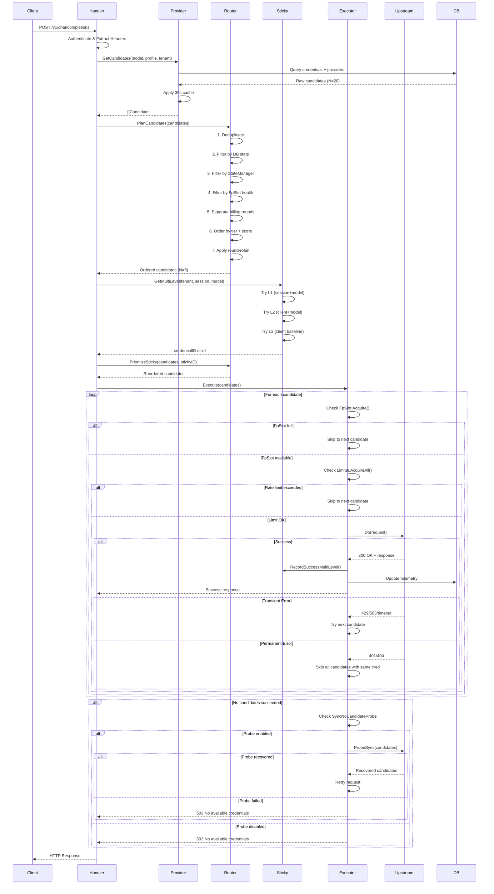

# LLM Gateway 路由系统架构与流程图

**日期**: 2026-07-18  
**关联文档**: 
- `2026-07-18-routing-diagnosis.md`
- `2026-07-18-routing-layered-testing.md`

---

## 1. 系统架构总览

```
┌─────────────────────────────────────────────────────────────────┐
│                        LLM Gateway 路由系统                       │
└─────────────────────────────────────────────────────────────────┘

    ┌──────────────┐
    │  HTTP Client │
    └──────┬───────┘
           │ Request
           ▼
    ┌──────────────────────────────────────┐
    │  Handler Layer                       │
    │  ┌────────────────────────────────┐ │
    │  │ • Authentication                │ │
    │  │ • Rate Limiting                 │ │
    │  │ • Session Management            │ │
    │  └────────────────────────────────┘ │
    └──────────────┬───────────────────────┘
                   │
                   ▼
    ┌──────────────────────────────────────┐
    │  Candidate Discovery                 │
    │  ┌────────────────────────────────┐ │
    │  │ Provider.GetCandidates()       │ │
    │  │ • Query DB (models_canonical)  │ │
    │  │ • Cache Lookup (30s TTL)       │ │
    │  │ • Returns ALL candidates       │ │
    │  └────────────────────────────────┘ │
    └──────────────┬───────────────────────┘
                   │
                   ▼
    ┌──────────────────────────────────────┐
    │  Router.PlanCandidates               │
    │  ┌────────────────────────────────┐ │
    │  │ 1. Deduplication               │ │
    │  │ 2. Availability Filtering      │ │
    │  │ 3. Health Filtering            │ │
    │  │ 4. Billing Round Separation    │ │
    │  │ 5. Tier-based Ordering         │ │
    │  │ 6. Load Balancing (Bandit/P2C) │ │
    │  │ 7. Round-Robin Rotation        │ │
    │  └────────────────────────────────┘ │
    └──────────────┬───────────────────────┘
                   │
                   ▼
    ┌──────────────────────────────────────┐
    │  Sticky Routing (3-Level)            │
    │  ┌────────────────────────────────┐ │
    │  │ L1: session+model (5-30min)    │ │
    │  │ L2: client+model (30min)       │ │
    │  │ L3: client baseline (2h)       │ │
    │  └────────────────────────────────┘ │
    └──────────────┬───────────────────────┘
                   │
                   ▼
    ┌──────────────────────────────────────┐
    │  Executor.Execute                    │
    │  ┌────────────────────────────────┐ │
    │  │ For each candidate:            │ │
    │  │   • FpSlot.Acquire()           │ │
    │  │   • Limiter.AcquireAll()       │ │
    │  │   • Upstream.Do()              │ │
    │  │   • Error Classification       │ │
    │  │   • Retry or Return            │ │
    │  └────────────────────────────────┘ │
    └──────────────┬───────────────────────┘
                   │
                   ▼
    ┌──────────────────────────────────────┐
    │  Response / Error Handling           │
    │  ┌────────────────────────────────┐ │
    │  │ • Record Sticky (on success)   │ │
    │  │ • Update State (on failure)    │ │
    │  │ • Emit Telemetry               │ │
    │  │ • Return to Client             │ │
    │  └────────────────────────────────┘ │
    └──────────────────────────────────────┘
```

---

## 2. 详细请求流程图



---

## 3. 候选过滤流程 (Router.PlanCandidates)

```
Input: 20 candidates from Provider.GetCandidates()

┌─────────────────────────────────────────────────────────┐
│ Step 1: Deduplication                                   │
│ • Remove duplicate (provider_id, credential_id, model)  │
│ • Keep first occurrence                                 │
│ Output: 18 candidates                                   │
└─────────────────────────────────────────────────────────┘
                            ▼
┌─────────────────────────────────────────────────────────┐
│ Step 2: DB State Filtering (filterAvailable)           │
│ • Filter by: UnavailableReason()                       │
│   - routing_blocked                                     │
│   - lifecycle:disabled                                  │
│   - availability:cooling                                │
│   - quota:balance_exhausted                             │
│ Output: 15 candidates                                   │
└─────────────────────────────────────────────────────────┘
                            ▼
┌─────────────────────────────────────────────────────────┐
│ Step 3: StateManager Filtering (if enabled)            │
│ • Check in-memory transient state                      │
│   - state:timeout (5min cooling)                        │
│   - state:rate_limit (10min cooling)                    │
│   - state:empty_response (5min cooling)                 │
│ Output: 10 candidates                                   │
└─────────────────────────────────────────────────────────┘
                            ▼
┌─────────────────────────────────────────────────────────┐
│ Step 4: FpSlot Health Filtering (if enabled)           │
│ • Query credentialfpslot.NodeState                     │
│ • Filter by:                                            │
│   - disabled=true                                       │
│   - consecutive_failures > 3                            │
│ • Fail-open: If ALL filtered, return original          │
│ Output: 8 candidates                                    │
└─────────────────────────────────────────────────────────┘
                            ▼
┌─────────────────────────────────────────────────────────┐
│ Step 5: Billing Round Separation                       │
│ • Round 1: token_plan, code_plan, agent_plan, free     │
│ • Round 2: per_token                                    │
│ Split: R1=5 candidates, R2=3 candidates                │
└─────────────────────────────────────────────────────────┘
                            ▼
┌─────────────────────────────────────────────────────────┐
│ Step 6: Tier-based Ordering (per round)                │
│ • Group by tier: [1, 2, 3, 9]                          │
│ • Within tier:                                          │
│   - If Bandit: score by Thompson Sampling              │
│   - If P2C: score by load (concurrency + latency)      │
│ Round 1 Ordered: [C1, C2, C3, C4, C5]                  │
│ Round 2 Ordered: [C6, C7, C8]                          │
└─────────────────────────────────────────────────────────┘
                            ▼
┌─────────────────────────────────────────────────────────┐
│ Step 7: Round-Robin Rotation (per tier)                │
│ • counter = rrCounter.Add(1) - 1                       │
│ • offset = counter % len(tier)                         │
│ • Rotate tier by offset                                │
│ Output: [C2, C3, C4, C5, C1, C6, C7, C8]               │
└─────────────────────────────────────────────────────────┘
                            ▼
┌─────────────────────────────────────────────────────────┐
│ Step 8: Sticky Prioritization (if sticky hit)          │
│ • Move sticky credential to front                      │
│ • Preserve relative order                              │
│ Final Output: [C_sticky, C2, C3, C4, ...]              │
└─────────────────────────────────────────────────────────┘
```

---

## 4. Sticky Session 三层级架构

```
┌─────────────────────────────────────────────────────────┐
│                  Sticky Lookup Flow                     │
└─────────────────────────────────────────────────────────┘

Request: {tenant: T1, session: S1, model: gpt-4, profile: default}

    ┌───────────────────────────────────────┐
    │ L1: Session + Model Sticky            │
    │ Key: T1:app:key:default:S1:gpt-4      │
    │ TTL: 5-30 min (模型类型决定)           │
    │ Scope: 会话内对话连续性                │
    └───────────────┬───────────────────────┘
                    │
                    ▼ (if not found)
    ┌───────────────────────────────────────┐
    │ L2: Client + Model Sticky             │
    │ Key: T1:app:key:default:gpt-4         │
    │ TTL: 30 min (建议值)                   │
    │ Scope: 跨会话模型偏好                  │
    └───────────────┬───────────────────────┘
                    │
                    ▼ (if not found)
    ┌───────────────────────────────────────┐
    │ L3: Client Baseline Sticky            │
    │ Key: T1:app:key:default               │
    │ TTL: 2 hours (建议值)                  │
    │ Scope: 客户端基线偏好                  │
    └───────────────┬───────────────────────┘
                    │
                    ▼ (if not found)
    ┌───────────────────────────────────────┐
    │ Sticky Miss                           │
    │ → Use Router-planned order            │
    └───────────────────────────────────────┘


┌─────────────────────────────────────────────────────────┐
│              Sticky Lifecycle                           │
└─────────────────────────────────────────────────────────┘

Success:
    Request → Credential C123 → 200 OK
    ↓
    RecordSuccessMultiLevel()
    ├─ L1: write with TTL_chat (5min)
    ├─ L2: write with TTL=30min
    └─ L3: write with TTL=2h

Failure:
    Request → Credential C123 → 401/timeout
    ↓
    RecordFailureMultiLevel()
    ├─ failures[L1]++
    ├─ failures[L2]++
    └─ failures[L3]++
    ↓
    If failures >= threshold (2 within 10s):
        Delete all 3 levels
```

---

## 5. 错误分类与重试决策树

```
Upstream Response
    │
    ├─ 2xx Success
    │   └─→ Return to client
    │
    ├─ 401 Unauthorized
    │   ├─ error.code == "rate_limit_exceeded"
    │   │   └─→ KindRateLimit (Transient) → Try next candidate
    │   └─ else
    │       └─→ KindAuth (Permanent) → Skip all with same cred
    │
    ├─ 404 Not Found
    │   └─→ KindModelNotFound (Permanent) → Skip all
    │
    ├─ 429 Rate Limited
    │   └─→ KindRateLimit (Transient) → Try next candidate
    │
    ├─ 500 Internal Error
    │   ├─ error.code == "model_overload"
    │   │   └─→ KindTransientOverload → Try next candidate
    │   └─ else
    │       └─→ KindUpstreamError (Permanent) → Skip all
    │
    ├─ 503 Service Unavailable
    │   └─→ KindUpstreamDown (Transient) → Try next candidate
    │
    ├─ Timeout
    │   └─→ KindTimeout (Transient) → Try next candidate
    │
    └─ 200 + Empty Stream
        └─→ KindEmptyResponse (Transient) → Try next candidate
```

---

## 6. 并发控制与限流架构

```
┌─────────────────────────────────────────────────────────┐
│            Concurrency & Rate Limiting                  │
└─────────────────────────────────────────────────────────┘

Request
    │
    ├─ Layer 1: Global Identity Pool (可选)
    │   └─ identityPool.Acquire(fpString)
    │      • LRU-recycle when saturated
    │      • Scope: tenant-wide
    │
    ├─ Layer 2: FpSlot Pre-Filter
    │   └─ fpSlots.RoutingEligibleForTenant()
    │      • Check: used_slots < limit
    │      • Degraded: If all filtered, use original set
    │
    ├─ Layer 3: FpSlot Acquisition (per-candidate)
    │   └─ fpSlots.Acquire(credentialID, holder, tenant)
    │      • Atomic increment
    │      • Fail: Skip to next candidate
    │
    └─ Layer 4: Limiter (per-candidate)
        └─ limiter.AcquireAll(providerID, credID, keyID, rpm)
           ├─ Check 1: Per-credential concurrency
           ├─ Check 2: Per-key concurrency
           ├─ Check 3: Per-credential RPM
           └─ All pass → Proceed to upstream

Release on completion:
    limiter.ReleaseAll()
    fpSlots.Release()
    identityPool.Release() (if used)
```

---

## 7. 无候选场景处理流程

```
Router.PlanCandidates() returns 0 candidates

    ↓
┌─────────────────────────────────────────────────────────┐
│ Step 1: Log Failure Reasons                             │
│ • Iterate all original candidates                       │
│ • Count reasons: cooling=5, disabled=2, quota=1         │
│ • Emit log: "all candidates unavailable"               │
└─────────────────────────────────────────────────────────┘
    ↓
┌─────────────────────────────────────────────────────────┐
│ Step 2: Trigger StateObserver                           │
│ • stateObserver.OnNoCandidates(signal)                 │
│ • Signal includes: model, tenant, reasons               │
│ • StateObserver fans out probe tasks                   │
└─────────────────────────────────────────────────────────┘
    ↓
┌─────────────────────────────────────────────────────────┐
│ Step 3: Check SyncNoCandidateProbe                     │
│ • If disabled → Skip to Step 5                         │
│ • If enabled → Continue to Step 4                      │
└─────────────────────────────────────────────────────────┘
    ↓
┌─────────────────────────────────────────────────────────┐
│ Step 4: Synchronous Probe Hold                         │
│ • Pause client request (max 5s)                        │
│ • Pause pre-stream keepalive (if streaming)            │
│ • Call ProbeSync(candidates, tenant, requestID)        │
│   - Parallel probe all candidates                      │
│   - Direct upstream test                               │
│   - Gateway routing test                               │
│ • If recovered:                                         │
│   - Re-plan candidates                                 │
│   - Retry request transparently                        │
│ • If not recovered:                                     │
│   - Continue to Step 5                                 │
└─────────────────────────────────────────────────────────┘
    ↓
┌─────────────────────────────────────────────────────────┐
│ Step 5: Return 503 Service Unavailable                 │
│ • Error message: "no available credentials"            │
│ • Include reason breakdown in logs                     │
│ • Emit telemetry: error_kind=no_candidates             │
└─────────────────────────────────────────────────────────┘
```

---

## 8. 状态同步与一致性

```
┌─────────────────────────────────────────────────────────┐
│                  State Sources                          │
└─────────────────────────────────────────────────────────┘

┌──────────────────┐
│ DB (PostgreSQL)  │  ← Persistent state (credentials, providers)
│ • availability   │     Update latency: immediate
│ • lifecycle      │     Read latency: 30s cache
│ • quota_state    │
└──────┬───────────┘
       │
       ├─ Cache (30s TTL) ← Provider.GetCandidates()
       │
       ▼
┌──────────────────┐
│ StateManager     │  ← Transient failure tracking (memory)
│ • timeout        │     Update: real-time (ms)
│ • rate_limit     │     Read: real-time
│ • empty_response │     Cooling periods: 5-10 min
└──────┬───────────┘
       │
       ▼
┌──────────────────┐
│ StickyCache      │  ← Session binding (memory + Redis)
│ • L1: 5-30min    │     Write: sync to memory, async to Redis
│ • L2: 30min      │     Read: memory only
│ • L3: 2h         │     TTL: per-level
└──────┬───────────┘
       │
       ▼
┌──────────────────┐
│ FpSlots          │  ← Slot occupancy (memory)
│ • used_count     │     Update: real-time (atomic)
│ • health_state   │     Read: real-time
└──────────────────┘


Consistency Challenge:
    T=0: DB state = available, Cache = available
    T=1: Probe detects failure → StateManager = cooling
    T=2: Request reads Cache (stale) → sees "available"
    T=3: StateManager filters out → candidate skipped ✓
    T=30: Cache expires → next read sees updated state

Solution: Lower cache TTL (30s → 5s) or event-driven invalidation
```

---

## 9. 降级模式触发流程

```
┌─────────────────────────────────────────────────────────┐
│           Degraded Mode Activation                      │
└─────────────────────────────────────────────────────────┘

Scenario 1: Single Candidate + FpSlot Saturation
    ├─ Total candidates: 1 (C1)
    ├─ C1.FpSlotLimit = 10
    ├─ C1 current usage = 10/10
    │
    ├─ Normal Mode:
    │   └─ fpSlots.RoutingEligibleForTenant() → false
    │      └─ Filtered out → 0 candidates → 503 ❌
    │
    └─ Degraded Mode:
        └─ Detect: len(filtered)==0 && len(original)==1-2
           └─ Bypass FpSlot check
              └─ Allow request → 200 ✓

Scenario 2: All Candidates Transiently Unavailable
    ├─ Candidates: C1, C2, C3
    ├─ C1: state=cooling (4m55s ago)
    ├─ C2: state=cooling (4m50s ago)
    ├─ C3: state=cooling (4m45s ago)
    │
    ├─ Normal Mode:
    │   └─ All filtered by StateManager → 0 candidates → 503 ❌
    │
    └─ Smart Degraded Mode (建议实现):
        └─ Sort by "time until recovery"
           └─ Try C3 (5s until recovery) → Likely success ✓
```

---

## 10. 性能热点与优化

```
┌─────────────────────────────────────────────────────────┐
│              Performance Bottlenecks                    │
└─────────────────────────────────────────────────────────┘

Bottleneck 1: Provider.GetCandidates - DB Query
    • Latency: 5-50ms (depends on DB load)
    • Frequency: Every request (with 30s cache)
    • Optimization:
      ├─ Lower cache TTL → More cache hits
      ├─ Add L2 cache (Redis, 5min)
      └─ Query optimization (add indexes)

Bottleneck 2: Router.PlanCandidates - Filtering
    • Latency: 1-10ms (depends on candidate count)
    • Complexity: O(N × M) (N=candidates, M=filters)
    • Optimization:
      ├─ Early termination (keep top K after each filter)
      ├─ Parallel filtering (goroutines)
      └─ Filter order (most selective first)

Bottleneck 3: Sticky Lookup - Multi-level
    • Latency: <1ms (memory only)
    • Complexity: O(1) × 3 lookups
    • Already optimized

Bottleneck 4: Executor Loop - Serial attempts
    • Latency: 2-5s per attempt (network + upstream)
    • Frequency: N attempts (worst case)
    • Optimization:
      ├─ Adaptive timeout (reduce on retry)
      ├─ Speculative execution (parallel first 2)
      └─ Circuit breaker (skip known-bad fast)

Bottleneck 5: State Synchronization - Cache invalidation
    • Latency: 0-30s (cache staleness)
    • Impact: Stale candidates considered available
    • Optimization:
      ├─ Event-driven invalidation (pub/sub)
      ├─ Versioned cache (compare-and-swap)
      └─ Lower TTL (30s → 5s)
```

---

## 总结

通过这些架构图和流程图，我们可以看到：

1. **复杂度来源**: 5 层过滤 × 3 层 sticky × 4 层限流 = 60 个决策点
2. **关键瓶颈**: 缓存一致性、串行尝试、状态同步延迟
3. **优化方向**: 降低 cache TTL、并行探测、渐进式过滤、事件驱动失效

下一步: 基于这些图表，开始实施分层测试和根因修复。
