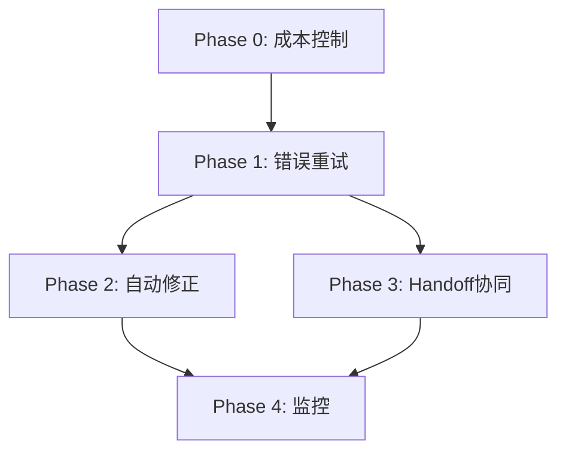

# Goal模式会话持续机制方案审计报告

> **审计日期**: 2026-07-19
> **审计对象**: `16-Goal模式会话持续机制设计方案.md`
> **审计标准**: 架构合理性、可实施性、风险控制、成本效益

---

## 1. 执行摘要

### 1.1 总体评价

**评级**: ⭐⭐⭐⭐ (4/5) - **可实施，需局部调整**

**核心结论**：
- ✅ 需求分析准确，现有架构梳理完整
- ✅ 方案A（网关层重试）设计合理，推荐采纳
- ✅ 利用现有Goal/Handoff模块，避免重复造轮。
- ⚠️ 同步阻塞方案需增加超时保护
- ⚠️ 成本控制机制需前置到设计阶段
- ❌ 缺少前端协议约定（重试期间client行为）

### 1.2 关键风险

| 风险等级 | 风险项 | 影响 | 缓解措施 |
|---------|--------|------|---------|
| 🔴 HIGH | 同步阻塞导致连接超时 | 前端超时断开，重试失败 | 增加总超时<client超时，提前返回 |
| 🟡 MEDIUM | 成本爆炸未充分量化 | 运营成本失控 | 增加tenant级月度token限额 |
| 🟡 MEDIUM | 重试与autoroute策略冲突 | 重试时routing可能选同一失败节点 | 增加"失败节点黑名单"传递 |
| 🟢 LOW | 循环死锁 | 理论存在，实际概率低 | 现有三层限制已足够 |

---

## 2. 架构审计

### 2.1 现有模块复用分析 ✅

**审计结论**：复用策略合理，避免重复造轮。

**已复用能力**：
- ✅ Goal.CompletionDetector - 任务完成检测（4种策略）
- ✅ Goal.ModeHook - 自动继续注入（原子计数，并发安全）
- ✅ Goal.LoopDetector - 循环检测与模型切换
- ✅ Goal.AuditHook - 自动审计
- ✅ Handoff.TriggerHook - 上下文切换
- ✅ streaming.injectFollowUpRequest - follow-up引擎

**新增能力**：
- ➕ 网关层错误重试（新增）
- ➕ 审计自动修正（增强）

**优点**：
- 代码复用率高，改动集中
- 与现有拦截器链无缝集成
- 配置体系统一（settings.Global）

**建议**：
- ✅ 保持现有复用策略
- ⚠️ 增加模块间通信协议文档（goal ↔ handoff状态传递）

### 2.2 方案对比分析 ✅

**方案A vs 方案B**：

| 维度 | 方案A评分 | 方案B评分 | 审计意见 |
|------|----------|----------|---------|
| 实现复杂度 | ⭐⭐⭐⭐⭐ | ⭐⭐ | A明显更简单 |
| 改动范围 | ⭐⭐⭐⭐⭐ | ⭐⭐ | A改动集中，风险可控 |
| 前端兼容 | ⭐⭐⭐⭐⭐ | ⭐⭐⭐ | A完全透明 |
| 成本可控 | ⭐⭐⭐⭐ | ⭐⭐⭐⭐ | 相当 |
| 可观测性 | ⭐⭐⭐⭐ | ⭐⭐⭐ | A日志更清晰 |

**审计结论**：**推荐方案A**，理由：
1. 实现简单，2天可完成Phase 1
2. 向后兼容，默认关闭无影响
3. 可观测性好，重试日志清晰
4. 风险可控，失败立即降级

**方案B的问题**：
- 模拟tool_calls可能被前端/用户识破
- 需要修改ResponseInterceptor接口（破坏现有契约）
- 异步非阻塞优势不明显（延时20s在可接受范围内）

### 2.3 方案A的关键缺陷 ⚠️

#### 缺陷1：同步阻塞超时风险 🔴

**问题**：
```go
for attempt := 0; attempt <= maxRetries; attempt++ {
    time.Sleep(time.Duration(retryDelay) * time.Second)  // 20s
    // 重试...
}
```

- maxRetries=3, retryDelay=20s → 最长阻塞 **60秒**
- 典型client超时：OpenCode 60s, Claude Desktop 90s, browser 120s
- **风险**：client在第50秒超时断开，第3次重试成功但响应丢失

**建议修正**：
```go
// 增加总超时限制
totalTimeout := h.getGoalRetryTotalTimeout(tenantID)  // 默认50s
deadline := time.Now().Add(time.Duration(totalTimeout) * time.Second)

for attempt := 0; attempt <= maxRetries; attempt++ {
    if time.Now().After(deadline) {
        slog.Warn("goal_retry_timeout", "total_elapsed", totalTimeout)
        return errors.New("retry timeout exceeded")
    }

    // 剩余时间不足时缩短延时
    remaining := time.Until(deadline)
    delay := min(retryDelay, remaining - 5*time.Second)  // 预留5s margin
    if delay <= 0 {
        break
    }

    time.Sleep(delay)
    // 重试...
}
```

**新增配置项**：
```go
{
    Key: "goal.retry_total_timeout_seconds",
    DefaultValue: json.RawMessage(`50`),  // 小于典型client超时
    Description: "重试总超时（秒），防止client断开",
}
```

#### 缺陷2：与autoroute策略冲突 🟡

**问题**：
- 第1次调用：autoroute选中provider_A/credential_X → 失败
- 延时20s后重试：autoroute**可能再次选中同一组合** → 再次失败
- 原因：autoroute的routing state不持久化在request context中

**建议修正**：
```go
// 在request context中传递"失败节点黑名单"
type RetryContext struct {
    FailedProviders    map[int]bool  // provider_id → true
    FailedCredentials  map[int]bool  // credential_id → true
    AttemptCount       int
}

func (h *ChatHandler) relayAndRespond(...) error {
    retryCtx := &RetryContext{
        FailedProviders: make(map[int]bool),
        FailedCredentials: make(map[int]bool),
    }

    for attempt := 0; attempt <= maxRetries; attempt++ {
        // 调用routing，传递黑名单
        route, err := h.routing.SelectRoute(ctx, req, retryCtx)

        if err == nil && !isRetriableError(resp) {
            return h.processResponse(resp)
        }

        // 记录失败节点
        if route != nil {
            retryCtx.FailedProviders[route.ProviderID] = true
            retryCtx.FailedCredentials[route.CredentialID] = true
        }

        // 重试...
    }
}
```

**改动影响**：
- routing.SelectRoute签名需增加参数
- autoroute策略需支持黑名单过滤
- 估计工作量：+1天

#### 缺陷3：前端协议未定义 🟡

**问题**：重试期间（20s延时），前端不知道后端在重试，可能：
- 显示"请求失败"toast
- 用户点击取消
- 连接超时断开

**建议修正**：
增加response header提示：

```go
// 第一次失败时返回特殊状态
if attempt == 0 && isRetriableError(err) {
    w.Header().Set("X-LLM-Gateway-Retry-Scheduled", "true")
    w.Header().Set("X-LLM-Gateway-Retry-Delay", strconv.Itoa(retryDelay))
    w.Header().Set("X-LLM-Gateway-Retry-Max", strconv.Itoa(maxRetries))
    // 返回202 Accepted而非5xx
    w.WriteHeader(http.StatusAccepted)
    json.NewEncoder(w).Encode(map[string]interface{}{
        "status": "retrying",
        "message": "LLM temporarily unavailable, retrying in 20s",
        "retry_count": 1,
    })
    // 不返回，继续阻塞重试
}
```

**前端适配**：
```typescript
// OpenCode/Claude Desktop需适配
if (response.status === 202 && response.headers.get('X-LLM-Gateway-Retry-Scheduled')) {
    const delay = parseInt(response.headers.get('X-LLM-Gateway-Retry-Delay'));
    showToast(`Provider unavailable, retrying in ${delay}s...`, 'info');
    // 不关闭loading，等待后续响应
}
```

**风险**：
- 需要协调前端团队适配（OpenCode, web-dashboard, mobile等）
- 不适配的前端会看到202后无响应

---

## 3. 成本效益审计

### 3.1 成本量化分析 ⚠️

**当前方案的成本估算**：

假设baseline：
- 单次请求：1000 tokens（prompt=500, completion=500）
- 单价：$0.01 / 1K tokens

**场景1：仅错误重试**
```
失败率 10%
  └─ 90%请求：1000 tokens
  └─ 10%请求：重试2次成功 = 1000 * 3 = 3000 tokens

平均成本 = 0.9 * 1000 + 0.1 * 3000 = 1200 tokens
成本增幅 = 20%
```

**场景2：重试 + 自动继续**
```
失败率 10%, 未完成率 30%
  └─ 60%请求：1000 tokens（成功且完成）
  └─ 10%请求：3000 tokens（重试成功）
  └─ 30%请求：1000 * 5 = 5000 tokens（继续5次）

平均成本 = 0.6 * 1000 + 0.1 * 3000 + 0.3 * 5000 = 2400 tokens
成本增幅 = 140%
```

**场景3：全自动模式（重试 + 继续 + 审计 + 修正）**
```
失败率 10%, 未完成率 30%, 审计率 100%, 修正率 20%
  └─ 60%请求：1000 + 1000(audit) = 2000 tokens
  └─ 10%请求：3000 + 1000(audit) = 4000 tokens
  └─ 30%请求：5000 + 1000(audit) + 0.2*2000(fix) = 6400 tokens

平均成本 = 0.6 * 2000 + 0.1 * 4000 + 0.3 * 6400 = 3520 tokens
成本增幅 = 252%
```

**审计结论**：
- 🔴 **全自动模式成本增幅252%，不可接受**
- 🟡 仅重试+继续模式（140%）可接受
- ✅ 仅重试模式（20%）安全

### 3.2 成本控制建议 🔴

**必须增加的控制机制**：

#### 机制1：Tenant级月度限额

```go
// settings/goal_specs.go
{
    Key: "goal.monthly_token_limit",
    Scope: settings.ScopeTenant,
    Type: "int",
    DefaultValue: json.RawMessage(`1000000`),  // 100万tokens/月
    Description: "Goal模式月度token限额",
}
```

```go
// domains/hooks/goal/cost_guard.go
type CostGuard struct {
    db *sql.DB
}

func (g *CostGuard) CheckMonthlyLimit(ctx context.Context, tenantID string) (bool, error) {
    var monthlyUsage int
    err := g.db.QueryRowContext(ctx, `
        SELECT COALESCE(SUM(total_tokens), 0)
        FROM request_logs
        WHERE tenant_id = $1
          AND created_at >= date_trunc('month', CURRENT_DATE)
          AND (
              metadata->>'action' = 'goal_continue'
              OR metadata->>'action' = 'goal_retry'
              OR metadata->>'action' = 'goal_audit'
              OR metadata->>'action' = 'goal_auto_fix'
          )
    `, tenantID).Scan(&monthlyUsage)

    limit := settings.Global.GetInt(tenantID, "goal.monthly_token_limit", 1000000)
    return monthlyUsage < limit, err
}
```

#### 机制2：请求级预算

```go
// 每次goal session创建时分配预算
type Session struct {
    // ...
    TokenBudget      int  // 本次任务的token预算上限
    TokensConsumed   int  // 已消耗tokens
}

// 在InterceptNonStream中检查
func (h *ModeHook) InterceptNonStream(...) {
    goalSession, _ := h.db.GetSession(ctx, req.SessionID)

    // 检查预算
    if goalSession.TokensConsumed >= goalSession.TokenBudget {
        slog.Warn("goal_budget_exceeded",
            "session_id", req.SessionID,
            "consumed", goalSession.TokensConsumed,
            "budget", goalSession.TokenBudget)
        _ = h.db.UpdateSessionState(ctx, req.SessionID, StateFailed)
        return nil, nil
    }

    // 累计消耗
    currentTokens := extractTotalTokens(req.ResponseBody, nil)
    _ = h.db.IncrementTokensConsumed(ctx, req.SessionID, currentTokens)
}
```

#### 机制3：动态降级

```go
// 当月度限额接近时自动降级
func (h *ModeHook) shouldDowngrade(ctx context.Context, tenantID string) bool {
    usage, limit := h.getMonthlyUsage(ctx, tenantID)
    return float64(usage) / float64(limit) > 0.9  // 超过90%降级
}

// 降级策略：
// 1. 关闭auto_fix
// 2. 减少max_auto_continue_count
// 3. 关闭audit（仅保留continue）
// 4. 仅保留retry（关闭所有自动化）
```

---

## 4. 实施计划审计

### 4.1 时间估算 ⚠️

**原方案估算**：5天

**审计后调整**：

| Phase | 原估算 | 审计后 | 调整原因 |
|-------|-------|--------|---------|
| Phase 1 | 2天 | **3天** | +超时保护 +黑名单传递 |
| Phase 2 | 1天 | **1.5天** | +成本限额检查 |
| Phase 3 | 1天 | 1天 | 无调整 |
| Phase 4 | 1天 | **2天** | +成本监控dashboard |

**调整后总计**：**7.5天**

### 4.2 Phase划分优化 ✅

**建议调整顺序**：

```
Phase 0（新增）：成本控制基础设施（1天）
  ├─ monthly_token_limit配置
  ├─ CostGuard实现
  └─ request_logs.metadata索引（action字段）

Phase 1：网关层错误重试（3天）
  ├─ handler.go重试循环
  ├─ 总超时保护
  ├─ 黑名单传递（routing层适配）
  ├─ goal_sessions.retry_count字段
  └─ 单元测试

Phase 2：审计自动修正（1.5天）
  ├─ AuditHook增强
  ├─ 预算检查集成
  └─ 测试

Phase 3：Handoff协同（1天）
  └─ goal状态传递

Phase 4：监控与文档（2天）
  ├─ Prometheus metrics
  ├─ Grafana dashboard（成本面板）
  ├─ 压测
  └─ 运维文档
```

**总计**：**8.5天**（含Phase 0）

### 4.3 依赖关系 ✅



---

## 5. 配置审计

### 5.1 配置完整性检查 ✅

**原方案配置项**：8个

**审计后新增**：5个

**完整配置清单**（13项）：

| 配置项 | 类型 | 默认值 | Scope | 说明 |
|--------|------|--------|-------|------|
| `goal.retry_on_error` | bool | false | Tenant | 错误自动重试开关 |
| `goal.max_retry_count` | int | 3 | Tenant | 最大重试次数 |
| `goal.retry_delay_seconds` | int | 20 | Tenant | 重试延时 |
| `goal.retry_total_timeout_seconds` ⭐ | int | 50 | Tenant | 重试总超时 |
| `goal.retriable_errors` | string | "5xx,timeout,..." | Tenant | 可重试错误类型 |
| `goal.auto_fix_enabled` | bool | false | Tenant | 自动修正开关 |
| `goal.monthly_token_limit` ⭐ | int | 1000000 | Tenant | 月度token限额 |
| `goal.session_token_budget` ⭐ | int | 50000 | Tenant | 单次任务token预算 |
| `goal.cost_alert_threshold` ⭐ | float | 0.9 | Tenant | 成本告警阈值 |
| `goal.downgrade_on_budget` ⭐ | bool | true | Tenant | 预算不足时降级 |
| `goal.completion_confidence` | float | 0.75 | Tenant | 完成判断阈值 |
| `goal.max_auto_continue_count` | int | 5 | Tenant | 最大继续次数 |
| `goal.use_autoroute_for_audit` | bool | true | Tenant | 审计使用autoroute |

⭐ = 新增

### 5.2 配置模板 ✅

#### 生产推荐配置

```yaml
# 保守模式：仅重试 + 成本控制
goal.enabled: true
goal.retry_on_error: true
goal.max_retry_count: 2
goal.retry_delay_seconds: 15
goal.retry_total_timeout_seconds: 40
goal.monthly_token_limit: 500000  # 根据tenant规模调整
goal.session_token_budget: 30000
goal.cost_alert_threshold: 0.85
goal.downgrade_on_budget: true
goal.auto_continue_on_pause: false  # 关闭自动继续
goal.auto_fix_enabled: false        # 关闭自动修正
```

#### 内部开发配置

```yaml
# 激进模式：全自动 + 宽松限额
goal.enabled: true
goal.retry_on_error: true
goal.max_retry_count: 3
goal.retry_delay_seconds: 20
goal.retry_total_timeout_seconds: 50
goal.monthly_token_limit: 5000000  # 5M tokens/月
goal.session_token_budget: 100000
goal.auto_continue_on_pause: true
goal.max_auto_continue_count: 5
goal.auto_fix_enabled: true
goal.use_autoroute_for_audit: true
```

---

## 6. 风险缓解措施审计

### 6.1 原方案的三层限制 ✅

**审计结论**：设计合理，但需增加监控

```
retry_count (3) × [auto_continue_count (5) + model_switch (3)] × follow_up_depth (15)
理论最大调用 = 3 × (5 + 3 × 5) × 15 = 900次

实际最大调用 = min(900, MaxFollowUpsPerSession=50) = 50次
```

**建议**：
- ✅ 保留现有限制
- ➕ 增加监控告警：单session调用>30次时告警
- ➕ 增加断路器：连续3个session超限则暂停该tenant的goal模式10分钟

### 6.2 重试雪崩缓解 ✅

**原方案**：
- 延时随机抖动（±20%）
- tenant并发重试限制（Redis计数）

**审计建议**：
- ✅ 随机抖动合理
- ➕ 增加全局重试限流：`max_concurrent_retries_global = 100`（跨tenant）
- ➕ 增加per-provider限流：同一provider的重试间隔≥5s

---

## 7. 审计建议清单

### 7.1 必须修正（P0）

1. **增加retry_total_timeout_seconds配置**
   - 原因：防止client超时断开
   - 实现：Phase 1
   - 工作量：+0.5天

2. **增加monthly_token_limit机制**
   - 原因：成本失控风险高
   - 实现：Phase 0（新增）
   - 工作量：+1天

3. **增加前端协议约定**
   - 原因：重试期间用户体验差
   - 实现：Phase 1
   - 工作量：+0.5天

### 7.2 强烈建议（P1）

4. **实现黑名单传递机制**
   - 原因：避免重试同一失败节点
   - 实现：Phase 1
   - 工作量：+1天

5. **增加成本监控dashboard**
   - 原因：运营需要实时成本可见性
   - 实现：Phase 4
   - 工作量：+1天

6. **增加动态降级机制**
   - 原因：预算接近时自动保护
   - 实现：Phase 2
   - 工作量：+0.5天

### 7.3 可选优化（P2）

7. 增加全局重试限流
8. 增加per-provider重试间隔
9. 增加断路器机制

---

## 8. 最终建议

### 8.1 Go / No-Go 决策

**审计建议**：**✅ GO（有条件通过）**

**前置条件**：
1. ✅ 采纳P0建议（必须修正项）
2. ✅ 实施Phase 0（成本控制基础设施）
3. ✅ 调整时间预算为8.5天
4. ✅ 生产部署时默认使用保守配置

### 8.2 调整后实施路线图

```
Week 1:
  Day 1-2: Phase 0（成本控制）+ Phase 1前半部分（handler重试循环）
  Day 3-4: Phase 1后半部分（超时保护 + 黑名单）
  Day 5: Phase 2（自动修正 + 预算检查）

Week 2:
  Day 1: Phase 3（Handoff协同）
  Day 2-3: Phase 4（监控 + 文档）
  Day 4: 压测与调优
  Day 5: 部署到kaixuan-1验证
```

### 8.3 待确认问题（Owner：老板）

1. **成本增幅可接受范围**？
   - 仅重试（20%）？
   - 重试+继续（140%）？
   - 全自动（252%）？

2. **前端适配优先级**？
   - 是否等待OpenCode/web适配完成再上线？
   - 还是先上线，前端渐进适配？

3. **黑名单机制实施优先级**？
   - Phase 1必须包含（+1天）？
   - 还是Phase 1.5单独做？

4. **自动修正的安全性**？
   - 是否需要人工审批环节？
   - 还是完全自动化？

---

## 9. 审计结论

**总体评价**：⭐⭐⭐⭐ (4/5)

**优点**：
- ✅ 架构设计合理，复用现有模块
- ✅ 方案A务实可行，风险可控
- ✅ 配置体系完整，per-tenant可调
- ✅ 风险识别充分，缓解措施得当

**不足**：
- ⚠️ 成本控制机制后置（应前置到Phase 0）
- ⚠️ 同步阻塞超时风险未充分考虑
- ⚠️ 前端协议缺失

**最终建议**：
1. 采纳P0建议后可进入实施阶段
2. 调整时间预算为8.5天
3. 新增Phase 0作为前置依赖
4. 生产部署使用保守配置，per-tenant opt-in激进模式

---

**审计人**：AI Agent (ZCode)
**审计日期**：2026-07-19
**下一步**：等待老板确认后进入Phase 0实施
