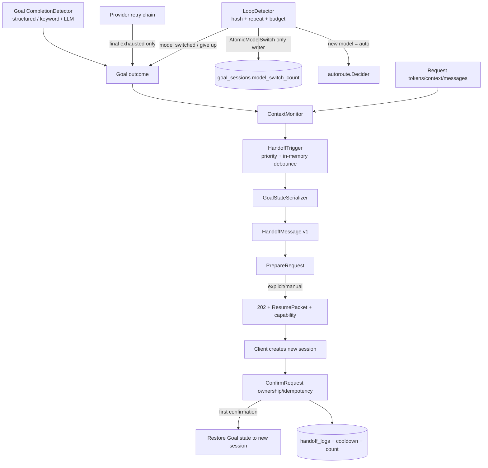

# Goal↔Handoff 协同契约

**状态**：P0-D 冻结（2026-08-16）
**上游设计**：[会话优化v2/28-Phase3-Handoff协同设计方案](../会话优化v2/28-Phase3-Handoff协同设计方案.md)
**现行传输协议**：[会话交接模块](../modules/handoff.md)

## 1. 裁决

28 号设计提出的四组件保持不变，但传输边界以当前已上线的请求侧协议为准：

1. Handoff 在 provider dispatch 前判定；显式客户端收到 `202 handoff_required`。
2. 客户端创建新会话后，通过一次性 capability 确认；首次确认才写日志、计数和 cooldown。
3. response-side `InjectFollowUp` 只能在原 session 内续跑，不承担跨会话 Handoff。
4. 四组件只提供 Goal 状态快照与触发意图，不替代 `autoroute.Decider`、Goal completion detector、LoopDetector 或确认事务。
5. `domains/moduleregistry.ModuleHandoffTrigger` 是模块元信息，不是接口或执行注册。生产执行继续由 `ChatHandler.SetHandoffHook` 显式装配。

## 2. ContextMonitor

### 2.1 输入

`ContextSnapshot` 是一次只读会话快照：

| 字段 | 类型 | 语义 |
|---|---|---|
| `session_id` / `tenant_id` | string | 原 Goal 会话与租户 |
| `goal_state` | string | `active/paused/retrying/completed/failed` |
| `tokens_used` / `context_window` / `message_count` | int | 累计 token、已解析窗口和消息数 |
| `retry_count` / `retry_exhausted` | int / bool | provider retry 累计值和本轮最终耗尽信号 |
| `repeat_count` | int | 连续重复响应计数，不等同于 loop 次数 |
| `model_switch_count` / `max_model_switch_count` | int | 仅指 `goal_sessions` 的 Goal loop 切模型计数 |
| `outcome` / `reason` | enum / string | Goal 检测链上报的最近结果与机器可判定原因 |
| `observed_at` | RFC3339 | 信号观测时间 |

### 2.2 输出

`TriggerSignal` 包含 `kind/source/reason/severity/observed_at`：

| kind | severity | Handoff 行为 |
|---|---:|---|
| `none` | 0 | 不触发 |
| `goal_completed` | 1 | 仅观测；无剩余工作时不触发 |
| `context_pressure` | 2 | 达到绝对或窗口百分比阈值时触发 |
| `goal_degraded` | 3 | 普通成功切模型只观测；明确仍需跨会话工作时可触发 |
| `goal_failed` | 4 | retry 最终耗尽、switch 预算耗尽、无 fallback 或禁用 switch 的 loop 可触发 |

优先级为 `failed > degraded > context_pressure > completed > none`。无有效 `context_window` 时只评估绝对阈值，不做除零或推测窗口。

## 3. GoalStateSerializer

### 3.1 schema

`GoalState` schema version 固定为 `1`：

```json
{
  "version": 1,
  "source_session_id": "gw_old",
  "tenant_id": "tenant-a",
  "state": "active",
  "cost_mode": "balanced",
  "retry_count": 2,
  "decision_count": 4,
  "auto_continue_count": 3,
  "repeat_count": 1,
  "model_switch_count": 1,
  "current_model": "auto",
  "tokens_used": 85000,
  "message_count": 18,
  "task_description": "原始 Goal",
  "audit_completed": false,
  "completed_steps": [],
  "remaining_work": "",
  "captured_at": "2026-08-16T00:00:00Z"
}
```

约束：

- 不序列化 `last_response_hash`、凭据、原始 audit 内容或未脱敏对话。
- `repeat_count` 保持原语义；不得改名或换算为 `loop_detections`。
- 当前 GoalStore 没有结构化 completed steps/remaining work，两个字段为可选扩展，不以永久零值冒充已采集数据。
- `Serialize(ctx, input)` 读取旧 session 并生成深拷贝快照。
- `Restore(ctx, newSessionID, state)` 必须显式指定目标 session。新 session 恢复为 `active`；retry/continue/repeat/model-switch 等运行预算归零，历史数值仍保留在 HandoffMessage 内。旧 session 不修改。
- P0-D 使用内存 proposal 关联；进程重启或快照缺失时 fail-open，客户端仍可从 HandoffMessage 人工恢复。持久化后置。

## 4. HandoffTrigger

### 4.1 触发与防抖

- ContextMonitor 的 `context_pressure` 和可交接的 `goal_failed` 进入 proposal。
- `goal_completed` 不创建 proposal。
- 成功 `AtomicModelSwitch` 后的 `goal_degraded` 不创建 proposal，因为 LoopDetector 已提供新模型预算；只有最终 give-up 才升级为 `goal_failed`。
- 同 session、同级或更低级信号在默认 5 分钟租约内去重；更高 severity 可以覆盖。
- durable cooldown 与 `max_per_session` 仍由现有 HandoffStore/confirmation 事务执行，内存防抖不替代数据库约束。

### 4.2 LoopDetector/model_switch_count 边界

HandoffTrigger：

- 不计算响应 hash，不增加 repeat count；
- 不选择模型，不调用 `AtomicModelSwitch`；
- 不写 `goal_sessions.model_switch_count`；
- 不混用 `session_summaries.model_switch_count` 或 `dispatch_failover_total{kind="model_switch"}`；
- 只消费 LoopDetector 已产出的 `model_switched` 或最终失败原因。

## 5. HandoffMessage

`HandoffMessage` schema version 固定为 `1`，作为现有 `ResumePacket` 的可选 `goal_handoff` 字段：

```json
{
  "version": 1,
  "source_session_id": "gw_old",
  "trigger": {"kind":"goal_failed","source":"goal","reason":"switch_budget_exhausted","severity":4},
  "goal_state": {"version":1},
  "summary": "脱敏后的会话摘要",
  "resume_instruction": "Continue the original goal in Goal mode from the remaining work.",
  "created_at": "2026-08-16T00:00:00Z"
}
```

消息不得包含凭据；字符串执行统一敏感信息脱敏；编码后有固定大小上限。`goal_handoff` 缺失时，旧 `ResumePacket` v1 行为不变。

## 6. 握手图



## 7. 兼容与失败策略

- 四组件及 observer 均为可选依赖；未装配时现有 Goal、audit、retry、Handoff 行为不变。
- `provider_retry_exhausted` 只来自已启用的 legacy Goal retry loop 的最终预算耗尽，并且必须存在 Goal session；关闭 retry、非 Goal session和未耗尽 retry 不上报。request-survival coordinator 保持独立 terminal outcome，本契约不从普通错误反推“retry exhausted”。
- Goal 状态读取、构建或恢复失败均 fail-open，记录结构化 warning，不阻断 provider 请求或已验证的 Handoff 确认。
- P0/P1/P2 completion 三策略顺序不变；`UseAutorouteForAudit` 路径不变。
- 自动续跑仍受 follow-up depth/per-session 上限控制，Handoff 不篡改这些计数。
