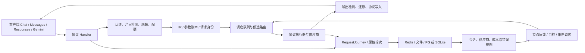

# 架构与需求契约（v3，2026-09-29）

## 1. 范围与判断方法

基线 `a8a3402355c5894d95030a184b29796f40df29be`；48 小时范围 `ff317a231037042b80e61952327d59ee4d23962f..a8a340235`，96 小时参考范围 `9635b9b1761b28ecd78c23457191a7e2f0e21429..a8a340235`。以运行调用链为准，方案文档只说明意图。`codegraph` 3.7.0 本轮重建了索引（6,455 文件、207,243 节点、753,469 边）；`codegraph where ChatHandler.ServeHTTP` 指向 `domains/streaming/handler.go:1836`，图谱索引用于定位，最终结论回到源码与测试。索引包含生成资产，复杂度排行须限定源码目录。

## 2. 现行架构及闭环边界

生产入口在 `cmd/gateway/main.go:6132-6157` 分别注册三种原生协议及 Gemini；可选 V2 pipeline 在 `:6174-6190` 包住同一组 Handler。Chat 在 `domains/streaming/handler.go:1836-1847` 进入内部流程，Messages 和 Responses 是独立 Handler（`domains/streaming/messages.go:72`、`responses.go:105`），不能假定它们调用 Chat 的入口中间件。调度执行见 `domains/streaming/executors/executor_dispatch.go:400` 与 `domains/dispatch`；路由权重见 `domains/routing/weighted_router.go:99,377`。异步队列、探测队列、统计队列服务不同职责，不能把一次入站请求队列与所有后台队列混为一个全局 FIFO。

**流程闭环**：每个请求有唯一身份，鉴权、入站治理、路由、候选尝试、供应商协议、客户端终态与 durable 记录一一对应；失败和取消也产生终态。**数据闭环**：原始请求不可因压缩覆盖，衍生层保留映射，队列只传引用/有 TTL 元数据，重试可恢复同一逻辑轮次；存储与查询遵守租户边界。**反馈闭环**：真实请求错误、探测、自检、用量和成本各自带来源及幂等键，经单一节点状态写入接口归并；可从凭据和会话 UI 追溯到同一次尝试。现状尚未证明全部不变量，缺口列于台账。

## 3. IR v3 目标契约

现行 `internal/ir/types.go:48` 的 `InternalRequest` 已容纳 Chat/Messages/Responses、工具、多模态与厂商字段；`Message`/`ContentBlock` 在 `:259` 起；`Metadata` 在 `:536` 仅有 user/request/project/tags/turn_total/Other。`domains/requestjourney/contract.go:477` 管请求事件，`domains/session/v2/cache_v2.go:146` 管会话状态。这些是不同职责的结构，当前不存在一个已落地且强类型覆盖用户要求全部字段的单体 IR。建议增加**内部**版本化 envelope，不扩散到上游厂商 payload：

| 组 | 字段及所有权 | 规则 |
|---|---|---|
| Identity | tenant_id、project_id、user_id、api_key_id、task_id、session_id、request_id、turn_no、total_turns、tags[]、client_type、created_at | 入站生成不可变 request_id；显式/推断会话与原始轮次分开；租户参与所有 key/index。凭据只存 ID，不在 envelope 放密钥。 |
| Wire | source_protocol、target_protocol、stream、model_requested、model_effective、provider_id、credential_id、vendor_extensions | 解析和序列化显式版本；auto 决策与实际路由分列。未知原厂参数保留 `json.RawMessage` 与 `expires_at`，缓存 TTL 到期后不得回灌；恢复必须按目标厂商 allowlist，避免跨协议污染。 |
| Content | 原始 turn/message/block 的稳定 identity + occurrence、顺序、role、文本摘要、附件引用及 MIME/大小/哈希/版本 | 原始正文只在受控存储；人类摘要去格式且不能代替原文；附件和媒体流转记录内容哈希、生命周期及访问权限。 |
| Provenance | original_ref、sanitized_ref、compressed_ref、SanitizedMessageRefs、AlignmentMap、占位符映射引用、策略与版本 | 映射 `(original identity, occurrence, block path) → sanitized → compressed` 双向可查；恢复只面向本租户本会话及客户端可见层；每次转换有可重放版本。 |
| Execution | 排队阶段时间、路由候选快照、调度瀑布、每次 attempt、协议选择/降级、上游窗口来源、压缩尝试、注入/输出检测判定 | 每次重试独立 attempt_id；记录 429/5xx/上下文超限与恢复路径，不能以最终成功掩盖中间失败。 |
| Settlement | usage 的来源与置信度、供应商账单项、内部账本项、价格版本、币种、成本、租户/API key 分摊 | 幂等键 `(request_id, attempt_id, charge_kind)`；估算与原厂回执分列；可对账到供应商凭据/模型。 |
| Lifecycle | schema_version、content_version、encryption_key_version、retention_until、状态、terminal_reason、各阶段时间戳 | 日志、队列、缓存、文件、数据库使用同一 schema version，迁移只向前；状态机和 TTL 一处定义。 |

`InternalRequest` 继续作为协议内容 IR；envelope 是内部审计与调度元数据，不直接发给供应商。原厂优先协议选择必须由候选 capability 与实测 endpoint 共同决定，并记录为什么切换；转换前后对工具调用、思考块、音视频、附件、cache control、usage、SSE 终态做语义往返测试。非法值、溢出 token/字节数、未知扩展、零/负 TTL 必须明确拒绝或保留为不发送的元数据。

## 4. 协议与数据存储验收矩阵

| 路径 | 入站 | 出站与客户端 | 必测不变量 |
|---|---|---|---|
| Chat | 文本/数组 block、工具、附件 | 非流式 JSON；SSE | 原始/脱敏/压缩映射；未知参数有 TTL；输出还原在真正 `Write` 前。 |
| Messages | 顶层 system、block、工具结果、cache control | 原生 Messages 或转换；SSE | 入站脱敏与输出检测不绕过；非流式只写一次 JSON；usage 不被估算覆盖。 |
| Responses | instructions/input、previous_response_id、function call output | 原生/Chat 降级；SSE 多事件 | 探测能力与真实执行一致；`data:` 合法变体安全；终态和流内失败可识别。 |
| Gemini/其他 | 原生多模态与参数 | 序列化对应目标 | 先证明不丢 block/附件，再声明“自动匹配”；供应商私有字段隔离。 |

全量存储目标为 PG + Redis + memory + files；简化模式为 SQLite + memory + files（`config/storage.go:26,107,149`、`cmd/gateway/storage_mode_init.go`）。文件缓存只存可丢弃衍生物，原始轮次和账本必须有权威写入路径及重建规则。`session_bodies_hot` 写入见 `domains/session/v2/bodies_writer.go:247-310`，读取使用 hot+分区统一视图；大表需逐表核实“只向 hot 更新/删除、8 小时批量转移、columnar 分区、重复/失败重跑幂等”，不可从其中一个表推断全部表成立。所有缓存键必须包含租户、版本及过期信息；跨进程 offset 要原子预占，不可仅依赖本地锁。

### 数据来源、去处与最小闭环记录

| 数据 | 来源→转换→去处 | 一致性/删除规则 |
|---|---|---|
| 原始单轮请求 | 客户端 wire → 协议解析 → 不可变原文/轮次引用 → 权威会话存储 | request_id + turn_no 去重；保留原始关键文本和媒体引用；压缩不能覆盖。 |
| 入站治理 | 原文文本 block → 注入检测与 sanitizer → sanitized block + 映射引用 | PII map 不进入供应商日志；key 包含 tenant/session/schema，TTL 有界，恢复按鉴权身份；错误不默默发送原文。 |
| 压缩会话 | sanitized refs → 窗口估算/策略 → compressed refs + AlignmentMap | original/sanitized/compressed 的 identity+occurrence 映射可重放；provider-window source telemetry 记录来源、时间、可信度和实际超窗反馈。 |
| 任务/队列 | envelope 身份与 body 引用 → 总队列/模型/凭据槽 → attempt | 队列元数据只保留可过期引用和优先级，重试与取消可释放；每层入/出队时间和排队原因进入 waterfall。 |
| 附件/媒体 | 上传或内嵌 block → MIME/大小/哈希/病毒/注入检测 → 文件或对象存储 + 版本元数据 | 引用计数、权限、加密、保留期与会话一致；原件与派生缩略/文本分版本，删除留 tombstone/可重试记录。 |
| 上游错误与输出 | 供应商 HTTP/SSE → 错误分类/恢复 → 客户端协议输出与错误表 | 每次失败按 credential/model/attempt 留证；客户端只见安全提示和合法终态，成功也不能擦掉前次失败。 |
| 用量/费用 | 原厂 usage 或估算 → 价格版本 → tenant/API key/credential/model 明细 → 对账 | 原厂与估算分列，幂等写入；内账与供应商账单差额有来源、处理状态和回放依据。 |

## 5. 观测和客户端契约

客户端成功响应只包含当前协议合法字节；恢复、候选失败和排队进展可在协议允许的 thinking/注释/side channel 中提示，但不得污染正文或提前宣告成功。供应商上下文超限只在尚未向客户端承诺成功时执行有界压缩重试；若已流出语义字节，需要可识别的失败终态与相同 request_id。超过 1M token 的 handoff + `/new` 需要客户端能力、可配置开关、触发阈值与幂等确认协议；网关不能自行执行客户端 `/new` 命令。会话 UI 应以项目→任务→会话→轮次→attempt 统一钻取，聚合展示耗时、成本、模型、供应商、错误与来源置信度，原文与脱敏摘要分权限。

## 6. 外部项目借鉴

本地 `__DEV_HOME__/workspace/ai/OmniRoute`、`__DEV_HOME__/workspace/ai/cc-switch` 的八项源码对照、取舍及本仓测试入口见 [06-外部项目借鉴与决策](06-外部项目借鉴与决策.md)。其中代理订阅跳转/DNS 的 SSRF 边界与供应商 cache token 计费口径是待验证风险；对方实现不直接复制为本仓协议、鉴权或存储实现。本仓已有 `docs/research/omniroute-compression-comparison.md`，后续对照当前版本时需复核其历史结论。
