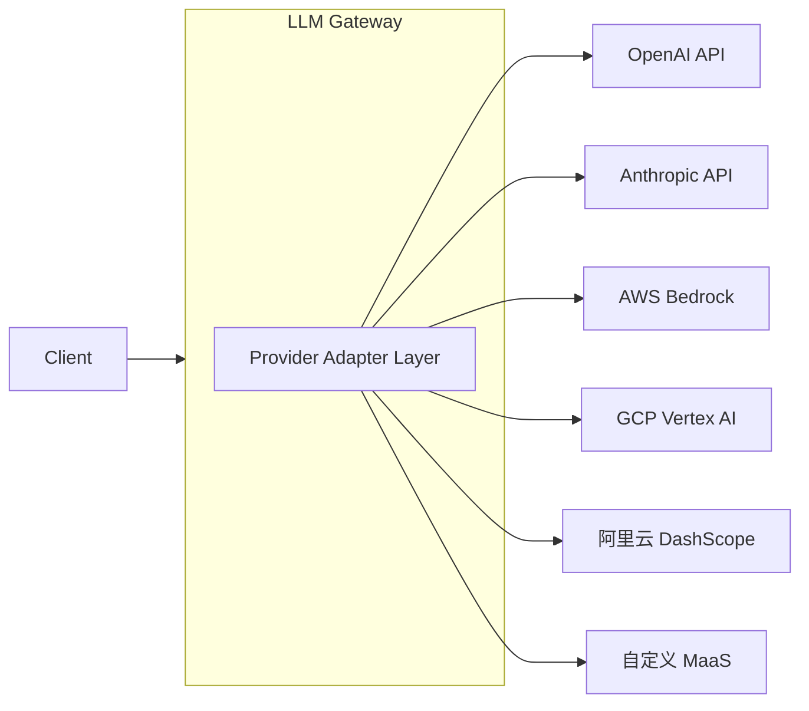

# LLM Gateway 入口/出口商业化与合规层设计

> 本文档系统的分析了 llm-gateway-go 在"入口与出口"层面的商业化及合规能力现状，
> 结合业界优秀方案，产出我们自己的优化设计与实施路线图。

---

## 目录

1. [概述与设计目标](#1-概述与设计目标)
2. [统一资源接入与监管](#2-统一资源接入与监管)
3. [敏感词过滤与内容安全审计](#3-敏感词过滤与内容安全审计)
4. [动态分发网关](#4-动态分发网关)
5. [精细化计费与分账](#5-精细化计费与分账)
6. [实施路线图](#6-实施路线图)
7. [与现有架构的关系](#7-与现有架构的关系)

---

## 1. 概述与设计目标

### 1.1 商业目标

llm-gateway-go 作为企业内部统一 AI 基础设施的数据面入口，需要解决四类核心商业诉求：

| 商业诉求 | 技术映射 | 优先级 |
|---|---|---|
| 多云/异构算力统一管理，降低 vendor lock-in 风险 | 统一资源接入与监管 | P0 |
| 输入输出符合监管要求，通过安全审计 | 敏感词过滤与内容安全审计 | P0 |
| 按业务优先级/合规/负载智能分发，降本增效 | 动态分发网关 | P1 |
| 内部部门/外部客户精细化计费，解决公摊难题 | 精细化计费与分账 | P1 |

### 1.2 现有架构成熟度

llm-gateway-go 经过近两年发展，代码量 ~10 万行，已具备扎实的基础设施能力：

| 维度 | 成熟度 | 说明 |
|---|---|---|
| Provider 抽象 | ★★★★☆ | OpenAI/Anthropic/Gemini/Zhipu/DeepSeek/Doubao 等 27+ 厂商，协议转换 IR 层 |
| 多租户 | ★★★★☆ | PostgreSQL RLS + 应用层 SQL 过滤 + 上下文传播三层隔离 |
| 凭证管理 | ★★★★☆ | AES-GCM 加密 + Redis 健康 + Bandit 评分 + 指纹槽 |
| 路由分发 | ★★★★☆ | Sticky/P2C/Bandit/Auto-route/MnfStreak 多策略 |
| 内容安全 | ★★★☆☆ | Armor v1（仅观察）+ OutputCompliance + 敏感词库，未正式上线阻断 |
| 计费分账 | ★★★☆☆ | MaaS 积分制 + 预付费钱包 + 订阅，缺后付费/多维度/分账 |

### 1.3 设计原则

1. **渐进式**：所有安全/合规功能以"观察→警告→阻断"三级成熟度演进
2. **可观测**：每个决策点必须输出结构化日志，支持事后审计与告警
3. **性能优先**：数据面路径 0 → 1 原则——安全/计费等附加逻辑必须 ≤ 5ms 开销
4. **可配置**：按租户/按模型/按 API 的差异化策略，不做一刀切
5. **松耦合**：四个模块独立演进，通过 Pipeline Hook 框架串联

---

## 2. 统一资源接入与监管

### 2.1 业界最佳实践

#### 2.1.1 Provider Adapter 模式

业界形成了以 **OpenAI-compatible API** 为通用面的共识：



主要开源参考：

| 项目 | 语言 | 特性 | 可比性 |
|---|---|---|---|
| **LiteLLM** | Python | 100+ 提供商，transparent proxy, cost tracking | 功能最全但 Python 性能差 |
| **Portkey** | Python/Go | AI Gateway, observability, guardrails | 商业产品，Go 部分开源 |
| **Bifrost** | Go | 11µs 开销 @5K RPS，多 provider 路由 | 架构最像，Go 生态 |
| **Kong AI Gateway** | Go | 插件化，企业级 | 重量级，适合 K8s 生态 |
| **OpenRouter** | - | 统一的定价/能力/延迟路由 | 商业标杆 |

#### 2.1.2 标配的 6 个关注点

业内 LLM Gateway 已标准化以下负载能力：

1. **统一 Provider API** — OpenAI 兼容作为 canonical form
2. **Model Routing** — 按能力/成本/延迟自动路由
3. **Retry & Fallback** — 错误码感知 + 逐级降级
4. **Caching** — Semantic cache (semantic + exact match)
5. **Observability** — Tracing (trace_id chain), metrics, cost
6. **Rate Limiting** — Per-user, per-key, per-model 多维度

#### 2.1.3 Circuit Breaker 三阶模型

LLM 服务的故障模式与传统 REST 不同——"静默质量退化"（HTTP 200 但输出垃圾）是最危险的故障模式。业内形成了 3 层断路器模型：

| 层级 | 检测对象 | 熔断条件 | 恢复策略 |
|---|---|---|---|
| L1 Provider | 整个上游服务 | 5xx 率 > 5% / p99 > 10s | 渐进恢复（50%→100%） |
| L2 Model | 特定模型 API | 错误率 > 10% / empty stream > 3 次 | 自动 failover 到等价模型 |
| L3 Capability | 功能模块（如 function calling） | 连续失败 > 5 次 | 降级为纯文本 |

### 2.2 现状分析

| 已有能力 | 所在位置 | 状态 |
|---|---|---|
| Provider 抽象 (27 厂商) | `provider/`, `catalog/`, `discovery/` | ✅ 成熟，持续扩充 |
| IR 协议转换层 | `domains/transformation/` | ✅ 覆盖 OpenAI↔Anthropic↔Responses↔Gemini |
| 凭证加密 + 健康管理 | `domains/credential/`, `domains/credentialstate/` | ✅ 成熟 |
| 凭证指纹 + 槽池 | `credentialfpslot/` | ✅ 独特设计 |
| Model Discovery | `discovery/` | ✅ 1h 周期性同步 |
| Pipeline Hook 框架 | `domains/pipeline/` | ✅ 16 阶段执行引擎 |

| 缺失/需加强 | 说明 | 优先级 |
|---|---|---|
| **Provider Adapter 接口标准化** | 当前 adapter 逻辑散落在 `provider/client.go`，未抽象为 interface | P1 |
| **3 层 Circuit Breaker** | 现有 health 检测是单层（credential 级），缺 model/capability 层级 | P1 |
| **Credential Pool 多 key stripe** | 同一 provider 多 API key 自动轮转/负载均衡 | P2 |
| **Provider 级 Rate Limit 自适应** | 上游限速返回 429 时自动退避 + 切 key | P2 |
| **Vendor SDK 集成** | Bedrock/Vertex AI 等自有 SDK 需在服务器端调用 | P2 |

### 2.3 设计方案

#### 2.3.1 Provider Adapter 接口标准化

```go
// domains/provider/adapter.go

// ProviderAdapter 定义统一的 provider 接入接口
type ProviderAdapter interface {
    // 基本信息
    ID() string
    Vendor() string          // openai / anthropic / azure / aws / gcp / ...
    Protocol() Protocol       // openai / anthropic / aws-bedrock / gcp-vertex / custom
    ModelFamilies() []string

    // 生命周期
    Init(ctx context.Context, config ProviderConfig) error
    Health(ctx context.Context) *HealthStatus
    Close(ctx context.Context) error

    // 核心调用（统一入口，adapter 内部做协议转换）
    ChatCompletion(ctx context.Context, req *ChatRequest) (*ChatResponse, error)
    ChatCompletionStream(ctx context.Context, req *ChatRequest) (<-chan StreamEvent, error)
    Embedding(ctx context.Context, req *EmbeddingRequest) (*EmbeddingResponse, error)

    // 能力自述
    Capabilities() CapabilitySet
}
```

每个 adapter 独立文件：

```
domains/provider/adapters/
├── adapter.go              // 接口定义
├── openai.go               // OpenAI-compatible (通用)
├── anthropic.go            // Anthropic native
├── azure.go                // Azure OpenAI
├── aws_bedrock.go          // AWS Bedrock (需 AWS SDK)
├── gcp_vertex.go           // GCP Vertex AI (需 GCP SDK)
├── aliyun_dashscope.go     // 阿里云 DashScope
├── custom.go               // 自定义 MaaS (OpenAI-compatible)
└── factory.go              // 按 vendor+protocol 选 adapter
```

这个重构与现有的 `domains/transformation/` IR 层的关系：
- Adapter 层 = "这个 provider 用什么协议通信"
- IR 层 = "客户端说 A 协议，后端需要 B 协议时做转换"
- 两者正交，Adapter 层优先，IR 层兜底

#### 2.3.2 3 层 Circuit Breaker

```go
// internal/circuitbreaker/circuitbreaker.go

type CircuitBreaker struct {
    State     CircuitState   // closed / half-open / open
    Failures  int
    Successes int
    Threshold ThresholdConfig
    LastError error
    Cooldown  time.Time
}

type CircuitState string
const (
    StateClosed   CircuitState = "closed"
    StateHalfOpen CircuitState = "half-open"
    StateOpen     CircuitState = "open"
)

// 注册到 Pipeline 的 fault-detection-hook
type TripleLayerMonitor struct {
    ProviderMonitor   *RollingWindowMonitor  // L1: provider 整体
    ModelMonitor      map[string]*RollingWindowMonitor  // L2: 按 model
    CapabilityMonitor map[string]*RollingWindowMonitor  // L3: function_call / json_mode
}
```

熔断行为的度量驱动：

| 指标 | 窗口 | 熔断条件 |
|---|---|---|
| HTTP 5xx rate | 5min | > 5% |
| Empty stream rate | 5min | > 10% |
| p99 latency | 5min | > 10s 或 baseline × 3 |
| 连续错误 | 1min | > 5 |

#### 2.3.3 Credential Pool (Multi-Key Stripe)

```go
// credentialpool/pool.go

type CredentialPool struct {
    ProviderID string
    Keys       []*PooledKey
    Selector   SelectionStrategy  // round-robin / least-loaded / health-weighted
    monitor    *HealthMonitor
}

type PooledKey struct {
    ID              string
    KeyPrefix       string       // sk-abc...
    CurrentRPM      int
    CurrentTPM      int
    LastUsed        time.Time
    RateLimitRemain int          // 来自 upstream Retry-After / x-ratelimit-remaining
}
```

---

## 3. 敏感词过滤与内容安全审计

### 3.1 业界最佳实践

#### 3.1.1 三层防御架构

```
Input (用户)
  │
  ▼
┌─────────────────────┐
│ L1: Input Guard     │  ← 正则规则 + PII 检测 + 敏感词 + Prompt Injection 检测
│ (before LLM call)   │    推荐: Microsoft Presidio (PII, ~10ms) + 自建敏感词库
└─────────┬───────────┘
          │  pass
          ▼
┌─────────────────────┐
│ L2: LLM Refusal     │  ← 模型自身的 RLHF 安全训练
│ (built-in)          │    原则：L1 放过的违规内容，模型自身应当拒绝回答
└─────────┬───────────┘
          │  output
          ▼
┌─────────────────────┐
│ L3: Output Guard    │  ← PII 泄露检测 + 毒性/偏见检查 + 幻觉检测 + 格式验证
│ (after LLM call)    │    推荐: Guardrails AI / NVIDIA NeMo Guardrails
└─────────┬───────────┘
          │  pass
          ▼
     返回给用户
```

#### 3.1.2 关键基准数据

| 方案 | F1 Score | Latency | 部署方式 |
|---|---|---|---|
| OpenAI Moderation API | 0.899 | 191.5ms | 外部 API 调用 |
| Azure Content Safety | 0.757 | 52.2ms | Azure 区域服务 |
| 自建正则 + ML | 0.82-0.88 (调优后) | 5-50ms | 本地 |
| Microsoft Presidio (PII) | 0.93-0.97 | ~10ms | 本地容器 |

核心洞察：**所有 guardrail 先从 "monitor mode" 开始**，用真实流量调优阈值后，再晋升到 "block mode"。否则假阳性风暴会让业务方崩溃。

#### 3.1.3 敏感词管理的专业做法

| 做法 | 说明 | 适用场景 |
|---|---|---|
| Aho-Corasick 自动机 | 多模式匹配，O(n) 时间，适合大规模敏感词库 | 高性能实时过滤 |
| 正则 + 置信度评分 | 灵活但慢，适合 PII/密码等准确定义的类别 | 精度优先的场景 |
| 嵌入向量相似度 | 基于语义的模糊匹配，能防变体/对抗 | 辅助兜底 |
| 外部审核 API | 调第三方审核服务 | 合规要求高的场景 |

### 3.2 现状分析

| 已有能力 | 所在位置 | 状态 |
|---|---|---|
| Armor Prompt Injection 检测 | `security/armor/` | ✅ 基于 LLM-as-judge，v1 强制 observe-only |
| 输出合规检查器 (8 项) | `domains/outputcompliance/checker.go` | ✅ PII/毒性/偏见/幻觉/机密/内网 IP/越狱/指令注入 |
| 敏感词库 (7 类中文) | `configs/sensitive_words.json` | ✅ 需维护更新 |
| PII/机密检测模式 | `configs/sensitive_patterns.yaml` | ✅ 含脱敏规则 |
| Pipeline hooks YAML 示例 | `config/hooks.yaml` | ✅ output-sanitizer-hook + audit-hook |

| 缺失/需加强 | 说明 | 优先级 |
|---|---|---|
| **输入层 Guard** | 当前只在输出侧有合规检查，输入侧只有 Armor（且 observe-only） | P0 |
| **Block Mode 正式上线** | Armor v1 强制观察模式，需 v2 支持告警/阻断 | P0 |
| **Aho-Corasick 高性能引擎** | 当前敏感词是线性正则遍历，大词库下性能有问题 | P1 |
| **多语言敏感词库** | 目前只有中文，需扩英文/日文/东南亚语 | P1 |
| **脱敏/替换策略** | 已有脱敏规则配置，但未集成到请求/响应 pipeline | P1 |
| **安全审计 Dashboard** | Armor 的日志在 PG 表里，缺可视化报表 | P2 |
| **PII 自动发现与分类** | 结构化敏感数据自动分类（信用卡/身份证/手机号等） | P2 |

### 3.3 设计方案

#### 3.3.1 三层 Guard 架构

```go
// security/guardian/guardian.go

// Guardian 是统一的安全审查入口
type Guardian struct {
    // 三层检查器
    InputGuards  []InputGuard    // L1: 输入侧（用户→LLM）
    BuiltinGuard *NoopGuard      // L2: LLM 自身（信任模型）
    OutputGuards []OutputGuard   // L3: 输出侧（LLM→用户）

    // 决策引擎
    Decider *GuardDecider

    // 审计
    Auditor *Auditor
}

type InputGuard interface {
    Name() string
    CheckInput(ctx context.Context, req *ChatRequest) (*GuardVerdict, error)
}

type OutputGuard interface {
    Name() string
    CheckOutput(ctx context.Context, req *ChatRequest, resp *ChatResponse) (*GuardVerdict, error)
}

const (
    ActionPass   GuardAction = "pass"      // 放行
    ActionWarn   GuardAction = "warn"      // 告警（记录 + 通知）
    ActionBlock  GuardAction = "block"     // 阻断（返回 4xx）
    ActionRewrite GuardAction = "rewrite"  // 改写（脱敏/替换）
)
```

#### 3.3.2 Input Guard 链（按顺序执行，快速失败）

```
用户输入
  │
  ├── 1. Aho-Corasick 敏感词过滤   ← 高性能多模式匹配 (~1ms)
  │      分级：P0(阻断) / P1(告警) / P2(PASS)
  │
  ├── 2. PII 检测与智能脱敏        ← Microsoft Presidio / 本地规则 (~10ms)
  │      可逆脱敏：手机号/身份证/银行卡/邮箱 → {SENSITIVE:phone:0}
  │      映射表 → 存入 Session SanitizeMap
  │      详见 3.4 智能脱敏还原
  │
  ├── 3. Prompt Injection 检测      ← 正则 + LLM-as-judge (~200ms)
  │      Armor 升级为支持 block mode
  │
  ├── 4. 内容安全检测                ← 色情/暴力/政治敏感 (~50ms)
  │      规则引擎 + 可选外部审核 API
  │
  └── pass → LLM 调用（请求体中已无明文敏感信息）
```

#### 3.3.3 Output Guard 链

```
LLM 输出（含占位符，如 {SENSITIVE:phone:0}）
  │
  ├── 1. 占位符还原检测            ← 扫描输出中的 {SENSITIVE:*} 占位符
  │      从 Session SanitizeMap 中查找对应的原始值
  │      精确匹配还原，不做猜测——找不到则保持占位符
  │      详见 3.4 智能脱敏还原
  │
  ├── 2. PII 泄露检测               ← 即使做了脱敏，仍检查是否有遗漏的 PII
  │      脱敏策略：<REDACTED> / 截断 / 替换
  │
  ├── 3. 敏感内容检测                ← 模型可能生成违规内容
  │      阻断策略：返回 "内容已被过滤" 或截断
  │
  ├── 4. 幻觉检测 (可选)            ← RAG 场景下检查是否超出上下文
  │      基于 embedding cosine 相似度
  │
  ├── 5. 格式合规校验                ← JSON schema / 长度限制等
  │
  └── pass → 返回给用户（占位符已被还原为原始敏感信息）
```

#### 3.3.4 Aho-Corasick 敏感词引擎

```go
// security/sensitive/engine.go

type SensitiveWordEngine struct {
    automaton  *ahocorasick.Matcher  // AC 自动机
    categories []WordCategory
    onMatch    MatchAction           // block / warn / rewrite
}

type WordCategory struct {
    Name   string       // "政治敏感" / "色情" / "暴力" / "毒品" / ...
    Level  AlertLevel   // P0(阻断) / P1(告警) / P2(PASS)
    Action MatchAction
}

// LoadWordLibrary 支持热加载
func (e *SensitiveWordEngine) LoadWordLibrary(filePath string) error
func (e *SensitiveWordEngine) Reload(ctx context.Context) error
```

词库分级管理：

| 层级 | 来源 | 处理方式 |
|---|---|---|
| P0 阻断级 | 法律法规明确禁止 | 直接阻断请求 |
| P1 告警级 | 业务特定敏感词 | 记录日志 + 通知管理员 |
| P2 观察级 | 模糊/变体/探测 | 仅记录不做处理 |

#### 3.3.5 决策引擎 (GuardDecider)

```go
// security/guardian/decider.go

type GuardDecider struct {
    // 租户级别策略覆盖
    tenantPolicies map[string]*TenantGuardPolicy
}

type TenantGuardPolicy struct {
    Mode           GuardMode   // observe / warn / block
    SkipChecks     []string    // 跳过的检查项
    CustomThreshold map[string]float64  // 个性化阈值
}

type GuardMode string
const (
    ModeObserve GuardMode = "observe"  // 仅记录，不干扰
    ModeWarn    GuardMode = "warn"     // 记录 + 告警
    ModeBlock   GuardMode = "block"    // 阻断违规请求/响应
)
```

---

### 3.4 核心模式：敏感信息智能脱敏还原 (SmartSaniGuard)

> 这是本节最关键的设计决策——一种"可逆脱敏"模式：
> 输入侧将敏感信息替换为占位符存入会话，LLM 只看到脱敏后的文本，
> 输出侧将占位符还原为原始值。实现对上游 LLM 提供商的**零信任隐私保护**
> （敏感信息不出网关），同时用户体验无损（用户最终拿到的是完整数据）。

#### 3.4.1 为什么需要这个模式

| 场景 | 传统做法 | 问题 |
|---|---|---|
| 用户输入含身份证号 "查询 110101199001011234 的订单" | 阻断请求 / 直接脱敏抹掉 | 业务流程断裂 / LLM 无法理解上下文 |
| LLM 回复含用户手机号 | 输出侧检测到手机号后脱敏抹掉 | 用户看不到自己的信息 |
| 企业内部数据（客户名、合同号） | 要么全部放行给 LLM provider | 数据出境合规风险 |
| 多轮对话中敏感信息反复出现 | 每轮都做检测/脱敏 | 重复计算，且脱敏不一致 |

**智能脱敏还原**的精髓：

```
输入: "我的手机是13800138000"
      │
      ├── PII 检测 → 命中手机号
      ├── 替换为 {SENSITIVE:phone:0}
      ├── 存入 Session: {SENSITIVE:phone:0 → "13800138000"}
      ▼
LLM 看到: "我的手机是{SENSITIVE:phone:0}"
      │
      ├── LLM 将此理解为"用户手机号占位符"
      ├── 回复: "您查询的手机号{SENSITIVE:phone:0}对应的订单是..."
      ▼
输出: "您查询的手机号{SENSITIVE:phone:0}对应的订单是..."
      │
      ├── 检测到占位符 {SENSITIVE:phone:0}
      ├── 从 Session 还原 → "13800138000"
      ▼
用户看到: "您查询的手机号13800138000对应的订单是..."
```

**收益**：
- ✅ 敏感信息**从不离开网关**到达 LLM provider
- ✅ LLM 得到的是语义可理解的占位符（不影响推理质量）
- ✅ 用户最终收到完整信息（体验无损）
- ✅ 审计日志中只记录占位符，不记录原始敏感值（减少合规范围）
- ✅ 多轮对话中同一敏感信息只需检测一次

#### 3.4.2 占位符格式设计

```go
// security/sanitize/placeholder.go

// 占位符格式: {SENSITIVE:<type>:<index>}
// 例如: {SENSITIVE:phone:0}, {SENSITIVE:id_card:1}, {SENSITIVE:email:2}

type Placeholder struct {
    Type  SensitiveType  // phone / id_card / email / credit_card / secret / name
    Index int            // 同一 type 内的序号（用于多实例）
}

type SensitiveType string
const (
    TypePhone      SensitiveType = "phone"
    TypeIDCard     SensitiveType = "id_card"
    TypeEmail      SensitiveType = "email"
    TypeCreditCard SensitiveType = "credit_card"
    TypeSecret     SensitiveType = "secret"       // API key / password
    TypeInternalIP SensitiveType = "internal_ip"
    TypeName       SensitiveType = "name"          // 客户名/企业名等业务敏感
    TypeCustom     SensitiveType = "custom"        // 业务自定义敏感字段
)

// 正则模式：用于输入检测和输出还原
var PlaceholderPattern = regexp.MustCompile(
    `\{SENSITIVE:([a-z_]+):(\d+)\}`,
)
```

**设计考量**：
- `{SENSITIVE:type:index}` 格式对 LLM 来说语义明确且易于在回复中引用
- Type 字段让 LLM 理解被隐藏的是什么类型的信息
- Index 字段支持同一个请求中出现多个同类敏感值
- 正则简单可靠，输出侧检测 O(1) 复杂度

#### 3.4.3 Session SanitizeMap 存储

利用现有的 Redis Session 体系，增加一个敏感映射表字段：

```go
// domains/session/sanitize.go

// SanitizeMap 存储请求中脱敏的敏感信息映射表
// key = placeholder string, value = 原始敏感值
// 存储在 Redis Hash: "session:{id}:sanitize" 中
type SanitizeMap map[string]string  // "{SENSITIVE:phone:0}" → "13800138000"

const sanitizeMapKey = "session:%s:sanitize"

// SaveSanitizeMap 将脱敏映射表保存到 Redis（与 session 同 TTL）
func (sm *Manager) SaveSanitizeMap(ctx context.Context, sessionID string, data SanitizeMap) error {
    key := fmt.Sprintf(sanitizeMapKey, sessionID)
    fields := make(map[string]any, len(data))
    for k, v := range data {
        fields[k] = v
    }
    pipe := sm.redis.client.Pipeline()
    pipe.HSet(ctx, key, fields)
    pipe.Expire(ctx, key, sm.ttl)
    _, err := pipe.Exec(ctx)
    return err
}

// GetSanitizeMap 读取脱敏映射表
func (sm *Manager) GetSanitizeMap(ctx context.Context, sessionID string) (SanitizeMap, error) {
    key := fmt.Sprintf(sanitizeMapKey, sessionID)
    result, err := sm.redis.HGetAll(ctx, key)
    if err != nil {
        return nil, err
    }
    return SanitizeMap(result), nil
}

// DeleteSanitizeMap 清理脱敏映射表（session 过期/删除时调用）
func (sm *Manager) DeleteSanitizeMap(ctx context.Context, sessionID string) error {
    key := fmt.Sprintf(sanitizeMapKey, sessionID)
    return sm.redis.Del(ctx, key)
}
```

**设计决策**：
- 用独立的 Redis Hash key（`session:{id}:sanitize`）而非塞进 Session 主 Hash——避免每次 Get 都拉回大量敏感数据
- 与 Session 主 key 共享 TTL，session 过期自动清理敏感映射
- Pipeline 原子写入，保证一致性
- 不落盘（仅在 Redis 中），敏感映射的生命周期不超过会话

#### 3.4.4 Sanitizer 模块实现

脱敏和还原作为一个独立模块（`Guard` 实现），注册到 Guardian 框架：

```go
// security/sanitize/sanitizer.go

// Sanitizer 智能脱敏还原器
// 输入侧: 替换 PII 等敏感信息为占位符
// 输出侧: 还原占位符为原始值
type Sanitizer struct {
    piiDetector     *PiiDetector      // 复用 domains/outputcompliance 的 PII 检测
    sensitiveDetect *SensitiveDetect  // 自定义敏感信息检测（企业名/合同号等）
    sessionManager  *session.Manager  // 用于读写 SanitizeMap
}

// SanitizeInput 对输入进行脱敏，返回脱敏后的文本 + 映射表
// 映射表会存入当前 Session
func (s *Sanitizer) SanitizeInput(ctx context.Context,
    text string, sessionID string) (string, error) {

    // 1. 检测所有敏感信息
    findings := s.piiDetector.FindAll(text)
    customFindings := s.sensitiveDetect.FindAll(text, GetTenantFromContext(ctx))
    findings = append(findings, customFindings...)

    // 2. 按位置降序替换（避免偏移漂移）
    //    每个敏感值 → {SENSITIVE:<type>:<index>}
    placeholderMap := make(SanitizeMap)
    typeCounters := make(map[SensitiveType]int)
    sanitized := text

    // 降序排列
    sort.Slice(findings, func(i, j int) bool {
        return findings[i].Start > findings[j].Start
    })

    for _, f := range findings {
        idx := typeCounters[f.Type]
        typeCounters[f.Type]++
        placeholder := fmt.Sprintf("{SENSITIVE:%s:%d}", f.Type, idx)
        placeholderMap[placeholder] = f.Original
        sanitized = sanitized[:f.Start] + placeholder + sanitized[f.End:]
    }

    // 3. 存入 Session
    if len(placeholderMap) > 0 {
        // 读取已有映射（多轮对话累加）
        existing, _ := s.sessionManager.GetSanitizeMap(ctx, sessionID)
        for k, v := range placeholderMap {
            existing[k] = v
        }
        if err := s.sessionManager.SaveSanitizeMap(ctx, sessionID, existing); err != nil {
            slog.Warn("sanitizer: failed to save sanitize map", "session_id", sessionID, "error", err)
        }
    }

    return sanitized, nil
}

// RestoreOutput 对输出进行还原，将占位符替换为原始值
// 精确匹配，不做猜测——找不到则保持占位符不变
func (s *Sanitizer) RestoreOutput(ctx context.Context,
    text string, sessionID string) (string, error) {

    if !PlaceholderPattern.MatchString(text) {
        return text, nil  // 无占位符，快速返回
    }

    sanitizeMap, err := s.sessionManager.GetSanitizeMap(ctx, sessionID)
    if err != nil || len(sanitizeMap) == 0 {
        return text, nil  // 没有映射表或已过期，保持原样
    }

    result := text
    // 从后往前替换，避免偏移漂移
    matches := PlaceholderPattern.FindAllStringSubmatchIndex(result, -1)
    type replacement struct{ start, end int; value string }
    var items []replacement

    for _, m := range matches {
        fullStart, fullEnd := m[0], m[1]
        placeholder := result[fullStart:fullEnd]
        if original, ok := sanitizeMap[placeholder]; ok {
            items = append(items, replacement{fullStart, fullEnd, original})
        }
    }

    // 降序替换
    sort.Slice(items, func(i, j int) bool { return items[i].start > items[j].start })
    for _, it := range items {
        result = result[:it.start] + it.value + result[it.end:]
    }

    return result, nil
}
```

#### 3.4.5 注册到 Guardian 框架

```go
// Sanitizer 实现 InputGuard / OutputGuard 接口
func (s *Sanitizer) Name() string { return "sanitizer" }

func (s *Sanitizer) CheckInput(ctx context.Context, req *ChatRequest) (*GuardVerdict, error) {
    sessionID := GetSessionIDFromContext(ctx)
    sanitized, err := s.SanitizeInput(ctx, req.LastUserMessage, sessionID)
    if err != nil { return &GuardVerdict{Action: ActionPass}, nil }

    // 改写请求体中的敏感信息
    req.LastUserMessage = sanitized
    return &GuardVerdict{Action: ActionRewrite, RewrittenBody: req.Body}, nil
}

func (s *Sanitizer) CheckOutput(ctx context.Context, req *ChatRequest, resp *ChatResponse) (*GuardVerdict, error) {
    sessionID := GetSessionIDFromContext(ctx)
    restored, err := s.RestoreOutput(ctx, resp.Content, sessionID)
    if err != nil { return &GuardVerdict{Action: ActionPass}, nil }

    resp.Content = restored
    return &GuardVerdict{Action: ActionRewrite, RewrittenBody: resp.Body}, nil
}
```

#### 3.4.6 Pipeline Hook 中的位置

```
请求路径            Pipeline stage
─────────────────────────────────────
1. Geo Routing     pre-route
2. Input Guard     pre-route (含 Sanitizer.SanitizeInput)
3. Auth / Rate     pre-invoke
4. LLM 调用        invoke (已无明文敏感信息)
5. Output Guard    post-invoke (含 Sanitizer.RestoreOutput)
6. Billing         post-invoke
```

#### 3.4.7 关键设计决策

| 决策 | 选择 | 理由 |
|---|---|---|
| 占位符格式 | `{SENSITIVE:type:index}` | LLM 语义可理解，正则可精确匹配；避免 LLM 误解为真实内容 |
| 存储位置 | Redis Hash `session:{id}:sanitize` | 独立 key 避免污染主 Session；共享 TTL 自动过期 |
| 还原策略 | 仅精确匹配还原 | 不猜测、不做模糊匹配——安全第一，找不到就保持占位符 |
| Input 检测源 | 复用 `domains/outputcompliance` PII 模式 + Sanitizer 自定义规则 | 避免重复造轮子；自定义规则覆盖业务特有敏感信息 |
| 多轮对话 | 映射表累加（新发现追加到已有映射） | 同一敏感词在后续轮次中无需重复检测，可直接还原 |
| 流式响应 | Output 按 chunk 还原，每个 chunk 独立匹配 | SSE 场景下不能等完整响应 |
| 异常处理 | 存入失败不阻断请求（去程容忍）、找不到映射不还原（回程安全） | 降级策略：宁可"不过滤"也不"错误阻断" |

#### 3.4.8 局限性

| 局限 | 说明 | 缓解措施 |
|---|---|---|
| LLM 可能不引用占位符 | 有些模型会忽略占位符，直接说"您的手机号已确认" | 回程无占位符可还原时，数据已被脱敏（安全的默认状态） |
| 映射表累积膨胀 | 长对话中敏感值越来越多 | 设置单次最大 50 条限制，超额则 fallback 到传统脱敏 |
| 流式传输还原延迟 | SSE 场景下需要逐 chunk 匹配 | `RestoreOutput` 是 O(n) 操作，对每个文本 chunk 独立执行 |
| Session 过期丢失映射 | session TTL 到达后映射表自动删除 | TTL 默认 7 天，合理覆盖绝大多数对话场景 |

#### 3.4.9 与现有模块的关系

| 现有模块 | 关系 |
|---|---|
| `domains/outputcompliance/checker.go` | Sanitizer 的 PII 检测**复用**其 `piiPatterns` / `detectPII()` 逻辑，不另起炉灶 |
| `domains/session/` | 扩展 session.Manager 的 `SaveSanitizeMap` / `GetSanitizeMap` 方法 |
| `security/armor/` | 正交——Armor 做 prompt injection 评分，Sanitizer 做 PII 脱敏，两者可以串联 |
| `configs/sensitive_patterns.yaml` | 脱敏规则可引用此文件的 PII/机密检测配置 |
| Pipeline Hook | Sanitizer 注册为 `pre-route` 阶段（Input）和 `post-invoke` 阶段（Output）的 Guard |

---

## 4. 动态分发网关

### 4.1 业界最佳实践

LLM 路由策略已形成 5 种经过生产验证的模式：

| 策略 | 适用场景 | 成本节省 | 复杂度 |
|---|---|---|---|
| **Cost-aware routing** | 非关键任务（摘要/分类） | 40-70% | 中 |
| **Latency-aware routing** | 实时对话（客服/助手） | - | 低 |
| **Capability-aware (semantic)** | 复杂推理/代码/工具调用 | - | 高 |
| **Cascading (fallback chain)** | 高可用场景 | 20-40% | 中 |
| **Weighted split (canary)** | 模型上线灰度 | - | 中 |

#### 4.1.1 地理合规路由

GDPR (EU) / 中国法规 / 各地数据本地化要求 → 请求必须送达特定区域的 provider：

```yaml
routing:
  geo_policies:
    - region: CN
      allowed_providers: [dashscope, doubao, deepseek, zhipu]
      fallback: openai  # 只允许 CN 不可达时
      moderation: china_standard  # 使用中国标准的内容审核
    - region: EU
      allowed_providers: [openai_eu, anthropic, mistral]
      data_residency: required  # 数据不能离境
      moderation: gdpr_standard
    - region: US
      allowed_providers: [openai, anthropic, google, aws]
      moderation: default
```

#### 4.1.2 优先级队列

```yaml
priority_queue:
  levels:
    - name: critical       # 实时交互（客服/助手）
      weight: 40
      reserve_percent: 30  # 预留 30% 容量
    - name: high           # 业务核心（报表/审核）
      weight: 30
      reserve_percent: 20
    - name: normal         # 批量处理
      weight: 20
      reserve_percent: 10
    - name: low            # 预计算/离线
      weight: 10
      reserve_percent: 0
```

### 4.2 现状分析

| 已有能力 | 所在位置 | 状态 |
|---|---|---|
| Executor 多策略路由 | `domains/streaming/executors/` | ✅ Sticky / P2C / Bandit / Round-robin |
| Auto-route 引擎 | `autoroute/` | ✅ Classifier + Decider + Scoring + Feedback |
| Health tracking | `bg/` | ✅ Call history, degrade detection |
| MnfStreak (model_not_found) | executor 内 | ✅ 模式检测 |
| Billing-aware 两轮选择 | executor 内 | ✅ 订阅优先，按量付费兜底 |

| 缺失/需加强 | 说明 | 优先级 |
|---|---|---|
| **Cost-aware routing** | 同一任务可被多个模型解决时，选最便宜的 | P1 |
| **地理合规路由** | GDPR / CN 法规要求数据本地化 | P1 |
| **Cascading fallback** | 优先模型失败后自动降级到次优模型 | P1 |
| **优先级队列** | 实时交互不被批量任务饿死 | P1 |
| **Canary 模型灰度** | 新模型按比例放量 + 自动回滚 | P2 |
| **Semantic capability routing** | 按任务语义（推理/代码/翻译/摘要）分派到最合适的模型 | P2 |

### 4.3 设计方案

#### 4.3.1 Routing Strategy 扩展

```go
// domains/routing/strategy/strategy.go

type Strategy interface {
    Name() string
    Select(ctx context.Context, candidates []*Candidate, req *RoutingRequest) (*Candidate, error)
    Priority() int
}

// 已有策略 (保持)
type StickyStrategy struct{}       // session-level pinning
type P2CStrategy struct{}          // Power of Two Choices
type BanditStrategy struct{}       // Thompson Sampling

// 新增策略
type CostAwareStrategy struct{}    // 选择最便宜的可行模型
type CascadingStrategy struct{}    // 高→低优先级 fallback
type GeoComplianceStrategy struct{} // 按地区合规要求过滤
```

路由策略链式组合：

```go
// Executor 中的策略编排

func (e *Executor) selectCandidate(ctx context.Context, req *RoutingRequest) (*Candidate, error) {
    // 1. 策略链
    strategies := []Strategy{
        &GeoComplianceStrategy{regions: req.Regions},  // 先按合规过滤
        &StickyStrategy{},                              // 尝试保留 session
        &CostAwareStrategy{},                           // 成本优先
        &CascadingStrategy{failover: true},             // 高可用兜底
    }

    candidates := e.loadCandidates(ctx, req)

    // 2. 逐层过滤/选择
    for _, s := range strategies {
        if len(candidates) == 0 { break }
        selected, err := s.Select(ctx, candidates, req)
        if err == nil { return selected, nil }
        // fallback: 移到本层下一个候选继续
    }

    // 3. 兜底
    return e.fallbackSelection(ctx, candidates)
}
```

#### 4.3.2 地理合规路由实现

```go
// domains/routing/strategy/geo.go

type GeoComplianceStrategy struct {
    policies map[string]*GeoPolicy  // region → policy
}

type GeoPolicy struct {
    Region             string
    AllowedProviders   []string     // 允许的 provider
    BlockedProviders   []string     // 明确禁止（如特定国家制裁）
    DataResidency      bool         // 数据不能出境
    RequiredModeration string       // 指定内容审核标准
    FallbackProviders  []string     // 允许的兜底提供者
}

func (s *GeoComplianceStrategy) Select(ctx context.Context, candidates []*Candidate, req *RoutingRequest) (*Candidate, error) {
    policy := s.policies[req.ClientRegion]
    if policy == nil {
        return nil, ErrNoPolicyForRegion
    }

    // 过滤掉禁止的 provider
    filtered := make([]*Candidate, 0, len(candidates))
    for _, c := range candidates {
        if isInList(c.ProviderID, policy.AllowedProviders) && !isInList(c.ProviderID, policy.BlockedProviders) {
            filtered = append(filtered, c)
        }
    }

    if len(filtered) == 0 {
        // 允许 fallback 时尝试兜底 provider
        for _, fb := range policy.FallbackProviders {
            for _, c := range candidates {
                if c.ProviderID == fb { return c, nil }
            }
        }
        return nil, ErrNoCompliantProvider
    }

    // 从过滤后的候选中继续（交给下一个策略）
    return filtered[0], nil  // 标记为"仅过滤"，实际选择交给下个策略
}
```

#### 4.3.3 优先级队列

```go
// domains/priorityqueue/queue.go

type PriorityLevel int
const (
    PriorityCritical PriorityLevel = iota  // 0, highest
    PriorityHigh                            // 1
    PriorityNormal                          // 2
    PriorityLow                             // 3
)

type PriorityQueue struct {
    queues      [4]chan *PendingRequest
    reservePct  [4]int      // 每个级别预留百分比
    stats       *QueueStats
}

func (q *PriorityQueue) Enqueue(req *PendingRequest, level PriorityLevel) error
func (q *PriorityQueue) Dequeue(ctx context.Context) (*PendingRequest, error)
```

租户级别的队列分配：

```go
type TenantQueueConfig struct {
    TenantID      string
    DefaultLevel  PriorityLevel
    Overrides     map[string]PriorityLevel  // API path → priority
    DailyQuota    int64                     // 每日调用上限
    BurstQuota    int                       // 单次突发上限
}
```

#### 4.3.4 Cascading Fallback

```
尝试顺序：
  1. GPT-4o        (首选: 能力最强)
  2. Claude 3.5    (fallback 1: 等价)
  3. DeepSeek-V3   (fallback 2: 成本更低，能力略低)
  4. Qwen-Max      (fallback 3: 末位)
  5. 返回 503       (全部失败)

每级失败条件：
  - HTTP 5xx / timeout / connection refused
  - Empty stream / partial response
  - p99 超限 (last mile guard)

失败转移策略：
  - 第一次失败：立刻 fallback (fast failover)
  - 连续失败：skip (跳过) —— 被 skip 的 provider 进入 cooldown
  - Cooldown 后：probing (恢复探测)
```

---

## 5. 精细化计费与分账

### 5.1 业界最佳实践

#### 5.1.1 五种计费模型

| 模型 | 说明 | 适用场景 |
|---|---|---|
| **Pass-through** | 原价转嫁，不加价 | 纯代理模式 |
| **Markup / Cost-plus** | 成本 + 固定加价率 | 内部部门分账 |
| **Flat per-call** | 每调用固定价格 | 简单计费 |
| **Token bundles** | 预购 Token 包，用完后按量 | 外部客户 |
| **Tiered subscription** | 阶梯订阅（基础/专业/企业） | SaaS 产品 |

实际情况：混合模型最常用（基础月费 + 超量按需）。

#### 5.1.2 Metering Pipeline 的 6 层架构

```
请求 → Instrumentation → Ingestion → Aggregation → Rating → Billing → Dashboard
       │                    │            │            │         │
       │ 计量原始数据        │ 去重+校验   │ 小时/天    │ 应用定价  │ 账单生成
       │ token_count        │ idempotent  │ 粒度汇总   │ 模型+折扣 │ + 支付
       │ latency            │ key:        │            │          │
       │ model              │ request_id  │            │          │
       │ provider           │             │            │          │
```

**核心原则**：Usage 数据（可持久化的事实）与 Pricing（业务规则）分离。这个原则让重新计价、纠错、租户差异定价成为可能，而不需要重写历史数据。

#### 5.1.3 Showback → Chargeback 演进路径

| 阶段 | 做什么 | 信噪比 |
|---|---|---|
| **Showback** | 只看不用付钱：给各部门报告用量 | 快速上线，< 2 周 |
| **Shadow billing** | 模拟账单但不实际收费 | 3-4 周 |
| **Chargeback** | 实际内部结算 | 6-8 周（需财务确认） |

**关键**：先 Showback 建立信任，等归因覆盖率 > 80% 后再 Chargeback。

### 5.2 现状分析

| 已有能力 | 所在位置 | 状态 |
|---|---|---|
| 计费积分制 (整数 credits) | `maas/` | ✅ 已上线 |
| 预付费钱包 (3 池) | `maas/credit_wallet.go` | ✅ 订阅/赠送/购买 |
| 订阅套餐目录 | `maas/subscription_plans.go` | ✅ 平台级 |
| 模型费率表 | `maas/model_rates.go` | ✅ 模型级别定价 |
| 计费扣费 (per-request) | `maas/service.go`, `domains/streaming/handler.go` | ✅ |
| 计费交易日志 | `maas/credit_ledger.go` | ✅ |
| 计费订单系统 | `maas/orders.go` | ✅ 订阅/充值 |
| 支付渠道接口 | `maas/payment.go` | ✅ 支付宝/微信/手动 |

| 缺失/需加强 | 说明 | 优先级 |
|---|---|---|
| **后付费模式** | 当前只有预付费（先充后用），缺先用后付 | P1 |
| **多维度计费** | 只有 token 计费，缺 GPU 卡时/调用次数维度 | P1 |
| **分账系统** | 缺部门级/项目级的分账报表与结算 | P1 |
| **Billing Pipeline 去重** | 当前计费是同步扣费，缺异步管道容错机制 | P1 |
| **Usage Dashboard** | 目前有 GetUsage() 查询，缺完整的用量分析大盘 | P2 |
| **折扣/优惠券** | 全局折扣已有，缺租户级折扣和自动优惠 | P2 |
| **计费告警** | 余额不足时缺自动通知 | P2 |

### 5.3 设计方案

#### 5.3.1 Billing Pipeline 异步化

```go
// billing/pipeline/pipeline.go

type BillingPipeline struct {
    Ingestion   chan *UsageEvent       // 接收原始用量事件
    Deduplicator *Deduplicator          // 按 request_id 去重
    Aggregator  *Aggregator             // 按 tenant+model+hour 聚合
    Rater       *Rater                  // 应用定价模型
    Biller      *Biller                 // 生成账单/扣费
    Auditor     *Auditor                // 审计日志
}

type UsageEvent struct {
    RequestID    string
    TenantID     string
    ModelID      string
    ProviderID   string
    TokensPrompt int64
    TokensOutput int64
    DurationMs   int64
    Timestamp    time.Time
}

// 异步管道的好处：
// 1. 计费不阻塞请求路径（当前同步扣费有 5s timeout）
// 2. 支持重试/死信（DLQ）
// 3. 支持重新计价（rerate historical usage）
// 4. 支持背压
```

#### 5.3.2 多维度计量与计费

```go
// billing/dimensions.go

type MeteringDimension string
const (
    DimensionToken   MeteringDimension = "token"     // 按 token 数
    DimensionGPU卡时 MeteringDimension = "gpu_hour"  // 按 GPU 运行时间
    DimensionCalls  MeteringDimension = "calls"      // 按调用次数
    DimensionLatency MeteringDimension = "latency_ms" // 按延迟（特殊场景）
)

type DimensionRate struct {
    Dimension  MeteringDimension
    UnitPrice  float64          // 单位价格
    Unit       string           // "1K_tokens" / "hour" / "call"
    FreeQuota  int64            // 免费额度
}

// 组合计费
type CompositePricing struct {
    BaseFee       float64         // 月基础费
    Dimensions    []DimensionRate // 多维度定价
    Priority      []MeteringDimension // 扣费顺序
}
```

扣费顺序（多维度时）：

```go
// 示例：一个请求消耗 2K 输入 tokens + 0.5s GPU 时间
// 扣费顺序：先扣基础费 → 再扣 token → 再扣 GPU 卡时
func (r *Rater) Charge(ctx context.Context, event *UsageEvent, wallet *Wallet) error {
    // 1. 计算 token 费用
    tokenCost := r.calcTokenCost(event.ModelID, event.TokensPrompt, event.TokensOutput)

    // 2. 计算 GPU 卡时
    gpuCost := r.calcGPUCost(event.ModelID, event.DurationMs)

    // 3. 按扣费顺序扣减
    totalCost := tokenCost + gpuCost
    wallet.Deduct(totalCost)
}
```

#### 5.3.3 分账系统

```go
// billing/chargeback/chargeback.go

type ChargebackService struct {
    store          *ChargebackStore
    costAttributor *CostAttributor
}

// CostAttributor 负责将成本归因到部门/项目
type CostAttributor struct {
    attributionRules []AttributionRule
}

type AttributionRule struct {
    Name        string
    Match       AttributionMatch
    Percentage  float64              // 百分比分摊
    Destination string               // 目标部门/项目 ID
}

// AttributionMatch 定义匹配规则
type AttributionMatch struct {
    TenantID    string
    Department  string               // 部门标签
    ProjectID   string               // 项目标签
    ModelRegex  string               // 模型正则匹配
}

// 分账报表
type ChargebackReport struct {
    Period       TimeRange
    Items        []ChargebackLine
    TotalCost    float64
    Allocations  map[string]float64  // 部门→分摊金额
}

type ChargebackLine struct {
    TenantID     string
    DepartmentID string
    ModelID      string
    Usage        UsageAggregation
    Cost         float64
    Allocation   float64              // 分摊比例
}
```

#### 5.3.4 混合计费模式

```
租户开户
  │
  ├── 选择计费模式
  │    ├── Prepaid (预付费): 购买额度包，按量扣减，余额不足时 402
  │    │   - 一次性充值包 (100 万 tokens)
  │    │   - 月度订阅包 (每月赠送 50 万 tokens)
  │    │   - 超额停服或自动切换后付费
  │    │
  │    └── Postpaid (后付费): 先用后付，月结账单
  │        - 信用额度上限 (例: ¥5000/月)
  │        - 超限自动降级/停服
  │
  ├── 多维度计费
  │    ├── Token 计费（默认）
  │    ├── GPU 卡时（长文本/微调）
  │    └── 混合模式（组合扣费）
  │
  ├── 分账归因
  │    ├── 自动按部门/项目标签分摊
  │    ├── 手动调整分摊比例
  │    └── Showback → Chargeback
  │
  └── 账单周期
       ├── 实时扣费（预付费）
       └── 月结账单（后付费）
           ├── 明细 PDF/CSV 导出
           └── 集成内部财务系统
```

#### 5.3.5 Usage Dashboard 指标

| 维度 | 指标 | 粒度 |
|---|---|---|
| 用量 | API 调用次数, Token 吞吐量, 活跃用户数 | 小时/天/月 |
| 模型 | 各模型用量分布, 平均输入/输出 token | 天 |
| 成本 | 按模型成本, 按 provider 成本, 部门分摊 | 天/月 |
| 租户 | 租户级别消费排行, 余额趋势, 欠费列表 | 天 |
| 性能 | 平均延迟, p99 延迟, 错误率, 缓存命中率 | 小时 |

### 5.4 现有 MaaS 系统升级路径

当前 `maas/` 包的积分制设计合理（整数计算避免浮点误差），升级路线：

```
Phase 1 (当前)                    Phase 2                    Phase 3
────────────                      ────────                   ────────
单一 token 维度计费               + GPU 卡时计费              + 按调用次数计费
预付费钱包                        + 后付费模式                + 混合计费
同步扣费                          + 异步 Billing Pipeline     + 去重 + 重试
全局折扣                          + 租户级折扣                + 阶梯定价
手动支付                          + 自动对账                  + 优惠券系统
```

---

## 6. 实施路线图

### 6.1 优先级矩阵

| 项目 | 商业价值 | 技术难度 | 工作量 | 优先级 |
|---|---|---|---|---|
| Armor Block Mode 上线 | 极高 (合规) | 中 | 2-3w | P0 |
| Input Guard 输入过滤 | 极高 (合规) | 中 | 3-4w | P0 |
| Aho-Corasick 敏感词引擎 | 高 (性能) | 低 | 1w | P1 |
| 地理合规路由 | 高 (合规) | 中 | 2-3w | P1 |
| Cost-aware routing | 高 (降本) | 中 | 2-3w | P1 |
| Cascading fallback | 高 (可用性) | 中 | 1-2w | P1 |
| 3 层 Circuit Breaker | 高 (稳定性) | 中 | 2-3w | P1 |
| Billing Pipeline 异步化 | 高 (可靠性) | 中 | 2-3w | P1 |
| Provider Adapter 标准化 | 中 (架构) | 中 | 3-4w | P2 |
| 后付费模式 | 中 (收入) | 中 | 2-3w | P2 |
| 分账系统 | 中 (管理) | 高 | 4-6w | P2 |
| 多维度计费 | 中 (精细化) | 高 | 3-5w | P2 |
| 优先级队列 | 中 (SLA) | 中 | 2-3w | P2 |
| Semantic capability routing | 低 (探索) | 高 | 4-6w | P3 |
| Canary 模型灰度 | 中 (风险) | 高 | 3-4w | P3 |

### 6.2 分阶段实施计划

#### Phase 1: 安全合规筑基 (4-6 周)

| 里程碑 | 交付物 |
|---|---|
| Week 1-2 | Armor v2: Block Mode 上线 + 租户级策略配置 |
| Week 2-4 | Input Guard 链: Aho-Corasick + PII + Prompt Injection |
| Week 4-6 | 地理合规路由 + Cascading fallback |

**验证标准**：
- 安全阻断场景下，p99 额外延迟 ≤ 100ms
- 地理路由 100% 符合配置策略（自动化测试）
- 假阳性率 < 1%（A/B 测试对比）

#### Phase 2: 降本增效 (4-6 周)

| 里程碑 | 交付物 |
|---|---|
| Week 1-3 | Cost-aware routing + 3 层 Circuit Breaker |
| Week 3-6 | Billing Pipeline 异步化 + 后付费模式 |

**验证标准**：
- Cost-aware routing 节省 ≥ 20% 总成本
- Circuit breaker MTTR < 1min
- Billing pipeline 0 丢单（24h 压测）

#### Phase 3: 精细化运营 (6-8 周)

| 里程碑 | 交付物 |
|---|---|
| Week 1-3 | Provider Adapter 标准化 + Credential Pool |
| Week 3-5 | 分账系统 + 多维度计费 |
| Week 5-8 | 优先级队列 + Canary 灰度 + Semantic routing |

**验证标准**：
- 分账准确率 > 99%（和历史对账）
- 优先级队列下 critical 请求 p99 不受批量任务影响
- Provider Adapter 覆盖 90% 现有 provider

### 6.3 风险与应对

| 风险 | 概率 | 影响 | 应对 |
|---|---|---|---|
| Block Mode 假阳性导致业务投诉 | 中 | 高 | 先 observe 收集数据，阈值调优后灰度开启 block；提供 block override 机制 |
| Billing pipeline 数据丢失 | 低 | 高 | 双写（同步+异步）过渡期；DLQ 兜底 |
| Circuit breaker 误判导致服务降级 | 中 | 高 | 半开状态只降级 10% 流量；人工干预接口 |
| Provider Adapter 重构影响现有功能 | 中 | 中 | 并行运行新旧两套，逐步切换 |

---

## 7. 与现有架构的关系

### 7.1 Pipeline Hook 集成

四个优化模块通过现有的 `domains/pipeline/` Hook 框架集成：

```yaml
# config/hooks.yaml (新增)
pipeline:
  hooks:
    # 新增的 entry/exit hooks
    - id: geo-routing-hook
      stage: pre-route
      order: 1

    - id: sanitizer-input-hook
      stage: pre-route
      order: 1                # (新) 最先执行：敏感信息脱敏 → {SENSITIVE:type:index}

    - id: input-guard-hook
      stage: pre-route
      order: 2

    - id: cost-aware-routing-hook
      stage: routing
      order: 1

    - id: circuit-breaker-hook
      stage: fault-detection
      order: 1

    - id: billing-pipeline-hook
      stage: post-invoke
      order: 10
      async: true      # 异步执行，不阻塞请求

    - id: sanitizer-output-hook
      stage: post-invoke
      order: 19               # (新) 最后执行还原：{SENSITIVE:type:index} → 原始值

    - id: output-guard-hook
      stage: post-invoke
      order: 20
```

### 7.2 新增/修改的包结构

```
llm-gateway-go/
├── security/
│   ├── guardian/        ← 新增：统一安全入口
│   │   ├── guardian.go
│   │   ├── decider.go
│   │   └── auditor.go
│   ├── sanitize/        ← 新增：智能脱敏还原 (SmartSaniGuard)
│   │   ├── sanitizer.go     # SanitizeInput / RestoreOutput
│   │   ├── placeholder.go   # 占位符格式定义 / 正则
│   │   └── detector.go      # 业务自定义敏感信息检测
│   ├── sensitive/       ← 新增：敏感词引擎
│   │   ├── engine.go
│   │   ├── loader.go
│   │   └── word_library.go
│   ├── armor/           ← 已有：升级 v2 支持 block
│   └── outputcompliance/ ← 已有
│
├── domains/
│   ├── routing/
│   │   └── strategy/    ← 新增：路由策略扩展
│   │       ├── geo.go
│   │       ├── cost.go
│   │       └── cascade.go
│   ├── provider/
│   │   └── adapters/    ← 新增：Provider Adapter 接口
│   ├── session/
│   │   └── sanitize.go  ← 扩展：SaveSanitizeMap / GetSanitizeMap 方法
│   └── pipeline/        ← 已有：新增 hook 注册
│
├── internal/
│   └── circuitbreaker/  ← 新增：3 层熔断器
│       ├── breaker.go
│       └── monitor.go
│
├── billing/             ← 新增：异步计费管道
│   ├── pipeline/
│   ├── chargeback/
│   └── dimensions/
│
├── domains/
│   └── priorityqueue/   ← 新增：优先级队列
│
├── credentialpool/      ← 新增：多 key 凭据池
│
└── configs/
    ├── guardians.yaml   ← 新增：Guard 策略配置
    ├── routing.yaml     ← 新增：路由策略配置
    └── billing.yaml     ← 新增：计费策略配置
```

### 7.3 数据面性能预算

```
        现有路径                    优化后路径
        ────────                    ────────
请求到达 → Middleware (~2ms)        请求到达 → Middleware (~2ms)
认证 (~1ms)                        认证 (~1ms)
                                    + Geo routing filter (~0.5ms)
路由 (~3ms)                         + Input Guard (~5-50ms)
                                    + Cost-aware select (~1ms)
                                    + Circuit breaker check (~0.5ms)
协议转换 (~2ms)                     协议转换 (~2ms)
上游调用 (网络延迟)                   上游调用 (网络延迟)
                                    + Output Guard (~5-50ms)
响应回传 (~1ms)                     响应回传 (~1ms)
                                    + Billing pipeline (~1ms, async)
总计：~1ms (数据面)                 总计：~10-60ms (数据面额外)
```

性能策略：
- **同步路径**（Input Guard / Output Guard / Routing）：控制在 50ms 内
- **异步路径**（Billing Pipeline / Audit Log）：不阻塞请求，通过 channel buffer 处理
- **热路径缓存**：敏感词自动机/路由策略表/费率表定期预热，不在请求时加载
- **超时兜底**：任何 Guard 超时 → 降级为 pass（不会错误阻断）

---

> **文档版本**: v1.2
> **最后更新**: 2026-07-18
> **新增 v1.2**: Guardian 统一安全编排层 (§3.3) — InputGuard/OutputGuard 接口 + GuardDecider
> (observe/warn/block 三级模式) + Auditor 结构化安全审计日志。Sanitizer
> 作为 InputGuard 实现注册。
> **新增 v1.1**: 智能脱敏还原模式 SmartSaniGuard (§3.4) — 输入侧用占位符替换敏感信息，
> 存入 Session SanitizeMap，输出侧精确还原。实现"敏感信息不出网关，用户体验无损"。
> **维护者**: Infrastructure Team
> **前置阅读**: `rules/11-execution-protocol.md`, `rules/37-llm-four-principles.md`,
> `rules/38-sql-script-management.md`, `rules/39-sensitive-info-management.md`
