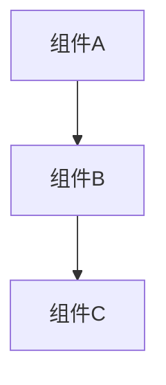
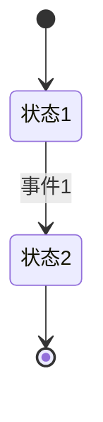
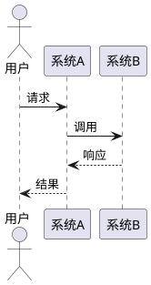
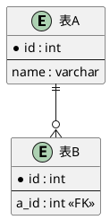

# 任务文档结构规范

> **版本**: v2.0  
> **日期**: 2026-07-03  
> **状态**: 正式标准

---

## 📋 标准目录结构

每个任务必须按照以下结构组织：

```
docs/新架构0703/tasks/{任务名称}/
├── 00-README.md                    # 任务总览（必需）
├── 01-design.md                    # 详细设计（必需）
├── 02-data-model.md                # 数据模型（必需）
├── 03-api-spec.md                  # API规范（如适用）
├── 04-process-flow.md              # 流程设计（必需）
├── 05-acceptance-criteria.md       # 验收标准（必需）
├── 06-external-integration.md      # 外部集成说明（必需）
├── diagrams/                       # 图表（必需）
│   ├── architecture.mmd            # 架构图 (Mermaid)
│   ├── state-machine.mmd           # 状态机 (Mermaid)
│   ├── sequence-*.puml             # 时序图 (PlantUML)
│   └── er-diagram.puml             # ER图 (PlantUML)
├── fixtures/                       # 样例数据（必需）
│   ├── seed.sql                    # 数据库种子数据
│   ├── test-data.json              # 测试数据
│   └── api-examples/               # API样例
│       ├── request-*.json          # 请求示例
│       ├── response-*.json         # 响应示例
│       └── error-examples.json     # 错误示例
├── prompts/                        # 任务提示词（必需）
│   ├── 00-orchestrator.md          # 主调度提示词
│   ├── 01-*.md                     # 子任务提示词
│   └── dependencies.yaml           # 依赖关系定义
└── reviews/                        # 审计报告（必需）
    ├── design-audit.md             # 设计审计
    ├── data-audit.md               # 数据模型审计
    ├── api-audit.md                # API审计
    ├── integration-audit.md        # 集成审计
    └── completion-audit.md         # 完成审计
```

---

## 📄 各文件内容要求

### 00-README.md（任务总览）

**必需内容**:
```markdown
# Task {ID}: {任务名称}

## 基本信息
- 任务ID: {ID}
- 负责团队: {团队}
- 预计工期: {工期}
- 依赖任务: {依赖列表}
- 状态: {状态}

## 任务概述
{简要描述}

## 交付物清单
- [ ] 文件1
- [ ] 文件2

## 快速导航
- [详细设计](01-design.md)
- [数据模型](02-data-model.md)
- [流程设计](04-process-flow.md)
```

---

### 01-design.md（详细设计）

**必需内容**:
```markdown
# 详细设计

## 1. 架构设计
### 1.1 组件图
### 1.2 模块划分
### 1.3 技术选型

## 2. 核心功能
### 2.1 功能1
### 2.2 功能2

## 3. 代码结构
### 3.1 文件组织
### 3.2 核心类/函数

## 4. 关键算法
### 4.1 算法1
### 4.2 算法2
```

---

### 02-data-model.md（数据模型）

**必需内容**:
```markdown
# 数据模型

## 1. 数据库表设计
### 1.1 表结构
```sql
CREATE TABLE ...
```

### 1.2 索引设计
### 1.3 分区策略

## 2. 数据结构定义
### 2.1 Go结构体
### 2.2 Python类
### 2.3 TypeScript接口

## 3. 数据流转
### 3.1 输入数据
### 3.2 中间数据
### 3.3 输出数据
```

---

### 03-api-spec.md（API规范）

**必需内容**:
```markdown
# API规范

## 1. RESTful API
### 1.1 端点列表
### 1.2 请求格式
### 1.3 响应格式
### 1.4 错误码

## 2. WebSocket API（如适用）
### 2.1 连接建立
### 2.2 消息格式
### 2.3 事件类型

## 3. 内部API（如适用）
### 3.1 函数签名
### 3.2 调用约定
```

---

### 04-process-flow.md（流程设计）

**必需内容**:
```markdown
# 流程设计

## 1. 主流程
### 1.1 流程图
### 1.2 步骤说明
### 1.3 异常处理

## 2. 子流程
### 2.1 子流程1
### 2.2 子流程2

## 3. 状态转换
### 3.1 状态机定义
### 3.2 转换条件
```

---

### 05-acceptance-criteria.md（验收标准）

**必需内容**:
```markdown
# 验收标准

## 1. 功能验收
- [ ] 功能1完成
- [ ] 功能2完成

## 2. 性能验收
- [ ] 响应时间 < Xms
- [ ] 并发量 > Y

## 3. 质量验收
- [ ] 单元测试覆盖率 > 85%
- [ ] 代码评审通过

## 4. 文档验收
- [ ] API文档完整
- [ ] 代码注释完整
```

---

### 06-external-integration.md（外部集成说明）⭐ 新增

**必需内容**:
```markdown
# 外部集成说明

## 1. 依赖的外部模块
### 1.1 模块A
- **位置**: path/to/module
- **接口**: API列表
- **调用时机**: 何时调用
- **数据交换**: 数据格式

## 2. 被依赖的接口
### 2.1 提供的API
- **接口名**: xxx
- **调用方**: 谁会调用
- **数据格式**: 输入输出

## 3. 跨服务通信
### 3.1 HTTP API调用
### 3.2 消息队列
### 3.3 数据库共享

## 4. 集成时序图
{时序图}

## 5. 故障处理
### 5.1 依赖不可用
### 5.2 降级方案
```

---

## 🎨 图表规范

### Mermaid图表格式

**架构图** (`diagrams/architecture.mmd`):


**状态机** (`diagrams/state-machine.mmd`):


### PlantUML图表格式

**时序图** (`diagrams/sequence-main.puml`):


**ER图** (`diagrams/er-diagram.puml`):


---

## 📦 样例数据规范

### seed.sql
```sql
-- 必须是真实可用的数据
-- 覆盖主要场景
-- 包含边界情况

INSERT INTO table_name (col1, col2) VALUES
  ('value1', 'value2'),
  ('value3', 'value4');
```

### test-data.json
```json
{
  "scenario1": {
    "input": {...},
    "expected_output": {...}
  },
  "scenario2": {...}
}
```

### api-examples/
```json
// request-create-user.json
{
  "username": "test_user",
  "email": "test@example.com"
}

// response-create-user.json
{
  "id": 123,
  "username": "test_user",
  "created_at": "2026-07-03T10:00:00Z"
}

// error-examples.json
{
  "validation_error": {
    "code": "INVALID_INPUT",
    "message": "Email format invalid"
  }
}
```

---

## 🤖 提示词规范

### 00-orchestrator.md（主调度提示词）

**格式**:
```markdown
# Task {ID}: {任务名称} - 主调度提示词

## 任务拆分
本任务分为以下子任务：
1. 子任务1 - [提示词链接](01-subtask1.md)
2. 子任务2 - [提示词链接](02-subtask2.md)

## 执行顺序
1. 先执行子任务1
2. 等待完成后执行子任务2
3. 最后集成测试

## 依赖检查
- [ ] 依赖任务A已完成
- [ ] 依赖任务B已完成

## 数据传递
- 子任务1输出 → 子任务2输入
```

### 子任务提示词格式

**每个子任务提示词包含**:
```markdown
# 子任务: {名称}

## 上下文
{来自主任务的背景}

## 输入数据
{从哪里获取，格式是什么}

## 输出数据
{输出到哪里，格式是什么}

## 详细需求
{具体实现要求}

## 验收标准
{如何验证完成}
```

### dependencies.yaml

```yaml
task_id: A1
dependencies:
  upstream: []  # 无上游依赖
  downstream:   # 下游依赖
    - task_id: B1
      interface: HookRegistry.Register()
      data_flow: Hook实例
    - task_id: B3
      interface: HookRegistry.Execute()
      data_flow: Environment对象

provides:
  - interface: HookRegistry
    methods:
      - Register(hook Hook) error
      - Execute(ctx, phase, env) error
    usage: 所有Hook插件注册和执行

consumes: []  # 不依赖其他任务

integration_points:
  - module: domains/session
    interface: Session结构体
    usage: Environment中使用
  
  - module: cmd/gateway/main.go
    integration: 启动时初始化HookRegistry
    code_location: line 123
```

---

## 🔍 审计报告规范

### design-audit.md（设计审计）

```markdown
# 设计审计报告

## 审计信息
- 审计人: {姓名}
- 审计时间: {时间}
- 审计版本: {版本}

## 架构审计
- [ ] 架构图完整
- [ ] 组件职责清晰
- [ ] 技术选型合理

## 设计审计
- [ ] 接口设计合理
- [ ] 错误处理完善
- [ ] 扩展性良好

## 问题清单
1. 问题1: {描述}
   - 严重程度: 高/中/低
   - 建议: {建议}

## 审计结论
✅ 通过 / ⚠️ 有问题待修复 / ❌ 不通过
```

### data-audit.md（数据审计）

```markdown
# 数据模型审计报告

## 数据库设计
- [ ] 表结构合理
- [ ] 索引设计正确
- [ ] 约束完整

## 数据结构
- [ ] Go结构体定义正确
- [ ] JSON序列化正确
- [ ] 类型安全

## 数据流
- [ ] 输入验证完整
- [ ] 输出格式统一
- [ ] 数据转换正确

## 问题清单
{同上}
```

### api-audit.md（API审计）

```markdown
# API审计报告

## RESTful规范
- [ ] HTTP方法使用正确
- [ ] URL设计符合规范
- [ ] 状态码使用正确

## 请求响应
- [ ] 请求格式统一
- [ ] 响应格式统一
- [ ] 错误处理完善

## 安全性
- [ ] 认证机制
- [ ] 授权检查
- [ ] 输入验证

## 问题清单
{同上}
```

### integration-audit.md（集成审计）⭐ 新增

```markdown
# 集成审计报告

## 依赖检查
- [ ] 上游依赖明确
- [ ] 下游影响分析
- [ ] 接口契约清晰

## 调用时机
- [ ] 调用时机正确
- [ ] 超时处理
- [ ] 重试机制

## 数据交换
- [ ] 数据格式统一
- [ ] 序列化正确
- [ ] 版本兼容

## 故障处理
- [ ] 降级方案
- [ ] 熔断机制
- [ ] 监控告警

## 问题清单
{同上}
```

### completion-audit.md（完成审计）

```markdown
# 完成审计报告

## 交付物检查
- [ ] 所有文件已生成
- [ ] 代码已提交
- [ ] 测试已通过

## 验收标准
- [ ] 功能验收通过
- [ ] 性能验收通过
- [ ] 质量验收通过

## 文档完整性
- [ ] 代码注释
- [ ] API文档
- [ ] 用户文档

## 最终结论
✅ 已完成 / 🔄 部分完成 / ❌ 未完成

## 遗留问题
{列出遗留问题和后续计划}
```

---

## ✅ 检查清单

任务提交前必须完成：

### 文档完整性
- [ ] 00-README.md
- [ ] 01-design.md
- [ ] 02-data-model.md
- [ ] 03-api-spec.md (如适用)
- [ ] 04-process-flow.md
- [ ] 05-acceptance-criteria.md
- [ ] 06-external-integration.md

### 图表完整性
- [ ] 架构图
- [ ] 状态机（如适用）
- [ ] 主流程时序图
- [ ] ER图（如适用）

### 样例数据
- [ ] seed.sql（如适用）
- [ ] test-data.json
- [ ] API样例

### 提示词
- [ ] 00-orchestrator.md
- [ ] 所有子任务提示词
- [ ] dependencies.yaml

### 审计报告
- [ ] design-audit.md
- [ ] data-audit.md
- [ ] api-audit.md (如适用)
- [ ] integration-audit.md
- [ ] completion-audit.md

---

## 📝 版本历史

### v2.0 (2026-07-03)
- ✨ 新增 06-external-integration.md
- ✨ 新增 integration-audit.md
- ✨ 新增 dependencies.yaml规范
- 📝 完善所有文档模板
- 📝 新增图表规范

### v1.0 (2026-07-03)
- 初始版本

---

**维护人**: 架构组  
**最后更新**: 2026-07-03
