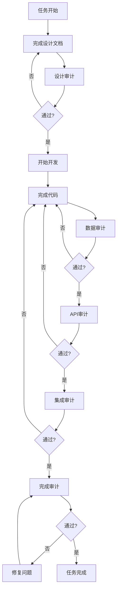

# 任务审计系统

> **版本**: v1.0  
> **日期**: 2026-07-03  
> **状态**: 已建立

---

## 📋 审计系统概述

每个任务必须经过5层审计才能标记为完成：

1. **设计审计** (design-audit.md) - 架构和接口设计审核
2. **数据审计** (data-audit.md) - 数据模型和结构审核
3. **API审计** (api-audit.md) - API规范和契约审核
4. **集成审计** (integration-audit.md) - 外部集成和依赖审核
5. **完成审计** (completion-audit.md) - 最终交付物审核

---

## 🔍 审计流程



---

## 📝 审计模板使用

### 设计审计模板

**文件**: `reviews/design-audit.md`

**审计内容**:
- 架构图完整性
- 组件设计合理性
- 接口设计
- 技术选型
- 错误处理
- 性能设计
- 安全性
- 可测试性

**评分**: 100分制

**通过标准**: 
- P0问题: 0个
- P1问题: <3个
- 总分: >80分

---

### 数据审计模板

**文件**: `reviews/data-audit.md`

**审计内容**:
- 数据库表设计
- 索引设计
- 数据结构定义
- 序列化/反序列化
- 数据验证
- 数据迁移
- 性能考虑

**通过标准**:
- 表结构合理
- 索引优化
- 类型安全
- 无性能瓶颈

---

### API审计模板

**文件**: `reviews/api-audit.md`

**审计内容**:
- RESTful规范
- 请求响应格式
- 错误处理
- 认证授权
- 版本控制
- 文档完整性

**通过标准**:
- 符合RESTful规范
- 错误处理完善
- 文档完整

---

### 集成审计模板

**文件**: `reviews/integration-audit.md`

**审计内容**:
- 依赖关系明确
- 接口契约清晰
- 调用时机正确
- 数据交换规范
- 故障处理完善
- 性能影响可控

**通过标准**:
- dependencies.yaml完整
- 06-external-integration.md完整
- 集成测试通过
- 性能达标

---

### 完成审计模板

**文件**: `reviews/completion-audit.md`

**审计内容**:
- 交付物完整性
- 代码质量
- 测试覆盖率
- 文档完整性
- 性能达标
- 安全性
- 可维护性

**通过标准**:
- 所有交付物已完成
- 测试覆盖率>85%
- 性能满足要求
- 文档完整

---

## ✅ 任务完成检查清单

### 文档完整性 (7个必需)
- [ ] 00-README.md
- [ ] 01-design.md
- [ ] 02-data-model.md
- [ ] 03-api-spec.md (如适用)
- [ ] 04-process-flow.md
- [ ] 05-acceptance-criteria.md
- [ ] 06-external-integration.md

### 图表完整性 (3个必需)
- [ ] diagrams/architecture.mmd
- [ ] diagrams/sequence-*.puml (至少1个)
- [ ] diagrams/er-diagram.puml (如适用)

### 样例数据 (2个必需)
- [ ] fixtures/test-data.json
- [ ] fixtures/api-examples/ (如适用)

### 提示词 (2个必需)
- [ ] prompts/00-orchestrator.md
- [ ] prompts/dependencies.yaml

### 审计报告 (5个必需)
- [ ] reviews/design-audit.md
- [ ] reviews/data-audit.md
- [ ] reviews/api-audit.md
- [ ] reviews/integration-audit.md
- [ ] reviews/completion-audit.md

### 代码交付
- [ ] 所有代码文件已完成
- [ ] 单元测试覆盖率>85%
- [ ] 集成测试通过
- [ ] 代码评审通过

---

## 🤖 自动化审计

### 文档完整性检查脚本

```bash
#!/bin/bash
# check-task-completeness.sh

TASK_DIR=$1

echo "检查任务文档完整性: $TASK_DIR"

# 必需文档
REQUIRED_DOCS=(
    "00-README.md"
    "01-design.md"
    "02-data-model.md"
    "04-process-flow.md"
    "05-acceptance-criteria.md"
    "06-external-integration.md"
)

# 必需审计报告
REQUIRED_AUDITS=(
    "reviews/design-audit.md"
    "reviews/data-audit.md"
    "reviews/api-audit.md"
    "reviews/integration-audit.md"
    "reviews/completion-audit.md"
)

# 必需提示词
REQUIRED_PROMPTS=(
    "prompts/00-orchestrator.md"
    "prompts/dependencies.yaml"
)

missing_count=0

for doc in "${REQUIRED_DOCS[@]}"; do
    if [ ! -f "$TASK_DIR/$doc" ]; then
        echo "❌ 缺少: $doc"
        ((missing_count++))
    else
        echo "✅ 存在: $doc"
    fi
done

for audit in "${REQUIRED_AUDITS[@]}"; do
    if [ ! -f "$TASK_DIR/$audit" ]; then
        echo "❌ 缺少: $audit"
        ((missing_count++))
    else
        echo "✅ 存在: $audit"
    fi
done

for prompt in "${REQUIRED_PROMPTS[@]}"; do
    if [ ! -f "$TASK_DIR/$prompt" ]; then
        echo "❌ 缺少: $prompt"
        ((missing_count++))
    else
        echo "✅ 存在: $prompt"
    fi
done

if [ $missing_count -eq 0 ]; then
    echo ""
    echo "✅ 文档完整性检查通过！"
    exit 0
else
    echo ""
    echo "❌ 文档不完整，缺少 $missing_count 个文件"
    exit 1
fi
```

---

## 📊 审计状态追踪

### Task A1审计状态

| 审计类型 | 状态 | 审计人 | 日期 | 结论 |
|---------|------|--------|------|------|
| 设计审计 | ⏳ 待审计 | - | - | - |
| 数据审计 | ⏳ 待审计 | - | - | - |
| API审计 | ⏳ 待审计 | - | - | - |
| 集成审计 | ⏳ 待审计 | - | - | - |
| 完成审计 | ⏳ 待审计 | - | - | - |

**总体状态**: ⏳ 设计阶段

---

## 🎯 审计最佳实践

### 1. 设计阶段审计
- **时机**: 开发前
- **重点**: 架构合理性、接口设计
- **目标**: 发现设计问题，避免返工

### 2. 开发中审计
- **时机**: 代码完成后
- **重点**: 代码质量、测试覆盖
- **目标**: 确保实现符合设计

### 3. 集成前审计
- **时机**: 集成测试前
- **重点**: 接口契约、依赖关系
- **目标**: 确保顺利集成

### 4. 完成审计
- **时机**: 提交前
- **重点**: 交付物完整性
- **目标**: 确保任务真正完成

---

## 📞 审计流程联系人

- **设计审计**: 架构师
- **数据审计**: DBA + 后端Lead
- **API审计**: 架构师 + 前端Lead
- **集成审计**: 系统集成工程师
- **完成审计**: 技术负责人

---

**文档维护**: 架构组  
**最后更新**: 2026-07-03
