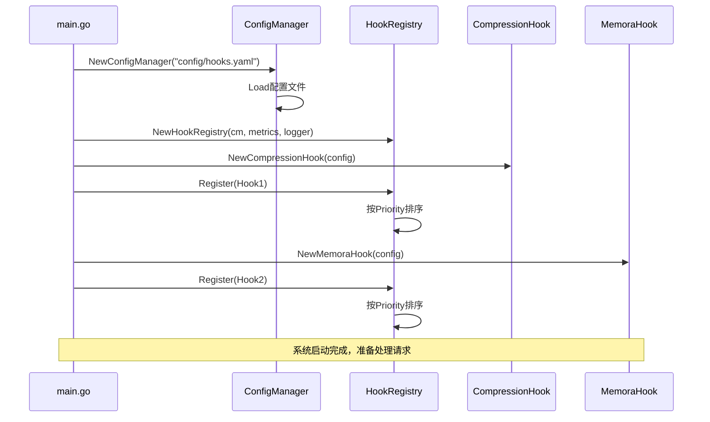
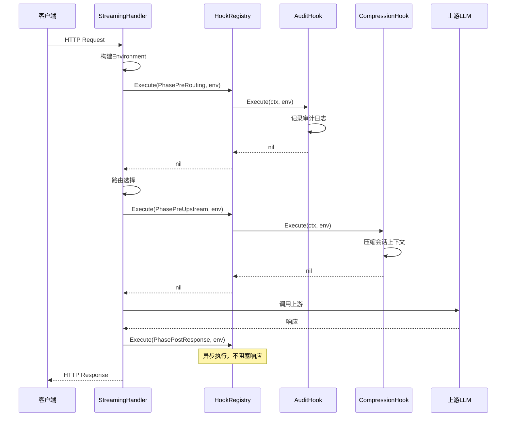
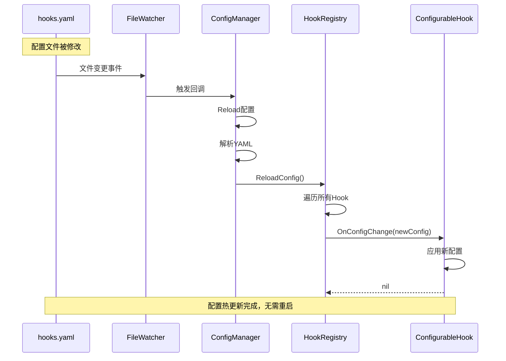

# 外部集成说明

> **任务**: Task A1 - Hook框架增强  
> **版本**: v1.0  
> **日期**: 2026-07-03

---

## 📋 集成概述

Hook框架作为核心基础设施，需要与多个模块进行集成。本文档详细说明所有外部交互。

---

## 1. 依赖的外部模块

### 1.1 domains/session（会话管理）

**集成点**:
- **位置**: `domains/session/session.go`
- **用途**: Hook执行时需要访问会话信息

**接口依赖**:
```go
// 从 domains/session 导入
type Session struct {
    SessionKey string
    TaskID     string
    CreatedAt  time.Time
    // ... 其他字段
}
```

**调用时机**: 
- Hook执行时，从`Environment.Session`获取会话信息
- 无需主动调用session模块的方法

**数据交换**:
```go
// Hook执行时的数据流
env := &Environment{
    Session: sessionFromContext, // 由调用方提供
    // ...
}
```

**故障处理**:
- Session可以为nil（某些Hook不需要会话信息）
- Hook需要检查Session是否为nil

---

### 1.2 config包（配置管理）

**集成点**:
- **位置**: `config/` 目录
- **用途**: 读取hooks.yaml配置文件

**接口依赖**:
```yaml
# config/hooks.yaml
hooks:
  - name: hook-name
    enabled: true
    priority: 10
    phase: pre_routing
    timeout: 5s
    config:
      custom_key: custom_value
```

**调用时机**:
- 系统启动时加载配置
- 配置文件变更时重新加载（热更新）

**数据交换**:
```go
// ConfigManager读取配置
cm := NewConfigManager("config/hooks.yaml")
config := cm.GetHookConfig("hook-name")
```

**故障处理**:
- 配置文件不存在：使用默认配置
- 配置格式错误：记录错误并使用默认值

---

### 1.3 Prometheus（指标收集）

**集成点**:
- **包**: `github.com/prometheus/client_golang/prometheus`
- **用途**: 暴露Hook执行指标

**接口依赖**:
```go
import (
    "github.com/prometheus/client_golang/prometheus"
    "github.com/prometheus/client_golang/prometheus/promauto"
)
```

**调用时机**:
- 每次Hook执行后记录指标

**数据交换**:
```go
// 指标定义
llmgw_hook_executions_total{hook="hook-name", phase="pre_routing", status="success"}
llmgw_hook_duration_seconds{hook="hook-name", phase="pre_routing"}
```

**故障处理**:
- Prometheus不可用不影响Hook执行
- 指标记录失败仅记录日志

---

### 1.4 slog（日志记录）

**集成点**:
- **包**: `log/slog`（标准库）
- **用途**: 记录Hook执行日志

**接口依赖**:
```go
import "log/slog"

type Logger interface {
    Info(msg string, args ...interface{})
    Error(msg string, args ...interface{})
    Debug(msg string, args ...interface{})
}
```

**调用时机**:
- Hook注册时
- Hook执行前后
- 错误发生时

**数据交换**:
```go
logger.Info("hook registered",
    "name", hook.Name(),
    "phase", hook.Phase(),
    "priority", hook.Priority())
```

---

## 2. 提供的接口（被依赖）

### 2.1 HookRegistry.Register()

**接口定义**:
```go
func (r *HookRegistry) Register(hook Hook) error
```

**调用方**:
- **Task B1** (Memora自动沉淀): 注册MemoraAutoHook
- **Task B2** (输出脱敏): 注册OutputSanitizerHook
- **Task B3** (会话编辑器): 不直接注册，通过调度器
- **Task B4** (Vibe Coding): 注册VibeCodeHook

**调用时机**:
- 系统启动时，在`cmd/gateway/main.go`中注册所有Hook

**调用示例**:
```go
// 在 cmd/gateway/main.go 中
hookRegistry := hooks.NewHookRegistry(configManager, metrics, logger)

// 注册各个Hook
hookRegistry.Register(compression.NewCompressionHook())
hookRegistry.Register(audit.NewAuditHook())
hookRegistry.Register(memoraAuto.NewMemoraAutoHook())  // Task B1
hookRegistry.Register(sanitizer.NewOutputSanitizerHook()) // Task B2
```

**数据交换**:
```go
// 输入: Hook实例
type Hook interface {
    Name() string
    Priority() int
    Enabled() bool
    Phase() Phase
    Execute(ctx context.Context, env *Environment) error
}

// 输出: error（如果注册失败）
```

---

### 2.2 HookRegistry.Execute()

**接口定义**:
```go
func (r *HookRegistry) Execute(
    ctx context.Context,
    phase Phase,
    env *Environment,
) error
```

**调用方**:
- **请求处理主流程**: 在`domains/streaming/handler.go`中

**调用时机**:
```
请求到达
  ↓
Execute(PhasePreRouting, env)    # 路由前
  ↓
路由选择
  ↓
Execute(PhasePreUpstream, env)   # 上游前
  ↓
调用上游LLM
  ↓
Execute(PhasePostUpstream, env)  # 上游后
  ↓
返回响应
  ↓
Execute(PhasePostResponse, env)  # 响应后（异步）
```

**调用示例**:
```go
// 在 domains/streaming/handler.go 中
func (h *Handler) HandleRequest(ctx context.Context, req *Request) (*Response, error) {
    // 构建环境
    env := &hooks.Environment{
        RequestID: req.ID,
        Request:   req,
        Session:   getSession(ctx),
        Metadata:  make(map[string]interface{}),
        StartTime: time.Now(),
    }
    
    // 执行PreRouting Hook链
    if err := h.hookRegistry.Execute(ctx, hooks.PhasePreRouting, env); err != nil {
        return nil, err
    }
    
    // 检查中止标志
    if env.Abort {
        return &Response{
            StatusCode: 403,
            Body:       []byte(env.AbortReason),
        }, nil
    }
    
    // 继续处理...
}
```

**数据交换**:
```go
// 输入:
// - ctx: 上下文（超时控制）
// - phase: 执行阶段
// - env: 环境对象（包含请求、响应、会话等）

// 输出:
// - error: Hook执行失败
// - env可能被修改（Hook可以修改Metadata、设置Skip/Abort标志）
```

---

### 2.3 Environment（数据传递对象）

**结构定义**:
```go
type Environment struct {
    // 请求标识
    RequestID  string
    TenantID   string
    SessionKey string
    TaskID     string
    
    // 请求响应数据
    Request          *Request
    Response         *Response
    UpstreamRequest  *UpstreamRequest
    UpstreamResponse *UpstreamResponse
    
    // 会话信息
    Session *Session
    
    // Hook间共享数据
    Metadata map[string]interface{}
    
    // 时间戳
    StartTime time.Time
    
    // 控制标志
    Skip        bool   // 跳过后续Hook
    Abort       bool   // 中止请求
    AbortReason string
}
```

**用途**:
- Hook间传递数据
- Hook可以读取请求信息
- Hook可以修改Metadata
- Hook可以设置控制标志

**使用示例**:
```go
// Hook A 写入数据
func (h *HookA) Execute(ctx context.Context, env *Environment) error {
    env.Metadata["user_id"] = "12345"
    return nil
}

// Hook B 读取数据
func (h *HookB) Execute(ctx context.Context, env *Environment) error {
    userID := env.Metadata["user_id"].(string)
    // 使用userID
    return nil
}
```

---

## 3. 跨服务通信

### 3.1 与kxmemory的集成（间接）

Hook框架本身不直接与kxmemory通信，但为**Task B1 (Memora自动沉淀)**提供了基础设施。

**集成模式**:
```
HookRegistry
    ↓ 注册
MemoraAutoHook (Task B1)
    ↓ HTTP调用
kxmemory /api/sessions/ingest
```

**Hook框架的职责**:
- 提供Hook接口
- 管理Hook生命周期
- 执行Hook（含MemoraAutoHook）

**不负责**:
- 与kxmemory的具体通信（由MemoraAutoHook负责）

---

## 4. 集成时序图

### 4.1 系统启动时的集成



### 4.2 请求处理时的集成



### 4.3 配置热更新时的集成



---

## 5. 故障处理

### 5.1 依赖模块不可用

#### 场景1: 配置文件不存在
```go
// ConfigManager处理
func NewConfigManager(configFile string) (*ConfigManager, error) {
    if _, err := os.Stat(configFile); os.IsNotExist(err) {
        // 使用默认配置
        return &ConfigManager{
            hooks: getDefaultConfig(),
        }, nil
    }
    // 正常加载
}
```

#### 场景2: Session为nil
```go
// Hook中的处理
func (h *MyHook) Execute(ctx context.Context, env *Environment) error {
    if env.Session == nil {
        // 某些Hook不需要Session，跳过或使用默认行为
        return nil
    }
    // 使用Session
}
```

#### 场景3: Prometheus不可用
```go
// MetricsCollector处理
func (mc *MetricsCollector) RecordHookExecution(...) {
    defer func() {
        if r := recover(); r != nil {
            // 指标记录失败不影响业务
            log.Printf("metrics recording failed: %v", r)
        }
    }()
    // 记录指标
}
```

---

### 5.2 Hook执行失败

#### 错误处理策略
```go
func (r *HookRegistry) Execute(ctx context.Context, phase Phase, env *Environment) error {
    for _, hook := range hooks {
        err := hook.Execute(ctx, env)
        if err != nil {
            // 记录错误
            r.logger.Error("hook failed", "name", hook.Name(), "error", err)
            
            // 根据Phase决定是否中断
            if phase == PhasePreRouting || phase == PhaseRouting {
                // 关键阶段，中断请求
                return fmt.Errorf("hook %s failed: %w", hook.Name(), err)
            } else {
                // 非关键阶段，记录错误但继续
                r.metrics.RecordHookFailure(hook.Name(), phase, err)
                continue
            }
        }
    }
    return nil
}
```

---

### 5.3 降级方案

#### 场景1: Hook超时
```go
func (r *HookRegistry) executeHook(ctx context.Context, hook Hook, env *Environment) error {
    timeout := r.config.GetHookTimeout(hook.Name())
    ctx, cancel := context.WithTimeout(ctx, timeout)
    defer cancel()
    
    done := make(chan error, 1)
    go func() {
        done <- hook.Execute(ctx, env)
    }()
    
    select {
    case err := <-done:
        return err
    case <-ctx.Done():
        // 超时，记录并返回错误
        return fmt.Errorf("hook %s timeout after %v", hook.Name(), timeout)
    }
}
```

#### 场景2: Hook频繁失败
```go
// 熔断机制（可选实现）
type CircuitBreaker struct {
    failures    int
    maxFailures int
    resetTime   time.Time
}

func (cb *CircuitBreaker) ShouldExecute() bool {
    if time.Now().After(cb.resetTime) {
        cb.failures = 0
        return true
    }
    return cb.failures < cb.maxFailures
}
```

---

## 6. 数据一致性保证

### 6.1 Environment的并发安全

**问题**: 多个Hook可能修改Metadata

**解决方案**: 
- Hook按顺序执行（不并发）
- 每个Phase内的Hook串行执行
- Environment不需要加锁

### 6.2 配置更新的原子性

**问题**: 配置更新时可能有请求正在处理

**解决方案**:
```go
type ConfigManager struct {
    hooks map[string]*HookConfig
    mu    sync.RWMutex  // 读写锁
}

// 读取配置（并发安全）
func (cm *ConfigManager) GetHookConfig(name string) map[string]interface{} {
    cm.mu.RLock()
    defer cm.mu.RUnlock()
    
    if hc, ok := cm.hooks[name]; ok {
        return hc.Config
    }
    return nil
}

// 更新配置（独占写入）
func (cm *ConfigManager) Load() error {
    cm.mu.Lock()
    defer cm.mu.Unlock()
    
    // 读取新配置
    newHooks := loadFromFile()
    
    // 原子替换
    cm.hooks = newHooks
    
    return nil
}
```

---

## 7. 性能优化

### 7.1 Hook执行性能

**优化点**:
1. **按需执行**: 检查Enabled状态，跳过禁用的Hook
2. **短路**: 支持Skip和Abort标志提前退出
3. **超时控制**: 防止单个Hook阻塞整个链路

**性能目标**:
- Hook链执行延迟 < 50ms (P95)
- 单个Hook执行 < 10ms (P95)

### 7.2 配置读取性能

**优化点**:
1. **内存缓存**: 配置加载到内存
2. **读写锁**: 支持高并发读取
3. **热更新控制**: 3秒轮询间隔

**性能目标**:
- 配置读取 < 1μs
- 热更新延迟 < 3s

---

## 8. 监控与告警

### 8.1 关键指标

```
# Hook执行次数
llmgw_hook_executions_total{hook="hook-name", phase="pre_routing", status="success"}

# Hook执行时长
llmgw_hook_duration_seconds{hook="hook-name", phase="pre_routing"}

# Hook失败次数
llmgw_hook_failures_total{hook="hook-name", phase="pre_routing", error_type="timeout"}
```

### 8.2 告警规则

```yaml
# Hook执行失败率过高
- alert: HookHighFailureRate
  expr: rate(llmgw_hook_failures_total[5m]) / rate(llmgw_hook_executions_total[5m]) > 0.1
  for: 5m
  annotations:
    summary: "Hook {{ $labels.hook }} failure rate > 10%"

# Hook执行时长过长
- alert: HookSlowExecution
  expr: histogram_quantile(0.95, llmgw_hook_duration_seconds) > 0.5
  for: 5m
  annotations:
    summary: "Hook {{ $labels.hook }} P95 latency > 500ms"
```

---

## 9. 集成检查清单

### 启动时检查
- [ ] 配置文件存在且格式正确
- [ ] 所有Hook成功注册
- [ ] Hook按Priority正确排序
- [ ] Prometheus指标正确暴露
- [ ] 日志输出正常

### 运行时检查
- [ ] Hook执行无报错
- [ ] Environment数据正确传递
- [ ] 超时控制正常工作
- [ ] 配置热更新生效
- [ ] 指标正确记录

### 集成测试
- [ ] 与现有Hook兼容
- [ ] 与session模块集成正常
- [ ] 与streaming handler集成正常
- [ ] 下游任务可以注册Hook

---

**文档维护**: Task A1负责人  
**最后更新**: 2026-07-03  
**版本**: v1.0
